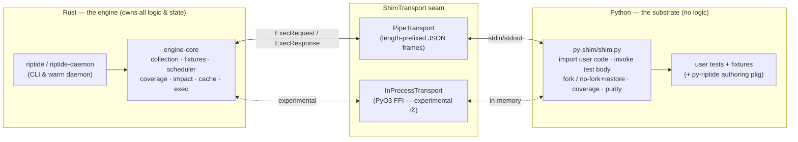
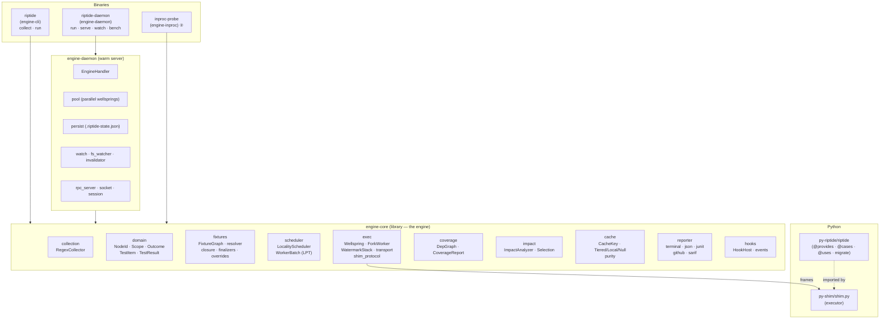
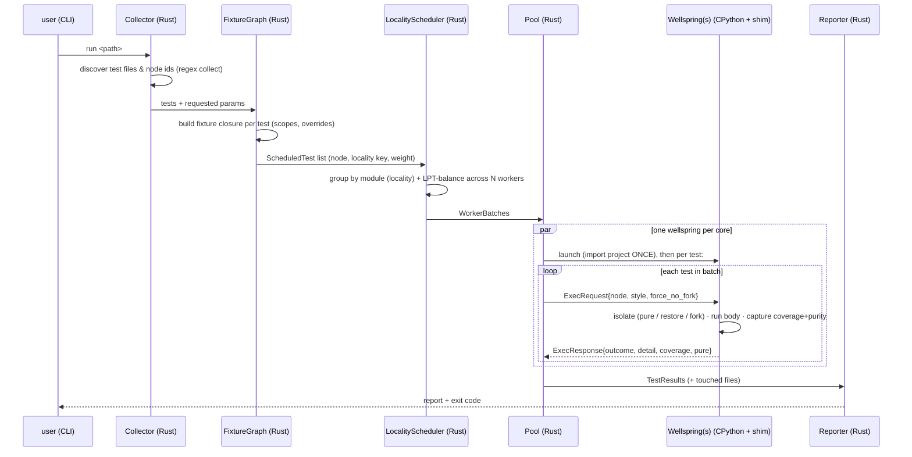
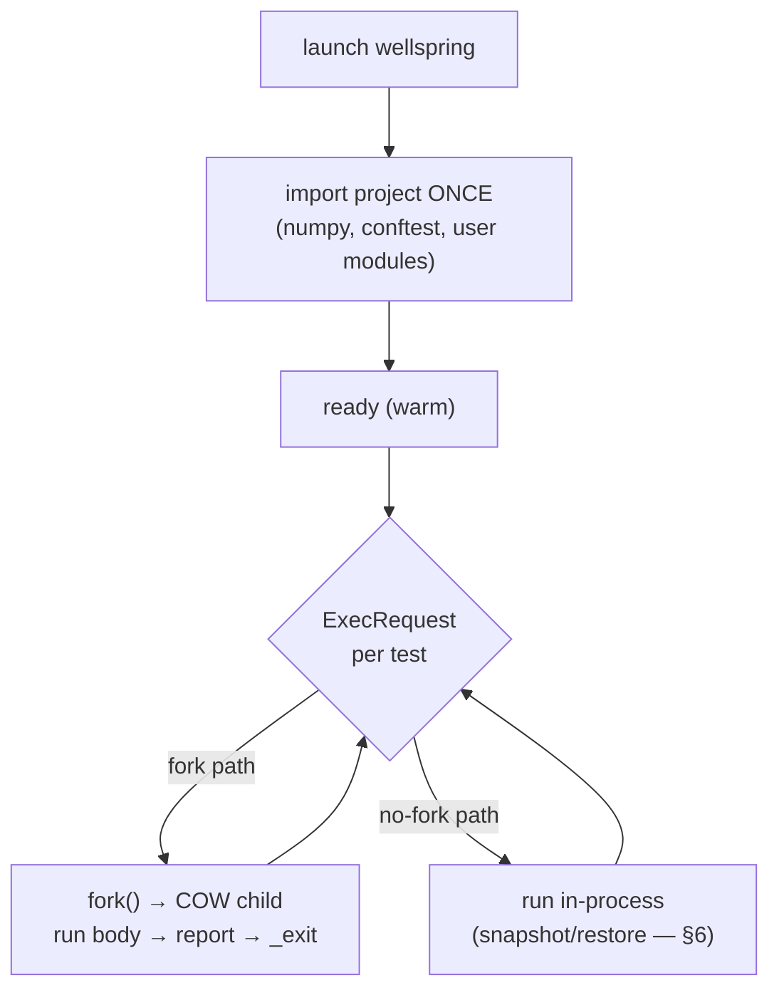
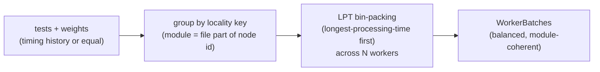
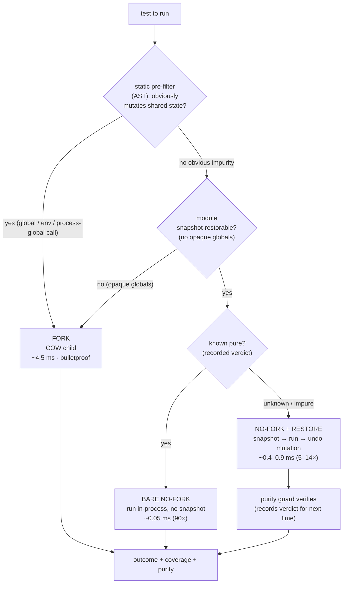
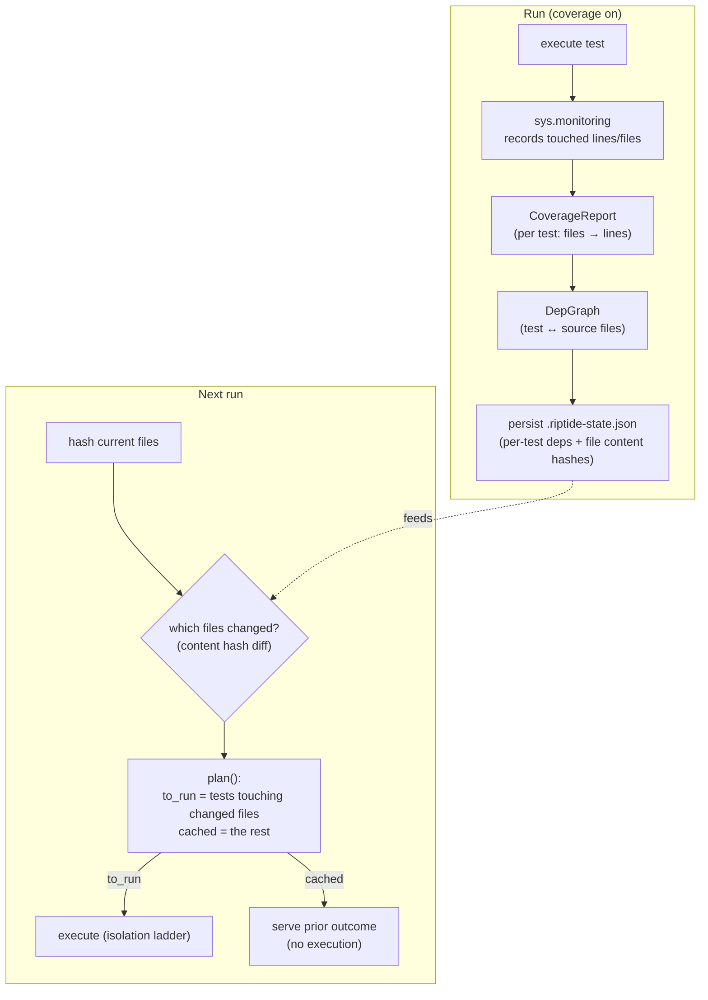
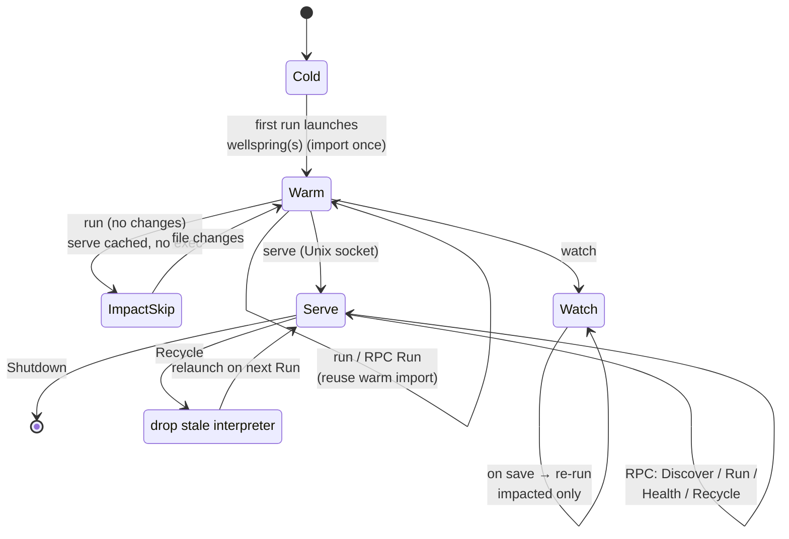

# tiderace — Architecture

**A pure-Rust test engine for Python.** tiderace owns test collection, the fixture graph, scheduling,
isolation, coverage, and impact analysis in compiled Rust; a thin Python *shim* is the only thing that
runs inside CPython, and it exists solely to import user code and invoke test bodies. There is **no
pytest at runtime** — tiderace is the runner, not a wrapper around one.

> **Naming.** The project is **tiderace**. During the pure-Rust rebuild the engine was codenamed
> *riptide*; that name is retired. Some binaries and identifiers still carry it (`riptide`,
> `riptide-daemon`, `RIPTIDE_*`, `.riptide-state.json`) pending a mechanical rename — read them as
> tiderace. An earlier generation — a separate `tiderace` binary that orchestrated *pytest* workers —
> has been removed.

---

## 1. The big picture

Two processes, one seam. Rust holds all the logic and state; CPython is a dumb execution substrate
reached over a narrow, swappable transport.



**Why this split.** Everything that benefits from being fast, typed, and parallel (graph building,
scheduling, hashing, impact) lives in Rust. The one thing that *must* be in Python — running Python — is
a few hundred lines of shim. The [`ShimTransport`](#7-the-transport-seam) trait means the engine never
knows whether Python is a subprocess over pipes or an embedded interpreter over FFI.

---

## 2. Component map



| Layer | Crate / dir | Responsibility |
|---|---|---|
| CLI | `engine-cli` → `riptide` | one-shot `collect` / `run` |
| Daemon | `engine-daemon` → `riptide-daemon` | warm server: impact-aware `run`, `serve` (RPC), `watch`, parallel pool |
| Engine | `engine-core` | all collection/graph/schedule/exec/coverage/impact/cache logic |
| ② | `engine-inproc` → `inproc-probe` | embedded-CPython transport experiment (PyO3) |
| Substrate | `py-shim/shim.py` | import user code, invoke bodies, isolation, coverage, purity |
| Authoring | `py-riptide/riptide` | native type-DI decorators + `migrate` codemod |

---

## 3. The run pipeline

One full run, end to end:



Collection and graph-building are pure Rust and cheap. The cost is execution — which is why the
[isolation ladder](#6-the-isolation-ladder) and [impact analysis](#8-coverage--impact-analysis) exist.

---

## 4. Execution: the warm wellspring & fork model

Isolation without paying interpreter startup per test. A **Wellspring** is a CPython process that imports
the project **once**; tests are then run as children via `fork()` (copy-on-write), so each test gets a
pristine view of imported state for ~the cost of a `fork`, not a fresh `python -c`.



- **Import once, fork many** — the warm import is the expensive part; COW children share it. (ADR-E003)
- **Per-test deadline** — a child exceeding its deadline is killed and reported `Error`.
- **WatermarkStack** — tracks fixture setup/teardown across scopes so finalizers run in the right order
  as the engine moves between modules/classes.
- **Parallelism** — the daemon runs **N wellsprings, one per core** (`engine-daemon/pool.rs`), each its
  own warm import; the [`LocalityScheduler`](#5-scheduling) keeps a module's tests on one worker.

> **Historical note:** `fork()` per test (~4.5 ms) was the dominant cost. The isolation ladder (§6) now
> avoids the fork wherever it's sound, so most tests never pay it.

---

## 5. Scheduling



The `LocalityScheduler` (ADR-E010) does two things at once: **scope locality** (a module's tests land on
the same worker, so its module/session fixtures are set up once) and **load balance** (LPT greedy packing
keeps workers evenly busy). A `RoundRobinScheduler` exists as a simpler baseline.

---

## 6. The isolation ladder ⭐

The heart of tiderace's speed. We `fork()` to isolate tests from each other — but most tests don't need a
fork. The engine classifies each test and runs it the cheapest **sound** way. This is automatic; there is
no user flag.



Three tiers, picked per test:

| Tier | When | Isolation mechanism | Rel. cost |
|---|---|---|---|
| **bare no-fork** | test is *known pure* (recorded verdict) | nothing to isolate | ~0.05 ms (90×) |
| **no-fork + restore** | *restorable* footprint, purity unknown/impure | deep-copy snapshot of module globals + `os.environ`, run, restore | ~0.4–0.9 ms (5–14×) |
| **fork** | module has *opaque* (un-deep-copyable) globals | copy-on-write child | ~4.5 ms (1×) |

Key properties:

- **Sound by construction.** No-fork + restore *contains* mutation rather than predicting it; a
  non-restorable module always falls back to fork (`shim._restorable()`). So correctness never depends on
  the purity verdict — the verdict is only an optimization (lets a known-pure test skip the snapshot).
- **No learning pass.** Restore works on the very first run; the **purity guard** records verdicts as a
  free side effect of running, so subsequent runs can promote pure tests to the bare tier.
- **Static pre-filter** (`shim.static_impurity`) is a cheap AST scan that flags obvious mutators (`global`,
  writes to free/module names, `os.environ`/`os.chdir`/`random.seed`-style calls) without running — a
  sufficient (conservative) impurity test that seeds the tier decision.

The daemon enables this by default: it sets `RIPTIDE_RESTORE=1` and requests no-fork on every test; the
shim downgrades to fork only where unsound. `RIPTIDE_FORCE_FORK=1` reverts to fork-per-test (debug /
benchmark baseline only — not a user flag).

---

## 7. The transport seam

`ShimTransport` is the one boundary between the Rust engine and Python. It is a single synchronous
exchange: send an `ExecRequest`, block for an `ExecResponse`.

```mermaid
classDiagram
    class ShimTransport {
        <<trait>>
        +ready() ReadyInfo
        +exchange(ExecRequest) ExecResponse
    }
    class PipeTransport {
        length-prefixed JSON
        over stdin/stdout
    }
    class InProcessTransport {
        PyO3 FFI into
        embedded CPython (②)
    }
    class ScriptedShim {
        pure-Rust test double
        (no process, no syscall)
    }
    ShimTransport <|.. PipeTransport
    ShimTransport <|.. InProcessTransport
    ShimTransport <|.. ScriptedShim
```

- **PipeTransport** (production) — frames over a child process's pipes (the wellspring).
- **InProcessTransport** (experimental, ②, ADR-E013) — one embedded CPython driven by FFI; no subprocess,
  no pipe. Proven to work; benchmarking showed the pipe was *not* the bottleneck (the fork was), so it
  remains a research path toward *import-once + parallel fork*.
- **ScriptedShim** (tests) — lets the entire `Worker → frames → TestResult` path run in one thread with no
  Python at all, so execution logic is testable offline.

The wire frame is additive and back-compatible: new fields (`coverage`, `force_no_fork`, `pure`) are
`skip-if-default`, so an old frame is byte-identical.

---

## 8. Coverage → impact analysis

The "only re-run what changed" engine. Each test's executed-source footprint is captured via CPython's
`sys.monitoring` (ADR-E006), folded into a dependency graph, and persisted; on the next run only tests
whose dependencies changed are executed.



Two complementary layers:

- **Impact-skip (active path, `engine-daemon/persist.rs`).** Per-run, local: `.riptide-state.json` stores
  each test's dependency files (from coverage) + file content hashes. On re-run, `changed_files()` +
  `plan()` select only impacted tests; with **no** changes nothing runs — the wellspring isn't even
  launched.
- **Content-addressed cache (`engine-core/cache`, ADR-E004).** The cross-machine layer: a test's outcome
  keyed by its full input closure (`CacheKey`), in a `TieredCache(Local, Remote)`. A cache *hit* means the
  test is never run — and because the key is content-addressed, a result CI computed is reusable on any
  machine with the same inputs. The `purity` gate excludes nondeterministic tests from caching. The remote
  tier is a shareable **`DirCache`** (a directory: a CI cache path / shared mount / artifact); an HTTP or
  object-store client is a drop-in behind the same `Cache` trait. The daemon consults it in `run`
  (**cache hit → impact-skip → run**): set `RIPTIDE_CACHE_DIR` to a shared directory and a result CI
  computed is served without re-running, even when this machine's local impact state is stale. Only
  *pure* outcomes are cached (the purity gate keeps it sound).

---

## 9. The warm daemon lifecycle

The daemon is the product's inner loop: keep CPython warm, re-run only what changed, react to file saves.



Modes (`riptide-daemon <mode> <root>`):

- **`run`** — impact-aware one-shot (coverage on; runs only changed tests, parallel pool).
- **`run --all`** — full run across the parallel pool.
- **`serve`** — bind the per-project Unix socket; answer RPC (`Discover`, `Run`, `Health`, `Recycle`,
  `Shutdown`) over a persistent warm session.
- **`watch`** — block and re-run impacted tests on each save (`fs_watcher` + `invalidator` + the DepGraph).
- **`bench`** — time cold vs warm passes.

---

## 10. Authoring & migration (py-riptide)

tiderace runs ordinary pytest-style tests (function/method/unittest styles, fixtures) **and** offers a
native, type-driven authoring model so suites can drop the pytest dependency entirely.

- **Native type-DI** (ADR-E012): `@riptide.provides` (declare a provider by return type),
  `@riptide.cases` (parametrization), `@riptide.uses` (set up by type, not injected). Fixtures resolve by
  **type**, built by the Rust fixture graph.
- **`riptide migrate`** — an AST codemod (`py-riptide/riptide/migrate.py`) that rewrites a pytest suite to
  the native model; conformance is tracked by auto-map % over pinned real-world repos.

---

## 11. Design decisions (ADR index)

The authoritative rationale lives in `planning/current/pure-rust-test-engine/design/adr/`:

| ADR | Decision |
|---|---|
| E001 | Pure-Rust engine, no pytest at runtime |
| E002 | Python shim as the execution substrate |
| E003 | Fork-from-warm-wellspring snapshot isolation |
| E004 | Content-addressed result cache |
| E005 | Workspace trait seams (testable boundaries) |
| E006 | Coverage via `sys.monitoring` |
| E007 | Warm daemon |
| E008 | Cross-platform strategy |
| E009 | Lazy assertion introspection |
| E010 | Locality scheduler (LPT + scope locality) |
| E011 | Shim transport seam |
| E012 | Native type-driven authoring |
| E013 | In-process / FFI isolation (②) |
| **E014** | **No-fork + restore isolation ladder (the default execution path)** |
| E015 | Conditional sub-interpreter tier (`SubInterpWorker`) for Windows parallelism (design; spiked) |

---

## 12. Where to look in the code

| You want… | Start here |
|---|---|
| How tests are found | `engine-core/src/collection/regex_collector.rs` |
| The fixture graph | `engine-core/src/fixtures/fixture_graph.rs`, `layered_resolver.rs` |
| Scheduling | `engine-core/src/scheduler/locality_scheduler.rs` |
| The fork model | `engine-core/src/exec/wellspring.rs`, `fork_worker.rs` |
| The transport seam | `engine-core/src/exec/transport.rs`, `shim_protocol.rs` |
| The isolation ladder | `py-shim/shim.py` (`static_impurity`, `_restorable`, `_restore_shared`, `Engine.run`) |
| Impact-skip | `engine-daemon/src/persist.rs`, `engine_handler.rs` (`run_impacted`) |
| The cache | `engine-core/src/cache/` (`cache_key.rs`, `tiered_cache.rs`, `purity.rs`) |
| Parallel pool | `engine-daemon/src/pool.rs` |
| Daemon modes | `engine-daemon/src/main.rs`, `rpc_server.rs`, `watch.rs` |
| Authoring / migration | `py-riptide/riptide/` (`builtins`, `_resolve.py`, `migrate.py`) |
| Benchmarks | `benchmarks/RESULTS-3way.md`, `RESULTS-inproc.md`, `bench_3way.sh` |
