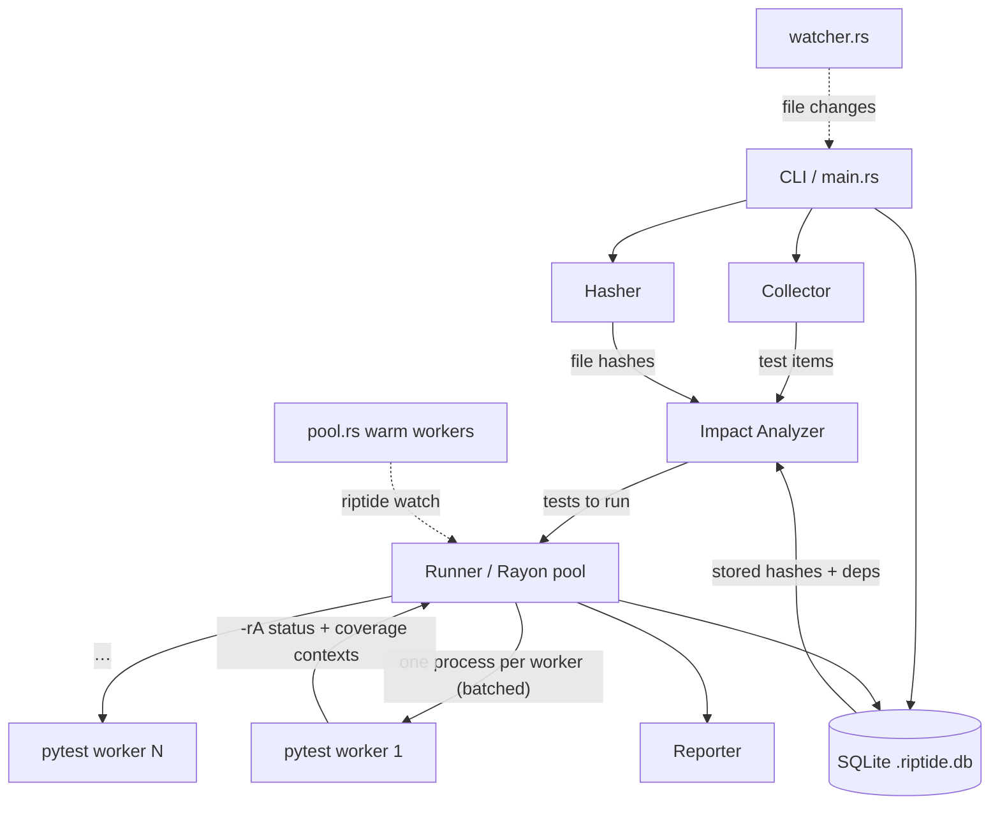

# Architecture

## System Overview

riptide is a single compiled Rust binary. It orchestrates Python test execution without being
a Python process itself — giving it native-speed control over discovery, hashing, scheduling,
and state — while real `pytest` does the actual running (full fixture/plugin/assertion
compatibility).

## Execution strategies

riptide drives pytest three ways (see [Execution Model](parallel-execution.md) and
[ADR-009](decisions.md)):

- **Batched (default)** — one `pytest` process per worker over many node ids; *N* tests cost
  *W* interpreter startups. ~8× faster cold than one process per test.
- **Isolated (`--isolate`)** — one process per test, for suites needing a fresh interpreter.
- **Warm pool (`riptide watch`)** — long-lived workers import pytest once; edit→test cycles
  pay no startup.

## Key design decisions

- **Subprocesses, not embedded Python.** Full compatibility and OS-level isolation. Embedding
  via PyO3 with subinterpreters was prototyped and **rejected** — most C extensions aren't
  multi-interpreter-safe and crash the process ([ADR-010](decisions.md)).
- **SQLite for state.** Zero infrastructure, ACID for concurrent writers, a single
  inspectable file ([ADR-002](decisions.md)).
- **SHA-256 for change detection.** Works without git, content-based ([ADR-003](decisions.md)).
- **Coverage dynamic contexts.** Per-test dependencies come from a single *batched* coverage
  run, so `--coverage` is precise *and* fast ([ADR-011](decisions.md)).

## Module breakdown

| Module | Responsibility |
|---|---|
| `main.rs` | CLI parsing, config resolution, run/collect/clear/coverage/**watch** orchestration |
| `config.rs` | `[tool.riptide]` parsing from `pyproject.toml` |
| `collector.rs` | Regex test discovery (functions, `Test*` classes, `unittest.TestCase`, async) |
| `hasher.rs` | SHA-256 fingerprinting + change detection |
| `db.rs` | SQLite persistence (hashes, results, deps, coverage) |
| `impact.rs` | Changed-file → affected-test selection |
| `runner.rs` | Rayon pool, batched/isolated execution, coverage-context extraction |
| `pool.rs` | Persistent warm worker pool (watch mode) |
| `watcher.rs` | Debounced file watching (`notify`) |
| `worker.py` | Embedded Python worker run by the warm pool |
| `reporter.rs` | Terminal output and coverage report |

## Concurrency model

Tests run on a scoped Rayon pool via `par_iter().map().collect()` — no shared
`Mutex<Vec<_>>`, so there are no lock-poisoning panics, and the requested worker count is
honored deterministically. The warm pool (`pool.rs`) adds a dedicated stdout reader thread per
worker so a timeout/crash never deadlocks or hangs the run.

## Limitations (v0.1)

- **Linux x86_64** is the supported target this phase (the code uses portable
  `std::process`, so other platforms are a future step).
- **Fixture/plugin dependencies** are captured only through runtime coverage, not static
  analysis — so precise impact analysis requires a prior `--coverage` run.
- **Embedded subinterpreters** are out (ecosystem not multi-interpreter-ready —
  [ADR-010](decisions.md)).
