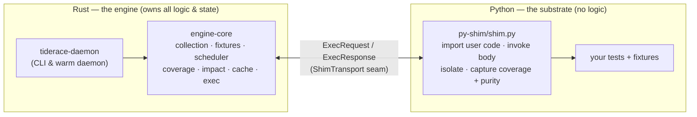
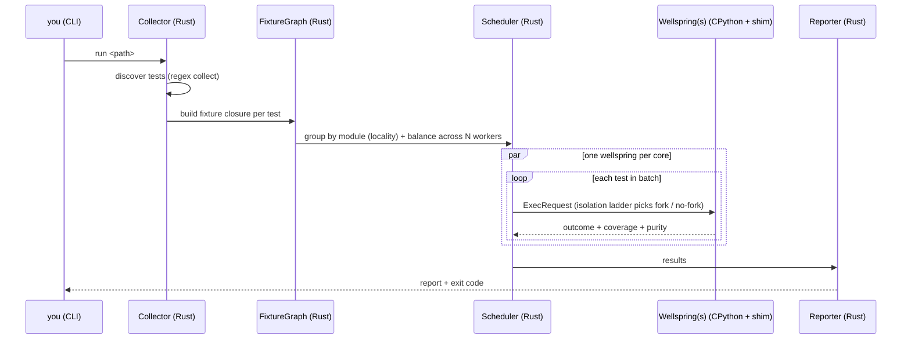
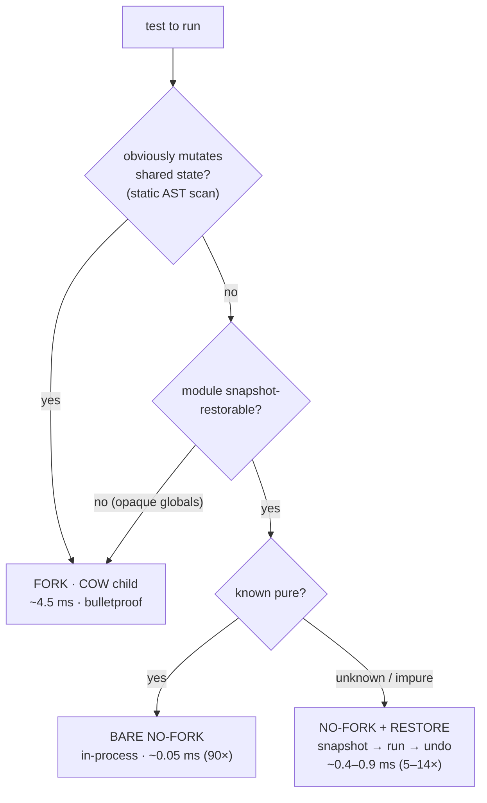
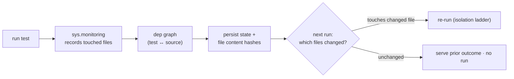

# Architecture

> The full, authoritative architecture (every diagram, the code map, ADR index) lives in
> [`ARCHITECTURE.md`](https://github.com/snoodleboot-io/tiderace/blob/main/ARCHITECTURE.md) at the repo
> root. This page is the user-facing tour.

## System Overview

tiderace is a **pure-Rust test engine for Python**. The Rust side owns everything that benefits from
being fast, typed, and parallel — test collection, the fixture graph, scheduling, isolation, coverage,
and impact analysis. The one thing that must run inside CPython — running Python — is a small *shim* that
imports your tests and invokes their bodies. **There is no pytest at runtime.**

The boundary between them is a single narrow trait, `ShimTransport` — one synchronous request→response
exchange. In production it's JSON frames over a child process's pipes; the same seam also hosts an
experimental embedded-CPython (FFI) backend. The engine never knows which.

## The run pipeline

## The isolation ladder

This is what makes tiderace fast. We isolate tests from each other so one can't corrupt another's view
of process-global state. The classic way is `fork()` per test — but the fork (~4.5 ms) was the dominant
cost, and **most tests don't mutate shared state at all**, so the fork buys them nothing. tiderace
classifies each test and runs it the cheapest *sound* way — automatically, no flag:

| Tier | When | How it stays isolated | Rel. cost |
|---|---|---|---|
| **bare no-fork** | test is known pure | nothing to isolate | ~0.05 ms (90×) |
| **no-fork + restore** | mutates a restorable footprint | snapshot module globals + `os.environ`, run, restore | ~0.4–0.9 ms (5–14×) |
| **fork** | opaque/un-restorable globals | copy-on-write child | ~4.5 ms (1×) |

It's **sound by construction**: restore *undoes* mutation rather than predicting purity, and anything it
can't snapshot falls back to fork. A wrong guess can only change speed, never correctness — which is why
it's on by default and needs no learning pass. See
[ADR-E014](https://github.com/snoodleboot-io/tiderace/blob/main/planning/current/pure-rust-test-engine/design/adr/ADR-E014-no-fork-restore-ladder.md).

## Impact analysis & the cache

After one run, tiderace knows which source files each test executed. On the next run it hashes the files,
finds what changed, and runs **only** the affected tests — when nothing changed, nothing runs (the warm
interpreter isn't even launched). Because outcomes are content-addressed, a result is a pure function of
its inputs, so the same machinery doubles as a **build-system-style cache** that can be shared across
machines.

## The warm daemon

The engine keeps CPython warm so your project is imported **once**, not per test or per run:

- **`run`** — impact-aware: execute only changed tests across a parallel pool of wellsprings.
- **`run --all`** — full run across the pool. With `TIDERACE_SUBINTERP=1`, routes sub-interpreter-safe
  modules to a parallel sub-interpreter pool (no fork) — the **sub-interpreter tier** (ADR-E015), which
  is how the engine parallelizes on **Windows** where there is no `fork()`.
- **`watch`** — re-run impacted tests on each file save (millisecond loops).
- **`probe`** — classify each module `safe` / `unsafe` for the sub-interpreter tier (read-only).
- **`serve`** — a persistent warm session over a Unix socket (RPC: discover / run / health / recycle).
  *Unix-only*; use `run` / `watch` on Windows.

The parallel pool is platform-aware: fork-per-test on Unix, no-fork `SubprocessWorker` on Windows.

## Authoring

tiderace runs ordinary pytest-style tests as-is. It also offers **native type-driven authoring** —
`@tiderace.provides` / `@tiderace.cases` / `@tiderace.uses`, where fixtures resolve by *type* through the
Rust fixture graph — so a suite can drop the pytest dependency entirely. `tiderace migrate` is an AST
codemod that converts an existing pytest suite to the native model (**91%** auto-mapped across the
pinned click / flask / anyio suites; see [Migrating from pytest](../guides/migration.md)).

## Learn more

- [Design overview](overview.md) — the three pillars
- [Modules](modules.md) — crate-by-crate responsibilities
- [Parallel execution & isolation](parallel-execution.md)
- [Coverage](coverage.md) · [Impact analysis](impact-analysis.md) · [State & cache](database.md)
- [Design decisions (ADRs)](decisions.md)
