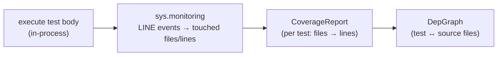

# Coverage

tiderace captures coverage with CPython's **`sys.monitoring`** (PEP 669, CPython 3.12+) — **not**
coverage.py and **not** a separate `coverage run` pass. The footprint is recorded *in-process on the
same run that executes the test*, so it costs almost nothing extra and feeds straight into
[impact analysis](impact-analysis.md). See ADR-E006.

## Why `sys.monitoring`

Coverage here serves one job above all: build the per-test **executed-source footprint** — which
source files (and lines) each test actually ran — so tiderace can re-run only what a change affects.
`sys.monitoring` (PEP 669) is the right tool because:

- It is a **built-in CPython API**, so there is no coverage.py dependency at runtime.
- Locations can be **disabled once seen** — after a line fires its LINE event, the shim disables that
  location, so steady-state overhead is low even on hot loops.
- It runs **on the same in-process execution** as the test body — there is no second instrumented run
  to attribute back to tests.

The shim claims a dedicated `sys.monitoring` tool id (slot 5, chosen to avoid clashing with
coverage.py or a profiler a user might attach) and turns LINE events on only while a test body runs.

## From events to the dep graph

Each test's touched files become a `CoverageReport` (`engine-core/src/coverage/coverage_report.rs`,
keyed by `file_lines`), which the engine folds into a `DepGraph` (`dep_graph.rs`): a mapping of test
node id ↔ source files. That graph is the input to impact analysis and is persisted with content
hashes in [`.riptide-state.json`](database.md).

## Enabling it

The daemon turns coverage on by itself for impact-aware runs — it sets `RIPTIDE_COVERAGE=1` so
footprints are recorded as a side effect of running. (The shim also accepts a `--coverage` argv flag.)
There is no separate coverage command and no coverage data file: the footprint lives in the engine's
state, not in an `.coverage` database.

## Relationship to impact and the cache

The same per-test footprint does double duty:

- It is the dependency set in the **impact-skip** layer — a test re-runs only when one of its
  footprint files changed ([impact analysis](impact-analysis.md)).
- It is part of the **content-addressed cache key** (ADR-E004): a test's outcome is keyed by its full
  input closure, of which the executed-source closure is a component.

> **Note on richer coverage reporting.** This page documents the dependency-footprint role of
> coverage, which is what the engine uses today. Any line-percentage *reporting* UI beyond that is not
> documented here because it is not something I could confirm in the engine code — treat the footprint
> as the load-bearing artifact.
