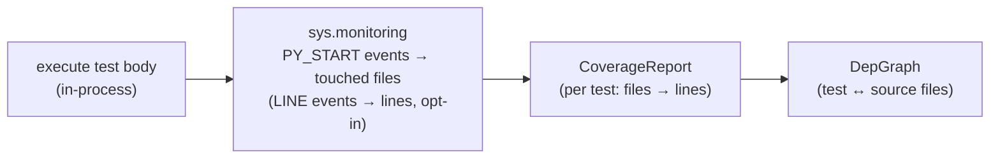

# Coverage

tiderace captures coverage with CPython's **`sys.monitoring`** (PEP 669, CPython 3.12+) — **not**
coverage.py and **not** a separate `coverage run` pass. The footprint is recorded *in-process on the
same run that executes the test* and feeds straight into [impact analysis](impact-analysis.md).
See ADR-E006.

By default the footprint is **file-level** — which source files a test entered — because that is
what every consumer reads. Line-level capture exists behind a flag; see
[what is captured](#what-is-captured-and-what-it-costs).

## Why `sys.monitoring`

Coverage here serves one job above all: build the per-test **executed-source footprint** — which
source files (and lines) each test actually ran — so tiderace can re-run only what a change affects.
`sys.monitoring` (PEP 669) is the right tool because:

- It is a **built-in CPython API**, so there is no coverage.py dependency at runtime.
- Locations can be **disabled once seen** — after a code object (or, with lines on, a line) fires its
  event, the shim disables that location, so steady-state overhead is low even on hot loops.
- It runs **on the same in-process execution** as the test body — there is no second instrumented run
  to attribute back to tests.

The shim claims a dedicated `sys.monitoring` tool id (slot 5, chosen to avoid clashing with
coverage.py or a profiler a user might attach) and turns events on only while a test body runs.

```mermaid
flowchart LR
    EXE["execute test body<br/>(in-process)"] --> MON["sys.monitoring<br/>PY_START events → touched files<br/>(LINE events → lines, opt-in)"]
    MON --> CR["CoverageReport<br/>(per test: files → lines)"]
    CR --> DG["DepGraph<br/>(test ↔ source files)"]
```

## What is captured, and what it costs

Two capture modes share the tool id and the report shape (`{relative_path: [lines]}`):

| | default | `--coverage-lines` / `TIDERACE_COVERAGE_LINES=1` |
| -- | -- | -- |
| event | `PY_START` + `PY_RESUME` — one per code object entered or resumed | `LINE` — one per line executed |
| records | the file; the line list is empty | the file and its executed lines |
| meaning of `[]` | "any change to this file counts" | — |

The default is file-level because **nothing on a production path reads a line number**. The
transport reduces the wire footprint to its file names (`touched_files`) before anything else sees
it, the daemon persists and selects by file, and the line-aware `DepGraph` is only ever fed by tests.
An empty list is the convention the [import closure](impact-analysis.md) already uses, so the wire
and the Rust side did not change. Module and class bodies are code objects too, so a file reached
only through a dynamic import (`importlib.import_module`, a plugin registry) is still seen — the case
the static import closure (TID-40) cannot cover.

Diffed per node on pirn-core (5,657 nodes, daemon `deps`), the two modes agree on all but 8. On 6
the file-level footprint is a strict superset: a code object can start without emitting a line event
(3.14's lazily evaluated annotations, for one). On 2 the line-level footprint names a file whose
code was already running when the test began — a frame in another thread executes lines without
ever starting or resuming inside the test — which is attribution to whoever happened to be running,
not a dependency. Two runs of the same mode agree on every node.

### Where the cost was

Capture made a cold pirn-core run (5,602 tests, 8 workers) **34% longer** — 34.1s → 45.8s, per-test
CPU 1.62× (TID-76). Splitting it, arm by arm on the same binary, none of the obvious suspects moved
the number: LINE and `PY_START` events cost the same, sending file names without lines cost the same,
and instrumenting once per process instead of toggling `sys.monitoring` around every test cost the
same. Steady-state bytecode is not slower with a tool attached (measured: within 1%).

The cost was the **static import closure**. `report_with_imports` returns early when capture is off;
with it on, each test module's closure walked ~100 files, parsing and resolving every one of them —
230ms per module — and the closures of different modules are almost the same files. 575 modules,
once per worker, is the whole of the gap. The parse and resolution are now memoised per source file
(`_file_deps`): all 537 pirn-core closures take 3.2s of CPU in total instead of ~124s, spread across
the workers.

### `DISABLE` outlives the tool id

One subtlety of `sys.monitoring`: `DISABLE` is per location and **survives `free_tool_id`**. The shim
calls `restart_events()` at every `start()`; without it, the first test in a worker to enter a
function was the only test ever credited with that file, and every later test on the in-process path
saw nothing there.

On CPython ≤3.11 the `settrace` fallback mirrors both modes: `call` events alone by default, `line`
events with `--coverage-lines`.

## From events to the dep graph

Each test's touched files arrive as `touched_files` on its `TestResult` and are persisted as that
test's `deps` in [`.tiderace-state.json`](database.md); a warm run re-executes a test when one of
them changed. The line-aware `CoverageReport` / `DepGraph` pair (`engine-core/src/coverage/`) is the
model for finer selection (`tests_touching_lines`) and is exercised by tests; the daemon's watch
session starts it empty, so it is not on the production path today.

## Enabling it

The daemon turns coverage on by itself for impact-aware runs — it sets `TIDERACE_COVERAGE=1` so
footprints are recorded as a side effect of running. (The shim also accepts a `--coverage` argv flag.)
There is no separate coverage command and no coverage data file: the footprint lives in the engine's
state, not in an `.coverage` database.

## Relationship to impact and the cache

The same per-test footprint does double duty:

- It is the dependency set in the **impact-skip** layer — a test re-runs only when one of its
  footprint files changed ([impact analysis](impact-analysis.md)).
- It is part of the **content-addressed cache key** (ADR-E004): a test's outcome is keyed by its full
  input closure, of which the executed-source closure is a component.

> **Note on richer coverage reporting.** This page documents the dependency-footprint role of
> coverage, which is what the engine uses today. Any line-percentage *reporting* UI beyond that is not
> documented here because it is not something I could confirm in the engine code — treat the footprint
> as the load-bearing artifact.
