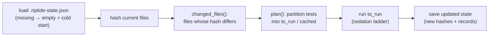

# State & Cache

tiderace keeps no SQLite database. Persisted state lives in two places: a local **warm-state JSON
file** (`.riptide-state.json`) that drives impact-aware re-runs, and a **content-addressed result
cache** that turns the suite into a build system. Neither is coverage.py and neither is a relational DB.

## `.riptide-state.json` — the warm impact state

The active impact-skip layer (`engine-daemon/src/persist.rs`) writes a single JSON file at
`<root>/.riptide-state.json`. It is the native analogue of the old engine's `.tiderace.db`, but it is
just two maps:

```rust
pub struct PersistedState {
    /// relative source path -> content hash (hex) at the time it was last run.
    pub files: BTreeMap<String, String>,
    /// node id -> last result + the files it touched.
    pub tests: BTreeMap<String, TestRecord>,
}

pub struct TestRecord {
    pub outcome: String,   // e.g. "passed" / "failed"
    pub detail: String,    // failure detail, if any
    pub deps: Vec<String>, // the source files this test touched (from coverage)
}
```

- **`files`** — path → content hash, captured when the file was last run. The diff against freshly
  computed hashes tells tiderace which files changed.
- **`tests`** — node id → `{ outcome, detail, deps }`. `deps` is the test's executed-source footprint
  from [coverage](coverage.md); it is what makes the skip decision precise.

The lifecycle is small:



- `changed_files(state, current)` returns every path whose stored hash differs (or vanished).
- `plan(state, candidates, changed)` partitions candidates into `to_run` and `cached`: a test runs if
  it was **never seen** or **any** of its recorded `deps` changed; otherwise its cached outcome stands.
- A missing or unparseable file yields empty state — a clean cold start. To reset, delete the file.

This file is **machine-local** working state and should not be committed.

## The content-addressed cache

The cross-machine layer (`engine-core/src/cache/`, ADR-E004) is a separate concern from the local
state file. A test's outcome is keyed by its full input closure (`CacheKey` / `CacheKeyBuilder`) and
stored behind the `Cache` trait. Production wires a `TieredCache(Local, Remote)`:

- **`get`** checks the local tier; on a miss it checks the remote tier and populates local, so a green
  test someone already ran on CI is free on a fresh machine.
- **`put`** writes through to both tiers — but only for **cacheable** (pure) outcomes. The `purity`
  module gates `Cache::put` on `Purity::is_cacheable`, so a nondeterministic test (clock, network,
  RNG) is never silently cached. The orchestrator's preference order is **cache hit → impact-skip →
  run**.

`LocalCache`, `NullCache` (for `--no-cache` / debugging), and `CachedOutcome` round out the module.
The shareable **remote tier is `DirCache`** — a directory of content-hashed JSON entries (`<hex>.json`),
so pointing it at a CI cache path / shared mount / artifact makes a result computed on one machine a free
hit on any other. An HTTP/object-store client is a drop-in behind the same `Cache` trait. Wiring the
cache into the daemon's run loop is the remaining step.

## Two layers, one idea

Both layers answer "has this work already been done?", at different granularities:

| | `.riptide-state.json` (impact-skip) | content-addressed cache |
|---|---|---|
| Scope | per project, local | cross-machine |
| Keyed on | per-test deps + file content hashes | full input closure (`CacheKey`) |
| When it skips | a test's deps didn't change | the exact inputs were seen before (here or in CI) |
| Status | active path | local built; remote tier unbuilt |

See [impact analysis](impact-analysis.md) for how the state file drives selection, and ADR-E004 for
the cache rationale.
