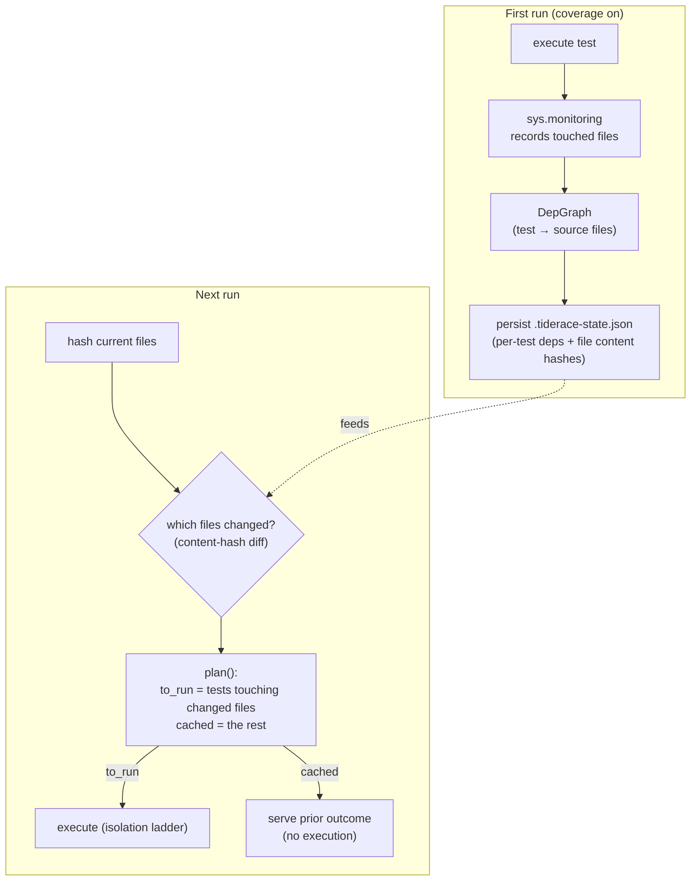

# Impact Analysis

Impact analysis is what makes tiderace fast on repeated runs. It answers: **given that these files
changed, which tests need to re-run?** The answer comes from runtime coverage data, not static
analysis — and when nothing changed, nothing runs.

## The pipeline



1. **Coverage footprint.** Each test's executed-source footprint is captured via
   [`sys.monitoring`](coverage.md) (ADR-E006) on the same in-process run that executes it.
2. **Dep graph.** Footprints fold into a `DepGraph` (`engine-core/src/coverage/dep_graph.rs`): test
   node id ↔ the source files it touched.
3. **Persist.** The graph plus the content hash of every touched file are written to
   [`.tiderace-state.json`](database.md) (`engine-daemon/src/persist.rs`).
4. **Content-hash diff.** On the next run, tiderace re-hashes the files and diffs against the stored
   hashes (`changed_files()`) — content-based, so touching a file without editing it triggers nothing.
5. **Plan.** `plan()` partitions the candidate tests into `to_run` and `cached`; only `to_run`
   executes, through the [isolation ladder](parallel-execution.md).

## Decision rules

For each candidate test (`persist::plan`):

```
1. Has this test never been seen?              → RUN  (establish a baseline)
2. Did any file in the test's dep list change? → RUN
3. Otherwise                                   → SKIP (serve the cached outcome)
```

A *test file* change shows up as rule 2 as well: a test's own source file is part of its recorded
dependency footprint, so editing the test re-runs it. And because dependency footprints can only
*over*-include (a coarse footprint adds extra deps), a wrong guess can only cause an unnecessary
re-run, never a wrong skip.

## The no-change fast path

The headline case: **if no tracked file changed, `changed_files()` is empty, `plan()` puts every
known test in `cached`, and nothing executes** — the wellspring isn't even launched. This is what
makes a warm "no changes" run land in milliseconds.

```
Run 1 (full, coverage on):  all tests run, dep graph + hashes built
Run 2 (edit src/auth.py):   only tests whose deps include src/auth.py run
Run 3 (no changes):         nothing runs — state served from .tiderace-state.json
```

## Building the footprint

The footprint is built from coverage, captured automatically on runs where the daemon sets
`TIDERACE_COVERAGE=1`. There is no separate instrumentation command and no `coverage run` — the
footprint is a side effect of executing the test in-process. See [coverage](coverage.md).

## Relationship to the content-addressed cache

Impact-skip is the **local, per-run** layer. The **content-addressed cache** (ADR-E004) is the
cross-machine layer: a test's outcome keyed by its full input closure, so a result computed in CI is
reusable on any machine. Impact-skip says "this test's deps didn't change, so its prior outcome
stands"; the cache says "these exact inputs were computed before, anywhere." Both are gated for
soundness (the cache by `purity`). See [state & cache](database.md).

## Limitations

- **Dynamic imports** that don't show up in the executed-source footprint won't be tracked. In
  practice the footprint comes from real execution, so anything the test actually ran is captured; the
  gap is code reached only on a path the test didn't take. A full run (`run --all`) always overrides.
- **First run** has no graph, so every test runs to establish the baseline (rule 1) — precise
  selection begins on the second run.
- **Files outside the scanned tree** (e.g. a shared library elsewhere in a monorepo) are only tracked
  if they fall within the paths tiderace hashes.
