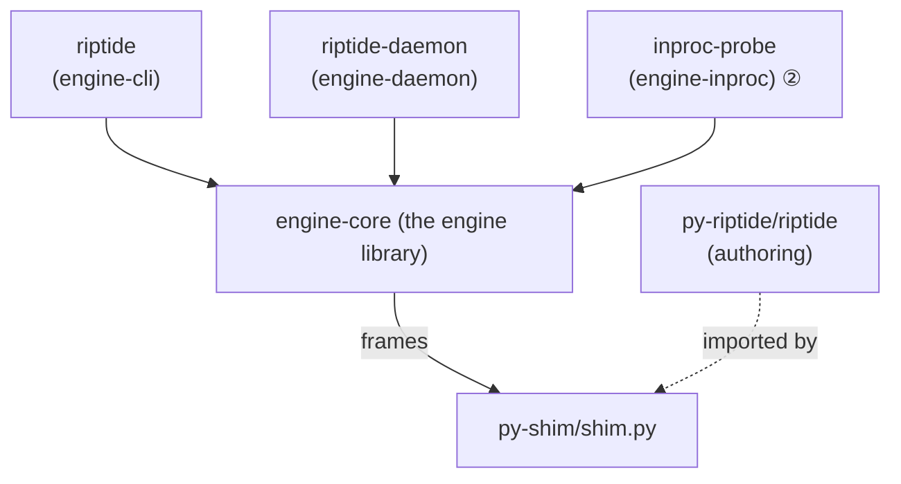

# Module Design

tiderace is a Cargo workspace (`engine/`) of four Rust crates plus two Python packages. Trait seams
between modules (ADR-E005) keep each boundary testable in isolation. This page walks the crates and
their module directories; for the authoritative code map see
[`ARCHITECTURE.md`](https://github.com/snoodleboot-io/tiderace/blob/main/ARCHITECTURE.md).

## `engine-core` — the engine library

All collection, graph, schedule, exec, coverage, impact, and cache logic. Module directories
(`engine-core/src/`):

- **`collection`** — `RegexCollector` (`regex_collector.rs`) discovers test files and node ids by
  fast regex scan; no interpreter, no `--collect-only`. Behind the `Collector` trait.
- **`fixtures`** — the `FixtureGraph` (`fixture_graph.rs`) and resolvers (`fixture_resolver.rs`,
  `layered_resolver.rs`): build each test's fixture **closure** across scopes, with `override_table`,
  `finalizer` ordering, `param_value`/`fixture_args` parametrization, and `closure_hash` (a fixture
  closure's identity, used as a cache-key input).
- **`scheduler`** — `LocalityScheduler` (`locality_scheduler.rs`, ADR-E010): groups a module's tests
  together (scope locality) and LPT-balances them into `WorkerBatch`es (`worker_batch.rs`) across N
  workers. `round_robin_scheduler.rs` is a simpler baseline; both behind the `Scheduler` trait.
- **`coverage`** — `DepGraph` (`dep_graph.rs`) and `CoverageReport` (`coverage_report.rs`): the
  per-test executed-source footprint captured via `sys.monitoring` (ADR-E006), keyed by `file_lines`.
- **`impact`** — `ImpactAnalyzer` (`impact_analyzer.rs`), `Change`, and `Selection`: from the dep
  graph + changed files, select the tests that must run.
- **`cache`** — the content-addressed result cache (ADR-E004): `CacheKey`/`CacheKeyBuilder`, the
  `Cache` trait, `TieredCache` (local + optional remote), `LocalCache`, `NullCache`, `CachedOutcome`,
  and `purity` (`Purity::is_cacheable` — the soundness gate that excludes impure outcomes).
- **`exec`** — execution: `Wellspring` (`wellspring.rs`) imports the project once and forks per test;
  `ForkWorker`, `SubprocessWorker` (the no-fork path), `SubInterpWorker` (`subinterp_worker.rs` — the
  parallel sub-interpreter pool, ADR-E015), the `Worker` trait and `WorkerCaps`; `WatermarkStack`
  (`watermark_stack.rs`) tracks fixture setup/teardown across scopes so finalizers fire in order;
  the `ShimTransport` seam (`transport.rs` — `PipeTransport`, `ReadyInfo`) and the wire types
  (`shim_protocol.rs` — `ExecRequest`/`ExecResponse`, `read_frame`/`write_frame`); plus
  `fork_permit`, `fork_plan`, and `memory_governor` for fork admission/back-pressure.
- **`domain`** — the shared vocabulary: `NodeId`, `Scope`/`ScopePath`, `Outcome`, `TestItem`,
  `TestResult`, `TestStyle`, `RunReport`.
- **`hooks`** — `HookHost` + `HookEvent`/`Hook`/`Priority`: an in-engine event/plugin seam.
- **`reporter`** — the `Reporter` trait with `terminal`, `json`, `junit_xml`, `github`, and `sarif`
  backends.

## `engine-daemon` — the warm server

Keeps CPython warm and adds impact-aware, parallel, file-watching execution. The `riptide-daemon`
binary (`main.rs`). Module files (`engine-daemon/src/`):

- **`engine_handler.rs`** — orchestrates a run: collect → graph → schedule → execute; chooses no-fork
  + restore by default (`optimistic_no_fork()` unless `RIPTIDE_FORCE_FORK=1`) and drives impact-aware
  re-runs (`run_impacted`). Under `RIPTIDE_SUBINTERP=1` it also partitions modules by sub-interpreter
  safety (`safe_set`, cached in `PersistedState`) and routes the safe subset to the `SubInterpWorker`.
- **`probe.rs`** — `probe` mode: classifies each module `safe` / `unsafe` / `unknown` for the
  sub-interpreter tier (imports it in an isolated sub-interpreter), feeding the routing above.
- **`pool.rs`** — the parallel pool, fed `WorkerBatch`es from the `LocalityScheduler`. Each batch runs
  on the platform's backend: a warm `ForkWorker` per core on Unix, a no-fork `SubprocessWorker` per
  batch on Windows (no `fork()` there).
- **`persist.rs`** — `.riptide-state.json` (`PersistedState`, `changed_files()`, `plan()`); the active
  impact-skip layer (see [state & cache](database.md)).
- **`watch.rs` / `fs_watcher.rs` / `invalidator.rs`** — `watch` mode: debounced filesystem events feed
  the invalidator, which uses the dep graph to re-run only impacted tests on each save.
- **`rpc_server.rs` / `socket.rs` / `session.rs` / `rpc_method.rs`** — `serve` mode: a per-project Unix
  socket answering RPC (`Discover`, `Run`, `Health`, `Recycle`, `Shutdown`) over a persistent warm
  session.

## `engine-cli` — the one-shot CLI

The `riptide` binary (`main.rs`): one-shot `collect` and `run`. Reads `RIPTIDE_SHIM` (path to
`py-shim/shim.py`, required) and `RIPTIDE_PYTHON` (default `python3`).

## `engine-inproc` — the in-process backend (②, experimental)

The `inproc-probe` binary (`main.rs`) and `InProcessTransport`: one embedded CPython driven by PyO3
FFI — no subprocess, no pipe — proving the `ShimTransport` seam (ADR-E011/E013). A research path toward
import-once + parallel fork; not the production path.

## `py-shim/shim.py` — the execution substrate

The only logic that runs inside CPython. Imports user code, invokes test bodies, and implements the
**isolation ladder**: `static_impurity` (AST pre-filter), `_restorable` (can this module be snapshot
+ restored?), `_restore_shared` (snapshot/undo of module globals + `os.environ`), and `Engine.run`
(picks bare no-fork / no-fork + restore / `os.fork()`). It also captures coverage via `sys.monitoring`
and records purity verdicts. Reads `RIPTIDE_COVERAGE`, `RIPTIDE_RESTORE`, `RIPTIDE_FORCE_FORK`.

## `py-riptide/riptide` — native authoring & migration

The optional native authoring package (ADR-E012): `@provides` / `@cases` / `@uses` type-DI decorators
(`builtins`, `_resolve.py`, `_spec.py`), and `migrate.py` — the `riptide migrate` AST codemod that
rewrites a pytest suite to the native model. Lets a suite drop the pytest dependency entirely.
