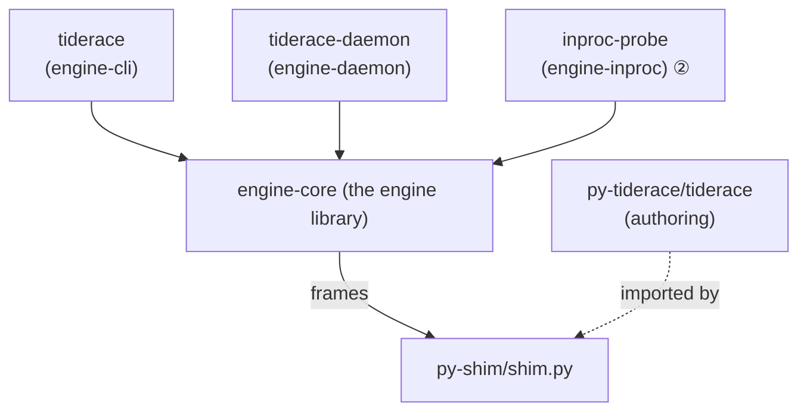

# Module Design

tiderace is a Cargo workspace (`engine/`) of four Rust crates plus two Python packages. Trait seams
between modules (ADR-E005) keep each boundary testable in isolation. This page walks the crates and
their module directories; for the authoritative code map see
[`ARCHITECTURE.md`](https://github.com/snoodleboot-io/tiderace/blob/main/ARCHITECTURE.md).

```mermaid
flowchart TB
    RIP["tiderace<br/>(engine-cli)"] --> CORE
    DAE["tiderace-daemon<br/>(engine-daemon)"] --> CORE
    PROBE["inproc-probe<br/>(engine-inproc) ②"] --> CORE
    CORE["engine-core (the engine library)"] -->|frames| SHIM["py-shim/shim.py"]
    AUTH["py-tiderace/tiderace<br/>(authoring)"] -.imported by.-> SHIM
```

## `engine-core` — the engine library

All collection, graph, schedule, exec, coverage, impact, and cache logic. Module directories
(`engine-core/src/`):

- **`collection`** — `RegexCollector` (`regex_collector.rs`) discovers test files and node ids by
  fast regex scan; no interpreter, no `--collect-only`. Behind the `Collector` trait.
- **`fixtures`** — the `FixtureGraph` (`fixture_graph.rs`) and resolvers (`fixture_resolver.rs`,
  `layered_resolver.rs`): build each test's fixture **closure** across scopes, with `override_table`,
  `finalizer` ordering, `param_value`/`fixture_args` parametrization, and `closure_hash` (a fixture
  closure's identity, used as a cache-key input).
- **`scheduler`** — `LocalityScheduler` (`locality_scheduler.rs`, ADR-E010): groups a module's tests
  together (scope locality) and LPT-balances them into `WorkerBatch`es (`worker_batch.rs`) across N
  workers. `round_robin_scheduler.rs` is a simpler baseline; both behind the `Scheduler` trait.
- **`coverage`** — `DepGraph` (`dep_graph.rs`) and `CoverageReport` (`coverage_report.rs`): the
  per-test executed-source footprint captured via `sys.monitoring` (ADR-E006), keyed by `file_lines`.
- **`impact`** — `ImpactAnalyzer` (`impact_analyzer.rs`), `Change`, and `Selection`: from the dep
  graph + changed files, select the tests that must run.
- **`cache`** — the content-addressed result cache (ADR-E004): `CacheKey`/`CacheKeyBuilder`, the
  `Cache` trait, `TieredCache` (local + optional remote), `LocalCache`, `NullCache`, `CachedOutcome`,
  and `purity` (`Purity::is_cacheable` — the soundness gate that excludes impure outcomes).
- **`exec`** — execution. `process/` launches and reaps the shim (`ShimLaunch`/`ShimProcess`,
  `launch.rs` + `shim_process.rs`; the reply-budgeted reader `budgeted_reader.rs`; `reaper.rs`).
  `tiers/` are the isolation tiers behind one `Worker` trait: `fork.rs` (`ForkWorker`: one warm
  wellspring, fork-per-test), `pool.rs` (`WellspringPool`: the forked workers and the warm image's
  parent), `fork_tier.rs`, `subprocess.rs` (the no-fork path), `subinterp.rs` (the parallel
  sub-interpreter pool, ADR-E015) and `probe.rs` (its safety probe). `tier.rs` names them
  (`WorkerStrategy`) and builds one for a run (`TierFactory`, `WarmImage`); `knobs.rs` is what a
  worker runs with (`RunKnobs`), `limits.rs` the one place deadlines live, `selection.rs` the
  `-k` / `-m` selection and how it travels through the environment. The `ShimTransport` seam
  (`transport.rs` — `PipeTransport`) and the typed wire (`shim_protocol.rs` — `ExecRequest` /
  `ExecResponse`, `read_frame`/`write_frame`); `WatermarkStack` (`watermark_stack.rs`) tracks
  fixture setup/teardown across scopes; plus `fork_permit`, `fork_plan`, `memory_governor` and
  `safe_set_cache`.
- **`runner`** — a run from "what to execute" to "how it was executed", shared by the CLI and the
  daemon: `run_plan.rs` (`RunPlan`, the configuration; `Learned`, what earlier runs recorded),
  `run.rs` (`run_parallel` and the warm-image variant: the tier claims what it runs itself, the
  scheduler partitions the rest, one lane per thread drains the queue — `schedule.rs`,
  `lane.rs`), `verdicts.rs` (`PersistedState`, `VerdictStore`: the `.tiderace-state.json`
  record), `memory.rs` (workers by memory), `run_notes.rs`, `phase_timer.rs`.
- **`domain`** — the shared vocabulary: `NodeId`, `Scope`/`ScopePath`, `Outcome`, `TestItem`,
  `TestResult`, `TestStyle`, `RunReport`.
- **`hooks`** — `HookHost` + `HookEvent`/`Hook`/`Priority`: an in-engine event/plugin seam.
- **`reporter`** — the `Reporter` trait with `terminal`, `json`, `junit_xml`, `github`, and `sarif`
  backends.

## `engine-daemon` — the warm server

Keeps CPython warm and adds impact-aware, parallel, file-watching execution. The `tiderace-daemon`
binary (`main.rs`). Module files (`engine-daemon/src/`):

- **`engine_handler.rs`** — the `EngineHandler`: its `DaemonConfig` (`config.rs`, the one reader of
  `TIDERACE_CACHE_DIR` / `FORCE_FORK` / `SUBINTERP` / `SOCKET`), the sequential `Run` over one warm
  `ForkWorker`, `run_items_parallel` (builds a `RunPlan` and calls the core runner), and the RPC
  dispatch. Errors are `DaemonError` (`error.rs`), converted once at the wire.
- **`full_run.rs` / `impacted_run.rs`** — the two runs: the purity-aware, `-k`-prefiltered full run
  that persists verdicts and footprints, and the impact-aware re-run that executes only what
  changed and serves the rest from the record or the result cache (`result_cache.rs`).
- **`warm_image.rs`** — the warm image a full run forks its workers from, kept between runs and
  dropped when the tree's stamp moves (`tree_stamp.rs`); the one Unix-only file. `collection.rs`
  caches the collection under the same stamp.
- **`state/`** — `.tiderace-state.json`: `plan.rs` (`PersistedState`, `changed_files()`,
  `plan()`; see [state & cache](database.md)), `fold.rs` (how a run's results fold into it,
  `RunScope`), `keyword_prefilter.rs` (`-k` decided by the daemon where the record can vouch),
  `safe_modules.rs` (the sub-interpreter safe set, probed once and persisted).
- **`watch.rs` / `fs_watcher.rs` / `invalidator.rs`** — `watch` mode: debounced filesystem events feed
  the invalidator, which uses the dep graph to re-run only impacted tests on each save.
- **`rpc/`** — `method.rs` (`RpcRequest` / `RpcResponse`), `server.rs` (framing, `RpcHandler`),
  `socket.rs` (the per-project Unix socket and its path), `client.rs` (`DaemonClient`, what
  `tiderace run` and `tiderace daemon …` talk through); `session.rs` the warm session.

The parallel pool itself lives in `engine-core` (`runner/run.rs` over `exec/tiers/`); the daemon's
contribution is the warm image those workers fork from. `probe` mode calls
`engine_core::exec::probe_modules`.

## `engine-cli` — the one-shot CLI

The `tiderace` binary: `main.rs` turns argv into a `Command` (`args.rs` — usage, `Options`, the
`Route` between the daemon serving the root and this process), `run.rs` executes `collect` and `run`
(the target, the plan that actually runs, what `run` writes back), `report.rs` prints the per-test
lines, the tally and the JSON report, and `daemon_cmd.rs` is `daemon start|status|stop` over
`DaemonClient`. Reads `TIDERACE_SHIM` (path to `py-shim/shim.py`, required), `TIDERACE_PYTHON`
(default `python3`) and `TIDERACE_NO_DAEMON`.

## `engine-inproc` — the in-process backend (②, experimental)

The `inproc-probe` binary (`main.rs`) and `InProcessTransport`: one embedded CPython driven by PyO3
FFI — no subprocess, no pipe — proving the `ShimTransport` seam (ADR-E011/E013). A research path toward
import-once + parallel fork; not the production path.

## `py-shim/` — the execution substrate

`shim.py` is a thin entry file; the shim is the package beside it, `tiderace_shim/` (`_shim.py`,
with `main()` as the argv dispatch — TID-116; `results.py`, `nodes.py` and `config.py` are the
result frames, the node-id resolver and the project-config loader it builds on — TID-121;
`protocol.py` is the one transport: frames, the request loop, and the forked children — TID-122;
`pytest_compat.py` folds both mark dialects once, `isolation.py` is the snapshot / verdict /
restore behind the no-fork tiers, `plan.py` is what a node's run will execute, decided before anything
is set up, and `tiers.py` is the isolation ladder's tiers, chosen once, with the response assembled
from a node's variants — TID-123; `selection.py` is what a run selects — `-k`, `-m`,
`--strict-markers`, the declared marks — as one `Selection` the engine holds and the daemon's
per-run patch replaces, and `config.py`'s `RunConfig` is the run itself — root, project, ignores,
the `--modules` set — loaded once and handed to discovery and the engine, where module globals
used to carry each piece; `log.py` is the one line to stderr — TID-124). The engine launches the entry, `TIDERACE_SHIM` points
at it, and the wheel stages both into `tiderace/_shim/`. The only logic that runs inside CPython. Imports user code, invokes test bodies, and implements the
**isolation ladder**: `static_impurity` (AST pre-filter), `_restorable` (can this module be snapshot
+ restored?), `_restore_shared` (snapshot/undo of module globals + `os.environ`), and `Engine.run`
(picks bare no-fork / no-fork + restore / `os.fork()`). It also captures coverage via `sys.monitoring`
and records purity verdicts. Reads `TIDERACE_COVERAGE`, `TIDERACE_RESTORE`, `TIDERACE_FORCE_FORK`.

## `py-tiderace/tiderace` — native authoring & migration

The optional native authoring package (ADR-E012): `@provides` / `@cases` / `@uses` type-DI decorators
(`builtins`, `_resolve.py`, `_spec.py`), and `migrate.py` — the `tiderace migrate` AST codemod that
rewrites a pytest suite to the native model. Lets a suite drop the pytest dependency entirely.
