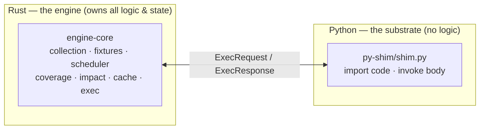

# Design Overview

tiderace is a **pure-Rust test engine for Python**. It owns test collection, the fixture graph,
scheduling, isolation, coverage, and impact analysis in compiled Rust; a thin Python *shim* is the
only code that runs inside CPython, and it exists solely to import your project and invoke test
bodies. **There is no pytest at runtime** — tiderace is the runner, not a wrapper around one.

The design rests on three pillars.

## Pillar 1 — Own the framework

tiderace does not shell out to `pytest`. The engine *is* the framework: a `RegexCollector` finds
tests, a Rust `FixtureGraph` resolves the fixture closure per test, a `LocalityScheduler` plans the
work, and the engine drives execution itself. Python sees only one narrow request at a time — "run
this node id with this isolation style" — over a single swappable transport
([`ShimTransport`](modules.md), ADR-E011).

Everything that benefits from being fast, typed, and parallel — graph building, scheduling, hashing,
impact — lives in Rust. The one thing that *must* be in Python — running Python — is a few hundred
lines of shim. Owning the framework is what unlocks the other two pillars: tiderace decides *how*
each test is isolated, and *whether* it needs to run at all.

## Pillar 2 — Isolate cheaply (the no-fork ladder)

Tests must be isolated from each other so one can't corrupt another's view of process-global state.
The classic mechanism is `fork()` per test — safe, but at ~4.5 ms it dominated execution. The key
observation: **most tests don't mutate shared state at all**, so the fork buys them nothing.

A **wellspring** (ADR-E003) is a CPython process that imports your project **once**; tests run inside
it. The engine then classifies each test and runs it the cheapest **sound** way — the
[isolation ladder](parallel-execution.md) (ADR-E014):

| Tier | When | Mechanism | Rel. cost |
|---|---|---|---|
| **bare no-fork** | test is *known pure* | nothing to isolate | ~0.05 ms (90×) |
| **no-fork + restore** | restorable footprint, purity unknown/impure | snapshot module globals + `os.environ`, run, undo | ~0.4–0.9 ms (5–14×) |
| **fork** | opaque (un-snapshot-able) globals | copy-on-write child | ~4.5 ms (1×) |

This is **sound by construction**: no-fork + restore *contains* mutation rather than predicting it,
and any module it can't snapshot falls back to fork. A wrong purity verdict can only change speed,
never correctness — which is why it is the **default**, with no user flag and no learning pass.
`RIPTIDE_FORCE_FORK=1` reverts to fork-per-test as a debug/benchmark baseline only.

## Pillar 3 — Only run what changed

Most runs after the first should be dramatically smaller. If you changed `src/auth.py`, you should
run the handful of tests that touch it, not the whole suite.

tiderace captures each test's executed-source footprint via CPython's `sys.monitoring`
([coverage](coverage.md), ADR-E006) — **not** coverage.py — and folds it into a dependency graph.
Two complementary layers exploit it:

- **Impact-skip** (the active path, `engine-daemon/persist.rs`): `.riptide-state.json` stores each
  test's dependency files plus the content hash of every touched file. On re-run, only tests whose
  dependencies changed execute. With **no** changes, nothing runs — the wellspring isn't even
  launched. See [impact analysis](impact-analysis.md) and [state & cache](database.md).
- **Content-addressed cache** (`engine-core/cache`, ADR-E004): a test's outcome keyed by its full
  input closure (`CacheKey`) in a `TieredCache(Local, Remote)`. Because the key is content-addressed,
  a result CI computed is reusable on any machine with the same inputs — a *build system for tests*.
  A `purity` gate keeps nondeterministic outcomes out of the cache. The shareable remote tier is a
  `DirCache` (a directory / CI cache path / shared mount); the daemon consults it in `run` when
  `RIPTIDE_CACHE_DIR` is set (**cache hit → impact-skip → run**).

---

The three pillars compound: owning the framework lets tiderace isolate cheaply and skip unchanged
work, so even a cold full run beats pytest and the warm inner loop is orders of magnitude faster.

For the full architecture, every diagram, and the code map, see
[`ARCHITECTURE.md`](https://github.com/snoodleboot-io/tiderace/blob/main/ARCHITECTURE.md).
