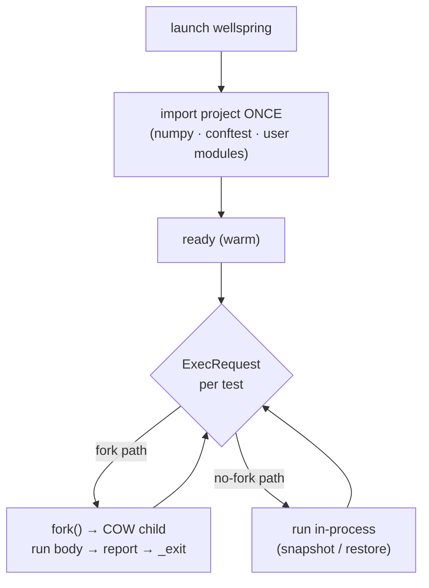
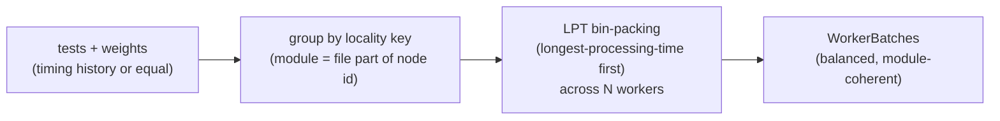
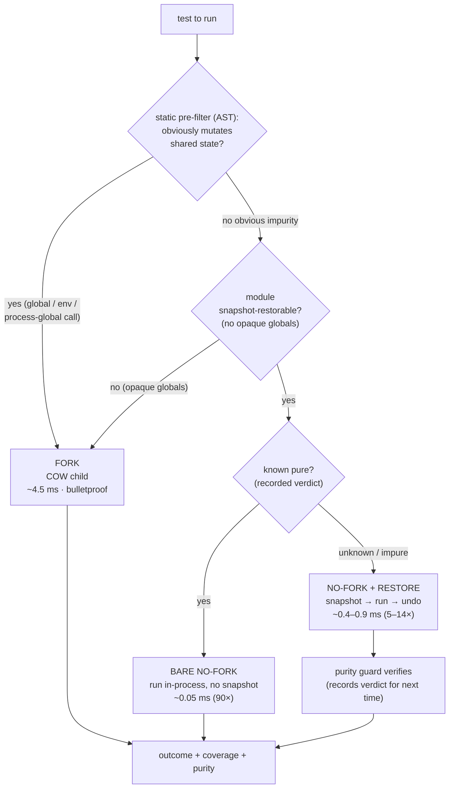

# Parallel Execution & Isolation

tiderace runs your tests itself — there is **no pytest at runtime**. Execution is built on three
ideas: a **warm wellspring** that imports your project once, a **parallel pool** of wellsprings
(one per core) fed by a locality-aware scheduler, and an **isolation ladder** that isolates each
test the cheapest sound way.

## The warm wellspring & fork model

A **Wellspring** (ADR-E003) is a CPython process that imports your project **once** — numpy,
`conftest`, your modules — and then runs tests inside that already-warm interpreter. On the fork
path, each test runs as a `fork()`ed copy-on-write child, so it gets a pristine view of imported
state for roughly the cost of a `fork`, not a fresh `python -c`.

- **Import once, fork many** — the warm import is the expensive part; COW children share it.
- **Per-test deadline** — a child exceeding its deadline is killed and reported `Error`.
- **WatermarkStack** — tracks fixture setup/teardown across scopes so finalizers run in the right
  order as the engine moves between modules and classes.

## The parallel pool

The daemon runs **N wellsprings, one per core** (`engine-daemon/pool.rs`), each with its own warm
import. The `LocalityScheduler` (ADR-E010) packs work into per-worker batches with two goals at once:

- **Scope locality** — a module's tests land on the same worker, so its module/session fixtures are
  set up once.
- **Load balance** — LPT (longest-processing-time-first) greedy packing keeps workers evenly busy.

A `RoundRobinScheduler` exists as a simpler baseline.

## The isolation ladder

We isolate tests from each other so one can't corrupt another's view of process-global state. The
classic mechanism is `fork()` per test — but the fork (~4.5 ms) was the dominant cost, and **most
tests don't mutate shared state at all**, so the fork buys them nothing. tiderace classifies each
test and runs it the cheapest **sound** way. This is automatic (ADR-E014); there is no user flag.

| Tier | When | Isolation mechanism | Rel. cost |
|---|---|---|---|
| **bare no-fork** | test is *known pure* (recorded verdict) | nothing to isolate | ~0.05 ms (90×) |
| **no-fork + restore** | *restorable* footprint, purity unknown/impure | deep-copy snapshot of module globals + `os.environ`, run, restore | ~0.4–0.9 ms (5–14×) |
| **fork** | module has *opaque* (un-deep-copyable) globals | copy-on-write child | ~4.5 ms (1×) |

Key properties:

- **Sound by construction.** No-fork + restore *contains* mutation rather than predicting it; a
  non-restorable module always falls back to fork (`shim._restorable()`). Correctness never depends
  on the purity verdict — the verdict is only an optimization that lets a known-pure test skip the
  snapshot.
- **No learning pass.** Restore works on the very first run; the **purity guard** records verdicts as
  a free side effect of running, so subsequent runs can promote pure tests to the bare tier.
- **Static pre-filter** (`shim.static_impurity`) is a cheap AST scan that flags obvious mutators
  (`global`, writes to free/module names, `os.environ`/`os.chdir`/`random.seed`-style calls) without
  running — a conservative impurity test that seeds the tier decision.

The daemon enables this by default: it sets `RIPTIDE_RESTORE=1` and requests no-fork on every test;
the shim downgrades to fork only where unsound. `RIPTIDE_FORCE_FORK=1` reverts to fork-per-test as a
debug / benchmark baseline only — it is **not** a user-facing tuning flag.

## The transport seam

Execution reaches Python through one trait, `ShimTransport` (ADR-E011): send an `ExecRequest`, block
for an `ExecResponse`. In production this is `PipeTransport` — length-prefixed JSON frames over the
wellspring's pipes. An experimental `InProcessTransport` (②, ADR-E013) drives an embedded CPython over
PyO3 FFI with no subprocess. The engine never knows which backend it's talking to. See
[`ARCHITECTURE.md`](https://github.com/snoodleboot-io/tiderace/blob/main/ARCHITECTURE.md) for the seam
diagram.
