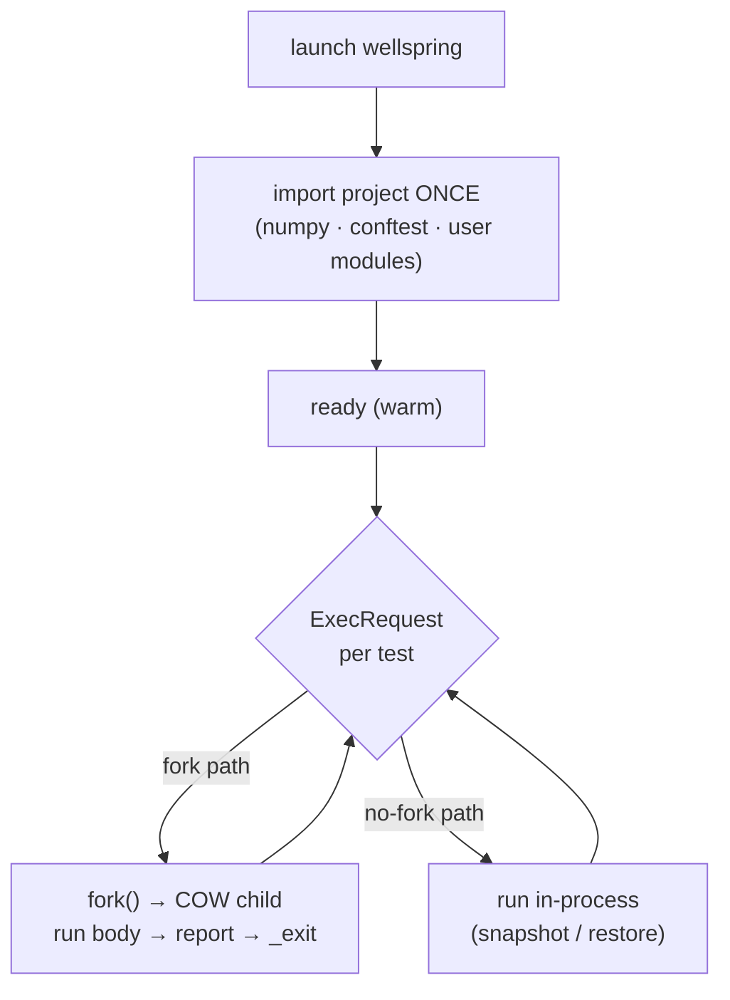
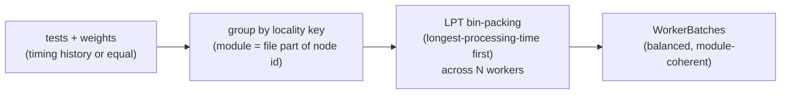
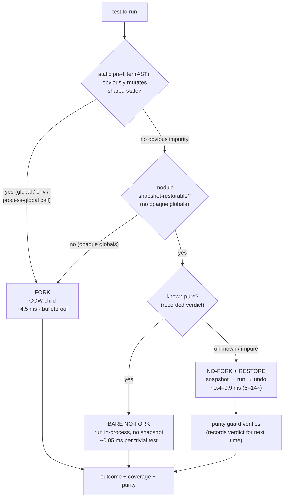
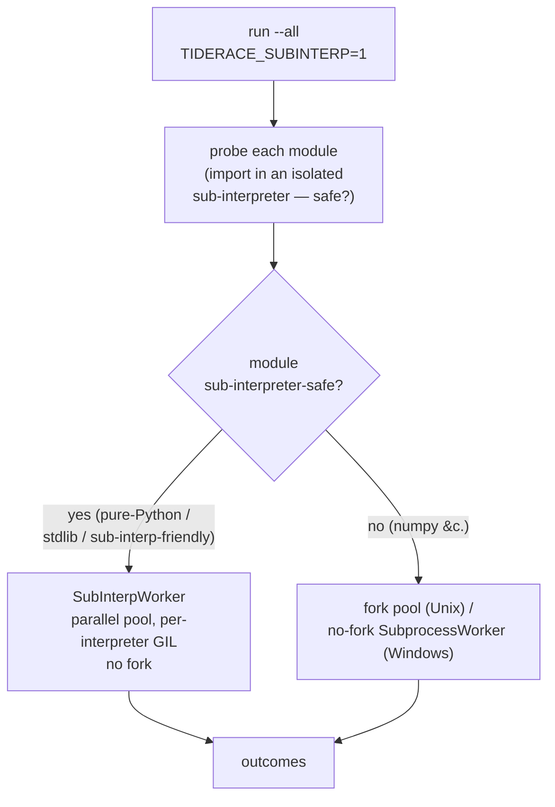

# Parallel Execution & Isolation

tiderace runs your tests itself — there is **no pytest at runtime**. Execution is built on three
ideas: a **warm wellspring** that imports your project once, a **parallel pool** of wellsprings
(one per core) fed by a locality-aware scheduler, and an **isolation ladder** that isolates each
test the cheapest sound way.

## The warm wellspring & fork model

A **Wellspring** (ADR-E003) is a CPython process that imports your project **once** — numpy,
`conftest`, your modules — and then runs tests inside that already-warm interpreter. On the fork
path, each test runs as a `fork()`ed copy-on-write child, so it gets a pristine view of imported
state for roughly the cost of a `fork`, not a fresh `python -c`.

```mermaid
flowchart TB
    L["launch wellspring"] --> I["import project ONCE<br/>(numpy · conftest · user modules)"]
    I --> RDY["ready (warm)"]
    RDY --> REQ{"ExecRequest<br/>per test"}
    REQ -->|"fork path"| FK["fork() → COW child<br/>run body → report → _exit"]
    REQ -->|"no-fork path"| NF["run in-process<br/>(snapshot / restore)"]
    FK --> REQ
    NF --> REQ
```

- **Import once, fork many** — the warm import is the expensive part; COW children share it.
- **Per-test deadline** — a child exceeding its deadline is killed and reported `Error`.
- **WatermarkStack** — tracks fixture setup/teardown across scopes so finalizers run in the right
  order as the engine moves between modules and classes.

## What the engine does not promise

Two things a pytest suite may lean on without noticing, stated here so a divergence is read for
what it is.

**Execution order.** Tests are grouped by module for snapshot locality and handed to workers from a
queue; which tests share a process, and in what order, is not pytest's file order and is not
promised to be. A test that asserts on what an earlier test left behind — the canonical case is
`assert "chromadb" not in sys.modules`, true only if nothing before it imported the package — is
order-dependent under pytest too (`pytest -p randomly` breaks it the same way), and the fix belongs
in the test. When such a failure mentions `sys.modules`, the engine appends a line saying so rather
than leaving a bare `AssertionError` to read as the runner's bug. This was the single divergence on
a 4,652-test suite in the benchmark, and it stays in that count: a real difference, not a defect.

**Being a plugin host.** Parametrisation a pytest plugin injects — anyio's backends — is expanded so
the node ids match, but a suite whose purpose is to test a pytest plugin through `pytester` is
testing pytest, and running it means becoming pytest. See
[12-plugin-host](../../planning/current/pure-rust-test-engine/design/12-plugin-host.md) for the
boundary.

## The parallel pool

The daemon runs **N wellsprings, one per core** (`engine-daemon/pool.rs`), each with its own warm
import. The `LocalityScheduler` (ADR-E010) packs work into per-worker batches with two goals at once:

```mermaid
flowchart LR
    T["tests + weights<br/>(timing history or equal)"] --> G["group by locality key<br/>(module = file part of node id)"]
    G --> LPT["LPT bin-packing<br/>(longest-processing-time first)<br/>across N workers"]
    LPT --> B["WorkerBatches<br/>(balanced, module-coherent)"]
```

- **Scope locality** — a module's tests land on the same worker, so its module/session fixtures are
  set up once.
- **Load balance** — LPT (longest-processing-time-first) greedy packing keeps workers evenly busy.

A `RoundRobinScheduler` exists as a simpler baseline.

Each batch runs on the platform's isolation backend, chosen once in `pool.rs`:

- **Unix** — a `ForkWorker`: one warm wellspring, fork-per-test (the model above).
- **Windows** — no `fork()`, so a `SubprocessWorker` runs the batch **no-fork** (in-process, with
  snapshot/restore between tests; opaque modules are refused rather than run without isolation).
  Parallelism still comes from N batches on N threads — one process per batch. This is what lets the
  parallel pool, and `run --all`, work on Windows at all.

## The isolation ladder

We isolate tests from each other so one can't corrupt another's view of process-global state. The
classic mechanism is `fork()` per test — but the fork (~4.5 ms) was the dominant cost, and **most
tests don't mutate shared state at all**, so the fork buys them nothing. tiderace classifies each
test and runs it the cheapest **sound** way. This is automatic (ADR-E014); there is no user flag.

```mermaid
flowchart TD
    START["test to run"] --> STATIC{"static pre-filter (AST):<br/>obviously mutates<br/>shared state?"}
    STATIC -->|"yes (global / env /<br/>process-global call)"| FORK
    STATIC -->|"no obvious impurity"| RESTORABLE{"module<br/>snapshot-restorable?<br/>(no opaque globals)"}
    RESTORABLE -->|"no (opaque globals)"| FORK["FORK<br/>COW child<br/>~4.5 ms · bulletproof"]
    RESTORABLE -->|"yes"| KNOWN{"known pure?<br/>(recorded verdict)"}
    KNOWN -->|"yes"| BARE["BARE NO-FORK<br/>run in-process, no snapshot<br/>~0.05 ms per trivial test"]
    KNOWN -->|"unknown / impure"| RESTORE["NO-FORK + RESTORE<br/>snapshot → run → undo<br/>~0.4–0.9 ms (5–14×)"]
    RESTORE --> VERIFY["purity guard verifies<br/>(records verdict for next time)"]
    BARE --> DONE["outcome + coverage + purity"]
    VERIFY --> DONE
    FORK --> DONE
```

| Tier | When | Isolation mechanism | Per-test cost ¹ |
|---|---|---|---|
| **bare no-fork** | test is *known pure* (recorded verdict) | nothing to isolate | ~0.05 ms (90×) |
| **no-fork + restore** | *restorable* footprint, purity unknown/impure | deep-copy snapshot of module globals + `os.environ`, run, restore | ~0.4–0.9 ms (5–14×) |
| **fork** | module has *opaque* (un-deep-copyable) globals | copy-on-write child | ~4.5 ms (1×) |

¹ **Microbenchmark figures** — one *trivial* test, against a fork from a *light* parent. They show the
shape of each tier's overhead, not what a suite will see, and both halves of the ratio move:

- **The fork baseline scales with the parent.** `fork()` copies page tables, so on a large-import project
  it is far more than 4.5 ms — ~29 ms per test against a 66 MB parent. Every multiplier above is relative
  to the light-parent figure.
- **The bare tier's reach depends on the suite, and is usually small.** It engages only for tests that
  mutate *nothing*. Measured on a snapshot-heavy corpus of genuinely pure tests it delivers **~3.4×** over
  no-fork + restore; on a real 4,545-test suite built with module-level test doubles and registries,
  **no test at all** measures pure, so the tier never engages. Suites of self-contained assertions
  benefit; suites that record into shared state — most suites worth optimising — do not. No-fork +
  restore is the tier real suites actually spend their time in.

Key properties:

- **Sound by construction.** No-fork + restore *contains* mutation rather than predicting it; a
  non-restorable module always falls back to fork (`shim._restorable()`). Correctness never depends
  on the purity verdict — the verdict is only an optimization that lets a known-pure test skip the
  snapshot.
- **No learning pass.** Restore works on the very first run; the **purity guard** records verdicts as
  a free side effect of running, so subsequent runs can promote pure tests to the bare tier.
- **Static pre-filter** (`shim.static_impurity`) is a cheap AST scan that flags obvious mutators
  (`global`, writes to free/module names, `os.environ`/`os.chdir`/`random.seed`-style calls) without
  running — a conservative impurity test that seeds the tier decision.

The daemon enables this by default: it sets `TIDERACE_RESTORE=1` and requests no-fork on every test;
the shim downgrades to fork only where unsound. `TIDERACE_FORCE_FORK=1` reverts to fork-per-test as a
debug / benchmark baseline only — it is **not** a user-facing tuning flag.

## The sub-interpreter tier (Windows parallelism)

The ladder above removes the *fork tax*, but on **Windows there is no `fork()` at all** — so the pool
falls back to the no-fork `SubprocessWorker`, which is **sequential** within each process. A pure-Python
suite that flies in parallel on Linux runs one-test-at-a-time on Windows. The sub-interpreter tier
(ADR-E015) is how tiderace gets **parallel no-fork execution** there.

Since CPython 3.14, `concurrent.interpreters` (PEP 734) exposes multiple interpreters in one process,
each with its **own GIL** (PEP 684) — so they run Python genuinely in parallel across cores, no fork.
The catch is that not every module can be imported into an isolated sub-interpreter: numpy's C core, for
one, refuses to load in a sub-interpreter (which rules out pandas/scipy/torch with it). So the tier is
**conditional** — detect first, route accordingly:

```mermaid
flowchart TD
    START["run --all<br/>TIDERACE_SUBINTERP=1"] --> PROBE["probe each module<br/>(import in an isolated<br/>sub-interpreter — safe?)"]
    PROBE --> PART{"module<br/>sub-interpreter-safe?"}
    PART -->|"yes (pure-Python /<br/>stdlib / sub-interp-friendly)"| SI["SubInterpWorker<br/>parallel pool, per-interpreter GIL<br/>no fork"]
    PART -->|"no (numpy &c.)"| REST["fork pool (Unix) /<br/>no-fork SubprocessWorker (Windows)"]
    SI --> OUT["outcomes"]
    REST --> OUT
```

- **Detect** — `tiderace-daemon probe` imports each module in a throwaway isolated sub-interpreter and
  records `safe` / `unsafe`. The verdict is **content-addressed and cached** (`.tiderace-state.json`),
  so a module is re-probed only when its content changes — the same pattern as purity verdicts.
- **Route** — safe modules go to the `SubInterpWorker` pool (parallel, no fork); everything else takes
  the ordinary fork/no-fork pool. A mixed suite gets *partial* parallelism: its pure-Python modules run
  in parallel, its numpy modules run the ordinary way.
- **Sound by the same rule as the ladder** — a sub-interpreter has its own module dict *and* its own
  `os.environ`, so tests in the pool can't leak state into one another; anything undeterminable is
  treated as unsafe and routed away. The tier is verified **result-identical to the fork pool** on the
  safe subset.

It is **opt-in** (`TIDERACE_SUBINTERP=1` on `run --all`; `TIDERACE_SUBINTERP_WORKERS` sizes the pool)
because its payoff is Windows-specific: on Linux the fork pool already parallelizes, so the tier
measures at parity there and buys nothing. Requires CPython 3.14+ (`concurrent.interpreters`); on older
interpreters `probe` reports `unknown` and callers fall back to fork. See the
[CLI reference](../api/cli.md) for the `probe` mode and the `TIDERACE_SUBINTERP*` env vars.

## The transport seam

Execution reaches Python through one trait, `ShimTransport` (ADR-E011): send an `ExecRequest`, block
for an `ExecResponse`. In production this is `PipeTransport` — length-prefixed JSON frames over the
wellspring's pipes. An experimental `InProcessTransport` (②, ADR-E013) drives an embedded CPython over
PyO3 FFI with no subprocess. The engine never knows which backend it's talking to. See
[`ARCHITECTURE.md`](https://github.com/snoodleboot-io/tiderace/blob/main/ARCHITECTURE.md) for the seam
diagram.
