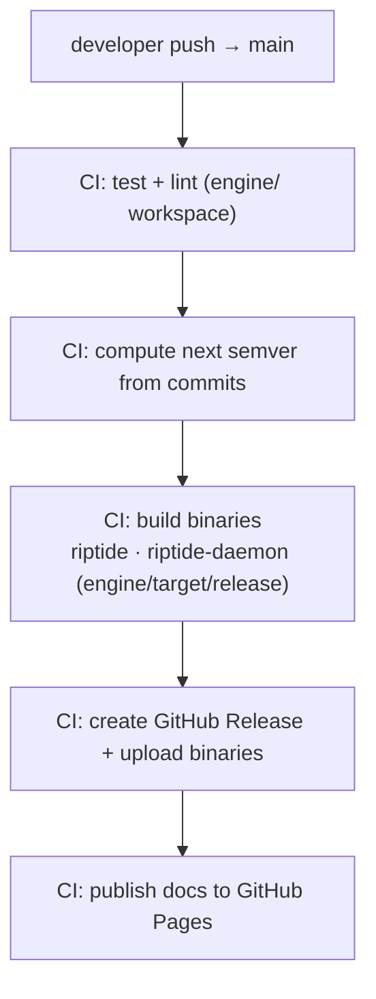

# Release Process

tiderace uses **trunk-based development** with **semantic versioning**. Releases are automated via
CI — developers never manually tag or bump versions.

!!! info "Naming"
    The binaries currently build as `riptide` / `riptide-daemon` from the `engine/` workspace — a
    retired codename being consolidated under tiderace. Read them as tiderace.

## Version rules

| Change type | Who can trigger | Version bump |
|---|---|---|
| Bug fix, docs, perf | Any PR | patch `0.0.x` |
| New feature (backwards compatible) | Any PR | minor `0.x.0` |
| Breaking change | **CI only** (via `BREAKING_CHANGE=true` env) | major `x.0.0` |

**Major version bumps never happen from a developer's local machine.** The `BREAKING_CHANGE` gate is
enforced exclusively in the release workflow.

## Workflow overview



## CI workflows

See `.github/workflows/` for the full definitions:

| File | Trigger | Purpose |
|---|---|---|
| `ci.yml` | Push to any branch, PRs | Build, test, clippy, fmt over the `engine/` workspace |
| `release.yml` | Push to `main` | Semver compute, build binaries, publish release |
| `docs.yml` | Push to `main` | Build and deploy the MkDocs site |
| `security.yml` | Schedule (weekly) | `cargo audit` dependency scan |

The release build compiles from the `engine/` Cargo workspace and ships the two binaries
(`riptide`, `riptide-daemon`) from `engine/target/release/`.

## Caching in CI

Release and test workflows cache **`.riptide-state.json`** (impact-analysis state) between runs,
keyed on branch name, so CI gets the same impact-analysis benefit as local development — only
changed-file tests re-run between commits on the same branch:

```yaml
- uses: actions/cache@v4
  with:
    path: .riptide-state.json
    key: tiderace-state-${{ github.ref_name }}-${{ hashFiles('tests/**') }}
    restore-keys: |
      tiderace-state-${{ github.ref_name }}-
      tiderace-state-main-
```

A stale or missing cache just produces a full run — never an incorrect result. See [CI](ci.md) for
the safe-vs-fast run modes.
