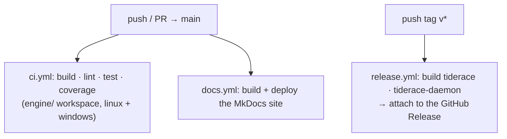

# Release Process

tiderace uses **trunk-based development** with **semantic versioning**. A release is cut by pushing a
version tag; CI then builds and publishes the binaries.

## Versioning

Versions follow semver (`MAJOR.MINOR.PATCH`):

| Change | Bump |
|---|---|
| Bug fix, docs, perf | patch `0.0.x` |
| New, backwards-compatible feature | minor `0.x.0` |
| Breaking change | major `x.0.0` |

## Cutting a release

Releases are triggered by a **version tag**, not by a push to `main`:

```bash
git tag v0.2.0          # the semver for everything since the last tag
git push origin v0.2.0  # → triggers .github/workflows/release.yml
```

`release.yml` (also runnable manually via **workflow_dispatch**) then:

1. builds `tiderace` and `tiderace-daemon` from the `engine/` workspace (`cargo build --release`),
2. stages them as `tiderace-linux-x86_64` / `tiderace-daemon-linux-x86_64` with a `sha256sums.txt`,
3. uploads them as a build artifact and — on a tag push — **attaches them to the GitHub Release**.

## Workflow overview



## CI workflows

See `.github/workflows/` for the full definitions:

| File | Trigger | Purpose |
|---|---|---|
| `ci.yml` | Push to `main`, PRs | Build · clippy · fmt · test + the coverage gate over the `engine/` workspace (linux + windows) |
| `release.yml` | Tag push (`v*`) or manual dispatch | Build the `tiderace` / `tiderace-daemon` binaries and attach them to the GitHub Release |
| `docs.yml` | Push to `main` (docs paths) | Build and deploy the MkDocs site to GitHub Pages |

## Caching in CI

The project's workflows cache the **Cargo** registry, git dependencies, and `engine/target` (keyed on
`engine/Cargo.lock`) so builds stay fast — that's the only thing they cache.

Caching **`.tiderace-state.json`** (impact-analysis state) is a pattern for running tiderace *in your
own project's CI* to skip unchanged tests — see [CI](ci.md). It doesn't apply to this pipeline, which
builds and tests the engine itself rather than running a downstream suite through the daemon.
