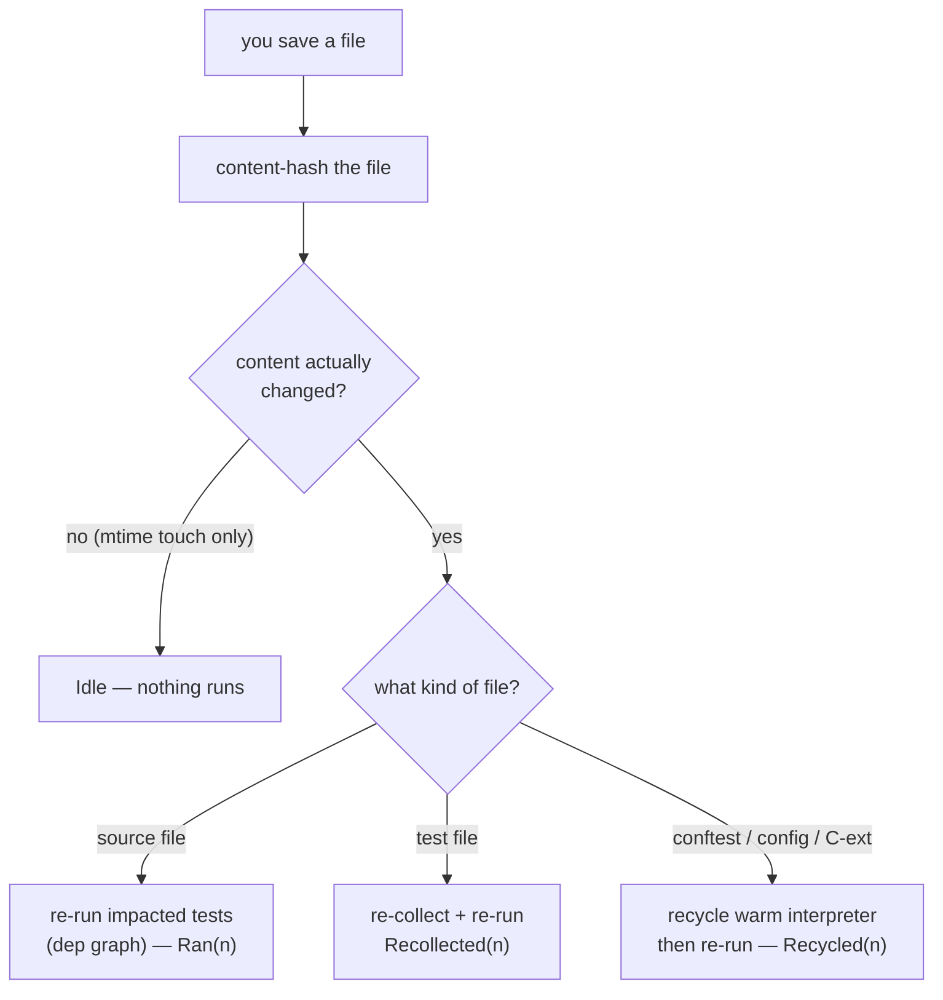

# Watch Mode

`tiderace-daemon watch` keeps a **warm** CPython interpreter — your project imported **once** — and
re-runs only the tests impacted by each file you save. Because the interpreter stays alive between
runs, every cycle after the first pays **no interpreter startup**: you get millisecond feedback as
you edit.

```bash
tiderace-daemon watch tests/
```

```
watching tests/ (Ctrl-C to stop)…
src/auth.py:    Ran(2)
test_auth.py:   Recollected(5)
conftest.py:    Recycled(12)
```

## How it works



On startup `watch` discovers your tests and seeds the dependency graph (empty until coverage runs
accrue). Then it watches the tree, coalescing each save's burst of filesystem events within a short
quiet window, and does the **minimum** work per change:

- **Source edit** → re-run only the tests whose recorded dependencies include that file (`Ran(n)`).
- **Test-file edit** → re-collect and re-run (`Recollected(n)`).
- **`conftest.py` / config / C-extension change** → recycle the warm interpreter (its imports are
  now stale), then re-run (`Recycled(n)`).
- **No real change** (e.g. an mtime-only touch with identical content) → `Idle`, nothing runs.

## Cold start is conservative, then tightens

The dependency graph is empty until coverage from real runs populates it. So the **first** edits in
a fresh `watch` session conservatively re-run the full candidate set (correct, just not yet precise);
as runs accrue coverage footprints, selection narrows to exactly the impacted tests. The impact-aware
daemon `run` already records this footprint to `.tiderace-state.json`, so a project you've `run`
recently starts `watch` with a warmer graph.

## When *not* to use it

`watch` keeps a **long-lived warm process** that shares interpreter state across runs. That's a
deliberate convenience for **trusted local development** — it's not an isolation guarantee across the
whole session. **Do not use the warm process as your CI gate.** For CI, run a fresh one-shot:

```bash
tiderace-daemon run tests/          # impact-aware fresh run
tiderace-daemon run tests/ --all    # full fresh run
```

Each of those launches a clean wellspring and applies the [isolation ladder](../design/architecture.md#the-isolation-ladder)
per test — the right model for a one-shot gate. See [CI](ci.md).
