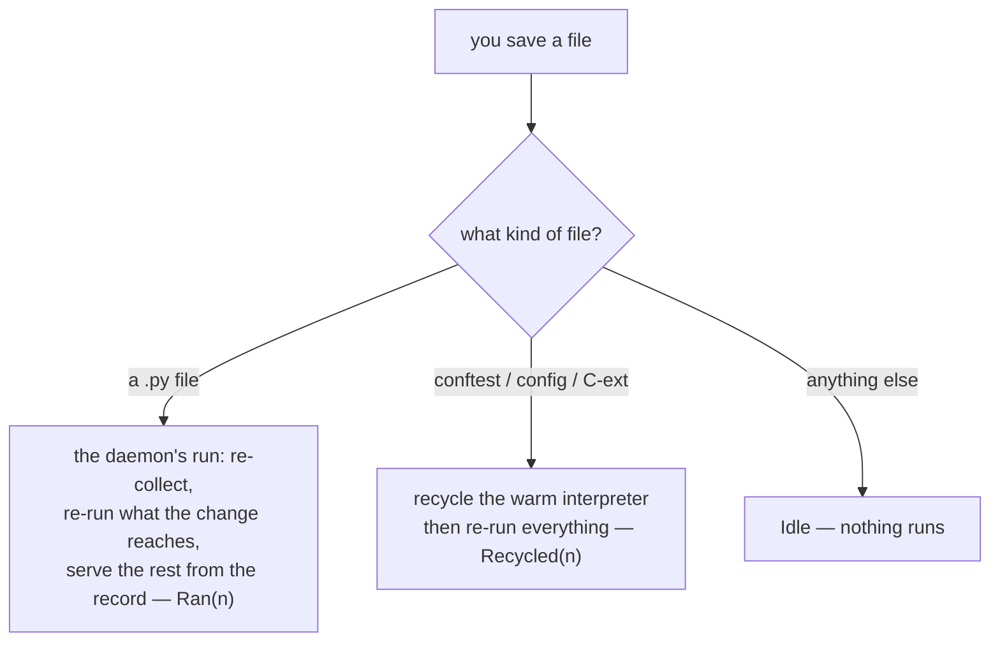

# Watch Mode

`tiderace-daemon watch` keeps a **warm** CPython interpreter — your project imported **once** — and
re-runs only the tests impacted by each file you save. Because the interpreter stays alive between
runs, every cycle after the first pays **no interpreter startup**: you get millisecond feedback as
you edit.

```bash
tiderace-daemon watch tests/
```

```
watching tests/ (Ctrl-C to stop)…
src/auth.py:    Ran(2)
test_auth.py:   Ran(5)
conftest.py:    Recycled(12)
```

## How it works


```mermaid
flowchart TD
    SAVE["you save a file"] --> KIND{"what kind of file?"}
    KIND -->|"a .py file"| RUN["the daemon's run: re-collect,<br/>re-run what the change reaches,<br/>serve the rest from the record — Ran(n)"]
    KIND -->|"conftest / config / C-ext"| RCY["recycle the warm interpreter<br/>then re-run everything — Recycled(n)"]
    KIND -->|"anything else"| IDLE["Idle — nothing runs"]
```

`watch` watches the tree, coalescing each save's burst of filesystem events within a short quiet
window, and hands every change to the same run path `tiderace run` uses through the daemon:

- **`.py` edit** (source or test) → the daemon's full run: it re-collects, re-runs the tests whose
  recorded footprint reaches the saved file, and serves the rest from the persisted record
  (`.tiderace-state.json`) — `Ran(n)`. With no record yet, everything runs once; the next save is
  precise.
- **`conftest.py` / project config / `setup.py` / C-extension change** → recycle the warm
  interpreter (its imports are now stale), then re-run everything (`Recycled(n)`).
- **Anything else** → `Idle`, nothing runs.

## When *not* to use it

`watch` keeps a **long-lived warm process** that shares interpreter state across runs. That's a
deliberate convenience for **trusted local development** — it's not an isolation guarantee across the
whole session. The same applies to `tiderace daemon start` (whose image *is* re-imported whenever a
`.py` file changes, but is shared by every run between edits). **Do not use a warm process as your
CI gate.** For CI, run a fresh one-shot:

```bash
tiderace-daemon run tests/          # impact-aware fresh run
tiderace-daemon run tests/ --all    # full fresh run
```

Each of those launches a clean wellspring and applies the [isolation ladder](../design/architecture.md#the-isolation-ladder)
per test — the right model for a one-shot gate. See [CI](ci.md).
