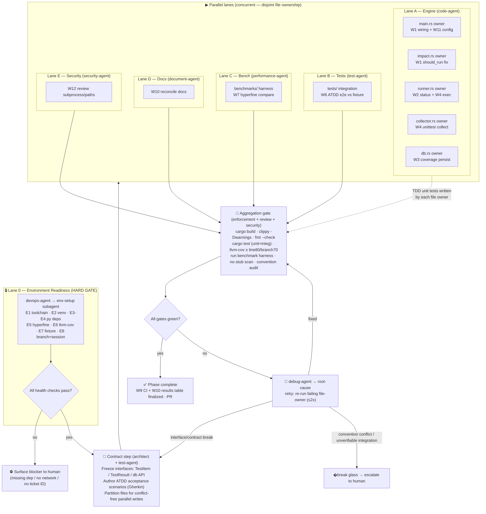

# Phase 1 — Tiderace Hardening, Test Suite & Benchmark Harness

> **Status:** Decisions locked — awaiting final **GO** to unblock Lane 0. **No lane begins until explicit approval.**
> **Owner:** orchestrator-agent · **Persona:** Software Engineer · **Date:** 2026-06-10

## Decisions locked (2026-06-10)
1. **Branch:** placeholder authorized → `feat/tiderace-hardening-benchmarks` (no ticket; internal repo).
2. **Rust structure:** idiomatic Rust modules — "one class per file" **waived** for Rust (C2 resolved).
3. **Scope:** **Full plan W1–W12** incl. pyproject `[tool.tiderace]` reader. Linux-only; mutation testing deferred.
4. **Installs:** isolated installs approved → `./.tiderace-bench-venv/` + `cargo install`; system Python untouched.

This plan follows the multiagent implementation protocol: load conventions → discover
agents → design a genuinely-parallel execution model → gate on environment readiness →
enforce implementation standards → present for review.

---

## 0. Phase scope (the "things to document and fix")

Derived from the gap analysis. Each work item (W#) is traceable to a lane and a verification.

| ID | Work item | Why it matters | Primary file(s) |
|----|-----------|----------------|-----------------|
| W1 | Fix impact analysis being a **no-op without `--coverage`** | The marquee feature; verified broken (2nd run re-ran all tests, `skipped: 0`) | `impact.rs`, `main.rs`, `db.rs` |
| W2 | Robust test-status parsing (pytest JSON/`--junitxml` instead of substring matching) | `parse_status` is locale/format-fragile | `runner.rs` |
| W3 | Wire **coverage persistence** to SQLite (kill dead `save_coverage`/`coverage_data`) | Coverage computed but never stored | `db.rs`, `main.rs` |
| W4 | **unittest** support — collect `unittest.TestCase` subclasses + execution path | "Benchmarkable against unittest" needs collection; regex misses non-`Test*` classes | `collector.rs`, `runner.rs` |
| W5 | Rust **unit tests** (TDD) for every module | Zero automated tests exist today | each `*.rs` (`#[cfg(test)]`) |
| W6 | **Integration tests** (ATDD) running the real binary against a fixture suite | Prove end-to-end behaviour, no mocks | `tests/` |
| W7 | **Benchmark harness** vs `pytest`, `pytest -n auto` (xdist), `pytest-testmon`, `unittest` | "Show it performs / benchmarkable" — the explicit ask | `benchmarks/` |
| W8 | **Reference Python fixture suite** generator (shared by W6 + W7 + env health check) | Reproducible target with a real import graph | `benchmarks/fixtures/` |
| W9 | **CI workflow** (build, clippy, rustfmt, test, coverage, bench-smoke) | README shows CI badges; no workflow exists | `.github/workflows/` |
| W10 | **Docs reconciliation** (impact caveat, install URLs, config status, results table) | Docs describe unimplemented behaviour | `README.md`, `docs/**` |
| W11 | `pyproject.toml [tool.tiderace]` config reader *(decision: include or defer)* | Documented but unimplemented | `main.rs` |
| W12 | **Security review** of subprocess construction & path handling | Untrusted nodeids/paths reach `Command` | review-only (diff) |

---

## 1. Conventions loaded

| Convention source | Location | Substantive? | Key concrete rules extracted |
|---|---|---|---|
| Core system + session protocol | `.claude/conventions/core/general.md` | ✅ Yes | Hard-stop branch rule (no work on `main`); **mandatory session file** in `.prompticorn/sessions/`; read-before-write; scope discipline; flag new deps; typed errors, never swallow |
| Language conventions (Rust) | `.claude/conventions/languages/rust.md` | ⚠️ **Template** | `Result<T,E>`/`?`/`anyhow`/`thiserror`; borrow over clone; `Arc` for sharing; snake_case files/fns, PascalCase types — **but testing section is `TODO` and `{{jinja}}` vars are unrendered** |
| Embedded core-conventions | inside `general.md` | ⚠️ **Template** | "One class per file (snake_case filename)"; SOLID; import grouping — **but Repo type / Error pattern / DB are `TODO`** |
| Architecture decisions | `docs/design/decisions.md` | ✅ Yes | ADR-001 subprocess-per-test; ADR-002 SQLite (`rusqlite` bundled); ADR-003 SHA-256 change detection; ADR-004 Rayon; ADR-005 regex collection; ADR-006 trunk-based + semver |
| Project spec | `.prompticorn/.prompticorn.yaml` | ✅ Yes | Rust 1.75/1.76; Cargo; **clippy + rustfmt**; **coverage targets: line 80 / branch 70 / fn 90 / stmt 85 / mutation 80 / path 60**; test_framework: built-in |
| Planning templates | `planning/backlog/_template/{PRD,ADR,DESIGN}.md` | ✅ Yes | PRD/ADR/DESIGN section structure; `backlog/`→`current/`→`completed/` lifecycle |
| Skills | `.claude/skills/*/SKILL.md` | ✅ Yes | feature-planning (plan before code); incremental (one file at a time); post-impl checklist; **test-coverage-categories (7 categories)**; **test-mocking-rules (mock only at process boundaries)** |

### Gaps & conflicts identified in conventions (see §9 for fallbacks)
- **C1 — Unrendered templates:** `rust.md` and embedded core-conventions contain `TODO`s and raw Jinja (`{{ language }}`). Concrete Rust testing/error/structure rules are **incomplete**.
- **C2 — "One class per file" vs idiomatic Rust:** the existing code (`runner.rs` holds `TestStatus`, `TestResult`, `Runner`, `CoverageInfo`) already violates this OOP rule. It is language-inappropriate for Rust modules. **Needs a ruling.**
- **C3 — "No stubs/NotImplementedError" vs `boilerplate.md` subagent** (which *uses* `NotImplementedError`). These are mutually exclusive. **Resolution: exclude `boilerplate` from this pipeline.**
- **C4 — Branch/ticket:** on `main`; convention mandates a feature branch whose name needs a **real ticket ID** (fakes explicitly forbidden). **Blocker — see §9.**

---

## 2. Discovered agent roster → pipeline role

All 24 primary agents load `.claude/workflows/feature.md` and the 5 shared skills. Mapping to roles:

| Pipeline role | Agent | Subagents it spawns (relevant) |
|---|---|---|
| **PM / scoping** | plan-agent + product-agent | task-breakdown, requirements-analyst |
| **Architect / contract** | architect-agent | data-model, scaffold, **task-breakdown** |
| **Environment (GATE)** | devops-agent | **devops, docker, gitops** |
| **Code (engine fixes)** | code-agent | feature, house-style, refactor *(boilerplate excluded — C3)* |
| **ATDD + TDD + coverage** | test-agent | strategy *(+ skills: test-coverage-categories, test-mocking-rules)* |
| **Benchmarking** | performance-agent | **benchmarking, profiling, bottleneck-analysis, optimization-strategies** |
| **Docs** | document-agent | docs, pr-description |
| **Security (verify)** | security-agent | review, threat-model, vulnerability-assessment-specialist, security-architecture-reviewer |
| **Enforcement (verify)** | enforcement-agent | house-style |
| **Review (verify)** | review-agent | code, performance |
| **Debug / retry** | debug-agent | root-cause, rubber-duck, log-analysis |
| **Orchestration** | orchestrator-agent | devops, meta, pr-description |

**Roles with no dedicated agent (flagged):**
- **ATDD** — no standalone acceptance-test agent → handled by **test-agent + task-breakdown** (acceptance scenarios authored before code).
- **"Verify"** — no single verify agent → realised as the **enforcement + review + security** aggregation gate.
- **Environment setup** — no standalone agent → owned by **devops-agent**'s env-setup subagent (the hard gate).

---

## 3. Environment manifest (Lane 0 — hard prerequisite gate)

The env-setup subagent **starts/verifies everything itself** (the pipeline owns infra; the human is never asked to run a command). Nothing else unblocks until every health check below passes.

| # | Service / process | Purpose | Start / provision | Health check |
|---|---|---|---|---|
| E1 | Rust toolchain (cargo, rustc ≥1.75, clippy, rustfmt) | Build, lint, format, test | verify present | `cargo --version && cargo clippy --version && rustfmt --version` |
| E2 | Isolated Python venv `./.tiderace-bench-venv/` | Reproducible Python deps, no system pollution | `python3 -m venv` | `./.tiderace-bench-venv/bin/python -V` |
| E3 | `pytest` + `coverage` (in venv) | Engine runtime deps (coverage currently **MISSING — verified**) | `pip install pytest coverage` | `python -c "import pytest, coverage"` |
| E4 | `pytest-xdist`, `pytest-testmon` (in venv) | Benchmark competitors | `pip install pytest-xdist pytest-testmon` | `python -c "import xdist, testmon"` |
| E5 | `hyperfine` | Statistically-sound wall-time benchmarking | `cargo install hyperfine` (or pkg mgr) | `hyperfine --version` |
| E6 | `cargo-llvm-cov` | Rust coverage vs thresholds (line80/branch70) | `cargo install cargo-llvm-cov` | `cargo llvm-cov --version` |
| E7 | Reference fixture suite (W8) | Shared target for tests + benchmarks | generate into `benchmarks/fixtures/sample_project/` | `tiderace collect` finds N tests; pytest runs green |
| E8 | Feature branch + session file | Governance (general.md) | pipeline creates *(needs ticket ID — §9)* | `git branch --show-current` matches; session file valid |

**Stop/cleanup:** `deactivate` venv (dir is gitignored & removable); `rm -rf .tiderace-bench-venv .tiderace.db .tiderace-coverage`; branch via normal git. All documented in the generated `env-manifest.md`.

**Network dependency risk:** E3–E6 require package downloads. If the sandbox is network-restricted, this is a **hard blocker** surfaced immediately (§9), not worked around.

---

## 4. Execution map

**Concurrency honesty note:** lanes are parallel **only where they touch disjoint paths**. Lane A's five file-owners each own exactly one `*.rs` file → safe concurrent writes. `main.rs` is owned by a *single* subagent (W1+W11) to avoid a two-writer conflict. Lanes B/C/D create new files under `tests/`, `benchmarks/`, `docs/` → no overlap with A. Lane E is read-only. The only true serialization points are the **contract step** (before A) and the **aggregation gate** (after all).

---

## 5. Subagent specification

| Subagent | Parent | Task scope | Inputs | Outputs | Convention constraints |
|---|---|---|---|---|---|
| env-setup | devops-agent | Provision & health-check §3; create branch+session | ticket ID, repo | `env-manifest.md`, ready signal | gitignore artifacts; pin versions |
| contract | architect-agent | Freeze struct/db interfaces; file-ownership map | gap analysis, conventions | `INTERFACES.md` | typed errors; no signature churn mid-lane |
| atdd-author | test-agent | Gherkin acceptance scenarios (before code) | scope, fixture | `tests/acceptance/*.feature` (or doc) | test-coverage-categories (7) |
| main-owner | code-agent | W1 impact wiring + W11 config reader | `INTERFACES.md` | edited `main.rs` + `#[cfg(test)]` | `Result`/`?`; no stubs; idiomatic Rust |
| impact-owner | code-agent | W1 `should_run` correctness | `INTERFACES.md` | edited `impact.rs` + tests | as above |
| runner-owner | code-agent | W2 JSON/junit status + W4 exec path | `INTERFACES.md` | edited `runner.rs` + tests | no `pass`/TODO; real impl only |
| collector-owner | code-agent | W4 unittest `TestCase` collection | `INTERFACES.md` | edited `collector.rs` + tests | as above |
| db-owner | code-agent | W3 coverage persistence | `INTERFACES.md` | edited `db.rs` + tests | parameterized SQL; snake_case tables |
| integ-tests | test-agent | W6 e2e against fixture (real binary, real pytest) | built binary, fixture | `tests/cli_*.rs` | mock **only** at boundaries → here, **no mocks** |
| bench | performance-agent | W7 hyperfine compare cold/warm vs 4 tools | binary, fixture, venv | `benchmarks/run.*`, `RESULTS.md`+JSON | document baselines & rationale |
| docs | document-agent | W10 reconcile + W9 CI yaml | final behaviour, results | edited `docs/**`, `README.md`, `.github/workflows/ci.yml` | docs match reality only |
| sec-review | security-agent | W12 subprocess/path/SQL/supply-chain | diff | findings (CVSS) | STRIDE; flag, don't patch silently |
| enforce | enforcement-agent | convention + no-stub audit | full diff | pass/fail + change requests | all of §6 |

---

## 6. Convention enforcement (per checkpoint)

| Convention | Applied by | Verified at | How |
|---|---|---|---|
| snake_case files / PascalCase types / fn naming | all code subagents | enforce gate | house-style subagent + `rustfmt --check` |
| `Result`/`?`/`anyhow`, never panic, never swallow | code subagents | review + enforce | grep for `.unwrap()`/`panic!` in new non-test code; clippy |
| **No stubs / TODO / `unimplemented!` / `NotImplementedError`** | all | enforce gate | `grep -rnE 'todo!|unimplemented!|unreachable!\(\)\s*//|TODO|FIXME'` over the diff → any hit = **failure** |
| Coverage line ≥80 / branch ≥70 | test-agent | aggregation | `cargo llvm-cov --fail-under-lines 80` |
| Idiomatic Rust module structure (C2 ruling pending) | code subagents | review | matches existing `runner.rs` multi-type pattern |
| Import grouping (std → third-party → internal) | code subagents | house-style | visual + clippy |
| ADR alignment (subprocess, SQLite, regex, Rayon) | architect/contract | contract step | no change to accepted ADRs without a new ADR |
| Branch naming + session updates | devops/orchestrator | gate + throughout | `git branch --show-current`; session file appended |

---

## 7. Test strategy

**ATDD (acceptance — authored before any code, by test-agent):** real-binary, real-pytest, no mocks.
- *Impact:* Given a suite run once **with `--coverage`**, When no files change, Then **0 tests execute**.
- *Impact:* Given `src/foo.py` changes, When run, Then **only tests covering `foo.py`** execute.
- *unittest:* Given `class AuthTests(unittest.TestCase)`, When collected, Then its `test_*` methods are discovered.
- *Status:* Given a failing test, Then process exit code is **1** and it is classified `failed` (not `error`).
- *Coverage persistence:* Given `--coverage`, Then `coverage_data` rows exist in `.tiderace.db`.

**TDD (unit — concurrent with code, written by each file-owner):** red→green→refactor, the 7 coverage categories (happy / boundary / empty-null / error / ordering / authz / adversarial) where applicable:
- collector: nested classes, parametrize, async, unittest, non-test funcs after a class (the indentation bug).
- hasher: new file, changed content, unchanged, ignored dirs.
- impact: own-file changed, dep changed, no-deps, previously-failed, unchanged-with-deps (the W1 fix).
- db: round-trip hashes/results/deps/coverage; replace semantics.
- runner: status classification across pytest output shapes (the W2 fix).

**Validation at aggregation:** `cargo test` (unit+integration) green in the live venv; `cargo llvm-cov` ≥ thresholds; integration suite green against the fixture. Mutation (80% target) is **flagged as a stretch goal** (`cargo-mutants`) — see §9.

---

## 8. Integration verification plan (every boundary, end-to-end, no mocks)

| Boundary | How verified working |
|---|---|
| Rust → Python/pytest subprocess | Integration test runs the binary on the fixture; asserts pass/fail/skip counts match a direct `pytest` run |
| Rust → `coverage.py` | Run `--coverage` on fixture; assert `test_file_deps` + `coverage_data` populated; assert **2nd run skips** unchanged tests |
| Rust → SQLite (`.tiderace.db`) | Test opens the DB post-run and asserts expected rows (hashes, results, deps) |
| unittest execution path | Fixture includes a `unittest.TestCase`; assert it is collected **and** run with correct status |
| Benchmark harness → pytest / xdist / testmon / unittest / hyperfine | Harness emits a populated table with **non-zero timings for every tool**; missing tool = blocker, not a blank cell |

Any boundary that cannot be verified in-environment is a **blocker** (§9) — not stubbed around.

---

## 9. Gap report & fallbacks

| Gap / blocker | Severity | Proposed fallback |
|---|---|---|
| **No ticket ID** for branch name (fakes forbidden) | 🔴 Blocker | **Human supplies a real ticket ID** (the one question below). Pipeline then creates the branch. |
| `coverage` **not installed** (verified); xdist/testmon/hyperfine/llvm-cov likely absent | 🔴 Blocker | env-setup installs into venv / via cargo. **If no network → halt and report.** |
| Conventions are **unrendered templates** (C1) | 🟠 | Use concrete bits (snake_case, `Result`/`anyhow`, prompticorn coverage targets) + idiomatic Rust + existing-code patterns as de-facto rules. |
| **"One class per file"** vs Rust idiom (C2) | 🟠 Decision | Recommend: follow idiomatic Rust modules (as existing code does). **Needs your ruling.** |
| `boilerplate` subagent uses `NotImplementedError`, violating no-stub rule (C3) | 🟢 Resolved | Exclude `boilerplate` from this pipeline. |
| **Mutation testing 80%** target (prompticorn) | 🟠 | `cargo-mutants` is heavy; propose **defer to a follow-up phase**, hit line/branch now. |
| **W11 pyproject config** — include or defer? | 🟠 Decision | Recommend **include** (makes docs honest); de-scopable if you want a smaller slice. |
| macOS/Windows support (docs say "coming") | 🟢 | Out of scope: **Linux x86_64 only** this phase. Confirm. |
| Subprocess-per-test means **cold runs ~250ms/test** (ADR-001) | 🟢 | Benchmark will report cold *and* warm honestly; no silent spin. |

---

## 10. Debug & retry logic

- **Owner:** debug-agent (spawns root-cause; rubber-duck for ambiguous failures).
- **Surfacing:** failures appear at the aggregation gate (test/clippy/coverage/bench/no-stub).
- **Retry scope:**
  1. *Subagent-local* — re-run the single failing file-owner with the failure log attached (**≤2 attempts**).
  2. *Lane re-plan* — if the failure is an interface/contract break, return to the **contract step** and re-freeze, then re-run affected owners.
  3. *Escalate to human* — on a convention conflict needing a ruling, an unverifiable integration, or exhausted retries.
- **Escalation trigger:** any 🔴 in §9, any boundary that won't verify, or >2 failed local retries.
- **Re-present rule:** if roster, conventions, environment state, or scope change materially mid-run, **all lanes pause and this plan is re-presented.**

---

## Approval checklist (for the human)

- [ ] Provide a **real ticket ID** (or authorize a placeholder for this internal repo).
- [ ] **C2 ruling:** idiomatic Rust modules OK (waive "one class per file")?
- [ ] **W11:** include pyproject config reader, or defer?
- [ ] Confirm **Linux-only** scope and **mutation-testing deferral**.
- [ ] Approve network installs into an isolated venv / via cargo (E3–E6).
- [ ] **Approve this plan** to unblock Lane 0.
