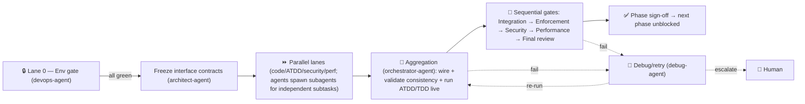

# Multiagent Pipeline — Shared Scaffold (all phases)

> **Status:** 📋 Reference for every phase PLAN. Read alongside [ROADMAP.md](ROADMAP.md).
> Each `phase-N-*/PLAN.md` references this file for the shared parts and only specifies its own
> scope, lanes, subagents, execution map, integration boundaries, and gaps.

This document holds the parts of the multiagent implementation model that are **identical across
all phases**: loaded conventions, the agent roster→role mapping, the environment-gate doctrine,
the non-negotiable implementation standards, convention-enforcement checkpoints, the test-strategy
doctrine, and the debug/retry/escalation logic. It exists so the seven phase plans don't repeat
~150 lines each.

---

## 1. Conventions loaded (apply to every phase)

| Convention | Location | Notes |
|------------|----------|-------|
| Core system / startup / sessions | [.claude/conventions/core/general.md](../../../.claude/conventions/core/general.md) | branch + **mandatory session**; SOLID; one-class-per-file |
| Rust language | [.claude/conventions/languages/rust.md](../../../.claude/conventions/languages/rust.md) | `Result`/`?`, `thiserror`, no panics in lib code, trait DI, naming |
| Feature / Code / Testing workflows | [.claude/workflows/](../../../.claude/workflows/) | plan→confirm→implement; read-before-write; happy/boundary/null/error/coverage/isolation |
| Test skills | [test-coverage-categories](../../../.claude/skills/test-coverage-categories), [test-mocking-rules](../../../.claude/skills/test-mocking-rules) | coverage taxonomy; mock only true externals |
| Engine ADRs | [design/adr/](design/adr/) (E001–E010) | binding architecture decisions |
| Planning structure | [planning/README.md](../../README.md) | backlog→current→completed; PRD/ADR/DESIGN |

**Standing convention gaps (flagged once here; ratify before Phase 1 unblocks):**

- **G-C1 — Placeholder core conventions.** `core/general.md` has unfilled `TODO`s (repo
  structure, error-handling pattern, commit style, PR size, DB, deployment). **Resolution:** use
  the engine ADRs + `rust.md` (thiserror error model from [13](design/13-cross-cutting.md),
  workspace layout from [01](design/01-architecture.md), Conventional-Commits messages).
- **G-C2 — Rust testing convention empty.** Use the testing workflow + coverage skill; target
  **≥80% line / ≥70% branch** (matches prior completed phases).
- **G-C3 — No Python convention** for `py-shim/shim.py`. PEP 8, fully type-annotated, minimal;
  propose adding `.claude/conventions/languages/python.md`.
- **G-C4 — Ticket-less branches.** Accepted; work branches follow `feat/...` without ticket IDs.

---

## 2. Agent roster → pipeline roles (24 agents / 70 subagents / 5 skills)

| Pipeline role | Agent | Spawns subagents |
|---------------|-------|------------------|
| PM / architect | `architect-agent` (+ `plan-agent`) | `data-model`, `scaffold`, `task-breakdown` |
| Orchestration / aggregation | `orchestrator-agent` | — |
| Environment (Lane 0 gate) | `devops-agent` | `devops`, `docker` (only if needed) |
| Code | `code-agent` | `scaffold`, `code`, `boilerplate` |
| ATDD (acceptance) | `test-agent` | `testing` |
| TDD (unit/integration) | `test-agent` | `testing`, `quality` |
| Verify | `review-agent` | `review`, `quality` |
| Enforce | `enforcement-agent` | `house-style` |
| Security | `security-agent` | `threat-model`, `vulnerability-assessment-specialist`, `security-architecture-reviewer` |
| Performance | `performance-agent` | `benchmarking`, `profiling`, `bottleneck-analysis` |
| Debug / retry | `debug-agent` | `root-cause`, `triage`, `rubber-duck` |

**No role lacks an agent.** Integration-verification has no dedicated agent → assigned to
`test-agent` (live differential run), gated by `orchestrator-agent`. No fabricated agents.

---

## 3. Environment-gate doctrine (Lane 0 — every phase)

**No agent begins phase work on an unready environment.** Each phase opens with a `devops-agent`
**Lane 0 gate** that:

1. Identifies every service/process the phase needs (toolchain, venv, daemon, mock server,
   watchers, DB, etc.).
2. **Starts or verifies** each — never assumes anything is up.
3. Confirms ports/connections/health checks.
4. Starts any watchers/live-reload needed.
5. Emits `phase-N-*/env-manifest.md` (same format as
   [the prior phase manifest](../../completed/phase-1-hardening-benchmarks/env-manifest.md))
   documenting what was started, how to verify, how to stop.

**The pipeline owns all setup — no human is asked to start a service or run a command.** Lane 0
must be **all-green before any other lane in that phase unblocks.** A service that cannot be
started is a **hard blocker**, surfaced immediately.

---

## 4. Implementation standards (enforced as pass/fail at gates)

1. **Real, verified integrations.** Every system boundary (here: Rust↔CPython via subprocess +
   shim + fork + binary IPC; later: remote cache, daemon RPC) is connected and tested end-to-end
   in the live environment. **Not** "passes against a mock." Integration verification is a
   required output of any subagent touching a boundary. Unverifiable integration = blocker.
2. **Testing is non-negotiable.** ATDD at acceptance level + TDD at unit/integration level. Tests
   **run and pass live**, exercise edge + failure paths, ≥80/70 coverage.
3. **No stubs / placeholders / deferred impl.** `pass`, `TODO`, `unimplemented!`, `todo!`,
   `NotImplementedError`, placeholder returns, commented-out logic are **failures** at
   enforcement. A genuine external dependency that blocks full impl must be **flagged as a
   blocker**, never silently stubbed. (A *phase boundary* — a feature owned by a later phase — is
   not a stub; it simply isn't in scope.)
4. **Understand before applying.** No agent applies a pattern/framework/convention without
   demonstrating in its output *why* it fits this context (e.g. why fork-from-warm, why bincode
   framing, why a trait seam). Uncertainty → flag + propose options for human review, don't guess.

---

## 5. Convention-enforcement checkpoints

| Convention | Verified at | By |
|------------|-------------|-----|
| One type/file, snake_case filenames; SOLID; trait DI | Enforcement gate + final review | `enforcement-agent` + `house-style`, `review-agent` |
| `Result`/`?`, `thiserror`, no panics in lib | Enforcement gate (clippy + grep `unwrap`/`panic!`) | `enforcement-agent` |
| **No stubs** (grep `pass`/`TODO`/`unimplemented!`/`todo!`/`NotImplementedError`) | Enforcement gate — **a hit fails the gate** | `enforcement-agent` |
| Naming + format | `rustfmt` + `clippy -Dwarnings` | `enforcement-agent` |
| Test categories + coverage ≥80/70 | Aggregation + enforcement | `test-agent`, `enforcement-agent` |
| Security policy (boundary handling) | Security gate | `security-agent` |
| **Understand-before-applying** justification present | Enforcement + final review | `enforcement-agent`, `review-agent` |

---

## 6. Test-strategy doctrine

- **ATDD first.** `test-agent` authors failing acceptance scenarios (the spec) **before** code,
  from the phase's acceptance criteria — differential vs pytest where an oracle exists.
- **TDD in parallel.** Each code lane has a **concurrent** TDD subagent writing unit + integration
  tests alongside (not after) implementation, per the
  [testing workflow](../../../.claude/workflows/testing.md) + coverage skill.
- **Mocking discipline.** Pure logic tested directly; **the Python boundary is never mocked** —
  fork/exec tests run real `python` + the real shim.
- Validated against established patterns at aggregation; coverage gate at enforcement.

---

## 7. Generic execution-map shape (each phase specializes it)

---

## 8. Debug & retry / escalation (every phase)

- **Owner:** `debug-agent` (+ `root-cause`, `triage`, `rubber-duck`).
- **Surfacing:** any gate emits a structured failure (expected vs actual, owning lane/subagent,
  repro command).
- **Retry scope (escalating):** (1) subagent-only retry → (2) full-lane retry → (3) **contract
  change ⇒ pause all lanes and re-present the plan** (parallel work is invalidated).
- **Escalate to human when:** a gate fails **twice**, any **hard blocker** (un-startable service,
  unverifiable integration, fork+C-ext crash), or a material change to roster/conventions/env/plan
  mid-run. On escalation, **all lanes pause.**

---

## 9. Cross-phase constraints

- Nothing in any phase starts until the human approves that phase (or the roadmap, if approved as
  a batch).
- Lane 0 completes + health-checks green before any other lane unblocks — every phase.
- All agents/subagents operate within the loaded conventions; verifiable at each checkpoint.
- No stubs/placeholders/deferred impl in delivered output.
- The pipeline owns all setup; no human is asked to run commands.
- No pattern applied without demonstrated understanding.
- Material mid-execution change → pause all lanes and re-present.
