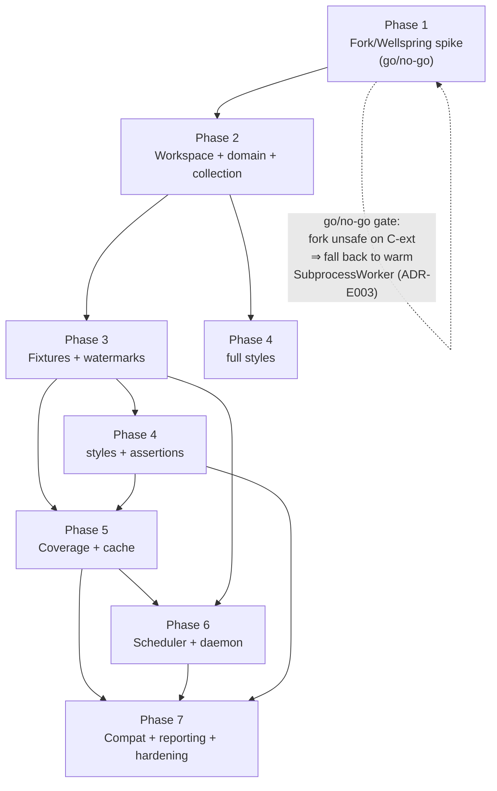

# Implementation Roadmap — Pure-Rust Test Engine (7 phases)

> **Status:** 📋 PLAN — awaiting human approval. **No agent begins work until approved.**
> **Shared multiagent scaffold:** [PIPELINE.md](PIPELINE.md) · **Design:** [DESIGN.md](DESIGN.md) ·
> [design/](design/) · ADRs [E001–E010](design/adr/)

Every phase is planned with the **multiagent model** (Lane 0 env gate → parallel lanes with
subagent spawning → aggregation → sequential gates → debug/retry), detailed per phase in its
`phase-N-*/PLAN.md` and sharing the common scaffold in [PIPELINE.md](PIPELINE.md).

## Why 7 phases (the renumbering)

The earlier draft folded the **fork spike** and the **workspace foundation** into one "Phase 1."
They are split here: the spike is the cheapest, highest-risk thing to kill or confirm
**before** building a workspace around it. The full sequence:

| Phase | Name | Goal | Primary design docs | Validates |
|------:|------|------|---------------------|-----------|
| **1** | [Fork/Wellspring spike](phase-1-fork-spike/PLAN.md) | Prove import-once + `fork()`-per-test + shim IPC runs a real pytest fn **and** a `unittest.TestCase`, isolated, faster than fresh-process; **go/no-go** | [05](design/05-execution-wellspring.md), [ADR-E002](design/adr/ADR-E002-execution-substrate.md), [ADR-E003](design/adr/ADR-E003-fork-snapshot-isolation.md) | the whole thesis |
| **2** | [Workspace + domain + collection](phase-2-workspace-domain-collection/PLAN.md) | Cargo workspace, domain model, `RegexCollector`, productionized `Wellspring`/`ForkWorker`/`ShimProtocol`, CLI `run`; fixture-free pytest fn/class + unittest end-to-end | [01](design/01-architecture.md), [02](design/02-domain-model.md), [03](design/03-collection.md), [05](design/05-execution-wellspring.md), [10](design/10-test-styles.md) | ADR-E001, ADR-E005 |
| **3** | [Fixtures + watermarks](phase-3-fixtures-watermarks/PLAN.md) | Native fixture graph (DI, scopes, yield/finalizers, autouse, overrides); **watermark** snapshot layers + fork-from-deepest; `reinit_after_fork`; `SubprocessWorker` fallback; `MemoryGovernor` | [04](design/04-fixture-graph.md), [05](design/05-execution-wellspring.md) | ADR-E003 (layers) |
| **4** | [Full styles + assertions](phase-4-styles-assertions/PLAN.md) | Full pytest fn/class + unittest protocols (parametrize, marks, subTest, expectedFailure, async); lazy assertion introspection + `RichDiff` + purity guard | [09](design/09-assertions.md), [10](design/10-test-styles.md) | ADR-E009 |
| **5** | [Coverage + cache](phase-5-coverage-cache/PLAN.md) | `sys.monitoring` coverage (+settrace fallback), `DepGraph`, `ImpactAnalyzer`, content-addressed cache (store + index + tiered local/remote), `SandboxHooks` impurity detection; cache→impact→run | [07](design/07-cache.md), [11](design/11-coverage-impact.md), [13](design/13-cross-cutting.md) | ADR-E004, ADR-E006 |
| **6** | [Scheduler + daemon](phase-6-scheduler-daemon/PLAN.md) | `LocalityScheduler` (duration-aware LPT + scope locality); warm daemon (JSON-RPC, FS watch, invalidation, IDE); watch mode | [06](design/06-scheduler.md), [08](design/08-daemon.md) | ADR-E007, ADR-E010 |
| **7** | [Compat + reporting + hardening](phase-7-compat-reporting-hardening/PLAN.md) | pytest-compat layer (conftest/`@fixture`/`@mark`), plugin host + `PyPluginAdapter`, reporters (JUnit/JSON/GitHub/SARIF), conformance suite (pass-rate metric), perf hardening, Windows `SubprocessWorker` validation | [12](design/12-plugin-host.md), [13](design/13-cross-cutting.md), [PRD metrics](PRD.md) | ADR-E008, adoption |

## Phase dependency graph

**Critical path:** 1 → 2 → 3 → 5 → 6 → 7, with Phase 4 able to overlap Phase 5 once Phase 3 lands.
Phase 1 is a true gate: a negative result reshapes Phases 2–3 (swap `ForkWorker` default for a
warm `SubprocessWorker` per the [ADR-E003 revisit trigger](design/adr/ADR-E003-fork-snapshot-isolation.md)).

## Per-phase artifacts

Each `phase-N-*/` folder will contain (produced by its Lane 0 + planning):

- `PLAN.md` — the multiagent plan (scope, lanes, subagent specs, execution map, integration
  verification, gates, gap report) — **drafted now, awaiting approval**.
- `env-manifest.md` — produced by the phase's Lane 0 env gate **at execution time** (not now).
- `CONTRACT.md` (where a phase publishes interfaces other phases consume, e.g. Phase 2's domain +
  wire protocol) — as needed.

## Approval model

Approve the **roadmap** to authorize the sequence, then approve **each phase** (or pre-authorize
through Phase N) before its Lane 0 starts. On any material change mid-execution, all lanes pause
and the affected plan is re-presented.
