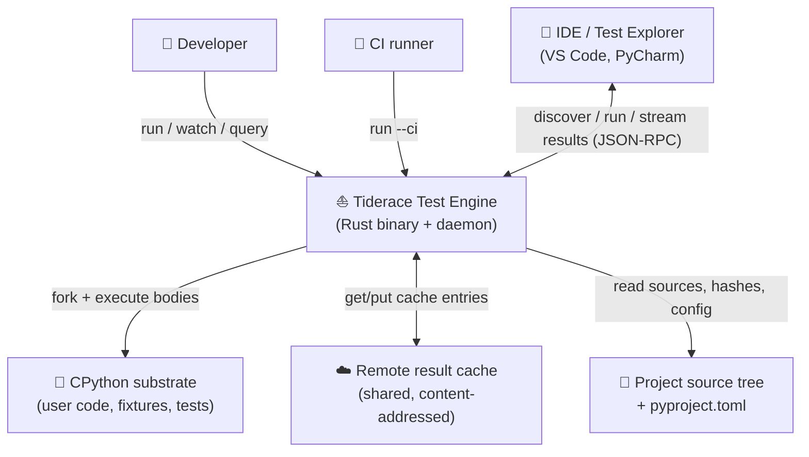
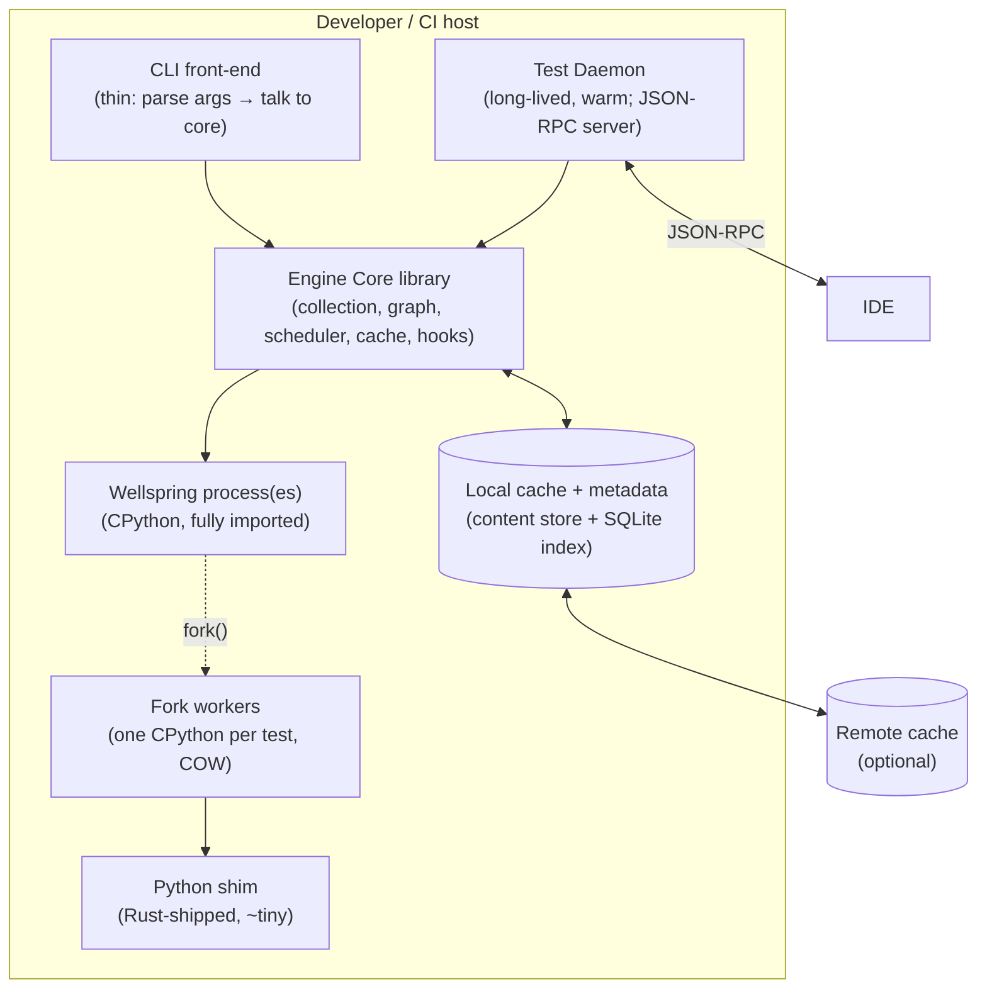
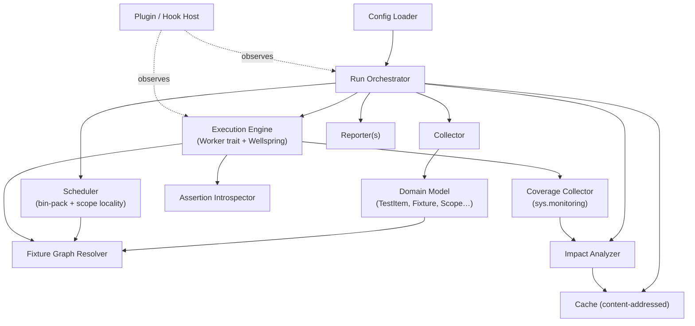
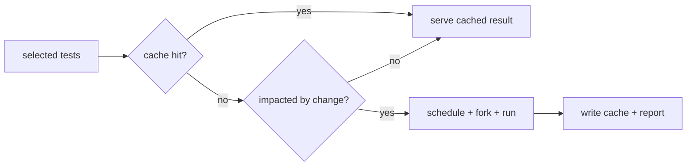
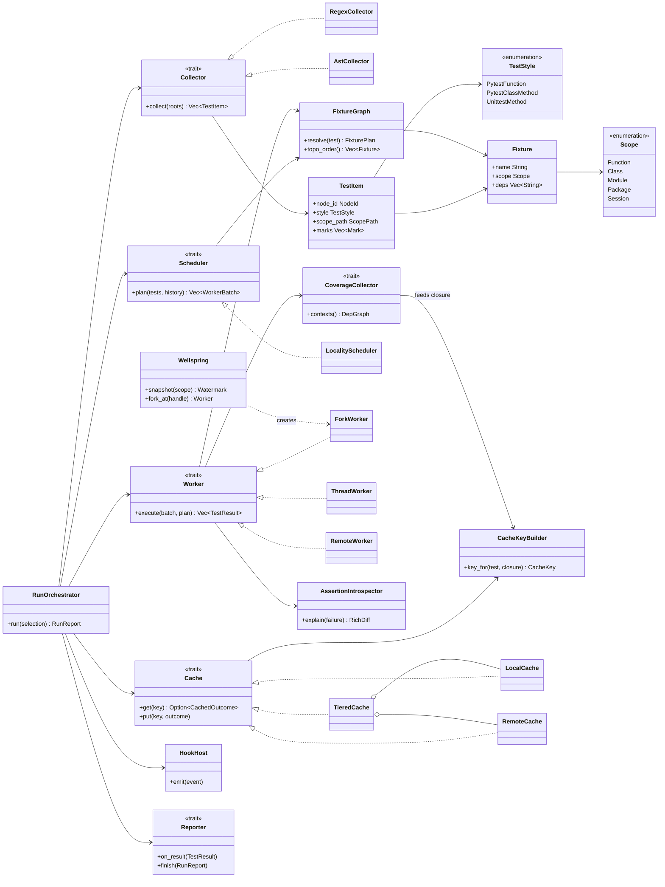

# 01 — Architecture (C4 + Module Map + Master Class Diagram)

> **Status:** ✅ draft for discussion
> Prereq: [00-vision](00-vision.md). Drills down in: [02-domain-model](02-domain-model.md) onward.

This document gives the top-down structure: C4 context → container → component, the proposed
crate/module layout (honoring one-class-per-file + SOLID), and a **master classifier (class)
diagram** of the engine's core traits and types. Each subsystem then gets its own deep-dive doc
with its own classifier + behavioral diagrams.

---

## 1. C4 Level 1 — System Context

Who/what the engine talks to.



## 2. C4 Level 2 — Containers

The deployable/runnable pieces.



**Notes**
- `cli` and `daemon` are two front-ends over the **same `core` library** — DIP: front-ends
  depend on core abstractions, not vice versa.
- The **wellspring** imports the project once; **fork workers** are COW children that run exactly
  one test each then exit (free isolation). See [05-execution-wellspring](05-execution-wellspring.md).
- The **shim** is the only Python we ship; it is dumb on purpose (receives "import X, call Y").

## 3. C4 Level 3 — Components (Engine Core)

Internal components of the `core` library and their dependencies.



**The preference order the Orchestrator enforces** (vision principle #1):



---

## 4. Proposed crate / module layout

Migrating from the current single `tiderace` binary to a **Cargo workspace** so the reusable
engine is a library (testable, embeddable by both CLI and daemon) — DIP + ISP at the crate
level. One class/type per file per conventions.

```text
crates/
├── engine-core/            # the library; no I/O front-end concerns
│   └── src/
│       ├── domain/         # TestItem, Fixture, Scope, NodeId, Outcome … (02)
│       ├── collection/     # Collector trait + impls (03)
│       ├── fixtures/       # FixtureGraph, resolver, scope layers (04)
│       ├── exec/           # Worker trait, Wellspring, ForkWorker … (05)
│       ├── scheduler/      # Scheduler trait + LocalityScheduler (06)
│       ├── cache/          # Cache trait, ContentStore, KeyBuilder (07)
│       ├── impact/         # ImpactAnalyzer (11)
│       ├── coverage/       # CoverageCollector (11)
│       ├── assertion/      # Introspector (09)
│       ├── hooks/          # HookHost, Hook trait (12)
│       ├── report/         # Reporter trait + impls (13)
│       ├── config/         # Config loader (13)
│       └── error.rs        # typed errors (thiserror) (13)
├── engine-cli/             # thin CLI front-end
├── engine-daemon/          # JSON-RPC test server (08)
└── py-shim/                # the Rust-shipped Python substrate shim
    └── shim.py
```

> The existing `tiderace/*.rs` modules (`collector`, `hasher`, `db`, `impact`, `pool`,
> `runner`, `watcher`) are the **conceptual ancestors** of these — several port forward (the
> regex collector, SHA-256 hasher, SQLite index, impact analyzer). The runner/pool are
> replaced by `exec/` (wellspring/fork) since we no longer drive pytest.

---

## 5. Master classifier (class) diagram — core traits & types

High-level relationships only; attributes/operations are detailed per-subsystem in 02–13.
Traits (interfaces) are the seams for DIP; concrete types are the default impls.



---

## 6. Concurrency & process model (overview)

- **Rust side:** the orchestrator runs on a bounded async/thread pool. Result aggregation uses
  `par_iter().map().collect()`-style fan-in (no shared `Mutex<Vec<_>>`), carried over from the
  current design's lock-poisoning-free approach.
- **Process side:** parallelism is **multi-process** (each fork worker has its own GIL).
  In-process `ThreadWorker` is reserved for free-threaded CPython (PEP 703) as a drop-in behind
  the `Worker` trait — no rewrite needed when it matures.
- **Isolation:** every test runs in its own forked interpreter; a crash/timeout kills only that
  child (process-group kill, as today's `procutil` does).

Detailed lifecycle/state machines live in [05-execution-wellspring](05-execution-wellspring.md) and
[08-daemon](08-daemon.md).

---

## 7. Key seams (Dependency Inversion points)

These traits are where the design stays open/closed and testable:

| Trait | Swappable implementations | Enables |
|---|---|---|
| `Worker` | `ForkWorker`, `ThreadWorker`, `RemoteWorker`, `SubprocessWorker` | platform fallback, free-threaded future, distributed exec |
| `Cache` | `LocalCache`, `RemoteCache`, `TieredCache`, `NullCache` | CI sharing; disable for debugging |
| `Collector` | `RegexCollector`, `AstCollector` | fast scan vs precise import-time info |
| `CoverageCollector` | `MonitoringCollector` (3.12+), `TraceCollector` (≤3.11) | version portability |
| `Reporter` | terminal, JSON, JUnit, GitHub, SARIF | CI/IDE integrations |
| `Scheduler` | `LocalityScheduler`, `RoundRobinScheduler` | tuning makespan vs fixture reuse |

---

## 8. What this buys us vs the old design

| Concern | Old (orchestrate pytest) | New (this design) |
|---|---|---|
| Framework ownership | pytest owns fixtures/asserts/marks | **engine owns them** |
| Per-test isolation | too expensive (process per test) | **free** (fork from snapshot) |
| Result caching | impact-skip only | **content-addressed, shareable** |
| Startup cost | per worker | **once** (wellspring) |
| Extensibility | bounded by pytest | **own trait-based hook host** |
