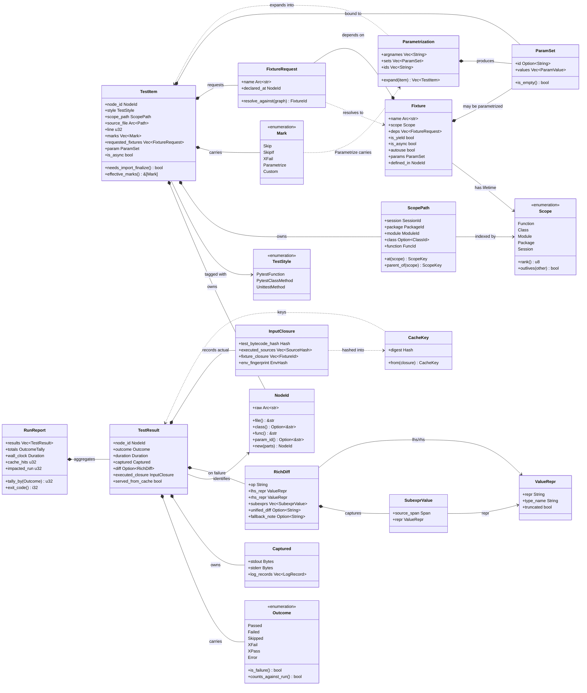
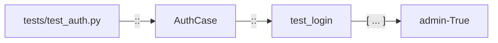
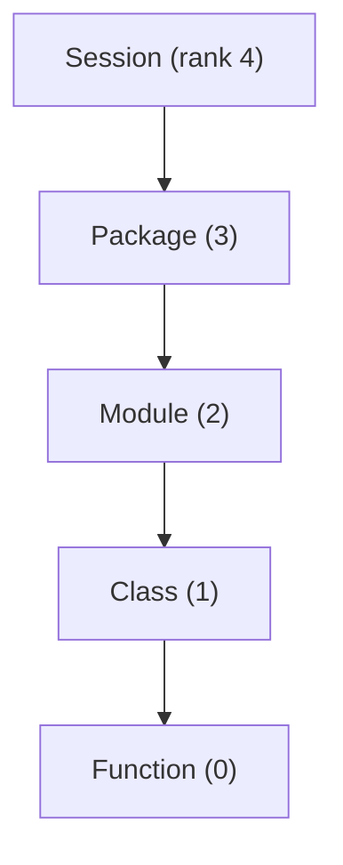
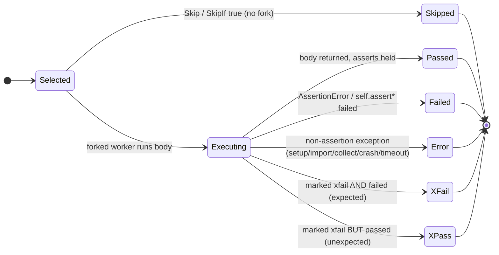
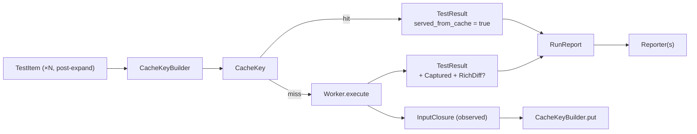

# 02 — Domain Model (Core Vocabulary + Classifier)

> **Status:** ✅ draft for discussion
> Prereq: [00-vision](00-vision.md), [01-architecture](01-architecture.md).
> Drives: [03-collection](03-collection.md), [04-fixture-graph](04-fixture-graph.md),
> [05-execution-wellspring](05-execution-wellspring.md), [07-cache](07-cache.md),
> [10-test-styles](10-test-styles.md), [13-cross-cutting](13-cross-cutting.md).

This is the **single source of truth for the engine's vocabulary**. Every subsystem doc
(collection, fixtures, scheduler, execution, cache, reporting) speaks these exact type names. If
a later doc needs a noun that is not here, it belongs here first. The types live in
`crates/engine-core/src/domain/`, one type per file (per [ADR-E005](adr/ADR-E005-workspace-trait-seams.md)
and the conventions: `PascalCase` types, `snake_case` files/fields, `thiserror` for errors).

The domain layer is **pure data + pure functions**: no I/O, no Python, no process management. It
is what the [Collector](03-collection.md) produces, what the
[FixtureGraph](04-fixture-graph.md) consumes, what the [Worker](05-execution-wellspring.md) returns,
and what the [Cache](07-cache.md) keys on. Keeping it I/O-free is what makes it trivially
unit-testable and safe to share across the CLI and daemon front-ends.

---

## 1. Design tenets for the domain layer

1. **Identity is a value, not a pointer.** A [`NodeId`](#nodeid) is an interned, stable,
   pytest-compatible string id. Everything else refers to a test *by id*, never by reference —
   this is what lets results be serialized, cached, and shipped to a remote cache or IDE.
2. **Data is cheap to clone and `Send + Sync`.** Heavy fields (source text, ids) are
   `Arc<str>`/interned so the scheduler can fan out `TestItem`s across workers without deep
   copies. Carried forward from the current lock-free aggregation model
   ([01-architecture](01-architecture.md) §6).
3. **The model is style-agnostic at rest, style-aware at execution.**
   [`TestStyle`](#teststyle) is a tag the [Worker](05-execution-wellspring.md) reads to choose *how*
   to invoke a body (plain call vs `TestCase.run()` vs `await`). The graph, cache, and scheduler
   treat all styles uniformly. See [§7](#7-how-teststyle-drives-execution).
4. **Outcomes are a closed enumeration.** [`Outcome`](#outcome) is the full, final result space
   the whole engine agrees on; reporters and the cache never invent new variants.
5. **The cache key is derived, never stored on the item.** [`CacheKey`](#cacheface) is computed
   from a test's [`InputClosure`](#cacheface); it is referenced here but *defined fully* in
   [07-cache](07-cache.md). The domain layer only owns the *shape* of the closure inputs.

---

## 2. Classifier (class) diagram — the core domain

Attributes use Rust-ish types. Operations are the pure methods other subsystems call.
Relationships: composition (`*--`) where the child's lifetime is owned by the parent;
association (`-->`) for "refers to by value/id"; realization (`..|>`) for trait impls.

---

## 3. Type catalogue (responsibility + home file)

One type per file under `crates/engine-core/src/domain/`. Filenames are the `snake_case` of the
type, per conventions.

| Type | Responsibility | File |
|---|---|---|
| `NodeId` | Stable, interned, pytest-compatible test identifier (`path::Class::func[param]`). The currency every subsystem trades in. | `node_id.rs` |
| `ScopePath` | The ancestry of a test through every [`Scope`](#scope) level — the key the [FixtureGraph](04-fixture-graph.md) and snapshot layers index on. | `scope_path.rs` |
| `Scope` | Enumeration of fixture/snapshot lifetimes (Function…Session) with an ordering. | `scope.rs` |
| `TestItem` | The central record: one runnable (or skippable) test, fully described *before* execution. Produced by the [Collector](03-collection.md). | `test_item.rs` |
| `TestStyle` | Enumeration tagging how a body is invoked (pytest fn / pytest method / unittest method). Read only by the [Worker](05-execution-wellspring.md). | `test_style.rs` |
| `Fixture` | A declared fixture: name, scope, dependencies, yield/async/autouse flags, optional params. | `fixture.rs` |
| `FixtureRequest` | A *demand* for a fixture by name from a test or another fixture; resolved against the graph into a concrete `FixtureId`. | `fixture_request.rs` |
| `Mark` | Enumeration of marks: `Skip`, `SkipIf`, `XFail`, `Parametrize`, `Custom`. Decorates a `TestItem`. | `mark.rs` |
| `Parametrization` | A `Parametrize` mark's payload: argnames + the cartesian/explicit param sets, plus generated ids; knows how to `expand` one item into many. | `parametrization.rs` |
| `ParamSet` | One concrete row of parameter values (one materialized test instance's data) plus its id fragment. | `param_set.rs` |
| `Outcome` | The closed enumeration of final states (Passed…Error). The whole engine's result alphabet. | `outcome.rs` |
| `TestResult` | The full result of executing (or cache-serving) one `TestItem`: outcome, duration, captured output, optional `RichDiff`, recorded `InputClosure`. | `test_result.rs` |
| `Captured` | Captured stdout/stderr/log records for one test. | `captured.rs` |
| `RichDiff` | The structured assertion-failure explanation produced by the [AssertionIntrospector](09-assertions.md) ([ADR-E009](adr/ADR-E009-lazy-assertion-introspection.md)). Canonical field shape, shared verbatim with [09-assertions](09-assertions.md): `op`, `lhs_repr`/`rhs_repr` (`ValueRepr`), `subexprs` (`Vec<SubexprValue>`), `unified_diff`, `fallback_note`. | `rich_diff.rs` |
| `SubexprValue` | One captured sub-expression of a failing assertion: its source `Span` + `ValueRepr`. | `subexpr_value.rs` |
| `ValueRepr` | A safe, possibly-truncated representation of a Python value (`repr`, `type_name`, `truncated`) used in diffs. | `value_repr.rs` |
| `RunReport` | The aggregate over all `TestResult`s for one run: tallies, wall-clock, cache/impact stats, exit code. Consumed by [Reporters](13-cross-cutting.md). | `run_report.rs` |
| `InputClosure` | The transitive input set whose hash determines a test's cached outcome. *Shape* owned here; *construction/semantics* in [07-cache](07-cache.md). | `input_closure.rs` |
| `CacheKey` | The content-address derived from an `InputClosure`. Referenced here, **defined fully** in [07-cache](07-cache.md) ([ADR-E004](adr/ADR-E004-content-addressed-cache.md)). | `cache_key.rs` |

> **Supporting value types** (`SourceHash`, `EnvHash`, `Hash`, `Duration` newtype wrappers,
> `OutcomeTally`, `ParamValue`, `Span`, `LogRecord`, the `*Id` newtypes inside `ScopePath`)
> are small leaf values; each still gets its own file under `domain/` but is elided from the
> catalogue above to keep the vocabulary table focused on the nouns other docs cite.

---

## 4. `NodeId` — the universal currency

`NodeId` is an interned, immutable string id that is **byte-for-byte compatible with pytest node
ids** (adoption goal G1): `tests/test_auth.py::AuthCase::test_login[admin-True]`. It carries the
current `tiderace::collector::TestItem::pytest_nodeid()` construction forward, generalized to
include the parametrization suffix.

- Parsing back out (`file()`, `class()`, `func()`, `param_id()`) is cheap because the separators
  are fixed; we keep the raw form as the canonical key (selection strings, cache rows, IDE
  protocol all use it verbatim).
- Ids are **interned** (`Arc<str>`) so a 50k-test suite holds one allocation per id and the
  scheduler clones pointers, not strings.
- Two tests are equal iff their `NodeId`s are equal — this is the equality the
  [impact analyzer](11-coverage-impact.md) and [cache](07-cache.md) rely on.

---

## 5. `Scope` & `ScopePath` — lifetimes as a lattice

`Scope` mirrors pytest's five fixture scopes. Its ordering is load-bearing: it tells the
[fixture graph](04-fixture-graph.md) and the [wellspring snapshot layers](05-execution-wellspring.md)
which setup *outlives* which, and therefore where a `fork()` boundary can sit
([ADR-E003](adr/ADR-E003-fork-snapshot-isolation.md)).

`Scope::outlives(other)` is just `self.rank() > other.rank()`. `ScopePath` is the *instance* of
this ladder for a single `TestItem`: the concrete session/package/module/class/function it
belongs to. The scheduler ([06-scheduler](06-scheduler.md), [ADR-E010](adr/ADR-E010-locality-scheduler.md))
sorts by `ScopePath` so tests sharing a `Module`/`Class` snapshot run adjacently and reuse the
same forked-from snapshot — *pay setup once* (vision principle #2).

---

## 6. Marks & parametrization

`Mark` is a closed enumeration with one open arm (`Custom`) for user-defined marks the
[hook host](12-plugin-host.md) may act on:

| Mark variant | Static-collectible? | Effect |
|---|---|---|
| `Skip { reason }` | ✅ unconditional | `TestItem` resolves to `Outcome::Skipped` without forking a worker. |
| `SkipIf { condition, reason }` | ⚠️ condition may need import | If the condition is a literal the [AstCollector](03-collection.md) can fold it; otherwise the predicate is evaluated in the [wellspring](05-execution-wellspring.md) at finalize time. |
| `XFail { reason, strict }` | ✅ | Inverts pass/fail at result time → `Outcome::XFail` (expected fail) or `Outcome::XPass` (unexpected pass; `Error` if `strict`). |
| `Parametrize(Parametrization)` | ⚠️ usually | Carries a [`Parametrization`](#3-type-catalogue-responsibility--home-file); literal arg lists fold statically, computed/`pytest_generate_tests` ones need import. |
| `Custom { name, args }` | ✅ name | Recorded verbatim; semantics deferred to plugins. |

`Parametrization::expand(item)` is a **pure fan-out**: it takes one `TestItem` and returns one
`TestItem` per [`ParamSet`](#3-type-catalogue-responsibility--home-file), each with a distinct
`NodeId` (the `[param-id]` suffix) and its own `ParamSet` bound. Expansion happens *after*
collection and *before* scheduling — so the scheduler and cache see the fully materialized,
per-instance tests. How marks/parametrize relate to assertion handling is covered in
[ADR-E009](adr/ADR-E009-lazy-assertion-introspection.md) and [09-assertions](09-assertions.md);
the key point for this doc is that **a parametrized instance is a first-class `TestItem` with its
own `NodeId` and its own `CacheKey`**.

---

## 7. How `TestStyle` drives execution

`TestStyle` is the one place the otherwise style-agnostic model leaks "how to run me." The
[Worker](05-execution-wellspring.md) switches on it; the graph, scheduler, and cache do not. Full
treatment is in [10-test-styles](10-test-styles.md); the contract from the domain's side:

| `TestStyle` | What the shim does to invoke the body | Fixture injection | Notes |
|---|---|---|---|
| `PytestFunction` | Import module, call `func(**resolved_fixtures)`. | By parameter name from the [FixtureGraph](04-fixture-graph.md). | The default; plain `assert` gets lazy `RichDiff` ([ADR-E009](adr/ADR-E009-lazy-assertion-introspection.md)). |
| `PytestClassMethod` | Instantiate `Test*` class (no `TestCase` base), call `inst.method(**fixtures)`. | Same as functions, plus class/instance-scoped fixtures. | Class is a *namespace + Class-scope fixture host*, not a unittest case. |
| `UnittestMethod` | Drive stdlib `TestCase.run()` at **method granularity** — we replace `TestSuite`/`TextTestRunner`, not the case contract ([ADR-E001](adr/ADR-E001-pure-rust-engine-no-pytest.md)). | `setUp`/`tearDown` run as the stdlib defines; pytest fixtures injected only where the compat layer allows. | `self.assert*` failures *also* route through the `AssertionIntrospector` so unittest gets rich diffs it never had. |

The `is_async` flag is orthogonal to style: any style may be `async def`, in which case the shim
runs the body on an event loop (see [10-test-styles](10-test-styles.md) §async). The domain
layer records `is_async` so the [Collector](03-collection.md) (which sees `async def`
statically) and the Worker agree without a second look.

---

## 8. `Outcome` — the result state space

`Outcome` is a **closed** enumeration. No reporter, cache tier, or plugin may add a variant; this
is what lets the [RunReport](#3-type-catalogue-responsibility--home-file) tally and the
[cache](07-cache.md) round-trip results losslessly.

Semantics the rest of the engine relies on:

- **`Failed` vs `Error`** is the assertion/non-assertion split. `Failed` = the test ran and an
  assertion (bare `assert` or `self.assert*`) did not hold → carries a `RichDiff`. `Error` = the
  test could not produce a meaningful pass/fail: setup/fixture exception, import error, collection
  error, worker crash, or timeout. This split is the same `failed`/`error` distinction the current
  [`impact.rs`](#) already persists and keys re-runs on — carried forward.
- **`XFail`/`XPass`** are derived from `Failed`/`Passed` *plus* an `XFail` mark at result-assembly
  time; the Worker reports raw pass/fail and the result builder applies the inversion. `strict`
  xfail turns an `XPass` into an `Error`.
- **`is_failure()`** is true for `Failed`, `Error`, and strict `XPass`; **`counts_against_run()`**
  drives `RunReport::exit_code()`. `Skipped`/`XFail` never fail a run.
- **Cache & impact tie-in:** a previously `Failed`/`Error` test is always re-run
  ([impact.rs](#) rule 4); `Passed`/`Skipped`/`XFail` results are cacheable and served by
  `CacheKey` when the [`InputClosure`](#3-type-catalogue-responsibility--home-file) is unchanged
  ([ADR-E004](adr/ADR-E004-content-addressed-cache.md)). `served_from_cache` on `TestResult`
  records which path produced it for the [RunReport](#3-type-catalogue-responsibility--home-file)
  stats.

---

## 9. Result & report flow (how the nouns connect at runtime)

The loop is the vision's preference order made concrete (cache → impact → run): the
[Orchestrator](01-architecture.md) builds a `CacheKey` per `TestItem`, serves a `TestResult` from
cache on a hit, and only hands true misses to a `Worker`. Every executed test also yields a fresh
`InputClosure`, which the [CacheKeyBuilder](07-cache.md) folds back into the store for next time.

---

## 10. Invariants other authors must honor

These are the load-bearing guarantees of the domain layer; downstream docs may *rely* on them and
must not *violate* them:

1. **One `NodeId` ⇒ one `TestItem` ⇒ at most one `TestResult` per run.** Parametrization expands
   *before* this rule applies (each instance is its own item/id).
2. **`Scope` ordering is total and fixed.** Snapshot/fork boundaries (05) and fixture lifetimes
   (04) are defined purely in terms of `Scope::rank()`/`outlives()`.
3. **`Outcome` is closed.** Add new run dispositions only by editing `outcome.rs` *and* this doc.
4. **`InputClosure` shape is owned here; its hashing/semantics are owned by [07-cache](07-cache.md).**
   Do not compute cache keys outside `cache/`.
5. **The domain layer stays I/O-free and `Send + Sync`.** Anything that imports Python, touches
   the filesystem, or forks lives in `collection/`, `fixtures/`, `exec/`, or `cache/`, never in
   `domain/`.
</content>
</invoke>
