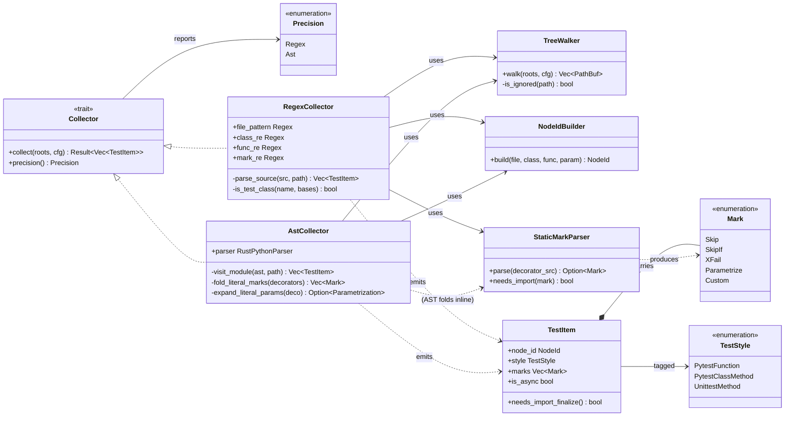
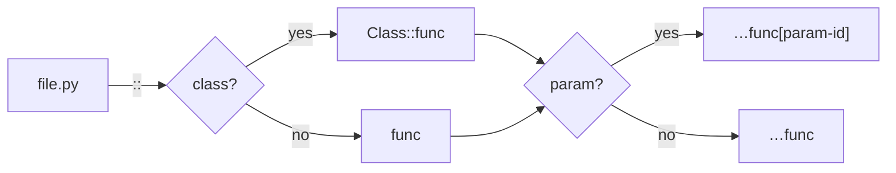
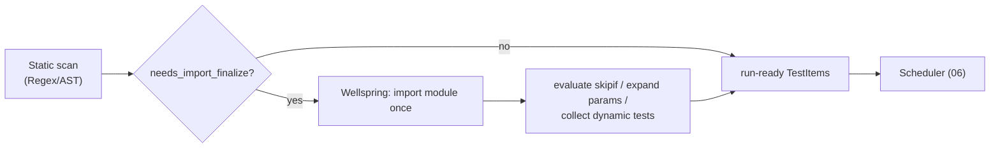

# 03 — Collection (Discovery & Registration without Importing)

> **Status:** ✅ draft for discussion
> Prereq: [00-vision](00-vision.md), [01-architecture](01-architecture.md),
> [02-domain-model](02-domain-model.md).
> Drives: [04-fixture-graph](04-fixture-graph.md), [05-execution-wellspring](05-execution-wellspring.md),
> [10-test-styles](10-test-styles.md). ADRs:
> [ADR-E001](adr/ADR-E001-pure-rust-engine-no-pytest.md),
> [ADR-E005](adr/ADR-E005-workspace-trait-seams.md).

Collection is the front of the pipeline: turn a project tree into a `Vec<TestItem>`
([02-domain-model](02-domain-model.md)) **without importing user code**. Not importing is the
whole game — pytest's collection *is* an import of the world, and "the fastest test is the one we
never import" (vision §1) starts here. We discover by **scanning source in Rust** (regex first,
AST when precision is needed), carrying forward `tiderace::collector` rather than replacing it.

Code lives in `crates/engine-core/src/collection/`, one type per file
([ADR-E005](adr/ADR-E005-workspace-trait-seams.md)): `collector.rs` (trait), `regex_collector.rs`,
`ast_collector.rs`, `walk.rs` (tree walk + ignore rules), `node_id_builder.rs`,
`static_mark.rs` (statically-recognized mark parsing).

---

## 1. Why static, source-only collection

| Property | Import-based (pytest) | Source-scan (this engine) |
|---|---|---|
| Cost to enumerate 50k tests | Import every module + run collection hooks | Read + scan files; no interpreter started |
| Side effects at collect time | Yes (module top-level code runs) | None |
| Works on a broken/uninstalled tree | No (import errors abort) | Yes (scan still lists items) |
| Daemon warm-restart on file save | Re-import affected modules | Re-scan changed files only |

The cost of *not* importing is **precision**: some marks and parametrizations are only knowable
at import time (computed conditions, `pytest_generate_tests`). The design's answer is a **two-tier
[Collector](#2-classifier--collector-trait--impls) trait** — a fast `RegexCollector` default and a
precise `AstCollector` — plus a **lazy import-time finalize** done *inside the wellspring*, not at
discovery (see [§7](#7-limits-of-static-collection--lazy-finalize)).

---

## 2. Classifier — `Collector` trait + impls

The `Collector` is a DIP seam ([ADR-E005](adr/ADR-E005-workspace-trait-seams.md)): the
[Orchestrator](01-architecture.md) depends on the trait, not a concrete scanner. Both impls emit
the same `Vec<TestItem>`, so they are Liskov-substitutable; precision is the only difference.



**`RegexCollector` (default, fast).** Directly evolves `tiderace::collector::parse_source`: the
same indentation-tracking class/function regexes, the same `is_test_class` rule (pytest `Test*`
*or* a `*TestCase` base), the same async handling (`async\s+def`). It additionally scans
decorator lines for **statically-recognizable marks** (`@pytest.mark.skip`, `@pytest.mark.xfail`,
literal `@pytest.mark.parametrize`) via `StaticMarkParser`, attaching them to the emitted
`TestItem`. Anything it cannot parse confidently is flagged `needs_import_finalize`.

**`AstCollector` (precise, opt-in / fallback).** Parses each file to a Python AST (a Rust
`rustpython-parser`-style front end — *no CPython import*) so it can (a) attribute methods to
classes without indentation heuristics, (b) fold *literal* `skipif` conditions and
`parametrize` arg lists into concrete `Mark`/`Parametrization` values, and (c) resolve
`TestCase`-base detection across multi-line/aliased base lists. It is selected when the config
asks for precision, or auto-promoted for a file the `RegexCollector` flagged as ambiguous.

> **Carry-forward note.** The current `TestItem { test_id, file_path, function_name, class_name }`
> maps onto the richer [02 `TestItem`](02-domain-model.md): `test_id → NodeId`,
> `file_path → source_file`, `function_name → NodeId.func()`, `class_name → NodeId.class()` +
> `TestStyle`. The regex engine and tree-walk/ignore rules port directly; `TestStyle`, `marks`,
> `is_async`, and `ScopePath` are the new fields collection now fills.

---

## 3. Sequence — one collection pass

```mermaid
sequenceDiagram
    autonumber
    participant O as RunOrchestrator
    participant C as Collector (Regex default)
    participant W as TreeWalker
    participant F as Source file
    participant SP as StaticMarkParser
    participant NB as NodeIdBuilder
    participant FG as FixtureGraph (04)

    O->>C: collect(roots, cfg)
    C->>W: walk(roots, cfg)
    W-->>C: [test_*.py, …] (ignoring .git/.venv/__pycache__)
    loop each candidate file
        C->>F: read_to_string(path)
        F-->>C: source text
        C->>C: scan classes/funcs (indent + regex / AST)
        C->>C: classify TestStyle (pytest fn / method / unittest)
        loop each test def found
            C->>SP: parse decorators → marks
            SP-->>C: Vec<Mark> (+ needs_import flags)
            C->>NB: build(file, class, func, param?)
            NB-->>C: NodeId
            C->>C: push TestItem{ node_id, style, marks, is_async, scope_path }
        end
    end
    C-->>O: Vec<TestItem> (literal params expanded; ambiguous flagged)
    O->>FG: hand TestItems for fixture resolution (04)
    Note over O,FG: items needing import-time finalize are<br/>resolved lazily in the wellspring before run (§7)
```

The pass is embarrassingly parallel per file (`par_iter` over the walked paths, lock-free fan-in
as in [01-architecture](01-architecture.md) §6). The output is handed straight to the
[fixture graph](04-fixture-graph.md); collection itself never touches fixtures beyond recording
each test's `requested_fixtures` (the parameter names of a `PytestFunction`/`PytestClassMethod`).

---

## 4. Discovery rules per test style

The recognizer assigns exactly one [`TestStyle`](02-domain-model.md) to each emitted item.

| `TestStyle` | Class shape | Function/method shape | `NodeId` form | Notes |
|---|---|---|---|---|
| `PytestFunction` | none (module level) | `def`/`async def` matching `test*` | `file.py::name` | The common case; carries forward `tiderace` top-level rule. |
| `PytestClassMethod` | `class Test*:` **without** a `TestCase` base | `def`/`async def test*` indented inside it | `file.py::Class::name` | `self` is ignored for fixture injection; class is a Class-scope namespace. |
| `UnittestMethod` | `class X(...TestCase):` (any name) | `def`/`async def test*` inside it | `file.py::Class::name` | Driven via stdlib `TestCase.run()` per-method ([ADR-E001](adr/ADR-E001-pure-rust-engine-no-pytest.md)); `setUp`/`tearDown` honored. |

Cross-cutting rules (all styles):

- **Function name match:** default `test*` prefix (configurable `python_functions`), mirroring the
  current `func_re = ^(\s*)(?:async\s+)?def\s+(test\w*)\(`.
- **Async:** `async def` sets `is_async = true`; style is unchanged. The shim picks an event loop
  at run time ([10-test-styles](10-test-styles.md)).
- **Method attribution:** a `def` is a method of the nearest enclosing class only while indented
  deeper than that class's keyword column (the existing indentation rule); methods of *non-test*
  classes are skipped entirely (the existing `Helper.test_not_really` guard).
- **Class detection:** `Test*` name **or** a base that is `TestCase` / `*.TestCase` / `*TestCase`
  (the existing `is_test_class`). A `Test*`-named class that *also* subclasses `TestCase` is
  `UnittestMethod` (base wins — stdlib contract governs).
- **Ignored paths:** `.git`, `__pycache__`, `.venv`, `venv` (carried forward), plus
  `.gitignore`/config `norecursedirs`.

---

## 5. Node-id construction

`NodeIdBuilder` produces the pytest-compatible id from `(file, class?, func, param?)`, generalizing
`tiderace::collector::TestItem::pytest_nodeid` to add the parametrization suffix:



Paths are normalized exactly as today (strip leading `./` so `tiderace .` and `tiderace` agree).
The `[param-id]` fragment is filled by [`Parametrization::expand`](02-domain-model.md) *after*
collection; collection emits the un-suffixed id and the expander forks per `ParamSet`.

---

## 6. Marks: statically known vs needs-import

`StaticMarkParser` classifies each decorator into one of three buckets:

| Decorator (as seen in source) | Bucket | Result of collection |
|---|---|---|
| `@pytest.mark.skip` / `@pytest.mark.skip(reason="…")` | **Static** | `Mark::Skip` attached; item resolves to `Outcome::Skipped` with no worker fork. |
| `@pytest.mark.xfail` / `@pytest.mark.xfail(strict=True)` | **Static** | `Mark::XFail{strict}` attached; result inversion applied at result time ([02 §8](02-domain-model.md)). |
| `@pytest.mark.skipif(sys.platform == "win32")` | **Static iff literal-foldable** (AST), else **needs-import** | `AstCollector` folds constant conditions; otherwise the predicate is evaluated in the wellspring at finalize. |
| `@pytest.mark.parametrize("x", [1, 2, 3])` | **Static iff literal** | Literal arg lists become a `Parametrization` and expand statically; computed/generator args defer. |
| `@pytest.mark.parametrize("x", compute())` / `pytest_generate_tests` | **Needs-import** | Item flagged `needs_import_finalize`; instances materialized in the wellspring (§7). |
| `@pytest.mark.slow` / any unknown `@pytest.mark.*` | **Static** | `Mark::Custom{name, args}` recorded verbatim for the [hook host](12-plugin-host.md). |
| `@some_other_decorator` | **Opaque** | Recorded as opaque; if it could affect collection (rare), the item is flagged needs-import. |

The decision rule `StaticMarkParser::needs_import(mark)` is the single gate the
[Orchestrator](01-architecture.md) reads to decide whether a `TestItem` is *run-ready* from the
scan alone, or must pass through the lazy finalize step.

---

## 7. Limits of static collection & lazy finalize

Static scanning cannot, by construction, know anything that only exists after Python evaluates
the module. The honest boundary (vision §6 "say so rather than over-claim"):

- **Computed parametrization** — `parametrize` with a non-literal arg source, or
  `pytest_generate_tests` hooks that synthesize ids/params at import time.
- **Conditional `skipif`** whose predicate is a runtime expression (versions, env, imports).
- **Dynamically generated tests** — functions attached to a module/class at import time, or
  metaclass/`__init_subclass__` machinery.
- **Marks applied programmatically** (e.g. `pytestmark = [...]`, `request.applymarker`).

For these, collection emits a **provisional `TestItem`** flagged `needs_import_finalize() == true`
and the engine does a **lazy import inside the [wellspring](05-execution-wellspring.md)** — *not* at
discovery time — to finalize marks and materialize parametrized instances:



This preserves the core invariant — **we still import at most once, in the warm wellspring we were
going to import for execution anyway** — so finalize is paid lazily and shared, never per-test and
never at cold discovery. Statically run-ready tests (the overwhelming majority) skip the wellspring
entirely on a pure cache/impact hit, which is exactly the "never import" path the vision promises.

> **Default policy.** Run `RegexCollector` first; promote a file to `AstCollector` only when it
> flags ambiguity; fall back to wellspring finalize only for the residue the AST still can't fold.
> Most suites never reach the wellspring for collection — they reach it (if at all) only to *run* the
> handful of impacted, uncached tests.

---

## 8. Outputs & contracts for downstream docs

- Collection's sole output is `Vec<TestItem>` exactly as specified in
  [02-domain-model](02-domain-model.md); no other type crosses the boundary.
- `requested_fixtures` on each item are the raw parameter names; **resolution into a
  `FixturePlan` is the [fixture graph](04-fixture-graph.md)'s job**, not collection's.
- `needs_import_finalize()` is the contract the [Orchestrator](01-architecture.md) and
  [wellspring](05-execution-wellspring.md) honor to decide on lazy finalize; collection must set it
  conservatively (when in doubt, flag it — soundness over speed for this one bit).
- The `Collector` trait is the seam [05-execution](05-execution-wellspring.md) and the
  [daemon](08-daemon.md) re-invoke on file-change (re-scan only changed files; merge into the
  cached `Vec<TestItem>`).
</content>
