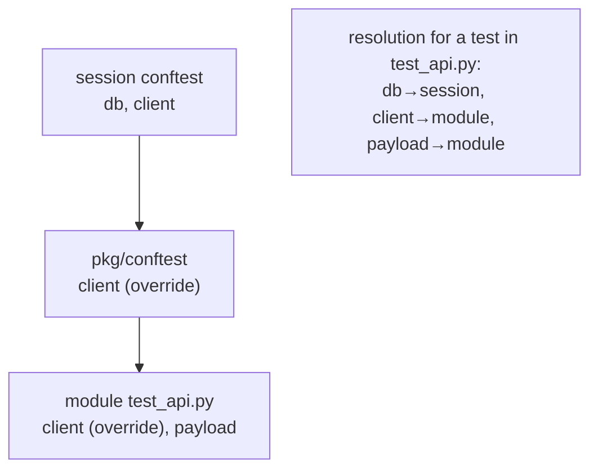
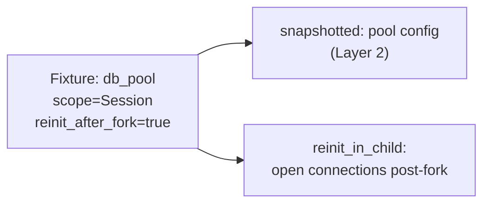
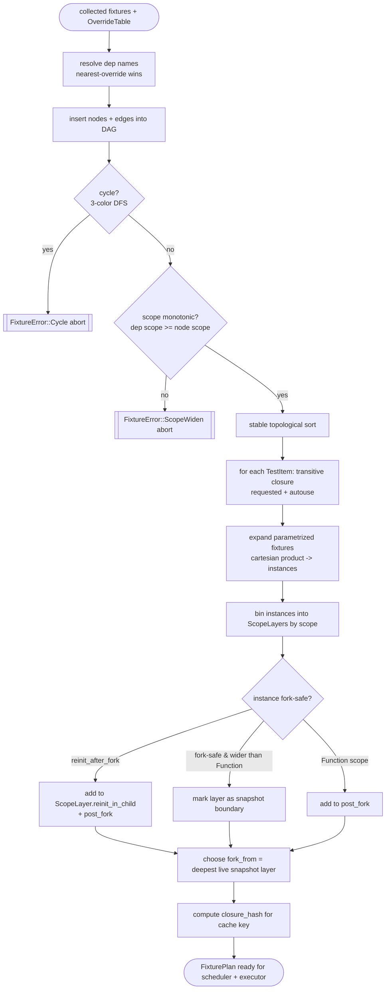
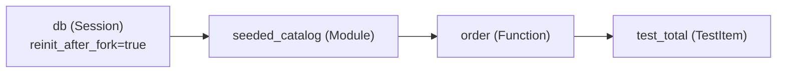

# 04 — Fixture Graph (Dependency Injection, Resolution & Snapshot Layering)

> **Status:** ✅ draft for discussion
> Prereqs: [00-vision](00-vision.md), [01-architecture](01-architecture.md), [02-domain-model](02-domain-model.md).
> Gated by: [ADR-E001](adr/ADR-E001-pure-rust-engine-no-pytest.md) (own the framework),
> [ADR-E003](adr/ADR-E003-fork-snapshot-isolation.md) (fork-from-snapshot; scopes = snapshot layers),
> [ADR-E002](adr/ADR-E002-execution-substrate.md) (subprocess + shim).
> Feeds: [05-execution-wellspring](05-execution-wellspring.md), [06-scheduler](06-scheduler.md), [07-cache](07-cache.md).

Because we own the framework and run no pytest underneath ([ADR-E001](adr/ADR-E001-pure-rust-engine-no-pytest.md)),
we **reimplement pytest's fixture model natively in Rust**. The fixture subsystem is the heart
of the engine: it is both the user-facing DI contract *and* the structure that decides what gets
baked into a memory snapshot versus run fresh in a forked child ([ADR-E003](adr/ADR-E003-fork-snapshot-isolation.md)).
Getting the fixture-scope → snapshot-layer mapping right is what turns an expensive
`setUpClass`/session fixture from an *N×* cost into a *1×* cost.

This document covers the fixture model, the `FixtureGraph` DAG and its algorithms, the mapping of
scopes onto wellspring snapshot layers, the `FixturePlan` handed to the executor, non-fork-safe
resource handling, and how the resolved fixture closure feeds the cache key.

---

## 1. The fixture model

A `Fixture` (defined in [02-domain-model](02-domain-model.md)) is a named, scoped provider that a
`TestItem` — or another fixture — may request by name. We reimplement the parts of the pytest
fixture contract that matter for adoption (G1):

| Concept | Meaning | Engine representation |
|---|---|---|
| **name** | how a test/fixture requests it | `Fixture.name: String` |
| **scope** | lifetime / how often it is set up | `Fixture.scope: Scope` (`Function`/`Class`/`Module`/`Package`/`Session`) |
| **deps** | other fixtures this one requests | `Fixture.deps: Vec<String>` (resolved to `NodeId`s) |
| **yield-style teardown** | code after `yield` runs at scope exit | `Finalizer` captured per active instance |
| **autouse** | injected without being requested | `Fixture.autouse: bool` |
| **parametrized** | one fixture → N parameter variants | `Fixture.params: Vec<ParamValue>` → fans out into N `FixtureInstance`s |
| **override by location** | nearer `conftest`/module shadows farther | resolved via `OverrideTable` keyed by `ScopePath` |

### 1.1 Yield-style teardown / finalizers

A fixture body may `return value` (no teardown) or `yield value` then run teardown code. We model
the teardown half as a `Finalizer`: an opaque handle the shim registers, plus the
(`FixtureInstance`, scope) it belongs to. Finalizers run in **strict reverse setup order** at the
moment their owning scope tears down — function finalizers at end of test, module finalizers when
the module's last test completes, session finalizers at run end. The Rust side owns the *ordering*;
the shim owns *invoking* the Python continuation.

> Crucially, finalizers for **snapshotted** scopes (session/module/class) are *not* re-run per
> test. They were set up once in the wellspring ancestor; their teardown runs once when that snapshot
> layer is retired. Only **function-scope** finalizers run inside each forked child. See §4.

### 1.2 autouse and the request graph

`autouse` fixtures are not requested by name; the resolver injects them into the closure of every
`TestItem` within their `ScopePath`. They participate in the DAG exactly like requested fixtures —
they simply enter the closure through a different door (location-implied edge, not a named edge).

### 1.3 Parametrized fixtures

A parametrized fixture with `params = [a, b, c]` expands into three distinct `FixtureInstance`s.
This is a fan-out at the *instance* level, not the *definition* level: the DAG holds one `Fixture`
node, but resolution produces one closure **per parameter combination**, multiplying the dependent
`TestItem`s accordingly (the cartesian product of all parametrized fixtures in a test's closure).
Each instance has its own cache key (§6) because its inputs differ.

### 1.4 Override by location (conftest-like layering)

pytest resolves a fixture name to the *nearest* definition walking from the test's module up
through package `conftest.py`s to the session root. We reproduce this with an `OverrideTable`:
fixture definitions are indexed by `(name, ScopePath)`; resolution for a `TestItem` at path `P`
picks the definition whose `ScopePath` is the **longest prefix of `P`**. Nearer wins. A module-level
fixture shadows a session `conftest` fixture of the same name for tests in that module only.



---

## 2. The FixtureGraph

The `FixtureGraph` is a directed acyclic graph whose nodes are `Fixture` definitions (post-override
resolution) and whose edges are `requests` dependencies (`A --requests--> B` means A's body needs
B's value). It is built once per collection pass and is the single source of truth for ordering and
closure computation.

### 2.1 Responsibilities

1. **Build** the DAG from collected fixtures + the `OverrideTable`, resolving each `dep` name to a
   concrete `NodeId` using location-nearest override rules (§1.4).
2. **Detect cycles** — a cycle (`a→b→a`) is a user error reported with the offending path; the run
   aborts collection for that scope path rather than deadlocking at setup.
3. **Topological setup order** — a stable topo sort gives the order fixtures must be *set up*.
4. **Reverse teardown order** — the exact reverse of the realized setup order per scope.
5. **Resolve a test's closure** — the transitive set of fixtures a given `TestItem` needs
   (requested + autouse + their transitive deps).
6. **Compute the `FixturePlan`** — partition that closure into snapshot layers vs post-fork setup
   (§4), the deliverable the executor and scheduler consume.

### 2.2 Cycle detection & scope-ordering invariant

Two validity checks run at build time:

- **Acyclicity** via DFS with a three-color marking; a back-edge is a cycle. Reported as a typed
  `FixtureError::Cycle { path }` ([thiserror], per [rust.md](../../.claude/conventions/languages/rust.md)).
- **Scope-monotonicity** — a fixture may only depend on fixtures of **equal or wider** scope (a
  `session` fixture cannot depend on a `function` fixture; that would force the wider scope to be
  re-set-up per test, defeating snapshotting). Violations are `FixtureError::ScopeWiden { narrow, wide }`.
  This invariant is what guarantees the snapshot layers in §4 are well-formed.

---

## 3. Classifier diagram — fixture subsystem

```mermaid
classDiagram
    direction LR

    class Fixture {
        +node_id NodeId
        +name String
        +scope Scope
        +deps Vec~NodeId~
        +autouse bool
        +params Vec~ParamValue~
        +is_yield bool
        +reinit_after_fork bool
        +scope_path ScopePath
    }

    class FixtureGraph {
        -nodes HashMap~NodeId, Fixture~
        -edges HashMap~NodeId, Vec~NodeId~~
        -overrides OverrideTable
        +build(fixtures, overrides) Result~Self, FixtureError~
        +detect_cycles() Result~(), FixtureError~
        +topo_order() Vec~NodeId~
        +teardown_order(layer) Vec~NodeId~
        +closure_of(test) FixtureClosure
        +plan_for(test) FixturePlan
    }

    class FixtureResolver {
        <<trait>>
        +resolve(test, graph) FixtureClosure
        +layer_assignment(closure) Vec~ScopeLayer~
    }
    class LayeredResolver {
        -override_table OverrideTable
    }

    class FixturePlan {
        +test NodeId
        +layers Vec~ScopeLayer~
        +fork_from ScopeLayer
        +post_fork Vec~FixtureInstance~
        +closure_hash ClosureHash
    }

    class ScopeLayer {
        +scope Scope
        +scope_path ScopePath
        +setup Vec~FixtureInstance~
        +snapshot Option~Watermark~
        +reinit_in_child Vec~NodeId~
    }

    class FixtureInstance {
        +fixture NodeId
        +param_index Option~usize~
        +value_repr ValueRepr
    }

    class Finalizer {
        +instance FixtureInstance
        +scope Scope
        +continuation ShimHandle
        +run()
    }

    class OverrideTable {
        +nearest(name, ScopePath) NodeId
    }

    FixtureResolver <|.. LayeredResolver
    FixtureGraph *-- Fixture
    FixtureGraph *-- OverrideTable
    FixtureGraph ..> FixturePlan : produces
    FixturePlan *-- ScopeLayer
    ScopeLayer *-- FixtureInstance
    ScopeLayer *-- Finalizer
    FixtureInstance --> Fixture : instantiates
    LayeredResolver --> FixtureGraph : reads
    LayeredResolver ..> FixturePlan : builds
    Finalizer --> FixtureInstance : tears down
```



`Watermark` is the same type the `Wellspring` exposes in [01-architecture](01-architecture.md)
(`Wellspring::snapshot(scope) -> Watermark`); the fixture graph decides *which* scopes get one.

---

## 4. Scopes as snapshot layers — the load-bearing performance link

This is where the fixture graph and [ADR-E003](adr/ADR-E003-fork-snapshot-isolation.md) meet.

A fixture's `Scope` is not just a lifetime — it is a **decision about which memory snapshot layer
the fixture's effects live in**. Wider scopes are set up *earlier* and *higher* in the snapshot
stack, then frozen via COW; narrower scopes are set up later; **function scope is set up in the
forked child, after we fork from the deepest applicable snapshot.**

```mermaid
graph TD
    L0["Layer 0 — interpreter + stdlib<br/>(wellspring boot)"] --> L1["Layer 1 — project imports"]
    L1 --> L2["Layer 2 — Session fixtures<br/>snapshot S"]
    L2 --> L3["Layer 3 — Module fixtures<br/>snapshot M"]
    L3 --> L4["Layer 4 — Class fixtures<br/>snapshot C"]
    L4 -->|fork() per test| child["Child: run post_fork[]<br/>= function-scope setup<br/>+ reinit_after_fork resources<br/>then run the test body"]
```

### 4.1 The "fork from the deepest applicable snapshot" plan

For a given `TestItem`, the resolver computes its closure, partitions it by scope into ordered
`ScopeLayer`s, and selects `fork_from` = the **deepest (narrowest-scoped) layer that has a live
snapshot and is shared by this test**. Concretely:

- Session/Module/Class fixtures in the closure are set up **once** in the wellspring lineage, each
  producing a `Watermark`. The class layer is the deepest snapshot.
- The executor `fork_at(fork_from.snapshot)` — the child inherits, copy-on-write, *all* wider
  fixture state for free.
- The child then runs `post_fork` — the **function-scope** fixtures (and any `reinit_after_fork`
  resources, §4.3) — and finally the test body.

The win restated: a 10s session fixture is paid **once**, snapshotted, and every dependent test
forks from it in ~ms with a pristine copy. The graph is what makes this safe — scope-monotonicity
(§2.2) guarantees no narrower fixture leaked into a snapshotted layer.

### 4.2 How the graph computes layer boundaries

The `LayeredResolver` walks the test's `FixtureClosure` in topo order and bins each
`FixtureInstance` into the `ScopeLayer` matching its `Scope`. Layers are ordered
Session → Package → Module → Class → (fork) → Function. A layer becomes a **snapshot boundary**
when (a) its scope is wider than `Function` and (b) it is shared by ≥1 test the scheduler will
co-locate (see [06-scheduler](06-scheduler.md) — locality scheduling deliberately groups tests that
share a snapshot layer to maximize reuse). Function-scope fixtures always land in `post_fork`.

### 4.3 Non-fork-safe resources (`reinit_after_fork`)

Some resources do not survive `fork()`: open sockets, file handles, CUDA/GPU contexts, some DB
connection pools, and anything backed by threads ([ADR-E003](adr/ADR-E003-fork-snapshot-isolation.md)
consequences). A fixture whose body acquires such a resource declares `reinit_after_fork = true`.

The graph treats such a fixture specially: even if its *declared* scope is `Session`/`Module`, its
**fork-fragile part is deferred to the child**. The pattern is split-setup:

- The cheap/pure part (config objects, computed constants) may still be snapshotted at its declared
  scope.
- The resource handle is listed in the owning `ScopeLayer.reinit_in_child` and **rebuilt post-fork**
  — effectively function-scoped *for the resource*, while the surrounding fixture value keeps its
  wider scope.

The graph marks the node `reinit_after_fork` and the resolver adds it to `post_fork` setup so the
executor knows to (re)establish it in each child. This is the safety valve that lets the wellspring
snapshot *before* any thread-spawning C-extension touches a fork-fragile handle.



---

## 5. Sequence — resolving + setting up fixtures across layers and post-fork

```mermaid
sequenceDiagram
    autonumber
    participant Sched as Scheduler
    participant Res as FixtureResolver
    participant Graph as FixtureGraph
    participant Zyg as Wellspring (CPython)
    participant Child as Fork Worker (child)
    participant Shim as py-shim

    Sched->>Res: plan_for(test)
    Res->>Graph: closure_of(test)
    Graph-->>Res: FixtureClosure (topo-ordered)
    Res->>Res: bin instances into ScopeLayers
    Res-->>Sched: FixturePlan { layers, fork_from, post_fork, closure_hash }

    Note over Zyg: wider scopes set up ONCE in wellspring lineage
    Sched->>Zyg: ensure layer Session set up
    Zyg->>Shim: call session fixtures (topo order)
    Shim-->>Zyg: values + register Finalizers
    Zyg->>Zyg: snapshot() -> Watermark S
    Sched->>Zyg: ensure layer Module / Class set up
    Zyg->>Shim: call module then class fixtures
    Shim-->>Zyg: values + Finalizers
    Zyg->>Zyg: snapshot() -> Watermark C (deepest)

    Sched->>Zyg: fork_at(C)  %% deepest applicable snapshot
    Zyg-->>Child: COW child (all wider fixture state inherited)

    Note over Child: post-fork, in isolation
    Child->>Shim: run post_fork (function fixtures + reinit_after_fork)
    Shim-->>Child: function values + Finalizers (child-local)
    Child->>Shim: call test body with assembled FixtureRequest
    Shim-->>Child: Outcome
    Child->>Shim: run function Finalizers (reverse order)
    Child-->>Sched: TestResult
    Note over Child: child exits; pristine state discarded
    Note over Zyg: session/module/class Finalizers run later,<br/>once, when their snapshot layer is retired
```

---

## 6. Activity — build graph, topo order, snapshot-layer assignment



---

## 7. Worked example — session DB + module + function fixture

Fixtures collected for `tests/test_orders.py`:

```python
# conftest.py (session root)
@pytest.fixture(scope="session")
def db():                       # expensive: spins up a Postgres testcontainer
    conn = connect(...)         # socket-backed -> NOT fork-safe
    migrate(conn)
    yield conn
    conn.close()

# tests/test_orders.py
@pytest.fixture(scope="module")
def seeded_catalog(db):         # depends on db; inserts 10k rows once
    load_fixtures(db, "catalog.json")
    return CatalogView(db)

@pytest.fixture                 # function scope (default)
def order(seeded_catalog):
    o = seeded_catalog.new_order()
    yield o
    o.rollback()                # function finalizer

def test_total(order):
    assert order.total() == 0
```

### 7.1 Graph & layering



Closure of `test_total` = `{db, seeded_catalog, order}` (topo: db → seeded_catalog → order).

### 7.2 What runs where

| Fixture | Scope | Runs in | Snapshot? | Notes |
|---|---|---|---|---|
| `db` (config + migration) | Session | **Wellspring, once** | yes (Layer 2 / `S`) | migration result baked into snapshot |
| `db` connection handle | Session | **child, post-fork** | no | `reinit_after_fork` — socket reopened per child |
| `seeded_catalog` | Module | **Wellspring, once** | yes (Layer 3 / `M`, deepest) | 10k-row seed paid once, COW-shared |
| `order` | Function | **child, post-fork** | no | fresh per test; finalizer runs at test end |
| `test_total` body | — | **child** | no | forked from `M` |

The expensive work — container boot, migration, 10k-row seed — is paid **once** and snapshotted.
Each test forks from snapshot `M`, reopens the DB socket (`reinit_after_fork`), builds a fresh
`order`, runs, rolls back, and exits. With 500 tests in the module we pay the seed **1×**, not
**500×** — the [00-vision](00-vision.md) "fixture-heavy suite, 10–100×" target. Session/module
finalizers (`conn.close()`, none for `seeded_catalog`) run **once** when the snapshot retires;
only `order`'s rollback runs per test.

---

## 8. Feeding the cache key (link to ADR-E004 / 07-cache)

The `FixturePlan` carries a `closure_hash`: a hash over the **fixture closure** — every fixture
body's source in the closure plus their transitive deps and the chosen parameter indices. This is
exactly the `fixture_closure` term in the [ADR-E004](adr/ADR-E004-content-addressed-cache.md) cache
key:

```
key = H( test_bytecode + executed_source_closure + fixture_closure + declared_env + engine/python/platform )
```

The graph is the authority for `fixture_closure` because only it knows the post-override, post-
parametrization transitive set a given test actually depends on. Two consequences:

- Editing a fixture body invalidates the cache entry of **every test transitively closing over it**
  — the graph's transitive closure is what makes that precise (no over- or under-invalidation).
- Each parametrized `FixtureInstance` produces a distinct `closure_hash`, so parameter variants
  cache independently.

Full key construction, soundness, and the `CacheKeyBuilder` live in [07-cache](07-cache.md); the
fixture graph's only contract there is to deliver a correct, complete `closure_hash` per
`FixturePlan`.

---

## 9. Open questions

- **F1** — Snapshot retirement policy: how long does the daemon hold a session/module snapshot
  warm across runs before reclaiming RSS? (→ [08-daemon](08-daemon.md))
- **F2** — Detecting `reinit_after_fork` automatically (sandbox observes a socket/thread spawn)
  vs requiring the declaration. (→ [07-cache](07-cache.md) sandbox machinery)
- **F3** — Cross-package `Package` scope override precedence when two sibling packages define the
  same name — exact prefix-match tie-breaking.
- **F4** — Bounding fork concurrency by RSS when a snapshot layer is large (COW write
  amplification, [ADR-E003](adr/ADR-E003-fork-snapshot-isolation.md)). (→ [06-scheduler](06-scheduler.md))
