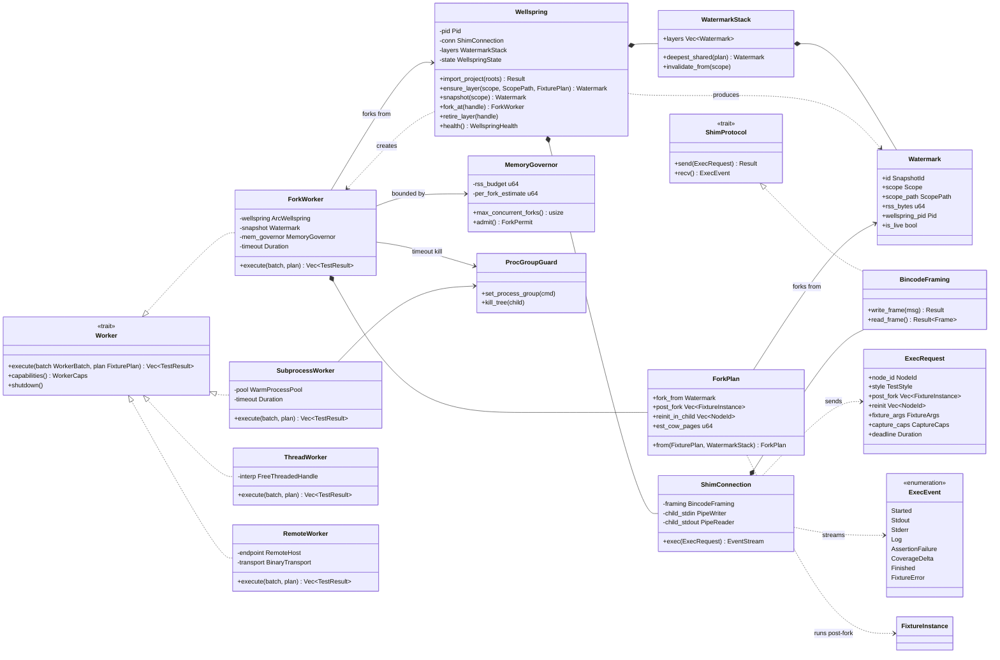
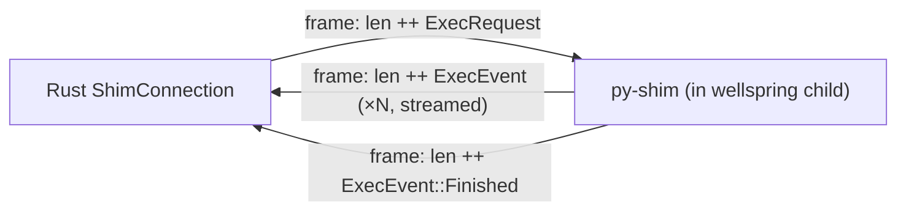
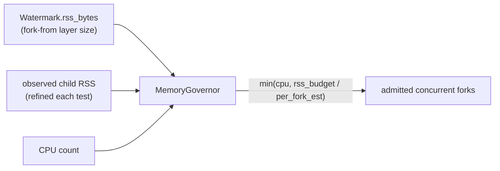
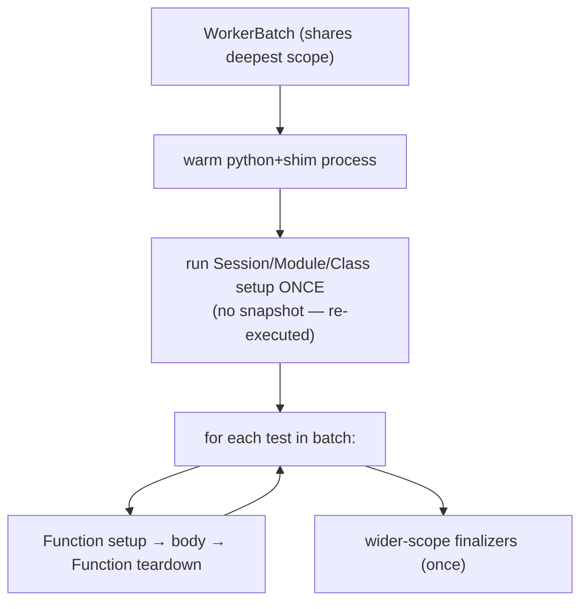
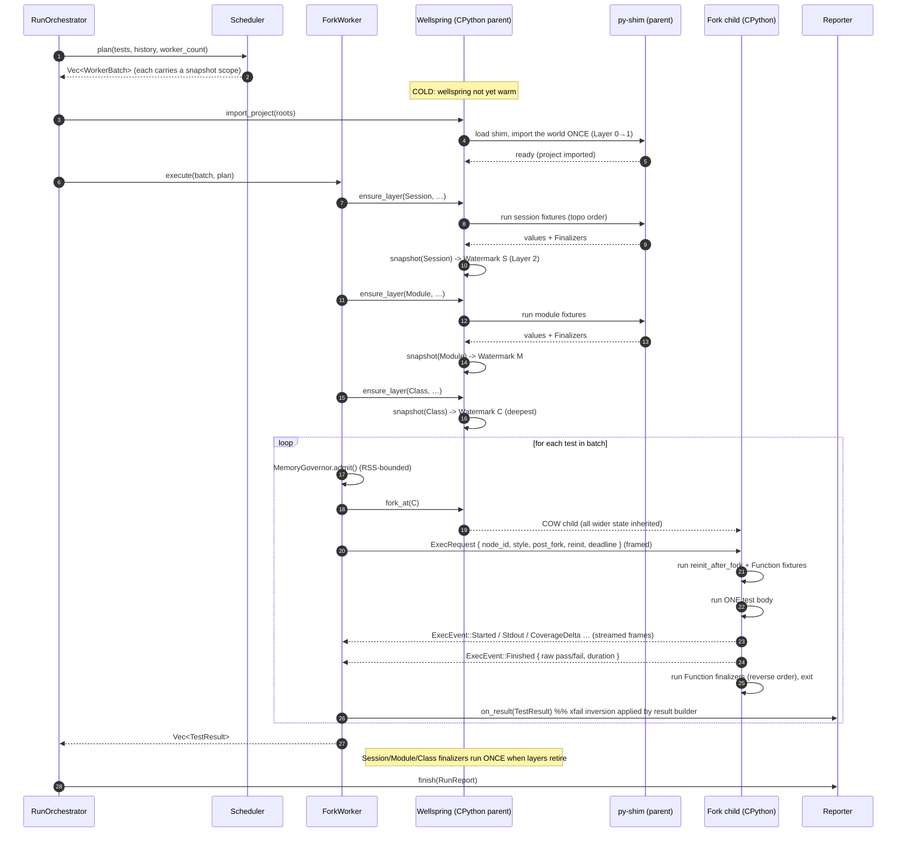

# 05 — Execution: Wellspring, Snapshot Stack & the Worker Trait

> **Status:** ✅ draft for discussion
> Prereqs: [00-vision](00-vision.md), [01-architecture](01-architecture.md), [02-domain-model](02-domain-model.md), [04-fixture-graph](04-fixture-graph.md).
> Gated by: [ADR-E003](adr/ADR-E003-fork-snapshot-isolation.md) (fork-from-snapshot — *the load-bearing performance bet*),
> [ADR-E002](adr/ADR-E002-execution-substrate.md) (subprocess + shim, binary IPC),
> [ADR-E005](adr/ADR-E005-workspace-trait-seams.md) (the `Worker` trait seam),
> [ADR-E008](adr/ADR-E008-cross-platform.md) (fork-first, fallbacks behind `Worker`).
> Feeds: [06-scheduler](06-scheduler.md) (each `WorkerBatch` carries a snapshot scope),
> [08-daemon](08-daemon.md) (warm wellspring lifecycle), [11-coverage-impact](11-coverage-impact.md).

This is the **load-bearing execution doc**. Everything the [00-vision](00-vision.md) promises about
*"pay setup once, isolation made free"* either happens here or does not happen at all. The
[fixture graph](04-fixture-graph.md) decides *what* belongs in which snapshot layer; this document
decides *how* those layers are built in a live CPython process, *how* we `fork()` from the deepest
applicable one, *how* the forked child talks to Rust, and *what happens when fork is unavailable,
unsafe, or times out*.

The subsystem lives in `crates/engine-core/src/exec/` (one type per file,
[ADR-E005](adr/ADR-E005-workspace-trait-seams.md)) plus the Rust-shipped Python shim in
`crates/py-shim/shim.py`. It **replaces** the old `tiderace/runner.rs` and `tiderace/pool.rs`
(which drove pytest); the process-group/timeout machinery in `tiderace/procutil.rs`
(`set_process_group`, `kill_tree`) **ports forward verbatim** — it is still exactly how we kill a
hung test's whole subtree.

---

## 1. The mental model in one paragraph

A **wellspring** is a plain `python` process that has run our shim and imported the project **once**.
Fixture scopes wider than `Function` are set up *inside* that lineage and frozen into a **layered
snapshot stack** (Layer 0 interpreter → Layer 1 project imports → Layer 2 session → Layer 3 module
→ Layer 4 class). For each test the executor **forks from the deepest applicable snapshot**, so the
child inherits — copy-on-write, in ~milliseconds — every wider fixture's state for free. The child
then runs only **function-scope setup** plus any `reinit_after_fork` resources, executes exactly
one test body, streams its result back over a **binary length-prefixed pipe**, and exits. The
parent never runs a test body, so it stays a pristine fork source. All of this sits behind one
`Worker` trait: `ForkWorker` is the Linux/macOS primary; `SubprocessWorker` is the no-fork
fallback; `ThreadWorker` and `RemoteWorker` are drop-in futures.

---

## 2. Classifier (class) diagram — the execution subsystem

Attributes use Rust-ish types; operations are the methods the orchestrator and scheduler call.
`<<trait>>` marks the DIP seams. Composition (`*--`) = owned lifetime; association (`-->`) = refers
to; realization (`..|>`) = trait impl.



`Watermark`, `FixturePlan`, `FixtureInstance`, `ScopeLayer`, and `Finalizer` are defined in
[04-fixture-graph](04-fixture-graph.md); `NodeId`, `TestStyle`, `Scope`, `TestResult`, `Outcome`,
and `Captured` in [02-domain-model](02-domain-model.md). This doc owns the *new* execution nouns:
`Wellspring`, `WatermarkStack`, `ShimProtocol`/`ShimConnection`/`BincodeFraming`, `ExecRequest`,
`ExecEvent`, `ForkPlan`, `MemoryGovernor`, `WorkerCaps`, `WellspringState`.

---

## 3. The layered snapshot stack

A `Scope` is not merely a lifetime; it is **a decision about which memory snapshot layer a
fixture's effects live in** ([04-fixture-graph](04-fixture-graph.md) §4). The wellspring materializes
those scopes as a stack of `Watermark`s. Each handle is a *forkable point in interpreter
memory*: forking from it gives a child all the state accumulated up to and including that layer.

```mermaid
graph TD
    L0["Layer 0 — interpreter + stdlib<br/>(wellspring boot: python + shim loaded)"]
    L1["Layer 1 — project imports<br/>(import the world ONCE; ADR-E003)"]
    L2["Layer 2 — Session fixtures<br/>snapshot S"]
    L3["Layer 3 — Module fixtures<br/>snapshot M"]
    L4["Layer 4 — Class fixtures<br/>snapshot C (deepest)"]
    L0 --> L1 --> L2 --> L3 --> L4
    L4 -->|fork() per test| child["Child:<br/>run post_fork (Function fixtures)<br/>+ reinit_after_fork resources<br/>then run ONE test body, report, exit"]
```

Key properties, each tied to an ADR:

- **Layers are append-only and scope-monotonic.** A snapshot at scope *s* contains all state from
  every wider scope. This is guaranteed upstream by the fixture graph's scope-monotonicity
  invariant ([04-fixture-graph](04-fixture-graph.md) §2.2): no `Function` state can leak into a
  snapshotted layer, so a snapshot is always a *clean wider-than-Function* world.
- **A layer is a `Watermark`, not a copy.** On Linux/macOS we do **not** serialize memory; the
  handle simply records "fork the wellspring *now*, after these fixtures ran." In practice the wellspring
  advances through the layers in scope order and we mint a handle at each boundary the scheduler
  asked us to keep warm. (CRIU-style materialized checkpoints are parked as a future
  `SnapshotStore`, [ADR-E003](adr/ADR-E003-fork-snapshot-isolation.md) alternatives.)
- **Only Function scope runs post-fork.** Session/Module/Class fixtures run **once** in the wellspring
  lineage; their finalizers run **once** when the layer retires — never per test
  ([04-fixture-graph](04-fixture-graph.md) §1.1, §4).

### 3.1 Fork from the *deepest applicable* snapshot

For a `WorkerBatch` ([06-scheduler](06-scheduler.md)) every test in it shares the same deepest
snapshot scope by construction — that is exactly what locality scheduling buys us. The
`ForkPlan::from(FixturePlan, WatermarkStack)` selects `fork_from = WatermarkStack::deepest_shared(plan)`:
the narrowest-scoped live snapshot shared by the test. The child inherits everything COW; it then
runs `post_fork` (Function fixtures) and `reinit_in_child` (fork-fragile resources), then the body.

> **The win restated.** A 10s session fixture or a 10k-row module seed is paid **once**,
> snapshotted, and every dependent test forks from it in ~ms with a pristine copy. 500 tests in a
> module pay the seed **1×**, not **500×** — the [00-vision](00-vision.md) *"fixture-heavy suite,
> 10–100×"* target, realized by this fork boundary.

---

## 4. The `Worker` trait and its four implementations

Per [ADR-E008](adr/ADR-E008-cross-platform.md) the orchestrator and scheduler are
**platform-agnostic**: they speak `Worker`, never `fork`. Capability detection picks the impl at
startup; `--worker=` overrides.

| Impl | Platform / mode | Isolation | Startup amortization | Snapshot semantics |
|---|---|---|---|---|
| **`ForkWorker`** (primary) | Linux, macOS | pristine per test (COW) | import once (wellspring) | true COW fork from deepest layer |
| **`SubprocessWorker`** (fallback) | Windows / `fork` unsafe / `--no-fork` | fresh process per batch | warm pool, no COW | **re-runs scope setup per worker** (§7) |
| **`ThreadWorker`** (future) | free-threaded CPython (PEP 703) | per-thread, shared imports | shared warm interp | no fork; per-thread teardown isolation |
| **`RemoteWorker`** (future) | distributed | remote process | remote warm hosts + cache | snapshots live on the remote host |

All four return `Vec<TestResult>` for a `(WorkerBatch, FixturePlan)` pair and expose
`capabilities() -> WorkerCaps { supports_cow, supports_streaming, max_parallel, … }` so the
scheduler can adapt (e.g. drop snapshot-locality grouping to pure LPT when `supports_cow == false`).

### 4.1 `ForkWorker` (Linux/macOS, primary)

Owns a reference to the warm `Wellspring`, a `Watermark` to fork from, a `MemoryGovernor`, and a
timeout. `execute()` loop, per test:

1. `governor.admit()` — block until RSS budget allows another in-flight child (§6.3).
2. `wellspring.fork_at(snapshot)` — the OS `fork()`; the child is a warm interpreter.
3. In the child, the shim runs `post_fork` + `reinit_in_child`, then the body
   ([04-fixture-graph](04-fixture-graph.md) §5 sequence).
4. Stream `ExecEvent`s back over the child's pipe; assemble a `TestResult`.
5. The child exits; `kill_tree` on deadline (§8). Function finalizers ran in-child.

The parent wellspring **never** runs a body, so it remains a pristine fork source for the whole batch.

### 4.2 `SubprocessWorker` (no-fork fallback)

A warm pool of plain `python`+shim processes (the spiritual successor of `tiderace/pool.rs`, but
shim-driven, not pytest-driven). With no COW it cannot inherit snapshot state, so it takes the
**no-COW path** (§7): each worker re-executes the batch's wider-scope setup once, then runs the
batch's tests sequentially in-process with per-test teardown. Correct, just less amortized.

### 4.3 `ThreadWorker` / `RemoteWorker` (futures)

Reserved drop-ins behind the trait. `ThreadWorker` targets free-threaded CPython (PEP 703): one
warm interpreter, per-thread test execution, isolation by per-thread teardown rather than fork.
`RemoteWorker` ships `ExecRequest`s over a `BinaryTransport` to remote warm hosts and a shared
[remote cache](07-cache.md). Neither requires touching the scheduler or orchestrator — the
[ADR-E008](adr/ADR-E008-cross-platform.md) bet.

---

## 5. The binary IPC protocol (Rust ↔ shim)

Per [ADR-E002](adr/ADR-E002-execution-substrate.md): the boundary is a **length-prefixed binary
pipe**, not newline-JSON. The old `pool.rs` used newline-JSON and had to defend against newline
injection in node ids; framing every message with an explicit length removes that whole class of
bug and lets us stream structured events cheaply.

### 5.1 Framing

Every frame is `u32 length (LE) ++ bincode/msgpack payload`. The reader reads exactly `length`
bytes — a node id, traceback, or captured blob containing any byte (including `\n`, `\r`, `\0`) is
carried verbatim inside the payload and can never forge a second frame. This is the structured
upgrade of the `pool.rs` "serde escapes newlines" defense, now enforced by the frame header itself.



### 5.2 Messages

`ExecRequest` (Rust → shim) — one per test the child must run:

| Field | Meaning |
|---|---|
| `node_id` | the test to run (verbatim, [02-domain-model](02-domain-model.md)) |
| `style` | `TestStyle` — how to invoke the body (plain call / `Test*` method / `unittest` method) |
| `post_fork` | Function-scope `FixtureInstance`s to set up in-child, topo order |
| `reinit` | `reinit_after_fork` fixture nodes to rebuild in-child ([04-fixture-graph](04-fixture-graph.md) §4.3) |
| `fixture_args` | the assembled argument map the body is called with |
| `capture_caps` | stdout/stderr/log capture limits (carries `MAX_CAPTURE_BYTES` forward) |
| `deadline` | per-test wall-clock budget; the shim self-aborts, Rust also enforces (§8) |

`ExecEvent` (shim → Rust) — a **stream**, not a single reply, so the IDE/terminal can show output
live and the cache/coverage subsystems consume deltas as they happen:

| Variant | Payload | Consumer |
|---|---|---|
| `Started` | timestamp | reporter (live progress) |
| `Stdout` / `Stderr` | bounded `Bytes` | `Captured` ([02](02-domain-model.md)) |
| `Log` | structured `LogRecord` | `Captured.log_records` |
| `AssertionFailure` | raw operands + AST handle | [AssertionIntrospector](09-assertions.md) builds `RichDiff` lazily ([ADR-E009](adr/ADR-E009-lazy-assertion-introspection.md)) |
| `CoverageDelta` | executed-file/line set | [CoverageCollector](11-coverage-impact.md) → `InputClosure` |
| `FixtureError` | which fixture, traceback | maps to `Outcome::Error` (setup failure) |
| `Finished` | raw pass/fail + duration | result builder applies xfail inversion → `Outcome` |

The shim reports **raw** pass/fail; the Rust result builder applies the `XFail`/`XPass`/strict
inversion and the `Failed` vs `Error` split per [02-domain-model](02-domain-model.md) §8 — policy
stays in Rust, the shim stays dumb ([ADR-E002](adr/ADR-E002-execution-substrate.md)).

### 5.3 Why streaming beats request/response

Batching + streaming is exactly the [ADR-E002](adr/ADR-E002-execution-substrate.md) mitigation for
per-message IPC cost: one `ExecRequest` admits N `ExecEvent`s, the heavy import is amortized by the
wellspring anyway, and live output/coverage arrives without a second round trip.

---

## 6. Fork hazards and how the design tames each

`fork()` is the performance bet *and* the hazard surface. [ADR-E003](adr/ADR-E003-fork-snapshot-isolation.md)
enumerates the dangers; here is the engineering response to each.

### 6.1 fork + threads

A `fork()` in a multithreaded process copies only the calling thread but inherits the others'
**locks in whatever state they were in** — classic post-fork deadlock. **Mitigation:** the wellspring
**snapshots before spawning any thread or importing any thread-spawning C-extension**. The fixture
graph's `reinit_after_fork` flag ([04-fixture-graph](04-fixture-graph.md) §4.3) is what makes this
possible: anything that would spin up a thread pool, a background reactor, or a connection pool is
deferred to the child. Layer 0–4 are kept thread-free; threads only ever exist in short-lived
children.

### 6.2 Non-fork-safe resources (`reinit_after_fork`)

Open sockets, file handles, CUDA/GPU contexts, and many DB connection pools do not survive `fork()`
(shared fd offsets, dead epoll handles, GPU context bound to the parent). A fixture acquiring such a
resource declares `reinit_after_fork = true`; the graph snapshots only its **pure part** (config,
computed constants) and lists the fragile handle in `ScopeLayer.reinit_in_child`. The `ForkWorker`
ships those node ids in `ExecRequest.reinit`, and the shim **rebuilds them in the child** before the
body runs. The surrounding fixture value keeps its wide scope; only the resource is effectively
function-scoped. (Worked example: `db_pool` in [04-fixture-graph](04-fixture-graph.md) §7 — migration
snapshotted, socket reopened per child.)

### 6.3 COW write amplification → bound concurrency by memory

COW is cheap *until* a child writes pages; each written page is privately copied, so a test that
touches a large object graph inflates RSS by (touched pages × in-flight children). Unbounded fork
parallelism can OOM the host even when CPU is idle. **Mitigation:** the `MemoryGovernor` admits
forks against an **RSS budget**, not just a CPU count. `max_concurrent_forks() = rss_budget /
per_fork_estimate`, where `per_fork_estimate` starts from the `Watermark.rss_bytes` of the
fork-from layer and is refined by observed child RSS over the run. This is open question **F4** in
[04-fixture-graph](04-fixture-graph.md) made concrete and is the second input (alongside CPU count)
the [scheduler](06-scheduler.md) uses to size worker fan-out.



### 6.4 Hazard summary

| Hazard | ADR-E003 line | Mitigation in this doc |
|---|---|---|
| fork + threads deadlock | ➖ "must snapshot before spawning threads" | snapshot layers kept thread-free; thread-spawning work → `reinit_after_fork` (§6.1) |
| non-fork-safe resource | ➖ "don't survive fork" | `reinit_in_child`, rebuilt post-fork via `ExecRequest.reinit` (§6.2) |
| COW write amplification | ➖ "bound concurrency by memory" | `MemoryGovernor` RSS budget (§6.3) |
| hung / runaway test | (timeout) | process-group `kill_tree`, carried from `procutil` (§8) |
| `fork` unavailable (Windows) | ➖ "Linux/macOS only" | `SubprocessWorker` no-COW path (§7) |

---

## 7. The no-COW fallback path (`SubprocessWorker`)

On a platform without `fork()` (Windows) or when fork is disabled, snapshots cannot be inherited
COW. [ADR-E008](adr/ADR-E008-cross-platform.md) requires a **correct, degraded** path:
*"fixture-scope snapshots degrade to re-execution of scope setup per worker."*

The `SubprocessWorker` takes a whole `WorkerBatch` (which already shares a deepest snapshot scope)
and, in one warm process:

1. Runs the batch's **wider-than-Function** scope setup **once** (the setup that would have been a
   snapshot) — paying it per *worker*, not per *test*. So the amortization is `N_tests /
   N_workers`× instead of `N_tests`×.
2. Runs each test in the batch sequentially, doing Function-scope setup + body + Function teardown
   between tests, restoring as much isolation as possible without a fresh interpreter.
3. Runs the wider-scope finalizers once at batch end.



The trade-off is explicit: **no per-test pristine interpreter**, so order-dependent flakiness is
*not* structurally eliminated on this path (we mitigate with per-test Function teardown, but a leak
in module state can still bleed). The scheduler is told via `WorkerCaps.supports_cow == false` and
may then prefer larger batches (more reuse per setup) and pure-LPT balancing.

---

## 8. Timeout & process-group kill (carried forward from `procutil`)

The hung-test story is **unchanged** from the current engine and ports forward verbatim — it is the
one piece of `tiderace/runner.rs` + `tiderace/pool.rs` we keep:

- Every spawned process (`SubprocessWorker` pool member, and the wellspring itself) is made a **process
  group leader** via `procutil::set_process_group` (`cmd.process_group(0)` on Unix). Children that a
  test spawns inherit the group.
- On deadline expiry — enforced both by the shim's own `deadline` self-abort *and* by a Rust-side
  `wait_timeout` — we `procutil::kill_tree`: `kill(-pid, SIGKILL)` to the whole group, then reap.
  A test that forks its own subprocesses cannot orphan them.
- A killed/crashed child is recorded as `Outcome::Error` ([02-domain-model](02-domain-model.md) §8:
  timeout/crash is `Error`, not `Failed`), with the partial captured output and a
  `"[riptide] test exceeded timeout of Ns and was killed"` note appended — carrying the existing
  message convention forward.
- For `ForkWorker`, a child crash/timeout kills **only that child**; the wellspring and all sibling
  children are unaffected ([01-architecture](01-architecture.md) §6 isolation guarantee). For the
  wellspring itself dying (rare — it never runs bodies), the [daemon](08-daemon.md) detects EOF on the
  shim pipe and respawns it, recycling the snapshot stack.

---

## 9. Sequence — a cold run (orchestrator → wellspring → fork per test → results)



On a **warm** run via the [daemon](08-daemon.md), steps 5–11 are skipped entirely — the wellspring and
its snapshot stack are already live, and only changed layers are rebuilt (content-hash invalidation,
[ADR-E007](adr/ADR-E007-warm-daemon.md)). That is the sub-100ms inner loop.

---

## 10. State machine — worker / test lifecycle

Tracks one forked child from spawn to exit, including the failure edges. (For the
*result-disposition* state space — `Passed`/`Failed`/`Skipped`/`XFail`/`XPass`/`Error` — see
[02-domain-model](02-domain-model.md) §8; this machine is about the *process*, which produces the
raw signal the result builder turns into an `Outcome`.)

```mermaid
stateDiagram-v2
    [*] --> Spawned : wellspring boot
    Spawned --> Imported : import_project (Layer 0→1)
    Imported --> Snapshotted : ensure_layer / snapshot (S, M, C)
    Snapshotted --> Forked : fork_at(deepest) per test (governor-admitted)
    Forked --> Running : reinit + Function setup + body
    Running --> Reporting : ExecEvent::Finished (raw pass/fail)
    Reporting --> Exited : Function finalizers, child exits
    Exited --> [*]

    Running --> TimedOut : deadline exceeded
    Forked --> Crashed : segfault / OOM-kill / pipe EOF
    Running --> Crashed : segfault / OOM-kill
    TimedOut --> Killed : procutil::kill_tree (SIGKILL group)
    Crashed --> Killed : reap subtree
    Killed --> [*] : recorded Outcome::Error

    note right of Snapshotted
        Parent (wellspring) stays here as a
        pristine fork source for the
        whole batch; never enters Running.
    end note
    note right of TimedOut
        Only this child dies; wellspring +
        siblings unaffected. Daemon
        respawns the wellspring only if the
        PARENT pipe EOFs.
    end note
```

---

## 11. Performance budget — where the milliseconds go

Directional, to be validated by the de-risking spike ([00-vision](00-vision.md) §6). The point is
*which* costs are paid once vs per-test, because that ratio is the whole thesis.

| Cost | When paid | Typical magnitude | Notes |
|---|---|---|---|
| Interpreter + shim boot (Layer 0) | once per wellspring | 20–60 ms | amortized across the entire run; ~0 on warm daemon |
| Project import (Layer 1) | once per wellspring | 100 ms – many s | *the* xdist killer — xdist pays this × N workers; we pay it × 1 |
| Session/Module/Class fixtures (Layers 2–4) | once per snapshot | fixture-dependent (the 10s DB) | the [04](04-fixture-graph.md) §7 win: 1× not N× |
| `fork()` per test | per test | **~0.5–3 ms** | the per-test isolation cost — *this* is what replaces import+startup |
| `MemoryGovernor.admit()` | per test | ~0 (uncontended) | blocks only under RSS pressure (§6.3) |
| `post_fork` Function setup + `reinit` | per test | fixture-dependent | the only per-test fixture cost |
| Test body | per test | the test itself | irreducible |
| IPC: `ExecRequest` + streamed `ExecEvent`s | per test | tens of µs/frame | binary framing + streaming ([ADR-E002](adr/ADR-E002-execution-substrate.md)); amortized by batching |
| COW page copies | per written page | proportional to test's working set | the RSS pressure the governor bounds |

**Reading the budget:** on a cold run the dominating one-time costs (import + expensive fixtures)
are paid **once**, after which each test costs ≈ `fork + post_fork + body + a few framed events`.
That is why a fixture-heavy suite lands at 10–100× and a cold full run at 5–50×
([00-vision](00-vision.md) §6). The **honest floor** also lives here: a suite of trivial,
all-changed, no-fixture tests is bounded by `fork + body`, so we beat xdist on startup but cannot
beat the cost of running the body itself — we say so rather than over-claim.

---

## 12. Open questions

- **E-1** — Snapshot retirement / RSS reclaim policy for the warm daemon: how long to hold a
  session/module snapshot warm before reclaiming? (→ [08-daemon](08-daemon.md); mirrors fixture
  open question **F1**.)
- **E-2** — Auto-detecting `reinit_after_fork` by sandboxing the wellspring (observe a socket/thread
  spawn) vs requiring the declaration. (→ [07-cache](07-cache.md) sandbox machinery; fixture **F2**.)
- **E-3** — `per_fork_estimate` calibration: how quickly does observed child RSS converge, and do we
  need a per-module estimate rather than a global one? (→ benchmarks/, [06-scheduler](06-scheduler.md).)
- **E-4** — bincode vs msgpack for the frame payload: pick on benchmarked serialization cost of the
  realistic `ExecEvent` mix (large tracebacks, coverage deltas). (→ [ADR-E002](adr/ADR-E002-execution-substrate.md)
  revisit trigger.)
- **E-5** — `ThreadWorker` isolation model once free-threaded CPython stabilizes: is per-thread
  teardown enough, or do we need per-thread sub-namespaces? (→ ADR when PEP 703 lands.)
