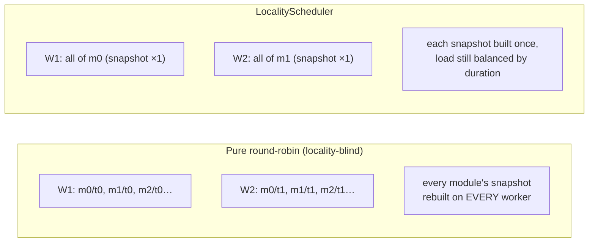
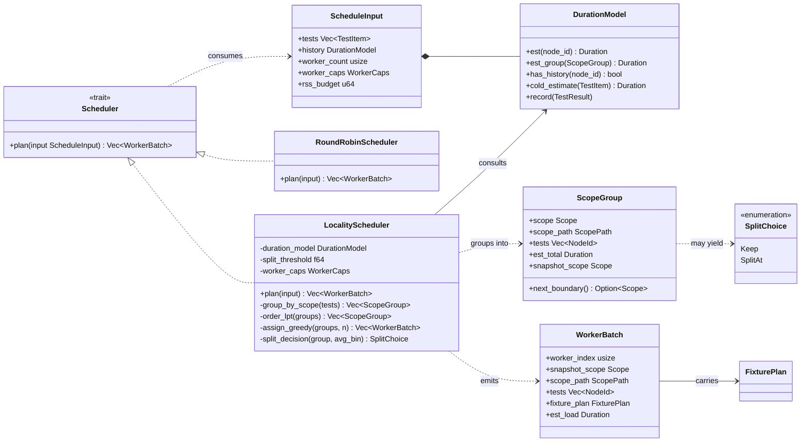
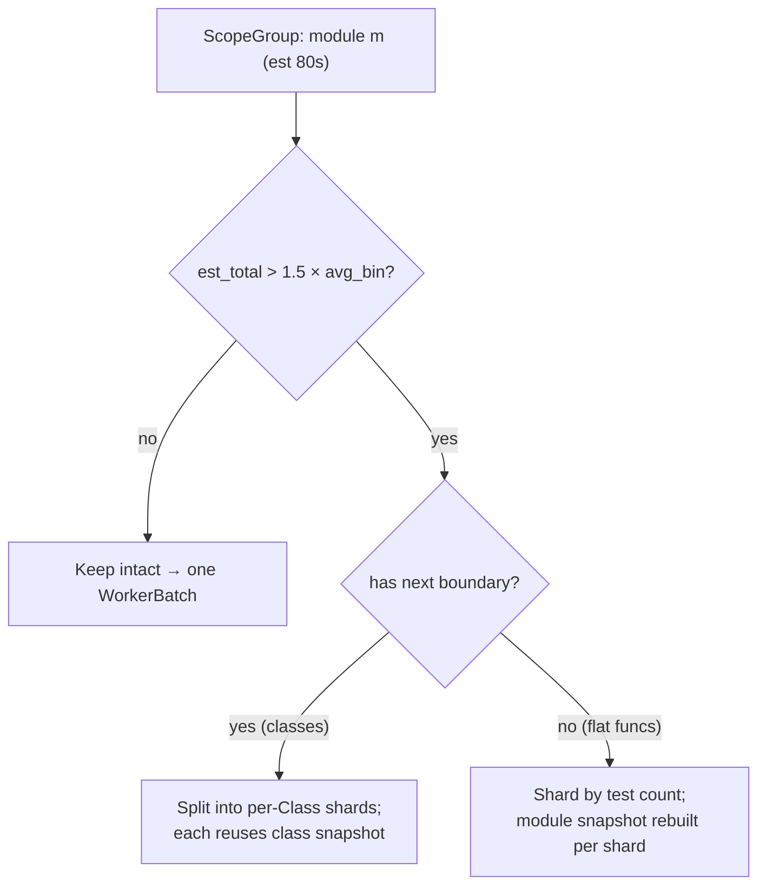
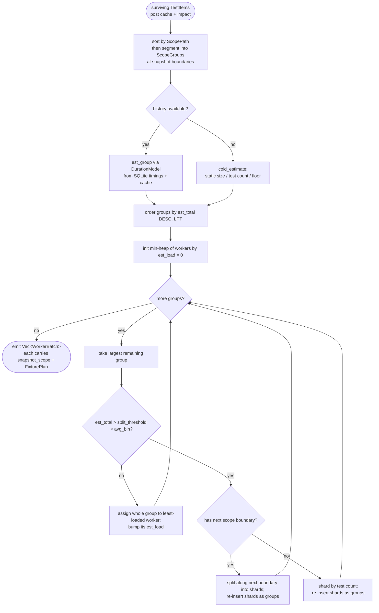

# 06 — Scheduler: Duration-Aware, Scope-Locality Bin-Packing

> **Status:** ✅ draft for discussion
> Prereqs: [00-vision](00-vision.md), [01-architecture](01-architecture.md), [02-domain-model](02-domain-model.md), [04-fixture-graph](04-fixture-graph.md), [05-execution-wellspring](05-execution-wellspring.md).
> Gated by: [ADR-E010](adr/ADR-E010-locality-scheduler.md) (the duration-aware, scope-locality scheduler),
> [ADR-E003](adr/ADR-E003-fork-snapshot-isolation.md) (snapshots are per-worker → locality matters),
> [ADR-E005](adr/ADR-E005-workspace-trait-seams.md) (`Scheduler` is a DIP seam),
> [ADR-E004](adr/ADR-E004-content-addressed-cache.md) / [ADR-E006](adr/ADR-E006-coverage-sys-monitoring.md) (timing history source).
> Feeds: [05-execution-wellspring](05-execution-wellspring.md) — each `WorkerBatch` carries the snapshot scope a `ForkWorker` forks from.

The scheduler sits between cache/impact filtering and execution: it takes the surviving
`TestItem`s and decides **which worker runs which test, in which order**. Per
[ADR-E010](adr/ADR-E010-locality-scheduler.md) it must reconcile two objectives that pull in
opposite directions, and it must do so as cheap Rust (it runs every cold run and every warm inner
loop). It lives in `crates/engine-core/src/scheduler/`, one type per file
([ADR-E005](adr/ADR-E005-workspace-trait-seams.md)).

---

## 1. The tension: makespan vs snapshot reuse

Fork workers are **separate processes with separate GILs** ([01-architecture](01-architecture.md) §6),
and a module/class/session snapshot ([05-execution-wellspring](05-execution-wellspring.md) §3) is built
**per worker**. That creates a direct conflict:

- **Makespan** (finish-fastest) wants total work **balanced evenly** across workers — classic
  multiprocessor scheduling.
- **Snapshot reuse** wants tests sharing a scope **co-located on one worker**, so the expensive
  Session/Module/Class setup is built **once** there instead of re-built on every worker the tests
  scatter to.

Pull only on makespan and you shred locality — a 10s module fixture gets rebuilt on all 8 workers
(80s of wasted setup). Pull only on locality and you can leave 7 workers idle while one chews
through a giant module. The `LocalityScheduler` packs with **both** objectives at once.

---

## 2. Classifier (class) diagram — the scheduler subsystem

`TestItem`, `NodeId`, `Scope`, `ScopePath`, `TestResult` are from [02-domain-model](02-domain-model.md);
`FixturePlan` from [04-fixture-graph](04-fixture-graph.md); `WorkerCaps` and the `WorkerBatch`→`ForkWorker`
hand-off from [05-execution-wellspring](05-execution-wellspring.md). This doc owns the new scheduling nouns:
`Scheduler` (trait), `LocalityScheduler`, `RoundRobinScheduler`, `ScheduleInput`, `DurationModel`,
`ScopeGroup`, `WorkerBatch`, `SplitChoice`.

---

## 3. The `LocalityScheduler` algorithm

Four phases — **group → order → assign → split** — run after collection + cache/impact filtering,
before fork ([ADR-E010](adr/ADR-E010-locality-scheduler.md)).

### 3.1 Group — by deepest shared snapshot scope

Tests are bucketed by their **deepest shared snapshot scope**, walking Session → Package → Module →
Class. Two tests land in the same `ScopeGroup` iff they share a `ScopePath` prefix down to that
group's scope **and** that scope has fixtures worth snapshotting (the fixture graph already told us
which layers are snapshot boundaries, [04-fixture-graph](04-fixture-graph.md) §4.2). A group is a
unit of *snapshot reuse*: every test in it can fork from the same `Watermark`
([05-execution-wellspring](05-execution-wellspring.md) §3.1), so keeping it on one worker builds that
snapshot once.

The `ScopePath` total ordering from [02-domain-model](02-domain-model.md) §5 is what makes this a
cheap sort-then-segment rather than an O(n²) clustering.

### 3.2 Order — longest-processing-time-first (LPT)

Groups are ordered by `DurationModel::est_group` **descending** (LPT). LPT is the classic 4/3-OPT
greedy makespan heuristic: placing the biggest chunks first leaves only small chunks to even out
the tail, which is exactly what minimizes the finish time of the slowest worker.

### 3.3 Assign — greedily to the least-loaded worker

Each group, largest first, is assigned to the worker with the **smallest current `est_load`**
(min-heap of workers keyed by accumulated estimated duration). Keeping a group intact preserves its
snapshot reuse; LPT ordering keeps the bins level despite that constraint.

### 3.4 Split — keep vs split along the *next* scope boundary

A single group can be larger than the whole average bin (one module with 5,000 slow tests, 8
workers). Keeping it intact would idle 7 workers. So when a group's `est_total` exceeds
`split_threshold × avg_bin` (default `split_threshold = 1.5`, a config knob), we **split** — but
**along the next-narrower scope boundary** (`ScopeGroup::next_boundary()`: Module → its Classes →
its functions). Each shard then still shares a snapshot one level down, so we trade *some* reuse
(the shared layer rebuilds per shard) for parallelism, while shards keep reusing the narrower
snapshot. If no narrower boundary exists (a flat module of free functions), we shard by test count
as a last resort and accept that those shards fork from the same module snapshot built per shard.

---

## 4. Cold-run heuristic (no history)

`DurationModel` is backed by the **SQLite timing history** (carried forward from the current
engine's timing persistence) and the [content-addressed cache](07-cache.md) /
[coverage](11-coverage-impact.md) records. On a **first/cold run** there is no per-test history, so
`DurationModel::cold_estimate` falls back to a static proxy:

- Static size of the test body (collected line/AST-node count) as a rough cost proxy.
- A flat per-test floor (every test pays at least `fork + body`,
  [05-execution-wellspring](05-execution-wellspring.md) §11).
- Group size (test count) when even static size is unavailable (`RegexCollector` without AST,
  [01-architecture](01-architecture.md) §7).

This is the [ADR-E010](adr/ADR-E010-locality-scheduler.md) consequence made explicit: *"cold runs
are heuristic (acceptable, converges after one run)."* After the first run, `DurationModel::record`
folds every `TestResult.duration` back into history, and the next run is duration-optimal. The
heuristic only needs to avoid pathological imbalance, not be exact.

---

## 5. Activity diagram — the scheduling algorithm

The split branch re-inserts shards into the same worklist, so a too-big group is recursively broken
down until every piece fits — and each piece still carries the deepest snapshot scope it can.

---

## 6. Worked example — makespan + snapshot reuse vs round-robin

**Setup.** 4 workers. 3 modules, each with one **8s module fixture** (the snapshotted cost) and
tests whose body times (from history) are:

| Module | Module-fixture setup | Test body times (s) | Σ bodies |
|---|---|---|---|
| `m_orders` | 8 | 6 × 4s = 24 | 24 |
| `m_billing` | 8 | 4 × 3s = 12 | 12 |
| `m_users` | 8 | 12 × 1s = 12 | 12 |

### 6.1 Naive `RoundRobinScheduler` (locality-blind)

Round-robin scatters each module's tests across all 4 workers, so **every module fixture is rebuilt
on every worker that gets any of its tests** — here all 3 fixtures on all 4 workers:

- Setup cost paid: `3 modules × 8s × 4 workers = 96s` of fixture setup (vs 24s necessary).
- Bodies (48s total) split ~evenly → ~12s of bodies/worker, **plus** ~24s of setup/worker.
- **Makespan ≈ 36s**, dominated by redundant setup.

### 6.2 `LocalityScheduler`

Group → 3 groups with `est_total` = setup + bodies: `m_orders` 32s, `m_billing` 20s, `m_users` 20s.
LPT order: `m_orders` (32), then `m_billing` (20), `m_users` (20). Greedy assign onto 4 workers:

| Worker | Batch | est_load |
|---|---|---|
| W1 | `m_orders` (snapshot ×1) | 32s |
| W2 | `m_billing` (snapshot ×1) | 20s |
| W3 | `m_users` (snapshot ×1) | 20s |
| W4 | *idle* | 0s |

Makespan = 32s, but W4 is idle and W1 dominates. Split check: `avg_bin = 72/4 = 18s`;
`m_orders` 32s > `1.5 × 18 = 27s` → **split**. `m_orders` has no class boundary (free functions),
so shard by test count into two 3-test shards, each rebuilding the module snapshot once:

| Worker | Batch | est_load |
|---|---|---|
| W1 | `m_orders` shard A (8 setup + 3×4) | 20s |
| W4 | `m_orders` shard B (8 setup + 3×4) | 20s |
| W2 | `m_billing` (snapshot ×1) | 20s |
| W3 | `m_users` (snapshot ×1) | 20s |

- Setup cost paid: `m_orders` 8s ×2 (the one accepted split) + `m_billing` 8s + `m_users` 8s = **32s**
  (vs round-robin's 96s).
- **Makespan ≈ 20s** — all four workers level.

**Result:** ~1.8× better makespan **and** ~3× less wasted fixture setup than round-robin. The split
heuristic spent *one* extra snapshot rebuild (8s on W4) to reclaim an idle core — a deliberate,
threshold-gated trade, exactly the [ADR-E010](adr/ADR-E010-locality-scheduler.md) §3.3 behavior.

---

## 7. Config knobs

Exposed in `pyproject.toml` `[tool.tiderace.scheduler]` ([13-cross-cutting](13-cross-cutting.md)),
all benchmark-validated ([ADR-E010](adr/ADR-E010-locality-scheduler.md) consequence: *"the
split-vs-keep heuristic needs tuning; exposed as a config knob"*):

| Knob | Default | Effect |
|---|---|---|
| `scheduler` | `locality` | `locality` \| `round_robin` (debugging) — the `Scheduler` seam |
| `split_threshold` | `1.5` | group is split when `est_total > threshold × avg_bin`; ↑ = favor reuse, ↓ = favor balance |
| `min_group_split` | `2` | never split a group below this many tests (splitting tiny groups never pays) |
| `worker_count` | `auto` | `auto` = `min(cpu, rss_budget / per_fork_estimate)` ([05-execution-wellspring](05-execution-wellspring.md) §6.3) |
| `history_decay` | `0.5` | EWMA weight on recent durations in `DurationModel` (recent runs trusted more) |
| `cold_proxy` | `static_size` | `static_size` \| `test_count` — cold-run cost proxy (§4) |

When `WorkerCaps.supports_cow == false` ([05-execution-wellspring](05-execution-wellspring.md) §4, the
`SubprocessWorker` no-COW path), the scheduler automatically raises the effective
`split_threshold` (larger batches = more reuse per *re-executed* setup) and leans toward pure LPT,
since there is no COW snapshot locality to protect — only setup-re-execution amortization.

---

## 8. How a `WorkerBatch` feeds the Worker / Wellspring

The scheduler's output is the executor's input. Each `WorkerBatch` carries **exactly** what a
`ForkWorker` needs to fork from the right place ([05-execution-wellspring](05-execution-wellspring.md)):

- `snapshot_scope` + `scope_path` — tells the `Wellspring` which `Watermark` to build/reuse and
  `fork_at`. Because every test in the batch shares this scope **by construction (§3.1)**, the
  `ForkWorker` builds that snapshot **once** and forks every test from it — the locality payoff.
- `fixture_plan` — the [FixturePlan](04-fixture-graph.md) for the batch (layers, `fork_from`,
  `post_fork`, `closure_hash`).
- `tests` — the ordered `NodeId`s, fed one `ExecRequest` at a time over the binary shim protocol.

This is the closed loop the whole performance thesis rides on: the **scheduler co-locates tests so
a snapshot is built once**, the **wellspring builds it once and forks per test**, and the
**`MemoryGovernor`** ([05-execution-wellspring](05-execution-wellspring.md) §6.3) bounds how many of those
forks run at once — `worker_count`'s `auto` value is itself derived from that RSS budget.

---

## 9. Open questions

- **S-1** — Should `split_threshold` adapt per-suite from observed snapshot-build cost (cheap
  fixtures → split aggressively; expensive → keep)? Ties to [ADR-E010](adr/ADR-E010-locality-scheduler.md)
  revisit trigger (*"simplify toward pure LPT if locality penalty is negligible"*).
- **S-2** — Cross-run worker affinity in the warm [daemon](08-daemon.md): pin a module's group to
  the worker that already holds its warm snapshot across inner-loop runs, to reuse it without
  rebuild. (→ [08-daemon](08-daemon.md), snapshot retirement **F1**/**E-1**.)
- **S-3** — Joint optimization of `worker_count` and grouping under a hard `rss_budget`: when memory
  is the binding constraint, fewer-but-fuller workers may beat more-but-thinner ones. (→ benchmarks/,
  [05-execution-wellspring](05-execution-wellspring.md) §6.3.)
- **S-4** — Should impacted-but-uncached tests be weighted higher in LPT (run the riskiest/slowest
  first for faster feedback) even at a small makespan cost? (→ [11-coverage-impact](11-coverage-impact.md).)
