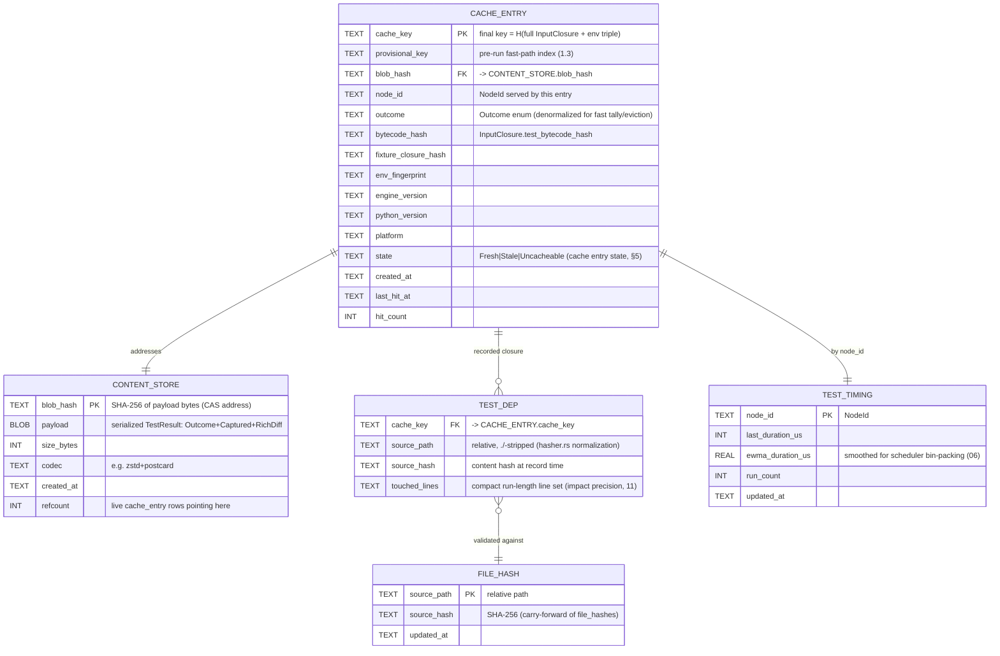
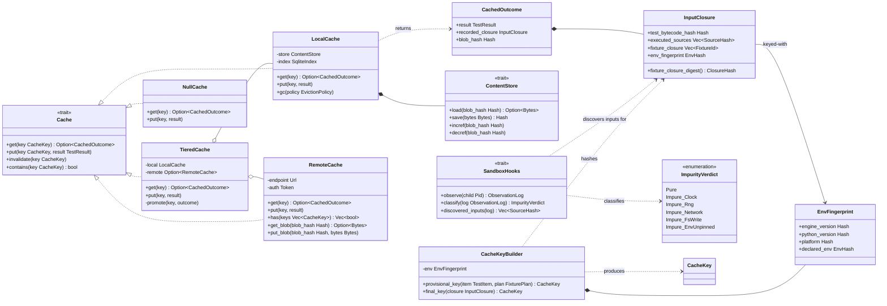
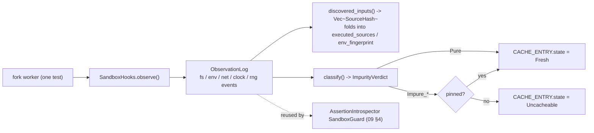
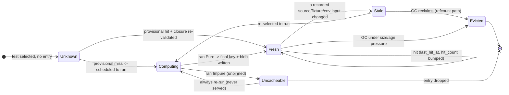
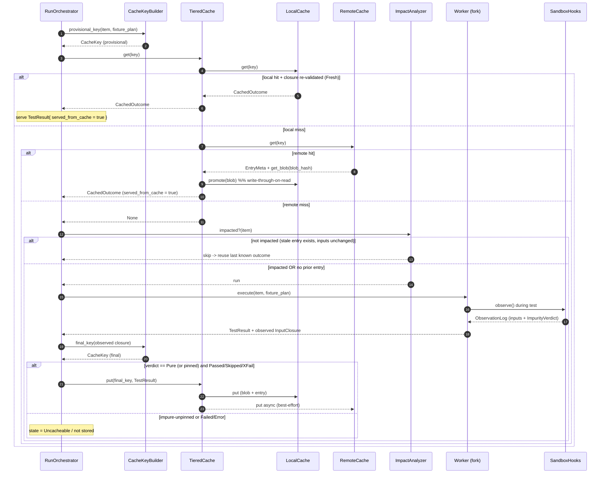

# 07 — Content-Addressed Result Cache (the "build system for tests")

> **Status:** ✅ draft for discussion
> Prereqs: [00-vision](00-vision.md), [01-architecture](01-architecture.md), [02-domain-model](02-domain-model.md),
> [04-fixture-graph](04-fixture-graph.md).
> Gated by: [ADR-E004](adr/ADR-E004-content-addressed-cache.md) (content-addressed cache),
> [ADR-E005](adr/ADR-E005-workspace-trait-seams.md) (trait seams),
> [ADR-E006](adr/ADR-E006-coverage-sys-monitoring.md) (coverage-derived closure),
> [ADR-E003](adr/ADR-E003-fork-snapshot-isolation.md) (fork isolation).
> Feeds: [11-coverage-impact](11-coverage-impact.md) (shared `DepGraph`), [08-daemon](08-daemon.md) (warm reuse).

This is the subsystem that makes the [vision](00-vision.md) literal: **a test result is a build
artifact.** We treat each [`TestResult`](02-domain-model.md#3-type-catalogue-responsibility--home-file)
the way Bazel/Nix treat an output — content-addressed by its transitive input closure, memoized,
and shareable. The fastest test is the one we never import, never start, and never run; this doc
defines *how* we know it is safe to not run it.

[02-domain-model](02-domain-model.md) owns the **shape** of [`InputClosure`](02-domain-model.md#2-classifier-class-diagram--the-core-domain)
and [`CacheKey`](02-domain-model.md#2-classifier-class-diagram--the-core-domain). This doc owns
their **derivation, semantics, soundness, storage, and tiering** — per
[domain invariant #4](02-domain-model.md#10-invariants-other-authors-must-honor) ("do not compute
cache keys outside `cache/`"). The types live in `crates/engine-core/src/cache/`, one type per file
([ADR-E005](adr/ADR-E005-workspace-trait-seams.md)).

---

## 1. The cache key — derivation & semantics

The cache key is a SHA-256 digest (carrying [`tiderace/hasher.rs`](../../../../tiderace/hasher.rs)'s
`Sha256` + `hex::encode` forward) over a test's **transitive input closure**, exactly as fixed in
[ADR-E004](adr/ADR-E004-content-addressed-cache.md):

```
CacheKey = SHA256(
    test_bytecode_hash          # the compiled test body (code object), not raw text
  + executed_source_closure     # coverage-derived touched source (E006/11), sorted
  + fixture_closure             # FixturePlan.closure_hash (04 §8)
  + declared_env                # env vars/files the test is permitted to read
  + engine_version             # cache format / engine semantics
  + python_version             # e.g. cpython-3.12.4
  + platform                   # os-arch-libc, e.g. linux-x86_64-glibc2.39
)
```

### 1.1 Why each term, and where it comes from

| Term | Type ([02](02-domain-model.md)) | Source of truth | Why it is in the key |
|---|---|---|---|
| `test_bytecode_hash` | `Hash` | shim hashes the test's compiled code object | Survives whitespace/comment-only edits — bytecode, not text. Catches a real body change a source-text hash would also catch, but *ignores* no-op reformatting. |
| `executed_sources` | `Vec<SourceHash>` | [`CoverageCollector`](11-coverage-impact.md) per-test footprint | The **soundness anchor**: what the test *actually* executed, not a static guess ([ADR-E006](adr/ADR-E006-coverage-sys-monitoring.md)). |
| `fixture_closure` | `Vec<FixtureId>` → `ClosureHash` | [`FixtureGraph::plan_for(test).closure_hash`](04-fixture-graph.md#8-feeding-the-cache-key-link-to-adr-e004--07-cache) | Editing a fixture body invalidates every test transitively closing over it — precisely, no over/under-invalidation. |
| `env_fingerprint` | `EnvHash` | `SandboxHooks`-observed env/file reads (§4) | Two runs that read a different `DATABASE_URL` are different inputs. |
| `engine_version` | `Hash` | compile-time constant | Bump invalidates the whole cache when result semantics change. |
| `python_version` | `Hash` | wellspring reports `sys.implementation` + `sys.version_info` | Bytecode + outcome are interpreter-version-specific. |
| `platform` | `Hash` | `target_triple` + libc | Avoids cross-environment poisoning (§7), the explicit [ADR-E004](adr/ADR-E004-content-addressed-cache.md) consequence. |

### 1.2 Reconciling with `InputClosure` (the [02](02-domain-model.md) shape)

[02-domain-model](02-domain-model.md) declares the shape:

```rust
struct InputClosure {              // domain/input_closure.rs (shape owned by 02)
    test_bytecode_hash: Hash,
    executed_sources: Vec<SourceHash>,
    fixture_closure: Vec<FixtureId>,
    env_fingerprint: EnvHash,
}
```

The three environment terms (`engine_version`, `python_version`, `platform`) are **not** stored on
`InputClosure` — they are a property of the *runtime*, not the test. The `CacheKeyBuilder` folds
them in at hash time via an [`EnvFingerprint`](#3-classifier-class-diagram--cache-subsystem)
captured once per process. This keeps `InputClosure` a pure description of *the test's* inputs (so a
`TestResult.executed_closure` round-trips losslessly) while the **key** is environment-scoped. The
derivation is therefore:

```rust
// cache/cache_key_builder.rs — the ONLY place keys are computed (invariant #4)
fn key_for(closure: &InputClosure, env: &EnvFingerprint) -> CacheKey {
    let mut h = Sha256::new();
    h.update(closure.test_bytecode_hash.as_bytes());
    for s in sorted(&closure.executed_sources) { h.update(s.as_bytes()); }  // sort = order-free
    h.update(closure.fixture_closure_digest().as_bytes());  // = FixturePlan.closure_hash
    h.update(closure.env_fingerprint.as_bytes());
    h.update(env.engine_version.as_bytes());
    h.update(env.python_version.as_bytes());
    h.update(env.platform.as_bytes());
    CacheKey { digest: Hash(hex::encode(h.finalize())) }
}
```

> **Canonicalization rule.** `executed_sources` are **sorted** and `fixture_closure` is reduced to
> the deterministic `ClosureHash` the graph already produces, so two runs that touch the same files
> in a different order yield the **same** key. Non-determinism in *ordering* must never change the key.

### 1.3 The bootstrap problem (first sight)

A test the cache has never executed on this content has **no `executed_sources` yet** — coverage is
a *product* of running. So the key is only fully computable *after* a run. We resolve this with a
**provisional key** then a **final key**:

- **Provisional key** (pre-run) = hash over the terms we know statically: `test_bytecode_hash` +
  `fixture_closure` + `env_fingerprint(declared)` + env triple. Used to *look up* whether we have a
  prior entry whose recorded `executed_sources` are all still content-identical.
- **Final key** (post-run) = the full key including the observed `executed_sources`. Written to the
  store keyed by the final key, with the provisional key recorded alongside as a fast-path index.

On the next run we recompute the provisional key, find the candidate entry, re-validate that every
recorded `executed_source` hash still matches the current tree (via `find_changed_files`,
[`hasher.rs`](../../../../tiderace/hasher.rs)), and if so serve the cached `TestResult` without
forking. This is the cache analogue of [ADR-E004](adr/ADR-E004-content-addressed-cache.md)'s
"a test never seen on this content has no closure yet → it runs, and that run produces the closure
for next time."

---

## 2. The store — content store + SQLite index

The cache is two cooperating stores, mirroring Bazel's **CAS + action cache**:

- **Content store (CAS):** blobs addressed by their own content hash. A blob is a serialized
  [`TestResult`](02-domain-model.md#3-type-catalogue-responsibility--home-file) payload — the
  [`Outcome`](02-domain-model.md#8-outcome--the-result-state-space), captured
  [`stdout`/`stderr`](02-domain-model.md#3-type-catalogue-responsibility--home-file)
  ([`Captured`](02-domain-model.md#2-classifier-class-diagram--the-core-domain)), and the optional
  [`RichDiff`](09-assertions.md). Deduplicated: two tests with identical output share one blob.
- **SQLite index:** the metadata layer that maps a `CacheKey` → content blob, records the recorded
  `InputClosure` (so we can re-validate it), per-test timing for the
  [scheduler](06-scheduler.md), and the persisted [`DepGraph`](11-coverage-impact.md) edges (shared
  with impact analysis). This evolves the current [`tiderace/db.rs`](../../../../tiderace/db.rs)
  schema (`file_hashes`, `test_results`, `test_file_deps`, `coverage_data`) forward.

### 2.1 ERD — cache store + index



Notes:
- `CONTENT_STORE.refcount` enables CAS garbage collection: a blob is collectible only when no
  `CACHE_ENTRY` references it (after eviction, §5/§6).
- `TEST_DEP` is the **same edge set** the [impact analyzer](11-coverage-impact.md) walks; it is the
  physical persistence of the `DepGraph`. Storing `touched_lines` (not just files) is what lifts the
  precision limitation of the old coverage-only path (see [11 §line-level](11-coverage-impact.md)).
- `FILE_HASH` is the carried-forward `file_hashes` table; `TEST_DEP.source_hash` is denormalized so a
  cache entry can be validated even if the global `FILE_HASH` snapshot is mid-update.

---

## 3. Classifier (class) diagram — cache subsystem



> `SandboxHooks` is the **shared** sandbox-observation mechanism named in
> [04 (F2)](04-fixture-graph.md#9-open-questions) and reused by the
> [assertion purity guard](09-assertions.md#4-the-purity--nondeterminism-guard) (`SandboxGuard`).
> One definition of "impure" across caching, `reinit_after_fork` auto-detection, and introspection
> — see [09 §A4](09-assertions.md#8-open-questions).

---

## 4. Soundness & hermeticity — knowing the closure is complete

A cache is only as correct as its input closure is complete. Our strategy is **staged and
conservative-by-default** ([ADR-E004](adr/ADR-E004-content-addressed-cache.md)):

1. **Coverage-derived closure (always on, 3.12+).** `executed_sources` come from the
   [`CoverageCollector`](11-coverage-impact.md) running *inside the fork worker* for the single test
   ([ADR-E006](adr/ADR-E006-coverage-sys-monitoring.md)). This reflects what the test *touched*, not
   a static import guess — the structural defense against under-invalidation.
2. **Sandboxed observation (staged).** `SandboxHooks` intercept fs/env/network/clock/RNG inside the
   child to (a) **discover** inputs the coverage layer can't see (env vars read, files `open()`ed) and
   (b) **detect impurity** — a test that reads `time.time()`, `random`, or a socket.
3. **Impurity policy.** A test whose observation log classifies as anything but
   `ImpurityVerdict::Pure` is either:
   - **marked uncacheable** (`CACHE_ENTRY.state = Uncacheable`) → always falls through to run; or
   - **pinned** — the nondeterministic input is frozen (frozen clock, seeded RNG, recorded network
     fixture) so the closure *becomes* complete and the entry is cacheable again. Never silently cached.
4. **Bootstrap.** First sight → no closure → run (§1.3); the run produces the closure for next time.

### 4.1 Shared `SandboxHooks` contract



The same `ObservationLog` a child produces is consumed by **both** the cache impurity classifier and
the assertion purity guard within one child — addressing [09 §A4](09-assertions.md#8-open-questions)
(share the instance, count observations once).

---

## 5. Cache-entry state machine

A `CACHE_ENTRY` moves through a lifecycle the orchestrator and GC reason about. `Uncacheable` is an
absorbing side-state for impure tests.



- **Unknown → Fresh** is the warm fast path: provisional key matches and every recorded
  `TEST_DEP.source_hash` still equals the current `FILE_HASH` → serve without forking.
- **Fresh → Stale** is invalidation (§6): a transitive input changed. Stale entries are *not* deleted
  immediately — the orchestrator may still consult them for impact (a stale-but-present entry tells
  impact "this test exists and previously passed").
- **Computing → Uncacheable** is the impurity verdict; such entries record the `NodeId` and verdict so
  the daemon can surface "N tests uncacheable: impure clock/RNG" diagnostics.

---

## 6. Invalidation rules & cross-environment poisoning prevention

### 6.1 What invalidates an entry (Fresh → Stale)

An entry's key is a pure function of its inputs, so invalidation is implicit: **change any input and
the key changes**, so the old entry is simply never looked up again. We make this explicit for the
re-validation fast path and GC:

1. **Source change.** Any `TEST_DEP.source_path` whose current `FILE_HASH` ≠ recorded `source_hash`
   → the test's `executed_sources` term differs → new key → old entry Stale. (Carries
   [`find_changed_files`](../../../../tiderace/hasher.rs) forward.)
2. **Fixture change.** A fixture body in the closure changed → `FixturePlan.closure_hash` differs
   ([04 §8](04-fixture-graph.md#8-feeding-the-cache-key-link-to-adr-e004--07-cache)) → new key. The
   graph's transitive closure makes this **precise**: only tests closing over the edited fixture
   invalidate.
3. **Test body change.** `test_bytecode_hash` differs (a real semantic edit; comment/whitespace-only
   edits do not change bytecode and so do **not** invalidate).
4. **Declared-env change.** A value in `env_fingerprint` (a read env var / config file) changed.
5. **Engine/Python/platform change.** Any of the env triple changed → *all* keys change (intentional
   wholesale invalidation; see §6.2).
6. **Always-uncacheable.** `Outcome::Failed` / `Outcome::Error` results are never served from cache —
   they are always re-run (consistent with [02 §8](02-domain-model.md#8-outcome--the-result-state-space)
   and [`impact.rs`](../../../../tiderace/impact.rs) rule 4). Only `Passed`/`Skipped`/`XFail` are
   cacheable.

### 6.2 Cross-environment poisoning prevention

The explicit [ADR-E004](adr/ADR-E004-content-addressed-cache.md) consequence: a result computed on
one interpreter/OS must never be served on another. We prevent it structurally:

- `engine_version`, `python_version`, `platform` are **mandatory key terms** — a Linux/cpython-3.12
  result and a macOS/cpython-3.13 result have different keys *by construction*; neither can shadow the
  other.
- The `RemoteCache` (§7) is keyed by the **same** full key, so a shared cache holds per-environment
  variants side by side. A CI shard on a different platform misses cleanly and recomputes rather than
  serving a poisoned hit.
- `declared_env` is part of the key, so a test that branches on `os.environ["CI"]` caches `CI=true`
  and `CI=false` as distinct entries.

---

## 7. Tiering — `LocalCache` + `RemoteCache` behind `TieredCache`

`TieredCache` composes the two (`Cache <|.. TieredCache`, [01 master diagram](01-architecture.md#5-master-classifier-class-diagram--core-traits--types)):

- **Read:** `local.get(key)` → on miss `remote.get(key)` → on remote hit, **promote** the blob into
  the local store (write-through-on-read) so the second local run is free.
- **Write:** `local.put` always; `remote.put` is async/best-effort (a failed remote write never fails
  the run — local correctness is independent of the remote).
- **`NullCache`** is the `--no-cache` debugging seam (always miss, never store).

### 7.1 Remote cache protocol (CAS-style sketch)

A thin content-addressable protocol — the action cache (`CACHE_ENTRY`) and CAS (`CONTENT_STORE`) map
directly onto it:

| RPC | Semantics | Idempotent? |
|---|---|---|
| `has(keys: [CacheKey]) -> [bool]` | Batched existence probe before a run (skip download if absent). | yes |
| `get(key: CacheKey) -> Option<EntryMeta>` | Fetch entry metadata incl. `blob_hash` + recorded `InputClosure`. | yes |
| `get_blob(blob_hash) -> Option<Bytes>` | Fetch the content blob (the serialized `TestResult`). CAS: content-addressed, so cacheable at any layer/CDN. | yes |
| `put(key, EntryMeta)` | Upload entry metadata (small). | yes (last-writer-wins, same key ⇒ same inputs ⇒ same result) |
| `put_blob(blob_hash, Bytes)` | Upload a blob; server may dedupe by `blob_hash`. | yes |

Because everything is content-addressed, `put` is safe under concurrency: the same key implies the
same inputs implies the same result, so racing writers converge. The two-phase `has` → `get_blob`
split lets a CI shard cheaply discover *which* of 50k tests it can skip before downloading any output.

### 7.2 Sequence — a run resolving each test through the cache



This sequence **is** the orchestrator preference order from
[00-vision §7](00-vision.md#7-guiding-principles) and [01 §3](01-architecture.md#3-c4-level-3--components-engine-core):
**cache hit → impact-skip → run**, with the run path closing the loop by observing the closure and
writing the entry.

---

## 8. What other authors must know

- **Where keys are computed:** only `cache/cache_key_builder.rs` (domain invariant #4). Everyone else
  passes an `InputClosure` (built by the graph + worker) and gets a `CacheKey` back.
- **`fixture_closure`** is supplied verbatim as `FixturePlan.closure_hash`
  ([04 §8](04-fixture-graph.md#8-feeding-the-cache-key-link-to-adr-e004--07-cache)); the cache does
  not recompute it.
- **`executed_sources`** and the persisted `TEST_DEP` edges are the **same** structure
  [11-coverage-impact](11-coverage-impact.md) reads as the `DepGraph` — one table, two consumers.
- **`SandboxHooks` / `ImpurityVerdict`** are shared with the
  [assertion purity guard](09-assertions.md#4-the-purity--nondeterminism-guard); do not fork a second
  impurity definition.

---

## 9. Open questions

- **C1** — `ObservationLog` cost under fork: does `SandboxHooks` interception add enough per-test tax
  to erode the cache win on already-fast suites? (ties to [ADR-E006](adr/ADR-E006-coverage-sys-monitoring.md) revisit)
- **C2** — Remote cache trust boundary: signing entries so a compromised shard can't poison the shared
  cache (→ [13-cross-cutting](13-cross-cutting.md) security).
- **C3** — Eviction policy: size-bounded LRU on `CONTENT_STORE` vs age-based on `CACHE_ENTRY`; who
  triggers GC in the [daemon](08-daemon.md) (F1 snapshot retirement is adjacent).
- **C4** — Auto-pinning impure tests (frozen clock/seeded RNG) transparently vs requiring an explicit
  `@pinned` marker. ([ADR-E004](adr/ADR-E004-content-addressed-cache.md) "aggressiveness opt-in".)
