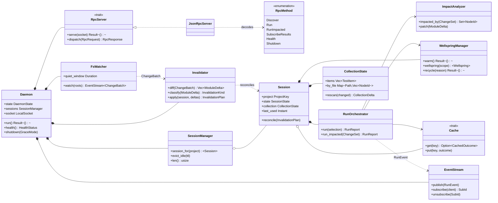
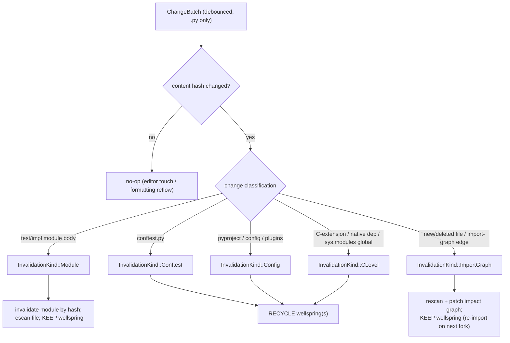
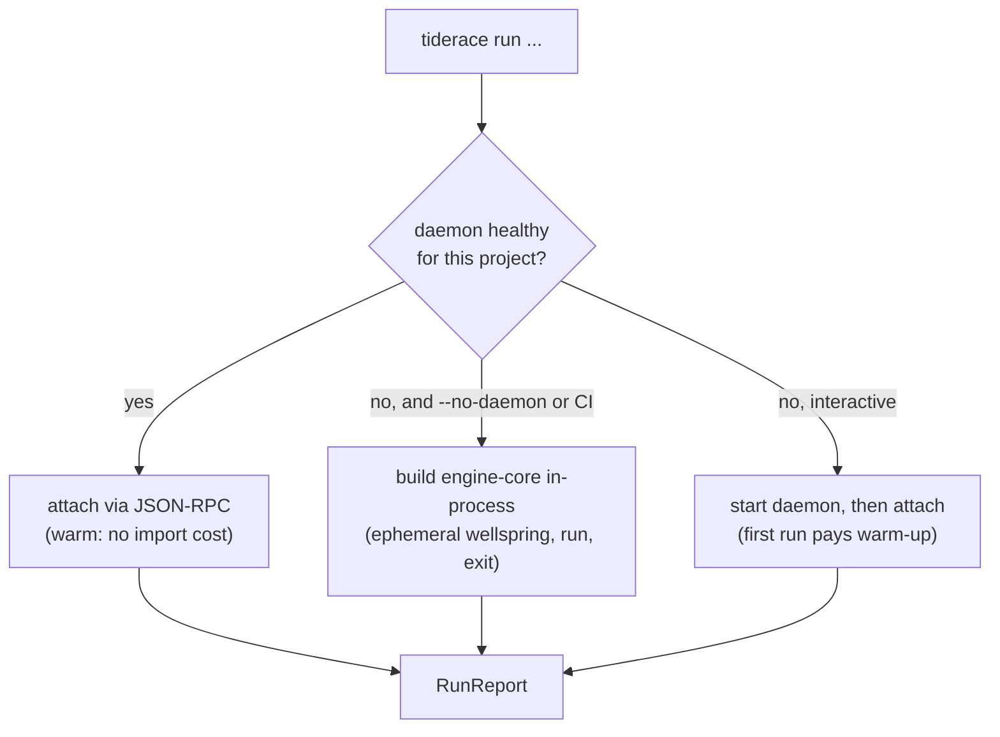

# 08 — Daemon (The Warm Test Server)

> **Status:** ✅ draft for discussion
> Prereq: [00-vision](00-vision.md), [01-architecture](01-architecture.md),
> [02-domain-model](02-domain-model.md).
> Reads from: [03-collection](03-collection.md), [05-execution-wellspring](05-execution-wellspring.md),
> [07-cache](07-cache.md), [11-coverage-impact](11-coverage-impact.md),
> [12-plugin-host](12-plugin-host.md), [13-cross-cutting](13-cross-cutting.md).
> ADRs: [ADR-E007](adr/ADR-E007-warm-daemon.md) (primary),
> [ADR-E003](adr/ADR-E003-fork-snapshot-isolation.md),
> [ADR-E004](adr/ADR-E004-content-addressed-cache.md),
> [ADR-E005](adr/ADR-E005-workspace-trait-seams.md),
> [ADR-E001](adr/ADR-E001-pure-rust-engine-no-pytest.md).

The daemon is the engine's **sub-100ms edit→result enabler** (vision G4). It is a long-lived
process that keeps the three expensive things *warm* between invocations — imported Python
([Wellspring(s)](05-execution-wellspring.md)), the [caches](07-cache.md), and
[collection state](03-collection.md) — and serves two clients over a local socket: the thin
[CLI](01-architecture.md) and an IDE/test-explorer. It generalizes today's `tiderace`
watch-mode [`WorkerPool`](#) (`pool.rs`) and [`watch_loop`](#) (`watcher.rs`) from a
watch-session-only pool into the engine's **normal** host ([ADR-E007](adr/ADR-E007-warm-daemon.md)).

Code lives in `crates/engine-daemon/`, a thin front-end over `engine-core` (the same library the
CLI uses — [ADR-E005](adr/ADR-E005-workspace-trait-seams.md) DIP seam). One type per file:
`daemon.rs` (lifecycle/state machine), `rpc_server.rs`, `rpc_method.rs`, `session.rs`
(per-project session = warm wellsprings + caches + collection state), `session_manager.rs`,
`fs_watcher.rs` (ports `watcher.rs`), `invalidator.rs`, `event_stream.rs`, `socket.rs`
(per-user, per-project, local-socket security), `health.rs`.

---

## 1. Why a daemon (and not just a warm pool)

The honest floor on inner-loop latency is set by three costs, each paid *once* and then held warm:

| Cost | Cold (pytest / `tiderace run`) | Warm daemon |
|---|---|---|
| Interpreter + project import | ~200ms–10s **every run** | paid **once** into the [Wellspring](05-execution-wellspring.md); forks are ~ms ([ADR-E003](adr/ADR-E003-fork-snapshot-isolation.md)) |
| Collection (scan + build `TestItem`s) | re-scan whole tree every run | incremental — re-scan only changed files ([03-collection](03-collection.md)) |
| Cache index open + warm | open SQLite, cold page cache | held open, hot in RSS ([07-cache](07-cache.md)) |
| Impact graph | rebuilt from disk | held in memory, patched per edit ([11-coverage-impact](11-coverage-impact.md)) |

The old `pool.rs` kept workers warm only *inside* a `tiderace watch` session; ad-hoc
`tiderace run` and IDE "run this test" actions paid every cost cold. ADR-E007's decision is to
make warmth the default by hoisting that state into a process that **outlives any single client
invocation** and that **any client can attach to**. The CLI becomes a thin RPC client that
transparently starts-or-reuses the daemon; an IDE attaches to the same daemon and shares its warm
state for free.

> **The latency budget (target, validated by the de-risking spike).** For a one-file edit on a
> warm daemon: FS event → debounce ≤ engine's quiet window; diff + invalidate ≈ µs–low-ms (hash a
> few files); impact query ≈ sub-ms (in-memory graph); cache check ≈ sub-ms per test
> (hot SQLite); the only Python work is `fork()` + run of the *impacted, non-cached* tests. With a
> small blast radius, total wall-clock lands **well under 100ms** — the bulk of which is the
> forked test bodies themselves, not engine overhead.

---

## 2. Component diagram — daemon internals

The daemon is a small I/O shell around `engine-core`. It owns the **RPC server**, the **FS
watcher**, an **invalidator**, an **event stream**, and a **session manager**; each per-project
`Session` owns the warm `engine-core` state (Wellspring(s), caches, collection state, orchestrator).



**Boundary discipline.** Everything in the right-hand cluster (`RunOrchestrator`, `WellspringManager`,
`Cache`, `ImpactAnalyzer`, `CollectionState`) is `engine-core` — identical to what the CLI drives
in-process. The daemon adds only the *shell*: socket, RPC, watch, invalidate, stream. This is the
[ADR-E005](adr/ADR-E005-workspace-trait-seams.md) two-front-ends-one-core split, and it is why a
one-shot CLI run can [fall back to an ephemeral in-process engine](#7-ephemeral-in-process-fallback)
with zero behavioral divergence.

---

## 3. The edit→result loop (sequence)

This is the hot path G4 exists for: a file save turns into streamed results in the IDE without
re-importing, re-collecting the whole tree, or re-running cached tests.

```mermaid
sequenceDiagram
    autonumber
    actor Dev as 👤 Developer
    participant Ed as 🧩 IDE / Editor
    participant W as FsWatcher
    participant Inv as Invalidator
    participant S as Session (warm)
    participant Imp as ImpactAnalyzer
    participant Ca as Cache
    participant Z as WellspringManager
    participant F as Fork workers
    participant Ev as EventStream

    Note over Ed,Z: Daemon already Ready: wellspring imported, cache hot, collection in memory
    Dev->>Ed: save test_auth.py
    Ed-->>Z: (no IDE round-trip needed; daemon watches FS)
    W->>W: debounce (quiet window)
    W->>Inv: ChangeBatch{ test_auth.py }

    Inv->>Inv: diff: content-hash changed files (07)
    Inv->>Inv: classify → ModuleEdit (not conftest/config)
    Inv->>S: InvalidationPlan{ invalidate module by hash; keep wellspring }
    S->>S: CollectionState.rescan(changed) → CollectionDelta

    Note over Inv,S: conftest/config/C-level change would instead force RECYCLE — see §5
    S->>Imp: impacted_by(ChangeSet{ test_auth.py, hash })
    Imp-->>S: { 6 impacted NodeIds } (rest provably unaffected)

    loop per impacted NodeId
        S->>Ca: get(CacheKey)
        alt cache hit (closure unchanged)
            Ca-->>S: CachedOutcome
            S->>Ev: RunEvent::Result{ served_from_cache=true }
        else miss
            S->>Z: fork_at(deepest snapshot for ScopePath)
            Z-->>F: COW child (warm interpreter)
            F->>F: run body (one test, isolated)
            F-->>S: TestResult (+ observed InputClosure)
            S->>Ca: put(CacheKey, outcome)
            S->>Ev: RunEvent::Result{ served_from_cache=false }
        end
    end
    Ev-->>Ed: stream RunEvent::Result × N (as they finish)
    S->>Ev: RunEvent::RunFinished{ RunReport }
    Ev-->>Ed: RunFinished → IDE paints gutter icons
    Note over W,Ev: warmth (no import) + cache (skip unchanged) + impact (skip unaffected) ⇒ sub-100ms
```

**Why each lever matters here:**
- **Warmth** ([ADR-E003](adr/ADR-E003-fork-snapshot-isolation.md)): no interpreter start, no
  project import — the impacted tests `fork()` from an already-imported snapshot in ~ms.
- **Cache** ([ADR-E004](adr/ADR-E004-content-addressed-cache.md)): of the impacted set, only tests
  whose [`InputClosure`](02-domain-model.md) actually changed are forked; the rest are served from
  the hot local cache.
- **Impact** ([11-coverage-impact](11-coverage-impact.md)): of *all* tests, only those whose
  executed-source closure touches the edited file are even considered — the blast radius, not the
  suite.

The orchestrator enforces the vision's preference order (**cache hit → impact-skip → run**,
[01-architecture](01-architecture.md) §3) unchanged; the daemon just keeps every input to that
decision warm.

---

## 4. Daemon lifecycle (state machine)

The daemon is a stateful long-lived process; its correctness rests on never serving results from a
stale warm state. The states below are owned by `Daemon` (`daemon.rs`); each `Session` carries a
mirrored, finer-grained `SessionState` so per-project recycling does not stall the whole daemon.

```mermaid
stateDiagram-v2
    direction LR
    [*] --> Starting

    Starting --> Warming: socket bound, session created
    note right of Starting
        bind per-user/per-project local socket (§6),
        open cache index, build collection state
    end note

    Warming --> Ready: wellspring imported project (layer 1+)
    note right of Warming
        import the world ONCE into the wellspring
        (ADR-E003 layers 0–1); snapshot session fixtures lazily
    end note

    Ready --> Running: run / runImpacted request
    Running --> Ready: RunReport streamed, cache written

    Ready --> Invalidating: FS change (module edit)
    Running --> Invalidating: FS change mid-run (queued)
    Invalidating --> Ready: hash-invalidate module(s) + rescan; wellspring kept
    Invalidating --> Recycling: conftest / config / C-level / import-graph change

    Recycling --> Warming: tear down stale wellspring(s), re-import clean
    note right of Recycling
        the classic stale-import failure mode:
        a partially-mutated interpreter is NEVER reused — recycle (§5)
    end note

    Ready --> Stopping: shutdown RPC / idle TTL / SIGTERM
    Running --> Stopping: shutdown (drain in-flight, then exit)
    Invalidating --> Stopping: shutdown
    Stopping --> [*]: kill fork process-groups, flush cache, unlink socket
```



**Lifecycle operations exposed to clients / supervisor:**

| Operation | Trigger | Behavior |
|---|---|---|
| **start** | CLI/IDE finds no live daemon for the project | Spawn detached; `Starting → Warming → Ready`. The first client blocks on a readiness handshake (the same pattern as `pool.rs`'s `ready` line, generalized to RPC). |
| **reuse** | CLI/IDE finds a healthy socket | Attach; no warming cost. Liveness is proven by a `health` ping, not by the socket file's mere existence (stale-socket guard, §6). |
| **health** | `health` RPC / supervisor probe | Returns `HealthStatus{ state, sessions, rss_bytes, wellspring_age, cache_hit_rate }`. Used for memory-bound recycling and stale-daemon detection. |
| **stop** | `shutdown` RPC, idle TTL, or `SIGTERM` | `Stopping`: stop accepting requests, drain in-flight runs (bounded), `kill_tree` every fork process-group (carries `procutil` forward), flush cache index, unlink the socket. |
| **idle eviction** | per-`Session` idle > TTL | `SessionManager.evict_idle` drops a project's warm state to reclaim RSS; the daemon stays up for other projects. A re-attach re-warms that session only. |

**Memory bounds.** A long-lived warm interpreter grows RSS (COW write amplification under heavy
forking — [ADR-E003](adr/ADR-E003-fork-snapshot-isolation.md)). The daemon recycles a wellspring after
a configurable age/request count (the generalization of `pool.rs`'s `MAX_WORKER_REQUESTS = 500`)
and bounds concurrent forks by available memory, not just CPU.

---

## 5. Robust module invalidation (the stale-import failure mode)

This is the single most dangerous part of any warm test host and the explicit ➖ in
[ADR-E007](adr/ADR-E007-warm-daemon.md): **a warm interpreter that has imported user code can serve
results from a stale module**, silently passing a test the user just broke (or vice-versa). pytest
sidesteps this by re-importing the world every run; we cannot afford that, so we invalidate
*surgically* and **recycle when surgery is unsound**.

The `Invalidator` classifies every change by what it can safely reuse:



**The two invalidation regimes:**

1. **Invalidate-in-place (keep the wellspring).** A plain test/impl module edit changes only that
   module's bytecode and source closure. We:
   - recompute the file's **content hash** (the SHA-256 hasher ports forward from `hasher.rs`),
   - drop the module from the wellspring's import cache so the next `fork()` re-imports the fresh
     version (the same `invalidate` list the old `pool.rs` already threaded to `worker.py`,
     generalized),
   - `CollectionState.rescan(changed)` to pick up added/removed/renamed tests in that file,
   - and let the [cache key](07-cache.md) change naturally — the new content hash flows into every
     dependent test's `InputClosure`, so cache simply misses for exactly the affected tests.

2. **Recycle (tear down and re-import).** Some changes mutate state that lives *outside* a single
   module's namespace and cannot be cleanly evicted from a running interpreter:
   - **`conftest.py`** — defines fixtures/hooks consumed across many modules; re-importing it into a
     warm interpreter leaves stale fixture closures bound to old objects. **Recycle.**
   - **config** (`pyproject.toml`, plugin enable/disable, env-affecting settings) — changes the
     engine's and substrate's interpretation of the whole tree. **Recycle.**
   - **C-level / native state** — a reimported C-extension, a process-global mutated at import
     time, `sys.modules` surgery: the interpreter is no longer a faithful copy of a clean import.
     **Recycle.**
   - **import-graph edges** — a new/deleted module or a changed import statement alters the
     dependency closure; we rescan and patch the [impact](11-coverage-impact.md) graph, and recycle
     if the edge feeds the wellspring's already-imported set.

   Recycling is the `Invalidating → Recycling → Warming` path in [§4](#4-daemon-lifecycle-state-machine):
   the stale wellspring is killed (process-group), a fresh one re-imports the clean tree, and *no result
   is ever served from a partially-mutated interpreter*. This is the design's hard answer to the
   classic warm-daemon stale-import bug — **when in doubt, recycle**; correctness outranks the few
   hundred ms of re-warm.

> **Why hash, not mtime.** [ADR-E004](adr/ADR-E004-content-addressed-cache.md) is explicit that
> mtime ≠ content; an editor save with no textual change (whitespace-only reflow, touch) must not
> invalidate. Invalidation keys on the same content hash the cache keys on, so the watcher and the
> cache can never disagree about whether a file "changed."

---

## 6. Security & scoping (per-project, per-user, local-socket-only)

The daemon holds a warm interpreter that can execute arbitrary project code and a cache that can
return precomputed results — both must be reachable **only** by the user who owns the project.

| Control | Mechanism |
|---|---|
| **Transport** | A **local socket only** — Unix domain socket on Linux/macOS (named pipe on the future Windows fallback). **No TCP, no network listener**, ever. There is no remote attack surface. |
| **Per-user** | Socket lives under the user's runtime dir (`$XDG_RUNTIME_DIR/riptide/` or equivalent), created `0700`/socket `0600`, owned by the invoking uid. The server verifies peer credentials (`SO_PEERCRED`/`LOCAL_PEERCRED`) and refuses any uid ≠ owner. |
| **Per-project** | One `Session` per project root, keyed by a canonicalized `ProjectKey` (resolved real path + interpreter fingerprint). The socket path is derived from a hash of that key, so two projects (or two virtualenvs of one project) never share warm state — and a client cannot address another project's session. |
| **Stale-socket guard** | A leftover socket from a crashed daemon is detected (connect fails / `health` times out) and **replaced**, never silently trusted. The PID + start-time is recorded in a lock file so a client can distinguish "alive," "crashed," and "different daemon." |
| **No privilege escalation** | The daemon runs as the invoking user with no setuid/setgid; it inherits the user's environment and venv. It is not a system service and registers no global listener. |

The [remote cache](07-cache.md) ([ADR-E004](adr/ADR-E004-content-addressed-cache.md)) is the *only*
network participant, and it is reached **outbound** by `engine-core`'s `RemoteCache` — the daemon
itself never accepts an inbound network connection.

---

## 7. Ephemeral in-process fallback

[ADR-E007](adr/ADR-E007-warm-daemon.md): cold/one-shot use must still work without a daemon. Because
the CLI and daemon are two front-ends over the **same `engine-core`**
([ADR-E005](adr/ADR-E005-workspace-trait-seams.md)), the fallback is trivial and behaviorally
identical — it just skips the socket and the warm-reuse benefit.



- **`--no-daemon` / CI default.** A single `tiderace run` in CI typically wants a clean,
  reproducible, one-shot engine: build `engine-core` in-process, warm one ephemeral wellspring, run,
  write the (often **remote**) cache, exit. No persistent state, no socket. CI gets its speed from
  the [remote content-addressed cache](07-cache.md), not from a daemon.
- **Interactive default.** A developer's `tiderace run`/`watch` transparently starts-or-reuses the
  daemon so the *second* invocation is warm — this is the ADR-E007 "CLI becomes a thin client"
  outcome.
- **Identical semantics.** The orchestrator, cache, impact, and worker code paths are the same in
  both modes; only the *host* differs. This keeps the fallback honest (no "daemon-only" features)
  and the daemon testable (the same `engine-core` unit tests cover both).

---

## 8. Deployment (C4 — developer host vs CI host)

Per [01-architecture](01-architecture.md) §2 containers, refined into the two deployment shapes the
daemon serves.

```mermaid
graph TB
    subgraph devhost["💻 Developer host"]
        direction TB
        cli1["CLI (thin client)"]
        ide1["IDE / Test Explorer"]
        subgraph dproc["engine-daemon (long-lived)"]
            rpc1["JSON-RPC server<br/>(local socket, per-user/project)"]
            sess1["Session: orchestrator + impact<br/>+ warm collection state"]
            zy1["Wellspring(s)<br/>(CPython, imported once)"]
            fw1["Fork workers<br/>(one CPython per test, COW)"]
            shim1["py-shim"]
        end
        lstore[("Local cache<br/>content store + SQLite index")]
    end

    subgraph cihost["☁️ CI host (ephemeral)"]
        direction TB
        cli2["CLI: tiderace run --ci --no-daemon"]
        subgraph eproc["ephemeral in-process engine"]
            zy2["Wellspring (one-shot)"]
            fw2["Fork workers"]
            shim2["py-shim"]
        end
        lstore2[("Local cache (scratch)")]
    end

    rcache[("☁️ Remote content-addressed cache<br/>(shared across machines & CI shards)")]

    cli1 -->|JSON-RPC| rpc1
    ide1 -->|JSON-RPC discover/run/stream| rpc1
    rpc1 --> sess1
    sess1 --> zy1
    zy1 -.->|fork()| fw1
    fw1 --> shim1
    sess1 <--> lstore
    lstore <-->|get/put| rcache

    cli2 --> eproc
    zy2 -.->|fork()| fw2
    fw2 --> shim2
    eproc <--> lstore2
    lstore2 -->|get/put| rcache
```

- **Developer host:** the daemon is the warm hub; CLI and IDE are thin clients sharing one
  `Session` per project. The local cache is the inner-loop accelerator; the remote cache is
  optional and outbound only.
- **CI host:** no daemon by default (ephemeral, reproducible). CI's speedup comes from the
  **shared remote cache** — a green test another shard or a developer already ran is a free cache
  hit ([ADR-E004](adr/ADR-E004-content-addressed-cache.md)). A CI runner *may* opt into a daemon
  for a long multi-stage pipeline, but it is not the default.

---

## 9. JSON-RPC method surface & event streaming

The daemon speaks **JSON-RPC 2.0** over the local socket (LSP-style framing:
`Content-Length` header + JSON body), chosen so IDEs — which already speak JSON-RPC to language
servers — integrate with no new transport. Two interaction shapes: **request/response** for
queries and runs, and **server-pushed notifications** for streamed results.

### 9.1 Request/response methods

| Method | Params | Result | Notes |
|---|---|---|---|
| `discover` | `{ roots?, force_rescan? }` | `{ items: TestItem[], collection_revision }` | Returns the warm [collection](03-collection.md). Cheap on a hot session (served from `CollectionState`); triggers a rescan only if stale or `force_rescan`. The IDE's test tree. |
| `run` | `{ selection: NodeId[] \| Query, options }` | `RunReport` (also streamed) | Full run of an explicit selection or [selection query](13-cross-cutting.md). Honors **cache → impact-skip → run**. |
| `runImpacted` | `{ since?: ChangeSet, options }` | `RunReport` (also streamed) | Runs only tests impacted by changes since the given point (defaults to "since last run" using the warm impact graph). The edit→result fast path of [§3](#3-the-editresult-loop-sequence). |
| `subscribeResults` | `{ filter?: NodeId[] }` | `{ subscription: SubId }` | Opens a streaming subscription; the daemon pushes `riptide/result` and `riptide/runFinished` notifications (below). Unsubscribe via `unsubscribe` or socket close. |
| `health` | `{}` | `HealthStatus` | Liveness + warmth + RSS + cache-hit-rate. Used for reuse/recycle decisions and stale-daemon detection ([§6](#6-security--scoping-per-project-per-user-local-socket-only)). |
| `shutdown` | `{ mode: "graceful" \| "now" }` | `{ ok }` | `Stopping`: graceful drains in-flight runs then exits; `now` kills fork groups immediately. |

### 9.2 Server-pushed events (notifications)

Streaming is what makes the IDE feel live — results paint as each test finishes, not at the end.

| Notification | Payload | Fires when |
|---|---|---|
| `riptide/runStarted` | `{ run_id, total_selected, impacted, cache_candidates }` | A run is admitted; lets the IDE show a progress denominator. |
| `riptide/result` | `{ run_id, TestResult }` | Each test resolves — whether **served from cache** (`served_from_cache=true`) or freshly forked. Carries `Outcome`, `Duration`, and `RichDiff` on failure ([02-domain-model](02-domain-model.md)). |
| `riptide/runFinished` | `{ run_id, RunReport }` | The run completes; the IDE finalizes counts and exit disposition. |
| `riptide/invalidated` | `{ files, kind, recycled: bool }` | The watcher [invalidated](#5-robust-module-invalidation-the-stale-import-failure-mode) state (and whether a recycle happened) — lets the IDE mark affected tests "stale" instantly. |
| `riptide/collectionChanged` | `{ added, removed, collection_revision }` | A rescan changed the test set; the IDE refreshes its tree. |

> **Mapping to the [hook host](12-plugin-host.md).** These RPC notifications are produced by a
> daemon-side [`Reporter`](13-cross-cutting.md) subscribed to the engine's
> [`HookHost`](12-plugin-host.md) events (`on_run_start`, `on_test_finish`, `on_run_finish`). The
> daemon does not invent a parallel event system — it adapts the engine's existing hook stream onto
> the wire, so CLI output, IDE streaming, and plugins all observe the same events.

### 9.3 Concurrency & ordering

- A `Session` admits one logical **run at a time** per project (queued otherwise); within a run,
  fork workers execute in parallel (the `thread::scope` fan-out generalized from `pool.rs`), and
  `riptide/result` notifications are emitted in **completion order** with a `run_id` so a client can
  correlate. Multiple clients can `subscribeResults` to the same run.
- Frame safety carries forward from `pool.rs`: all `NodeId`s and payloads travel **inside** JSON
  (serde-escaped), so a crafted filename or test id can never forge a second protocol frame — the
  same newline-injection guard the existing pool unit-tests assert.

---

## 10. What ports forward from `tiderace`

| Today (`tiderace`) | In the daemon | Change |
|---|---|---|
| `pool.rs` `WorkerPool` (warm during `watch`) | `Session` + `WellspringManager` (warm always) | Generalized to fork-from-snapshot ([ADR-E003](adr/ADR-E003-fork-snapshot-isolation.md)); warmth is the default, not watch-only. |
| `pool.rs` `MAX_WORKER_REQUESTS`, kill+respawn on hang | wellspring age/request recycling + per-test fork timeout | Same robustness posture, hoisted to the daemon. |
| `pool.rs` readiness handshake + newline-injection guard | RPC readiness + serde-framed payloads | Same guarantees over JSON-RPC instead of NDJSON. |
| `watcher.rs` `watch_loop`, debounce, ignore rules | `FsWatcher` | Ported nearly verbatim (ignore `__pycache__`/`.git`/`.venv`/state; `.py`-only; debounced batch). |
| `watcher.rs` `invalidate` list → `worker.py` | `Invalidator` (hash-classify → in-place vs recycle) | Hardened: classifies conftest/config/C-level for **recycle** vs plain-module **invalidate-in-place** (§5). |

---

## 11. Invariants the daemon must honor

1. **Never serve a result from a stale interpreter.** Any change the `Invalidator` cannot prove is
   a clean in-place module swap forces a **recycle** ([§5](#5-robust-module-invalidation-the-stale-import-failure-mode)).
2. **Warmth is an optimization, never a semantic.** A daemon run and the
   [ephemeral fallback](#7-ephemeral-in-process-fallback) must produce identical `RunReport`s for
   the same inputs; the daemon adds no behavior the CLI lacks.
3. **No network listener, ever.** Local socket only, per-user, per-project
   ([§6](#6-security--scoping-per-project-per-user-local-socket-only)); the only network I/O is the
   outbound [remote cache](07-cache.md).
4. **Bounded resources.** Wellsprings recycle by age/request-count; fork concurrency is memory-bounded;
   idle sessions are evicted ([§4](#4-daemon-lifecycle-state-machine)).
5. **One core, two front-ends.** All run logic lives in `engine-core`; `engine-daemon` is shell
   only ([ADR-E005](adr/ADR-E005-workspace-trait-seams.md)).
</content>
</invoke>
