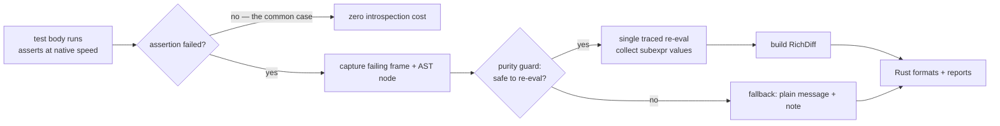
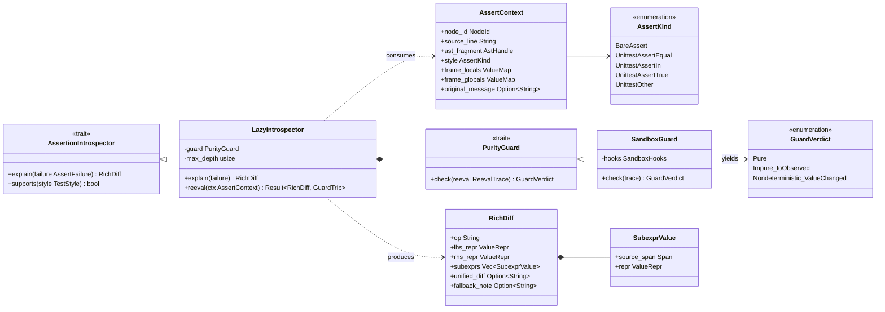

# 09 — Assertions (Lazy Introspection & Rich Diffs)

> **Status:** ✅ draft for discussion
> Prereqs: [00-vision](00-vision.md), [01-architecture](01-architecture.md), [02-domain-model](02-domain-model.md).
> Gated by: [ADR-E009](adr/ADR-E009-lazy-assertion-introspection.md) (lazy introspection, not import-time rewrite),
> [ADR-E001](adr/ADR-E001-pure-rust-engine-no-pytest.md) (own the framework),
> [ADR-E002](adr/ADR-E002-execution-substrate.md) (subprocess + shim — where Python `ast` lives).
> Related: [10-test-styles](10-test-styles.md) (pytest vs unittest contract).

Rich assertion failure output — the structured `assert a == b` diff — is pytest's signature UX and
a non-negotiable adoption gate (G5, [00-vision](00-vision.md)). pytest produces it by **rewriting
every `assert` statement's AST at import time**, paying a cost on *all* asserts whether or not they
fail. Since we own the framework ([ADR-E001](adr/ADR-E001-pure-rust-engine-no-pytest.md)) and fork
per test ([ADR-E003](adr/ADR-E003-fork-snapshot-isolation.md)), we choose a different point on the
cost curve: **run asserts at native Python speed, introspect only on failure**
([ADR-E009](adr/ADR-E009-lazy-assertion-introspection.md)).

This document covers the lazy-introspection mechanism, the split of work between the Rust
orchestrator and the Python shim, the purity guard that protects against re-evaluating side-
effecting expressions, the graceful fallback to a plain message, and how a single
`AssertionIntrospector` serves **both** bare `assert` (pytest-style) and `unittest`
`self.assert*` failures uniformly.

---

## 1. The lazy model



The happy path — the overwhelming majority of assertion executions — costs **nothing extra**. Only
a *failing* assertion triggers the re-evaluation machinery. This is the inverse of pytest's
trade-off: pytest taxes every passing assert to make failures rich; we make failures rich without
taxing passes.

---

## 2. Where the work lives — Rust orchestrator vs Python shim

Per [ADR-E002](adr/ADR-E002-execution-substrate.md), Python's `ast`/`compile`/`eval` only exist in
the substrate, so the introspector is **split**:

| Stage | Side | Why |
|---|---|---|
| Detect failure (`AssertionError` / `self.assert*` raise) | **shim** | the exception surfaces in the test process |
| Capture frame, source line, locals/globals snapshot | **shim** | needs the live Python frame + `ast` |
| Re-evaluate the failing node with subexpression tracing | **shim** | needs `ast` + `eval` |
| Purity guard (compare re-eval vs original, watch for I/O) | **shim** (decision) + **Rust** (policy) | shim observes; Rust owns the policy/threshold |
| Build the structured `RichDiff` value | **shim** assembles → **Rust** owns the type | `RichDiff` is a domain type ([02-domain-model](02-domain-model.md)) |
| Format `RichDiff` for terminal/JSON/JUnit | **Rust** ([13-reporting](13-cross-cutting.md)) | reporters are Rust traits |

The shim stays "dumb on purpose" ([01-architecture](01-architecture.md)): it captures and re-
evaluates, but the *policy* (is this pure enough to trust? how deep to recurse? when to fall back?)
is Rust's. The shim ships the raw `AssertContext` and proposed `RichDiff` back over the binary pipe;
Rust decides and formats.

---

## 3. Uniform handling of pytest `assert` and unittest `self.assert*`

A single `AssertionIntrospector` covers both styles ([ADR-E009](adr/ADR-E009-lazy-assertion-introspection.md),
[10-test-styles](10-test-styles.md)):

- **Bare `assert expr`** (pytest-style, also valid inside any function) → raises `AssertionError`.
  The introspector locates the `Assert` AST node at the raising line and re-evaluates `expr`.
- **`unittest` `self.assertEqual(a, b)`** (and siblings) → on failure stdlib raises
  `self.failureException` (an `AssertionError` subclass). The introspector recognizes the
  `self.assert*` call node, maps the method to a comparison shape (`assertEqual` → `==`,
  `assertIn` → `in`, `assertTrue` → truthiness, …), and re-evaluates the **argument expressions**.

The payoff: a plain `assert order.total() == 0` written **inside** a `unittest.TestCase` gets a rich
diff — something stock `unittest` never provides — because we drive the method contract ourselves
and intercept the failure uniformly. Both paths converge on the same `RichDiff` and the same
reporters.

---

## 4. The purity / nondeterminism guard

Re-evaluating an assertion expression can re-trigger side effects (`assert queue.pop() == x`
mutates the queue) or yield a different value (`assert time.time() < deadline`). The guard
([ADR-E009](adr/ADR-E009-lazy-assertion-introspection.md)) protects against producing a misleading
or harmful diff:

1. **Single traced re-eval.** The expression is re-evaluated exactly once with a tracing evaluator
   that records each subexpression's value (no repeated evaluation that would compound side
   effects).
2. **Reproduction check.** The top-level boolean result of the re-eval must still be falsy. If the
   re-eval now *passes* (value differs), the expression is nondeterministic → **fall back**.
3. **I/O / impurity watch.** During re-eval the shim watches for observable side effects (fs,
   network, clock, RNG reads) using the same sandbox hooks the cache soundness layer uses
   ([ADR-E004](adr/ADR-E004-content-addressed-cache.md) / [07-cache](07-cache.md)). Any tripped
   hook → **fall back**.
4. **Fallback.** On any guard trip, emit the **plain assertion message** (the original
   `AssertionError` args, or unittest's `msg`) plus a short note:
   *"rich diff suppressed — expression appears impure/nondeterministic."* Never a silent wrong
   answer.

The guard reuses the sandbox observation machinery rather than reinventing impurity detection,
keeping one definition of "impure" across caching and introspection.

---

## 5. Classifier diagram — assertion subsystem



`AssertContext` and the raw `ReevalTrace` are assembled in the **shim** (Python `ast`); `RichDiff`,
`PurityGuard` policy, and formatting are **Rust**. The `Worker` holds an `AssertionIntrospector`
exactly as shown in the master diagram ([01-architecture](01-architecture.md), §5).

> `RichDiff`, `SubexprValue`, and `ValueRepr` are domain types **owned by**
> [02-domain-model](02-domain-model.md); their canonical field shape is defined there and matches
> the diagram above (single source of truth for vocabulary).

---

## 6. Sequence — failure → capture → re-eval → RichDiff (with fallback branch)

```mermaid
sequenceDiagram
    autonumber
    participant Body as Test body (child)
    participant Shim as py-shim (ast/eval)
    participant Guard as PurityGuard (sandbox hooks)
    participant Rust as Rust orchestrator
    participant Rep as Reporter

    Body->>Body: assert order.total() == expected
    Body-->>Shim: raises AssertionError (or self.failureException)
    Shim->>Shim: capture frame, source line, locals/globals
    Shim->>Shim: parse line -> AST; locate failing node
    Shim->>Shim: classify AssertKind (BareAssert / Unittest*)
    Shim->>Shim: single traced re-eval, recording subexpr values

    Shim->>Guard: check(ReevalTrace)
    alt expression is pure & reproduces falsy
        Guard-->>Shim: Pure
        Shim->>Rust: AssertContext + proposed RichDiff (subexprs)
        Rust->>Rust: finalize RichDiff (op, lhs/rhs repr, unified diff)
        Rust->>Rep: on_result(TestResult{ rich_diff })
        Rep-->>Rust: formatted rich failure
    else impure / nondeterministic
        Guard-->>Shim: Impure_IoObserved | Nondeterministic_ValueChanged
        Shim->>Rust: AssertContext + original_message + GuardVerdict
        Rust->>Rust: RichDiff{ fallback_note: "rich diff suppressed — impure" }
        Rust->>Rep: on_result(TestResult{ plain message + note })
        Rep-->>Rust: formatted plain failure
    end
```

---

## 7. Comparison vs pytest's import-time rewrite (perf trade-off)

| Dimension | pytest (import-time AST rewrite) | Tiderace (lazy introspection, [ADR-E009](adr/ADR-E009-lazy-assertion-introspection.md)) |
|---|---|---|
| **When cost is paid** | every `assert`, on every run, pass or fail | only on a **failing** assert |
| **Import path** | rewrites + writes a modified `.pyc` for each module | untouched — cleaner for the wellspring import ([ADR-E003](adr/ADR-E003-fork-snapshot-isolation.md)) |
| **Happy-path overhead** | nonzero (recorded subexpressions even when green) | **zero** |
| **Re-eval hazard** | none (values captured during original eval) | side-effecting asserts — handled by the purity guard + fallback (§4) |
| **unittest `self.assert*`** | not rewritten — no rich diff | **rich diff**, uniform with bare `assert` (§3) |
| **bare `assert` in `unittest.TestCase`** | only if pytest rewrote that module | **rich diff** (we own the contract) |

The trade we accept ([ADR-E009](adr/ADR-E009-lazy-assertion-introspection.md)): we move the cost
from *every assert* to *only failing asserts*, in exchange for a re-evaluation hazard on impure
expressions — which the purity guard converts into a graceful, clearly-labeled fallback rather than
a wrong answer. For the common suite where green vastly outnumbers red, this is strictly faster *and*
richer (covering unittest, which pytest's rewrite does not). The optional future escape hatch — a
**cached per-file targeted rewrite** in Rust for hot files where re-eval is unsafe — stays available
behind the same `AssertionIntrospector` trait if the guard's fallback fires too often
([ADR-E009](adr/ADR-E009-lazy-assertion-introspection.md) revisit trigger).

---

## 8. Open questions

- **A1** — Re-eval depth: how deep into nested calls/comprehensions do we recurse before truncating
  `subexprs` for readability vs completeness?
- **A2** — Should the cached per-file rewrite be auto-promoted per-file when the guard trips N times
  on the same node, or stay a global opt-in? (ties to [ADR-E009](adr/ADR-E009-lazy-assertion-introspection.md) revisit)
- **A3** — Custom `unittest` assertion methods (user subclasses adding `assertX`) — map heuristically
  to a comparison shape, or fall back to plain message by default?
- **A4** — Sharing the sandbox-hook instance between the cache impurity detector and the purity
  guard within one child without double-counting observations. (→ [07-cache](07-cache.md))
