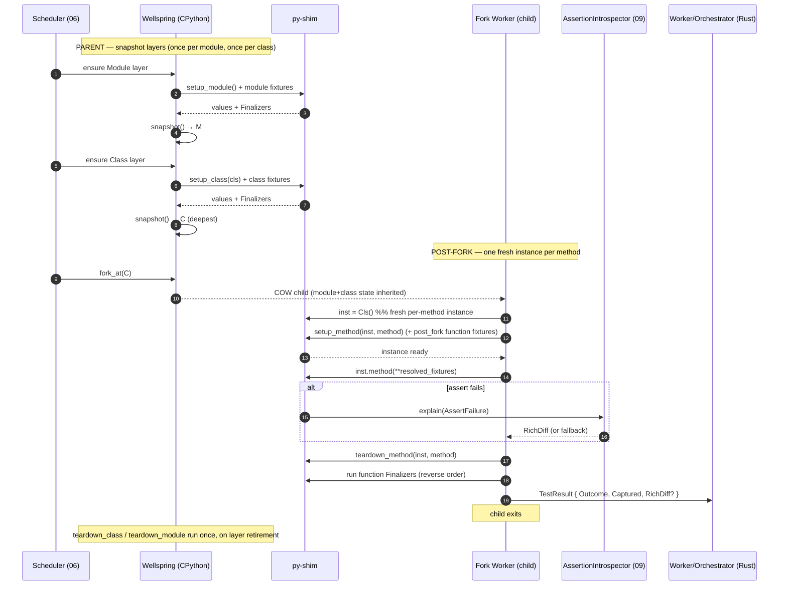

# 10 — Test Styles (Per-Style Execution Protocols: pytest fn/class + unittest.TestCase)

> **Status:** ✅ draft for discussion
> Prereqs: [00-vision](00-vision.md), [01-architecture](01-architecture.md), [02-domain-model](02-domain-model.md).
> Gated by: [ADR-E001](adr/ADR-E001-pure-rust-engine-no-pytest.md) (own the framework; drive stdlib
> `unittest.TestCase.run()` at method granularity), [ADR-E003](adr/ADR-E003-fork-snapshot-isolation.md)
> (fork-from-snapshot; scopes = snapshot layers), [ADR-E002](adr/ADR-E002-execution-substrate.md)
> (subprocess + shim), [ADR-E009](adr/ADR-E009-lazy-assertion-introspection.md) (lazy introspection).
> Builds on: [03-collection](03-collection.md) (how each style is *recognized*),
> [04-fixture-graph](04-fixture-graph.md) (the `FixturePlan`/`ScopeLayer` machinery this doc *spends*),
> [09-assertions](09-assertions.md) (the `AssertionIntrospector` all three styles route through).

This is the document that proves the central claim of [ADR-E001](adr/ADR-E001-pure-rust-engine-no-pytest.md):
we run **both** pytest suites (function- and class-based) **and** `unittest.TestCase` suites
**without pytest and without the unittest *runner*** underneath. The engine owns scheduling,
fixtures, scopes, caching and reporting; the only Python that ever runs is the user's body plus
the tiny [shim](01-architecture.md). The hard part is the *division of labour* per
[`TestStyle`](02-domain-model.md): which setup is baked into a parent **wellspring snapshot layer**
([04 §4](04-fixture-graph.md), [ADR-E003](adr/ADR-E003-fork-snapshot-isolation.md)) and what runs in
the **post-fork child** for each of `PytestFunction`, `PytestClassMethod`, and `UnittestMethod`.

The [Worker](05-execution-wellspring.md) switches on `TestStyle` at exactly one point — invoking the
body — exactly as [02 §7](02-domain-model.md) specifies. Everything *upstream* (collection, graph,
scheduler, cache) and *downstream* (`TestResult`, `Outcome`, `RichDiff`, reporters) is
style-agnostic. This doc only describes the switch and its consequences.

---

## 1. The three protocols at a glance

All three protocols share the same skeleton — *wider scopes are snapshot layers in the wellspring
lineage; the function-scope tail runs in the forked child* — and differ only in **what the shim
calls** to invoke the body and **who owns the per-instance lifecycle hooks**.

| `TestStyle` | Body invocation (shim) | Per-instance lifecycle owner | Wider-scope lifecycle owner |
|---|---|---|---|
| `PytestFunction` | `module.func(**fixtures)` | the `FixtureGraph` (function fixtures, autouse) | the `FixtureGraph` (class/module/session fixtures) → snapshot layers |
| `PytestClassMethod` | `inst = Cls(); inst.method(**fixtures)` | `setup_method`/`teardown_method` + function fixtures (post-fork) | `setup_class`/`setup_module` + class/module fixtures → snapshot layers |
| `UnittestMethod` | `case = Cls(method_name); case.run(OurResult())` | **stdlib** `setUp`/`tearDown`/`addCleanup`/`doCleanups` (inside `TestCase.run`) | **the engine** orchestrates `setUpClass`/`setUpModule` → snapshot layers |

The load-bearing asymmetry is the last column for `UnittestMethod`: stdlib's `TestCase.run()`
runs `setUp`/`tearDown` **per method** but does **not** run `setUpClass`/`setUpModule` — in stock
unittest those are driven by `TestSuite`/`TestLoader`, which we have **replaced** with our
scheduler + wellspring ([ADR-E001](adr/ADR-E001-pure-rust-engine-no-pytest.md)). So we must call the
class/module fixtures ourselves, and we place them exactly where the performance model wants
them: in snapshot layers ([04 §4](04-fixture-graph.md)).

---

## 2. Scope → snapshot-layer vs post-fork mapping (all three styles)

This is the single mapping table the [Worker](05-execution-wellspring.md) and
[FixtureGraph](04-fixture-graph.md) agree on. "Snapshot layer" means *set up once in the wellspring
lineage and frozen via COW* ([ADR-E003](adr/ADR-E003-fork-snapshot-isolation.md)); "post-fork"
means *run in each forked child after `fork_at(fork_from.snapshot)`* ([04 §4.1](04-fixture-graph.md)).

| `Scope` | `PytestFunction` | `PytestClassMethod` | `UnittestMethod` | Layer |
|---|---|---|---|---|
| **Session** | session fixtures | session fixtures | `setUpModule` of the root package? (no — module-only) + session fixtures via compat | snapshot `S` (Layer 2) |
| **Package** | package fixtures (`conftest`) | package fixtures | package-level compat fixtures | snapshot `P` (Layer 2.5) |
| **Module** | module fixtures | module fixtures + `setup_module` | **`setUpModule`** (engine-driven) + module fixtures | snapshot `M` (Layer 3) |
| **Class** | — (no class) | class fixtures + **`setup_class`** | **`setUpClass`** (engine-driven) | snapshot `C` (Layer 4, deepest) |
| **(fork boundary)** | `fork_at(deepest)` | `fork_at(deepest)` | `fork_at(deepest)` | — |
| **Function (instance)** | function fixtures + autouse | per-method instance + `setup_method` + function fixtures | `TestCase(method)` instance + **`setUp`** (inside `run`) | **post-fork (child)** |
| **Body** | `func(**fixtures)` | `inst.method(**fixtures)` | `case.run(result)` | **post-fork (child)** |
| **Function teardown** | function finalizers (reverse order) | `teardown_method` + function finalizers | **`tearDown` + `doCleanups`** (inside `run`) | **post-fork (child)** |
| **Class/Module/Session teardown** | scope finalizers when layer retires | `teardown_class`/`teardown_module` + finalizers when layer retires | **`tearDownClass`/`tearDownModule`** (engine-driven) when layer retires | **on snapshot retirement** ([04 §1.1](04-fixture-graph.md)) |

Three invariants make this sound, all inherited from upstream docs:

1. **Snapshot layers only ever hold scope-wider-than-Function state** — guaranteed by the
   scope-monotonicity check ([04 §2.2](04-fixture-graph.md)): no narrower setup can leak into a
   frozen layer.
2. **The function-scope tail is the *only* thing that differs per test instance** — so it is the
   only thing that must run post-fork, which is what makes forking cheap.
3. **Teardown of a snapshotted layer runs once, on retirement, not per test** ([04 §1.1](04-fixture-graph.md))
   — including `tearDownClass`/`tearDownModule` for unittest, which the engine sequences because
   it owns the layer lifetime.

> **Why `setUpClass`/`setUpModule` map to snapshot layers and `setUp` does not.** Stdlib semantics:
> `setUpClass`/`tearDownClass` run *once per class*, `setUpModule`/`tearDownModule` *once per
> module*, `setUp`/`tearDown` *once per test method*. The per-class/per-module hooks are therefore
> exactly the "pay once, snapshot it" win ([04 §7](04-fixture-graph.md), vision principle #2); the
> per-method hooks are inherently per-instance and belong in the child. This maps unittest's class
> hierarchy onto the same fork layers as pytest's `Class`/`Module`-scope fixtures with no special
> casing downstream.

---

## 3. `PytestFunction` — fixture resolution + injection, run callable, plain-assert introspection

The default and most common style ([03 §4](03-collection.md)). The shim imports the module and
calls the function with the resolved fixture arguments by name; a bare `assert` that fails routes
through the [lazy introspector](09-assertions.md).

**Parent / snapshot work** ([04 §4](04-fixture-graph.md)): session → package → module fixtures in
the test's closure are set up once in the wellspring lineage and snapshotted (deepest is `M`).

**Post-fork / child work:** `fork_at(M)`; run `post_fork` = function-scope fixtures + autouse +
any `reinit_after_fork` resources ([04 §4.3](04-fixture-graph.md)); call `func(**fixtures)`; on
`AssertionError`, hand the failing frame to the `AssertionIntrospector` ([09 §3](09-assertions.md));
run function finalizers in reverse order; emit `TestResult`; child exits.

```mermaid
sequenceDiagram
    autonumber
    participant Sched as Scheduler (06)
    participant Zyg as Wellspring (CPython, imported once)
    participant Shim as py-shim
    participant Child as Fork Worker (child)
    participant Intro as AssertionIntrospector (09)
    participant Rust as Worker/Orchestrator (Rust)

    Note over Zyg: PARENT — snapshot layers (paid once)
    Sched->>Zyg: ensure Session/Module fixtures (FixturePlan.layers)
    Zyg->>Shim: call session→module fixtures (topo order)
    Shim-->>Zyg: values + register Finalizers
    Zyg->>Zyg: snapshot() → Watermark M (deepest)

    Note over Child: POST-FORK — per test, isolated
    Sched->>Zyg: fork_at(M)
    Zyg-->>Child: COW child (module/session state inherited)
    Child->>Shim: run post_fork (function fixtures + autouse + reinit_after_fork)
    Shim-->>Child: function values + child-local Finalizers
    Child->>Shim: module.func(**resolved_fixtures)
    alt assert passes (common path)
        Shim-->>Child: returned normally → raw Passed
    else assert fails
        Shim-->>Child: AssertionError (failing frame captured)
        Child->>Intro: explain(AssertFailure) [single traced re-eval, purity guard]
        Intro-->>Child: RichDiff (or fallback note)
    end
    Child->>Shim: run function Finalizers (reverse setup order)
    Child->>Rust: TestResult { Outcome, Captured, RichDiff? }
    Note over Child: child exits; pristine state discarded
    Note over Zyg: module/session Finalizers run once, on layer retirement
```

Outcome reporting: the raw pass/fail/skip from the shim becomes an [`Outcome`](02-domain-model.md);
`XFail` marks invert it at result-assembly time ([02 §8](02-domain-model.md)); a setup/fixture/import
exception is `Outcome::Error`, never `Failed`.

---

## 4. `PytestClassMethod` — per-method instance, setup/teardown_method post-fork, setup/teardown_class as snapshot layers

A `Test*` class **without** a `TestCase` base ([03 §4](03-collection.md)): a *namespace + Class-scope
fixture host*, **not** a unittest case. `self` is ignored for fixture injection; fixtures arrive by
parameter name exactly as for `PytestFunction`, plus the class-scoped ones.

The pytest *xunit-style* method hooks split cleanly across the fork boundary by their scope:

- `setup_module`/`teardown_module` (module scope) → **module snapshot layer** `M`.
- `setup_class`/`teardown_class` (class scope) → **class snapshot layer** `C` (deepest).
- `setup_method`/`teardown_method` (per-method) → **post-fork**, around each instance.
- A **fresh instance per method** (`inst = Cls()`) is created **post-fork** — distinct instances
  for distinct methods never share child memory, which is the isolation win for free.

**Parent / snapshot work:** `setup_module` + module fixtures → `M`; `setup_class` + class fixtures
→ `C` (deepest). The expensive once-per-class state is frozen.

**Post-fork / child work:** `fork_at(C)`; create the instance; run `setup_method(method)`; run
`post_fork` function fixtures; call `inst.method(**fixtures)`; on failure route through the
introspector; run `teardown_method`; run function finalizers; emit `TestResult`; exit.



---

## 5. `UnittestMethod` — drive stdlib `TestCase.run()` at method granularity

This is the proof that we ride the stdlib *case contract* without the stdlib *runner*. Per
[ADR-E001](adr/ADR-E001-pure-rust-engine-no-pytest.md) we replace `TestSuite`/`TestLoader`/
`TextTestRunner` with our scheduler + wellspring, but we do **not** reimplement `TestCase` — we drive
it directly, one method per child:

```python
# inside the shim, post-fork, for ONE UnittestMethod item:
case = TestClass(method_name)     # stdlib: binds the bound method to run
result = OurResult()              # our unittest.TestResult subclass (the only Python we add)
case.run(result)                  # stdlib runs setUp → test → tearDown → doCleanups
# read disposition off `result`, ship it back to Rust
```

`OurResult` is a thin `unittest.TestResult` subclass — the single piece of compat Python we
write. It overrides the `add*` callbacks (`addSuccess`, `addFailure`, `addError`, `addSkip`,
`addExpectedFailure`, `addUnexpectedSuccess`, `addSubTest`) to record dispositions into a
struct the shim serializes back over the binary pipe ([ADR-E002](adr/ADR-E002-execution-substrate.md)).
It does **no** printing and **no** orchestration — it is the unittest analogue of the old
`ResultCollector` in [`tiderace/worker.py`](#) (which read pytest reports the same way), carried
forward to a runner-less world.

### 5.1 What stdlib owns vs what the engine owns

| Concern | Owned by | Where it runs |
|---|---|---|
| `setUp` / `tearDown` | **stdlib** (`TestCase.run`) | post-fork (per method) |
| `addCleanup` / `doCleanups` | **stdlib** (`TestCase.doCleanups`, called by `run`) | post-fork (per method) |
| the test method body | **stdlib** (`TestCase.run` → `getattr(self, method)()`) | post-fork |
| `skipTest` / `@skip` / `@skipIf` / `@skipUnless` | **stdlib** raises `SkipTest`; read off `result.skipped` | post-fork (decision), Rust (mapping) |
| `@expectedFailure` | **stdlib** routes to `addExpectedFailure`/`addUnexpectedSuccess`; read off result | post-fork (decision), Rust (mapping) |
| `subTest` | **stdlib** routes each to `addSubTest`; we aggregate | post-fork (collect), Rust (aggregate) |
| `setUpClass` / `tearDownClass` | **the engine** (stdlib `TestCase.run` does **not** call these) | **snapshot layer `C`** / retirement |
| `setUpModule` / `tearDownModule` | **the engine** | **snapshot layer `M`** / retirement |
| ordering, isolation, parallelism, caching, reporting | **the engine** | scheduler + wellspring + cache + reporters |

The engine calls `TestClass.setUpClass()` / `setUpModule()` itself at the appropriate snapshot
layer (it is just a classmethod / module function the shim invokes), snapshots, then forks per
method. On layer retirement it calls `tearDownClass()` / `tearDownModule()` once — the same
finalizer-on-retirement path snapshotted pytest fixtures use ([04 §1.1](04-fixture-graph.md)). This
is the *only* place we re-create work that stock unittest's `TestSuite` would have done; everything
else is genuine stdlib.

### 5.2 Async unittest — `IsolatedAsyncioTestCase`

`unittest.IsolatedAsyncioTestCase` already encapsulates its own event-loop lifecycle: its
`run()`/`_callTestMethod` create and tear down a loop and `await` `asyncSetUp`/the coroutine
test/`asyncTearDown`. Because we drive `case.run(result)` unchanged, **async unittest works for
free** — the shim does not pick the loop, the stdlib case does. The domain's `is_async` flag
([02 §7](02-domain-model.md)) is still recorded by collection (the method is `async def`), but for
`UnittestMethod` it is informational: the stdlib case, not the shim, owns the loop. (For
`PytestFunction`/`PytestClassMethod` async, the shim *does* own the loop — see [05-execution](05-execution-wellspring.md).)

### 5.3 Rich diffs for `self.assert*` and bare `assert`

Because we intercept the failure uniformly ([09 §3](09-assertions.md)), a `self.assertEqual(a, b)`
*and* a bare `assert a == b` written inside a `TestCase` both get a `RichDiff` — something stock
unittest never provides. `OurResult.addFailure` hands the failing frame to the same
`AssertionIntrospector`; the introspector maps `assertEqual → ==`, `assertIn → in`, etc.
([09 §3](09-assertions.md)), and the purity guard + fallback apply identically.

```mermaid
sequenceDiagram
    autonumber
    participant Sched as Scheduler (06)
    participant Zyg as Wellspring (CPython)
    participant Shim as py-shim (+ OurResult)
    participant Child as Fork Worker (child)
    participant Case as stdlib TestCase.run()
    participant Intro as AssertionIntrospector (09)
    participant Rust as Worker/Orchestrator (Rust)

    Note over Zyg: PARENT — engine drives class/module hooks → snapshots
    Sched->>Zyg: ensure Module layer
    Zyg->>Shim: TestClass-module.setUpModule()  %% engine-driven (stdlib runner would)
    Shim-->>Zyg: done
    Zyg->>Zyg: snapshot() → M
    Sched->>Zyg: ensure Class layer
    Zyg->>Shim: TestClass.setUpClass()           %% engine-driven
    Shim-->>Zyg: done
    Zyg->>Zyg: snapshot() → C (deepest)

    Note over Child: POST-FORK — one method per child via stdlib run()
    Sched->>Zyg: fork_at(C)
    Zyg-->>Child: COW child (class/module state inherited)
    Child->>Shim: case = TestClass(method_name); result = OurResult()
    Child->>Case: case.run(result)
    Case->>Case: setUp() → test method → tearDown() → doCleanups()
    alt self.assert* or bare assert fails
        Case-->>Shim: addFailure(test, exc_info)
        Shim->>Intro: explain(AssertFailure) (AssertKind = Unittest*/BareAssert)
        Intro-->>Shim: RichDiff (or fallback note)
    else subTest / expectedFailure / skip
        Case-->>Shim: addSubTest / addExpectedFailure / addUnexpectedSuccess / addSkip
    end
    Shim->>Shim: read disposition off OurResult
    Shim->>Rust: TestResult { Outcome (+ aggregated subTests), RichDiff? }
    Note over Child: child exits
    Note over Zyg: tearDownClass / tearDownModule run once, on layer retirement
```

---

## 6. Disposition mapping — stdlib `TestResult` → engine `Outcome`

The shim reads dispositions off `OurResult` and the Rust side maps them to the closed
[`Outcome`](02-domain-model.md) enumeration. No new variants are invented ([02 §8](02-domain-model.md)).

| stdlib `TestResult` callback | Trigger | Engine `Outcome` |
|---|---|---|
| `addSuccess` | test method returned, no failure | `Passed` |
| `addFailure` | `self.failureException` (`AssertionError` subclass) raised | `Failed` (+ `RichDiff` via [09](09-assertions.md)) |
| `addError` | any non-`AssertionError` exception (incl. in `setUp`/`tearDown`/cleanup) | `Error` |
| `addSkip` | `SkipTest` / `@skip*` / `self.skipTest()` | `Skipped` |
| `addExpectedFailure` | `@expectedFailure` and the test failed | `XFail` |
| `addUnexpectedSuccess` | `@expectedFailure` but the test passed | `XPass` (→ `Error` if treated strict — see §7) |
| `addSubTest` (failed) | a `subTest` block failed | contributes a sub-failure; parent `Failed` if any sub failed (§7) |
| `addSubTest` (passed) | a `subTest` block passed | contributes a sub-pass; no standalone result |

This mirrors, and generalizes, the pytest-report→status mapping already shipping in
[`tiderace/worker.py`](#)'s `ResultCollector` (`setup`-fail → error, `call`-skip → skipped, etc.):
the same disposition-from-result-object approach, now reading stdlib `TestResult` instead of
pytest reports.

---

## 7. Boundary cases & compatibility

The honest boundary (vision §6 — "say so rather than over-claim"). Each row names what is
**supported** natively versus deferred to the staged **pytest-compat shim**
([ADR-E001](adr/ADR-E001-pure-rust-engine-no-pytest.md)).

| Boundary case | Behaviour | Native vs compat-shim |
|---|---|---|
| **`subTest`** (unittest) | One `TestCase.run()` may emit *many* `addSubTest` outcomes. We collect them into the single owning `TestItem`'s `TestResult`: parent is `Passed` iff all subs passed, else `Failed` carrying per-sub `RichDiff`s. One `NodeId`, one cache entry (sub-results are sub-records, not separate items — preserves the [02 §10](02-domain-model.md) one-id-one-result invariant). | **Native** (we read `addSubTest`). |
| **`expectedFailure`/`unexpectedSuccess`** (unittest) | `@expectedFailure` + fail → `XFail`; `@expectedFailure` + pass → `XPass`. Mirrors pytest `xfail`/`xpass` ([02 §8](02-domain-model.md)). | **Native.** Note: stdlib unittest has **no `strict`** concept; an unexpected success is just `unexpectedSuccess`. We map it to `XPass` and let config (`unittest_unexpected_success_is_error`) decide whether it fails the run, matching pytest `xfail(strict=True)` ergonomics without changing stdlib behaviour. |
| **`skip`/`skipIf`/`skipUnless`/`skipTest`** (unittest) | Read off `result.skipped` → `Outcome::Skipped` with reason. Class-level `@skip` short-circuits before the snapshot layer (no `setUpClass`). | **Native.** |
| **`addCleanup`/`doCleanups`** (unittest) | Entirely **stdlib** — `TestCase.run` calls `doCleanups`; we never touch the cleanup stack. Runs post-fork in the child. | **Native (stdlib owns it).** |
| **`setUpClass`/`setUpModule`** (unittest) | **Engine-driven** at snapshot layers `C`/`M` (stdlib's runner normally does this; `TestCase.run` does not). `tearDownClass`/`tearDownModule` run once on layer retirement. | **Native** — this is the [ADR-E001](adr/ADR-E001-pure-rust-engine-no-pytest.md) replacement of `TestSuite`. |
| **`IsolatedAsyncioTestCase`** (unittest) | Works unchanged: the stdlib case owns the event loop inside `run()` (§5.2). | **Native.** |
| **unittest parametrization gap vs pytest `@parametrize`** | unittest has **no** first-class parametrization. pytest `@pytest.mark.parametrize` expands to N `TestItem`s with distinct `NodeId`s pre-scheduling ([02 §6](02-domain-model.md), [03 §6](03-collection.md)); `subTest` is unittest's nearest analogue and is handled above as **sub-records under one id**, *not* as N items. Common third-party patterns (`parameterized`, `ddt`, `load_tests`-generated methods) appear to collection as **distinct `test*` methods** and collect normally. | **Native for distinct methods**; `subTest`-as-N-items is **explicitly not** supported (it is one item with sub-records — a deliberate boundary). |
| **`load_tests`** protocol (unittest) | A module's `load_tests(loader, tests, pattern)` reshapes a `TestSuite` *at load time* — but we have **replaced the loader**. Statically we still collect every `test*` method by source scan ([03](03-collection.md)); for suites whose membership is *only* knowable via `load_tests` (dynamically synthesized cases), the item is flagged `needs_import_finalize` ([03 §7](03-collection.md)) and materialized in the wellspring. Custom `load_tests` *filtering/ordering* is **ignored** (we own ordering/selection). | **Native for static methods**; dynamic `load_tests` membership via **wellspring finalize**; custom ordering/filtering is a **compat-shim item** (deferred). |
| **`usefixtures` cross-pollination** (`@pytest.mark.usefixtures` on a `unittest.TestCase`) | pytest lets you attach pytest fixtures to a `unittest.TestCase` via `@pytest.mark.usefixtures` / autouse. Natively we drive the stdlib contract, so pytest-fixture injection into a `TestCase` is **opt-in via the compat layer**: when present, the resolver builds those fixtures into `post_fork` and binds them to the instance *before* `case.run()`, leaving `setUp`/`tearDown` to stdlib. Plain fixture *arguments* on a `TestCase` method (pytest does not inject these either) remain unsupported. | **Compat-shim item** (staged) — `usefixtures` honored; positional fixture args on `TestCase` methods unsupported (matches pytest). |
| **bare `assert` inside `unittest.TestCase`** | Gets a `RichDiff` (§5.3) — strictly better than stock unittest. | **Native.** |
| **Mixed `Test*` name + `TestCase` base** | Base wins → `UnittestMethod` ([03 §4](03-collection.md), carried from `tiderace::collector::is_test_class`). | **Native.** |

---

## 8. Contracts for downstream docs

- The [Worker](05-execution-wellspring.md) reads `TestStyle` at exactly the body-invocation step and
  nowhere else; it consumes the `FixturePlan` ([04](04-fixture-graph.md)) verbatim for the
  snapshot-layer vs `post_fork` split. The §2 table is the authority for that split per style.
- `OurResult` (the `unittest.TestResult` subclass) and the per-style invocation snippets live in
  the [shim](01-architecture.md) (`crates/py-shim/shim.py`); they are the *only* style-specific
  Python. Everything else is Rust.
- All three styles converge on one [`TestResult`](02-domain-model.md)/[`Outcome`](02-domain-model.md)
  and one [`AssertionIntrospector`](09-assertions.md); reporters ([13-cross-cutting](13-cross-cutting.md))
  and the [cache](07-cache.md) never branch on style.
- `subTest` aggregation introduces a `SubResult` sub-record on `TestResult` (one id, many sub-rows);
  the [cache](07-cache.md) keys the parent id and stores sub-rows as part of the cached outcome — it
  does not mint extra cache keys.

---

## 9. Open questions

- **TS1** — `subTest` cache granularity: when one of 1000 sub-tests changes, do we re-run the whole
  method (current plan, since `TestCase.run` is method-atomic) or attempt sub-test-level memoization?
  (→ [07-cache](07-cache.md))
- **TS2** — `setUpClass` that opens a non-fork-safe resource (socket/thread): does it need an explicit
  `reinit_after_fork` analogue for unittest, or do we auto-detect via sandbox hooks
  ([13 §hermeticity](13-cross-cutting.md), [04 F2](04-fixture-graph.md))?
- **TS3** — Custom `self.assertX` methods on user `TestCase` subclasses: map heuristically to a
  comparison shape or fall back to plain message? (ties to [09 A3](09-assertions.md))
- **TS4** — Depth of `load_tests` support before declaring it a compat-shim-only path: is dynamic
  membership-only finalize enough for the conformance suite, or do real OSS suites rely on
  `load_tests` ordering? (→ benchmark against `benchmarks/real_world.sh`)
