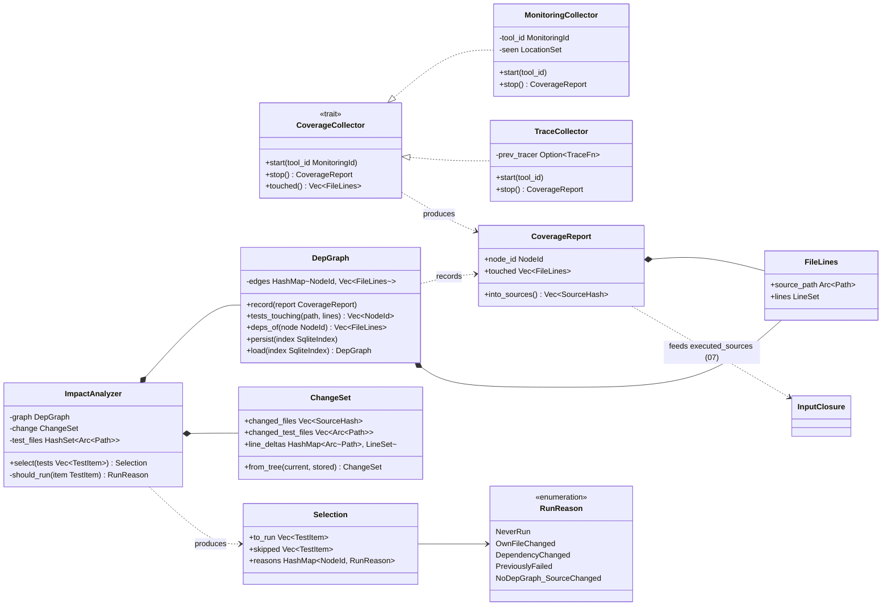
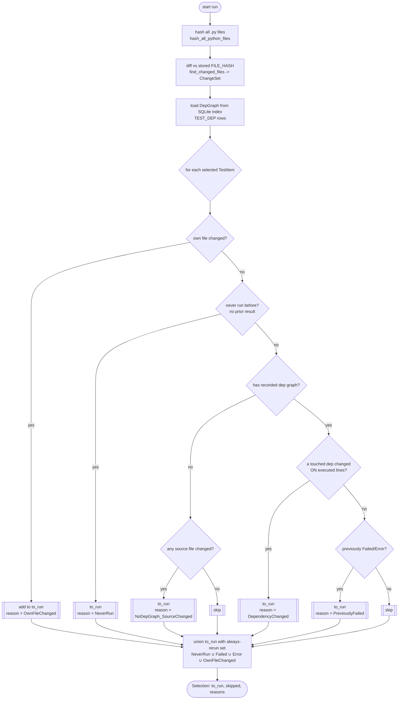
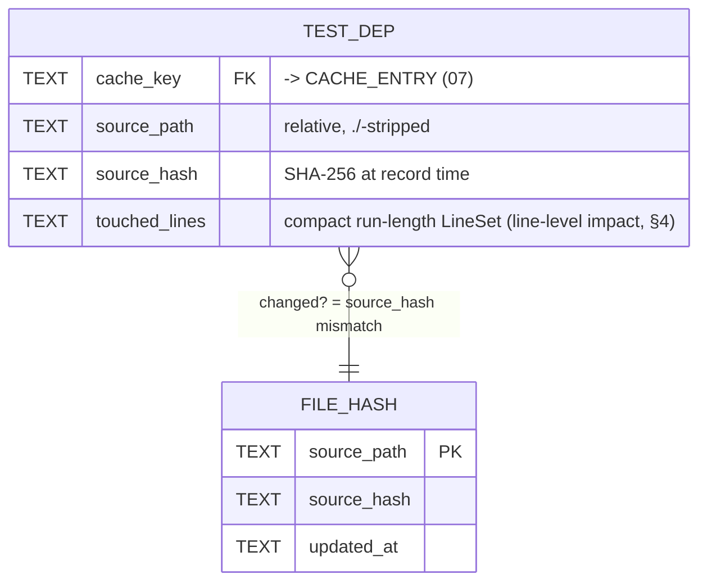

# 11 — Coverage & Impact Analysis (per-test footprint → DepGraph → selection)

> **Status:** ✅ draft for discussion
> Prereqs: [00-vision](00-vision.md), [01-architecture](01-architecture.md), [02-domain-model](02-domain-model.md),
> [07-cache](07-cache.md).
> Gated by: [ADR-E006](adr/ADR-E006-coverage-sys-monitoring.md) (`sys.monitoring` coverage),
> [ADR-E004](adr/ADR-E004-content-addressed-cache.md) (closure feeds the cache key),
> [ADR-E003](adr/ADR-E003-fork-snapshot-isolation.md) (coverage runs inside the fork worker).
> Feeds: [07-cache](07-cache.md) (`executed_sources` term), [06-scheduler](06-scheduler.md) (timing).

Coverage here is **not** a reporting feature — it is the engine's dependency tracker. Each test's
executed-source footprint is captured precisely and cheaply, producing a **`DepGraph`** (test →
touched source files/lines). That one structure feeds **both**:

1. the [content-addressed cache key](07-cache.md) (`executed_sources` term — soundness), and
2. **impact selection** — which tests a change actually affects.

This is the precision upgrade over the old design, whose impact analysis
([`tiderace/impact.rs`](../../../../tiderace/impact.rs)) depended on a coverage pass that was an
opt-in `--coverage` mode and only ever tracked *files*, not lines. Here, coverage is cheap enough to
leave **always on** ([ADR-E006](adr/ADR-E006-coverage-sys-monitoring.md)), so the dependency graph is
always current and the cache is always sound.

Types live in `crates/engine-core/src/coverage/` and `crates/engine-core/src/impact/`, one type per
file ([ADR-E005](adr/ADR-E005-workspace-trait-seams.md)).

---

## 1. Capturing per-test coverage — the `CoverageCollector` trait

Coverage is captured **inside the fork worker**, for the single test that child runs
([ADR-E003](adr/ADR-E003-fork-snapshot-isolation.md), [ADR-E006](adr/ADR-E006-coverage-sys-monitoring.md)).
Because each test is its own forked process, per-test granularity is *natural* — there is no
cross-test contamination to disentangle, unlike a shared-interpreter tracer.

Two implementations behind one trait (the [01](01-architecture.md) / [ADR-E005](adr/ADR-E005-workspace-trait-seams.md) seam):

| Impl | Mechanism | CPython | Overhead | Notes |
|---|---|---|---|---|
| **`MonitoringCollector`** (default) | PEP 669 `sys.monitoring` `LINE`/`BRANCH` events under our tool id, scoped to the test body, disabling events per-location once seen | **3.12+** | low (the property that makes always-on viable) | emits touched file+line set back through the shim |
| **`TraceCollector`** (fallback) | `sys.settrace` line callbacks | **≤3.11** | 2–5× (documented, accepted for old interpreters) | same `DepGraph` output, slower path |

Both produce the **same** output type so the rest of the engine is version-agnostic: a per-test
`CoverageReport` (touched `source_path` → line set), which the worker folds into the test's
[`InputClosure.executed_sources`](07-cache.md#11-reconciling-with-inputclosure-the-02-shape) and the
orchestrator persists as `DepGraph` edges.

### 1.1 Classifier diagram — coverage & impact subsystem

> `CoverageReport.into_sources()` is the bridge to [07-cache](07-cache.md): the touched set becomes
> the `executed_sources: Vec<SourceHash>` term of the test's `InputClosure`. The line-level `LineSet`
> is what `DepGraph` persists for impact precision (§4).

---

## 2. From coverage to `DepGraph`

The `DepGraph` is the bipartite map **`NodeId` → touched `FileLines`**. After each forked test
reports its `CoverageReport`, the orchestrator calls `DepGraph::record(report)`. The graph is then:

- **Persisted** to the SQLite index as the `TEST_DEP` rows defined in the
  [07 ERD](07-cache.md#21-erd--cache-store--index) — `(cache_key, source_path, source_hash,
  touched_lines)`. There is exactly **one** physical dependency table; the cache and impact analyzer
  are two readers of it.
- **Queried two ways:**
  - `deps_of(node)` — forward edges, used to build the cache key's `executed_sources` term.
  - `tests_touching(path, lines)` — reverse edges, used by impact selection to map a changed file (and
    *which lines* changed) to the precise set of affected tests.

This dual use is the [ADR-E006](adr/ADR-E006-coverage-sys-monitoring.md) decision made concrete: *"the
resulting `DepGraph` feeds both the cache key builder and the impact analyzer."*

---

## 3. The `ImpactAnalyzer` — selecting impacted tests

`ImpactAnalyzer` evolves [`tiderace/impact.rs`](../../../../tiderace/impact.rs) forward. The input is a
`ChangeSet` (built by content-hashing the tree and diffing against stored hashes — carrying
[`hasher.rs`](../../../../tiderace/hasher.rs)'s `hash_all_python_files` / `find_changed_files` /
`detect_changes` forward) plus the loaded `DepGraph`. The output is a `Selection` partition with a
recorded `RunReason` per test (so the [reporter](13-cross-cutting.md) and daemon can explain *why* a
test ran).

### 3.1 Selection rules (with conservative fallbacks)

These preserve the exact safety semantics already test-covered in
[`impact.rs`](../../../../tiderace/impact.rs), generalized to line-level deps:

1. **`OwnFileChanged`** — the test's own source file changed → always run. ([impact.rs](../../../../tiderace/impact.rs) rule 1.)
2. **`NeverRun`** — no prior result recorded → must run to establish a baseline. (Rule 2.)
3. **`DependencyChanged`** — a recorded `TEST_DEP` source the test touched changed *on lines the test
   executed* → run. (Rule 3, now line-precise — §4.)
4. **`NoDepGraph_SourceChanged`** — the test has *no* recorded dep graph (e.g. coverage never captured
   for it) **and** any source file changed → run conservatively. (Rule 3 fallback.)
5. **`PreviouslyFailed`** — last [`Outcome`](02-domain-model.md#8-outcome--the-result-state-space) was
   `Failed` or `Error` → always re-run, never skipped, never cache-served. (Rule 4; consistent with
   [02 §8](02-domain-model.md#8-outcome--the-result-state-space) and [07 §6.1](07-cache.md#61-what-invalidates-an-entry-fresh--stale).)

Everything else is **skipped** (its inputs are unchanged). Impact selection is the *second* line of
the [orchestrator preference order](01-architecture.md#3-c4-level-3--components-engine-core) — it runs
**after** the cache lookup ([07 §7.2](07-cache.md#72-sequence--a-run-resolving-each-test-through-the-cache)):
cache hit → **impact-skip** → run.

### 3.2 Activity diagram — impact analysis

The terminal **union step** makes the "always-rerun set" explicit: even if a later rule would skip a
test, membership in `{never-run, own-file-changed, previously-failed/errored}` forces it into
`to_run`. This is the conservative floor — we would rather run a test we could have skipped than skip
one we should have run.

---

## 4. Line-level precision — how this improves on the old `--coverage-only` limitation

The old impact analysis ([`impact.rs`](../../../../tiderace/impact.rs) + `coverage_data` in
[`db.rs`](../../../../tiderace/db.rs)) had two limitations this design removes:

| Dimension | Old (`--coverage` opt-in, file-level) | New (always-on, line-level) |
|---|---|---|
| **When coverage runs** | Only under an explicit `--coverage` flag; warm re-runs without it had *no* dep graph → fell back to "rerun on any source change" (`impact.rs` rule 3 fallback fired constantly). | **Always on** ([ADR-E006](adr/ADR-E006-coverage-sys-monitoring.md)) — every fork worker captures coverage at low cost, so the dep graph is always fresh. |
| **Granularity** | File-level: `test_file_deps(test_id, dep_path)`. Editing *any* line of a touched file re-ran *every* test touching that file. | **Line-level**: `TEST_DEP.touched_lines`. A change to `src/foo.py:120` only re-runs tests whose executed line set intersects the changed lines (`tests_touching(path, lines)`). |
| **Soundness for caching** | Impact-skip only — local, run-relative, not a cache. | The same precise closure is the cache key's `executed_sources` term → shareable, content-addressed results ([07-cache](07-cache.md)). |
| **Branch sensitivity** | None. | `sys.monitoring` `BRANCH` events let us record which branch a test took, so a change to an untaken branch need not invalidate. |

Concretely: a 2000-line module touched by 500 tests, where one developer edits a 3-line helper at the
bottom — old behavior re-ran all 500 tests; new behavior re-runs only the tests whose `touched_lines`
intersect that helper's lines (often a handful), and serves the rest from the
[cache](07-cache.md). This is the line-level intersection in rule 3 (`DependencyChanged`), and it is
why the [00-vision](00-vision.md) inner-loop target of 100–1000× is reachable on real suites rather
than only on trivially partitioned ones.

> **Conservatism note.** Line-level matching is an *optimization* layered on top of the file-level
> safety net: if `touched_lines` is missing or the diff can't be mapped to lines (e.g. a whole-file
> rewrite, an import-time side effect), we degrade to the file-level rule, never to *under*-selection.

---

## 5. Persistence — how `DepGraph` ties to the [07](07-cache.md) ERD

`DepGraph` has no storage of its own; it **is** a view over the cache index. `persist`/`load` read and
write the [`TEST_DEP`](07-cache.md#21-erd--cache-store--index) and `FILE_HASH` tables:

- **Write** (after a run): `DepGraph::record` then `persist` inserts one `TEST_DEP` row per touched
  file with its `LineSet`, keyed by the run's `cache_key` (so the *same* row that validates a cache
  entry also answers impact queries — no duplicate state).
- **Read** (start of next run): `load` reconstructs the reverse index `tests_touching` from
  `TEST_DEP`; `ChangeSet::from_tree` diffs the current tree hashes against `FILE_HASH`.
- This is deliberately the **same table** [07 §2](07-cache.md#2-the-store--content-store--sqlite-index)
  describes: there is one dependency-edge table, written once per test run, read by both the cache
  (forward, for the key) and impact (reverse, for selection). No second source of truth.

---

## 6. Open questions

- **I1** — Per-fork `sys.monitoring` registration cost: register once in the wellspring and inherit across
  `fork()`, or per child? (The [ADR-E006](adr/ADR-E006-coverage-sys-monitoring.md) revisit trigger.)
- **I2** — Mapping a textual diff to changed *line numbers* robustly across edits that shift lines
  (insertions above a touched line) — do we re-anchor on AST nodes rather than raw line numbers?
- **I3** — Dynamic imports / `getattr`-driven dispatch that coverage sees but a static pre-filter
  would miss — confirm the always-on coverage closure is the sole authority (it is, per
  [ADR-E006](adr/ADR-E006-coverage-sys-monitoring.md) "static import-graph analysis only … rejected as
  the sole source").
- **I4** — `LineSet` encoding: run-length vs roaring bitmap for 10k-line files touched by 50k tests
  (storage vs query speed in the [07](07-cache.md) index).
