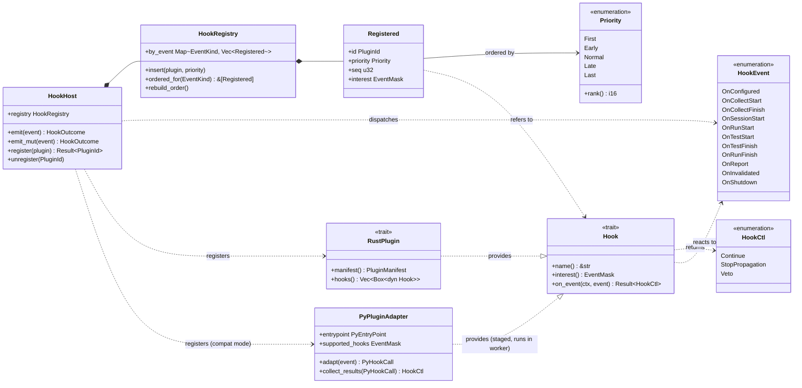
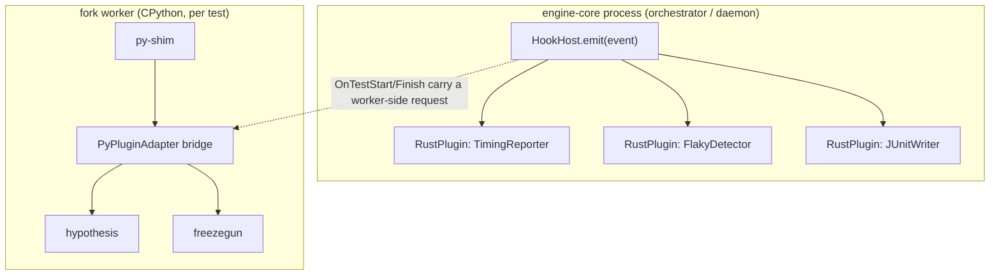
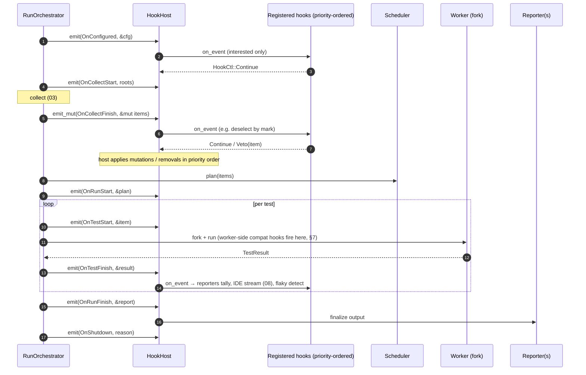
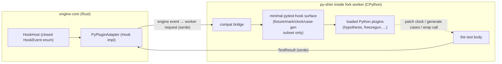

# 12 — Plugin Host (Own the Hooks; no pluggy)

> **Status:** ✅ draft for discussion
> Prereq: [00-vision](00-vision.md), [01-architecture](01-architecture.md),
> [02-domain-model](02-domain-model.md).
> Relates to: [05-execution-wellspring](05-execution-wellspring.md), [08-daemon](08-daemon.md),
> [09-assertions](09-assertions.md), [13-cross-cutting](13-cross-cutting.md).
> ADRs: [ADR-E001](adr/ADR-E001-pure-rust-engine-no-pytest.md) (own the framework),
> [ADR-E005](adr/ADR-E005-workspace-trait-seams.md) (trait seams).

[ADR-E001](adr/ADR-E001-pure-rust-engine-no-pytest.md) is explicit: the engine owns the plugin/hook
host; it is *not* bounded by pytest, and it does **not** run pytest's `pluggy` underneath. This doc
defines a **Rust-native [`HookHost`](#2-classifier--hook-host--registry)** that dispatches typed
lifecycle events to in-process Rust plugins for ~free, plus a **staged pytest-plugin compatibility
shim** so popular Python plugins (hypothesis, freezegun, …) can still load *inside the worker*
([05-execution-wellspring](05-execution-wellspring.md)) without dragging pytest's hook machinery into the
engine's hot path.

Code lives in `crates/engine-core/src/hooks/`, one type per file
([ADR-E005](adr/ADR-E005-workspace-trait-seams.md)): `hook_host.rs`, `hook.rs` (trait),
`hook_event.rs` (enum), `hook_registry.rs`, `priority.rs`, `rust_plugin.rs`, and — for the staged
shim boundary — `py_plugin_adapter.rs`.

---

## 1. Why own the host (and the cost we are avoiding)

pytest's extensibility is its great strength and a real performance tax. `pluggy` dispatches every
hook through a dynamic, Python-level call chain: per hook call it builds an argument mapping,
iterates all registered `hookimpl`s (with `tryfirst`/`trylast`/`hookwrapper` ordering computed at
the Python level), and threads results back — all in the interpreter, on every test, for hooks like
`pytest_runtest_setup`/`call`/`teardown`. Multiply by a 50k-test suite and the dispatch overhead is
not noise.

| Aspect | pytest + pluggy | This engine's `HookHost` |
|---|---|---|
| Dispatch site | CPython, dynamic, per-call arg-mapping | **Rust**, static dispatch over a registered `Vec` |
| Cost per engine-level event | Python call chain + result threading | a method call + (cheap) `&HookEvent` borrow |
| Ordering model | `tryfirst`/`trylast`/`hookwrapper`, resolved in Python | `Priority` integer + stable registration order, resolved once at registration |
| Where most hooks run | inside the interpreter, per test | **in the orchestrator/daemon process**, not per-fork |
| Failure isolation | a bad plugin can break the run | a Rust hook returns `Result`; errors are contained ([§6](#6-error-handling--isolation)) |

**The key architectural move:** *engine-level* hooks (collection started, run finished, a result is
ready, reporting) fire in **Rust**, in the orchestrator/daemon — **once per event, not once per
forked interpreter**. The expensive Python-plugin behavior that genuinely must run *next to the
test body* (hypothesis generating cases, freezegun patching the clock) runs **inside the fork
worker** via the [compat shim](#7-staged-pytest-plugin-compatibility-shim), exactly where it has to,
and nowhere else. We pay Python-plugin cost only where it is unavoidable.

---

## 2. Classifier — Hook Host & registry

**Roles:**
- **`HookHost`** — the single dispatcher the [Orchestrator](01-architecture.md) and
  [daemon](08-daemon.md) hold. `emit` for read-only observation (cheap, can fan out); `emit_mut`
  for the few events a plugin may *influence* (e.g. modify the selection at `OnCollectFinish`).
- **`Hook` (trait)** — the DIP seam every plugin implements. `interest()` returns an `EventMask` so
  the host skips plugins that do not care about an event — no wasted dispatch.
- **`HookEvent` (enum)** — the **closed** set of typed lifecycle events with typed payloads
  ([§4](#4-hook-event-catalogue)). Like `Outcome` ([02-domain-model](02-domain-model.md)), it is
  closed: new events are added by editing `hook_event.rs` *and* this doc, never by plugins.
- **`HookRegistry`** — holds plugins bucketed per `EventKind`, pre-sorted by `Priority` then stable
  registration sequence; order is resolved **once** at registration (`rebuild_order`), not per
  call.
- **`HookCtl`** — a hook's return: `Continue` (normal), `StopPropagation` (later hooks for this
  event are skipped), `Veto` (reject the action — only meaningful for `emit_mut` events like a
  selection filter).
- **`RustPlugin` vs `PyPluginAdapter`** — both *are* `Hook` providers (LSP), so the host treats
  them uniformly. The difference is **where they run** and **how much they cost**
  ([§3](#3-two-kinds-of-plugin-rust-native-vs-python-compat)).

---

## 3. Two kinds of plugin: Rust-native vs Python-compat

- **Rust-native plugins** are the default and the fast path. Reporters
  ([13-cross-cutting](13-cross-cutting.md)), flaky-test detection, timing/JSON/JUnit/GitHub
  output, the daemon's [RPC event stream](08-daemon.md) — all are `RustPlugin`s observing engine
  events in-process, paying only a Rust method call per event.
- **Python-compat plugins** are the *staged* path ([§7](#7-staged-pytest-plugin-compatibility-shim)).
  They run **inside the fork worker**, next to the test body, because that is the only place their
  effect is meaningful (patching the test's clock, parametrizing the test's inputs). The engine does
  **not** run them in the orchestrator and does **not** route the per-test event chain through
  Python — that is precisely the pluggy cost we reject.

---

## 4. Hook event catalogue

Every event carries a typed, read-mostly payload. "Mutable?" marks the few an `emit_mut` hook may
influence (returning `HookCtl::Veto`/a replacement); everything else is observation only.

| `HookEvent` | Payload | Fires when | Mutable? |
|---|---|---|---|
| `OnConfigured` | `&Config` | After [config](13-cross-cutting.md) load, before collection. Plugins read settings, declare interest. | no |
| `OnCollectStart` | `&[Root]` | Collection ([03-collection](03-collection.md)) begins. | no |
| `OnCollectFinish` | `&mut Vec<TestItem>` | Collection produced the item set, **before** scheduling. The one place a plugin may add/remove/reorder/deselect items. | **yes** |
| `OnSessionStart` | `&RunContext` | A run is admitted (selection fixed, before any fork). | no |
| `OnRunStart` | `&RunPlan` | The scheduler ([06-scheduler](06-scheduler.md)) produced batches; about to execute. | no |
| `OnTestStart` | `&TestItem` | A test is about to be forked/run. Engine-level (fires in orchestrator); a worker-side hook is delivered through the [adapter](#7-staged-pytest-plugin-compatibility-shim). | no |
| `OnTestFinish` | `&TestResult` | A test resolved (run **or** [cache](07-cache.md) hit). The workhorse event: streamed to the [IDE](08-daemon.md), tallied by reporters, fed to flaky detection. | no |
| `OnRunFinish` | `&RunReport` | All results in. Reporters finalize; exit code computed. | no |
| `OnReport` | `&mut ReportSink` | A reporter is emitting; plugins may append sections (e.g. custom summary). | **yes** |
| `OnInvalidated` | `&InvalidationPlan` | (daemon) The [watcher](08-daemon.md) invalidated/recycled state. | no |
| `OnShutdown` | `&ShutdownReason` | Engine/daemon is stopping; plugins flush/close. | no |

> `OnTestStart`/`OnTestFinish` fire **once per test in the orchestrator**, regardless of how many
> fork workers run — they are *not* per-interpreter, which is the structural reason engine-level
> hook dispatch stays cheap even on huge suites.

---

## 5. Dispatch across a run lifecycle (sequence)

**Ordering semantics:** for each event the registry yields hooks sorted by `Priority::rank()` then
stable registration `seq`. `First`/`Last` bracket the order for plugins that must wrap others
(the role pytest fills with `hookwrapper`), but the resolution is a one-time integer sort at
registration — not a per-call computation. A hook returning `StopPropagation` ends the chain for
that event; `Veto` (on `emit_mut` events only) rejects the proposed mutation.

---

## 6. Error handling & isolation

Per [conventions](../../../../.claude/conventions/languages/rust.md) (no panics in library code,
typed `thiserror` errors):

- `Hook::on_event` returns `Result<HookCtl, HookError>`. A failing **observer** hook
  (e.g. a reporter) is logged and isolated — the run continues; a broken plugin never aborts a test
  run the way a misbehaving pytest plugin can.
- A failing **mutating** hook (`emit_mut`, e.g. a selection filter that errors) is treated
  conservatively: the proposed mutation is dropped and the error surfaced in the
  [`RunReport`](02-domain-model.md) diagnostics; the engine does not silently apply a partial
  mutation.
- Worker-side compat plugins ([§7](#7-staged-pytest-plugin-compatibility-shim)) are isolated by the
  fork boundary itself ([ADR-E003](adr/ADR-E003-fork-snapshot-isolation.md)): a plugin that crashes
  or hangs the interpreter kills only that one forked child, which the worker records as
  `Outcome::Error` — exactly the timeout/crash containment `pool.rs` already implements, generalized.

---

## 7. Staged pytest-plugin compatibility shim

Adoption (vision G1, [ADR-E001](adr/ADR-E001-pure-rust-engine-no-pytest.md)) means real suites that
depend on hypothesis, freezegun, pytest-mock, etc. should run with minimal edits — but **without**
re-importing pytest's runner or routing the engine's per-test event chain through pluggy. The
answer is a **bounded compatibility boundary**: a `PyPluginAdapter` that loads selected Python
plugins **inside the fork worker** and exposes *just enough* of the pytest hook surface for them to
function around the test body. This is a **staged** effort — the boundary is specified here; the
full hook-by-hook coverage matrix is sequenced in the implementation phases, not a launch blocker.

### 7.1 Where the boundary sits

The adapter is the **only** place engine events cross into Python-plugin land, and it crosses **at
the worker, per test, only for plugins the project actually enables**. The engine-side `HookEvent`
enum stays closed and pytest-free; the worker-side bridge presents a *minimal, curated* slice of the
pytest hook names those plugins call (a small subset — not the whole `pluggy`/`_pytest` surface).

### 7.2 How a Python plugin is adapted (staged)

1. **Discovery / opt-in.** Compat mode is explicit ([config](13-cross-cutting.md)): the project
   lists which pytest plugins to load. The engine resolves their entry points but does **not**
   import pytest's session machinery.
2. **Worker-side load.** Inside the fork worker, the `py-shim` compat bridge imports the named
   plugins against the **minimal pytest-hook surface** (a small Python module the engine ships that
   provides only the hook names + fixture/mark registration those plugins use).
3. **Event adaptation.** For a worker-relevant engine event (`OnTestStart`/`OnTestFinish`-equivalent
   *for that test*), `PyPluginAdapter::adapt` translates it into the corresponding pytest hook call
   (`pytest_runtest_setup`/`call`/`teardown` subset) on the bridge; the plugin's effect (frozen
   clock, generated cases, mocked attrs) applies around the test body.
4. **Result collection.** `collect_results` maps the plugin chain's outcome back to `HookCtl` and
   folds any plugin-produced data into the worker's `TestResult` before it returns to the engine.
5. **Staged coverage.** The first stage targets the highest-value, lowest-surface plugins
   (freezegun, pytest-mock) and the generators (hypothesis); plugins that assume pytest's full
   collection/session lifecycle are explicitly out of the initial surface and reported as
   unsupported rather than silently misbehaving. The conformance suite
   (`benchmarks/real_world.sh`, [ADR-E001](adr/ADR-E001-pure-rust-engine-no-pytest.md)) gates which
   plugins graduate.

### 7.3 What the shim deliberately does *not* do

- It does **not** run pytest's runner, session, or collection — those are the engine's job
  ([ADR-E001](adr/ADR-E001-pure-rust-engine-no-pytest.md)).
- It does **not** route engine-level hooks (`OnCollectFinish`, `OnRunFinish`, reporting) through
  Python — those are Rust-native and never pay Python dispatch.
- It does **not** promise 100% pytest-plugin compatibility on day one — that is an explicit
  non-goal (vision §5); the boundary is curated and grows as the conformance suite proves each
  plugin out.

---

## 8. Invariants other authors must honor

1. **`HookEvent` is closed.** Add a lifecycle event only by editing `hook_event.rs` *and* this doc
   (mirrors the `Outcome` rule in [02-domain-model](02-domain-model.md)).
2. **Engine-level hooks fire in Rust, once per event** — never once per fork worker, never through
   Python. Anything that must run per-test in Python goes through the
   [compat shim in the worker](#7-staged-pytest-plugin-compatibility-shim).
3. **Ordering is resolved at registration, not per call** (`Priority` + stable `seq`). Dispatch is a
   pre-sorted iteration.
4. **A misbehaving plugin cannot abort a run.** Observer-hook errors are isolated; worker-plugin
   crashes are contained by the fork boundary as `Outcome::Error`
   ([§6](#6-error-handling--isolation)).
5. **The pytest-compat surface is curated and staged**, not the full pluggy/`_pytest` surface
   ([§7](#7-staged-pytest-plugin-compatibility-shim)); unsupported plugins are reported, never
   silently degraded.
</content>
