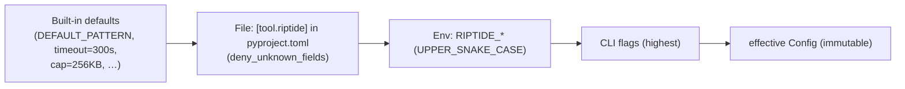
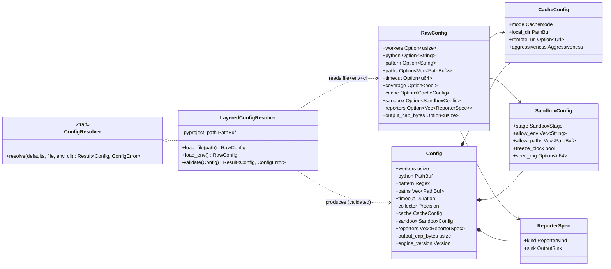
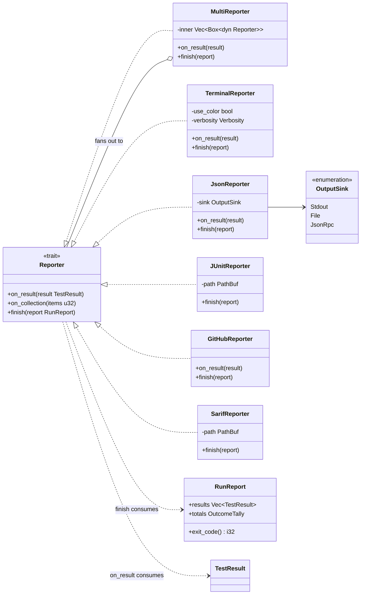
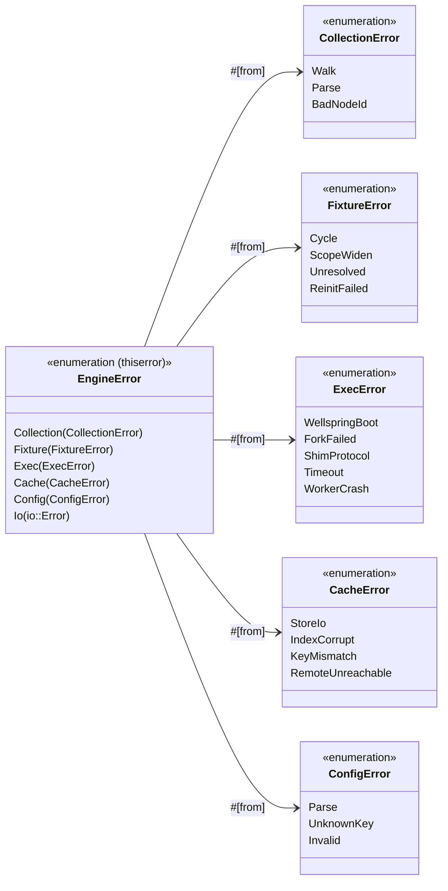
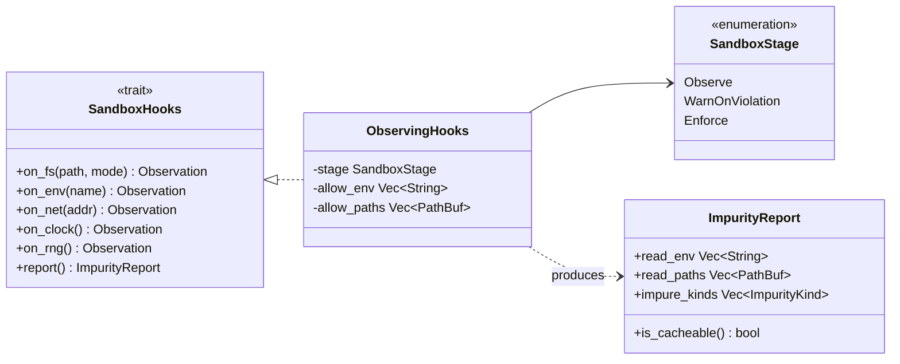
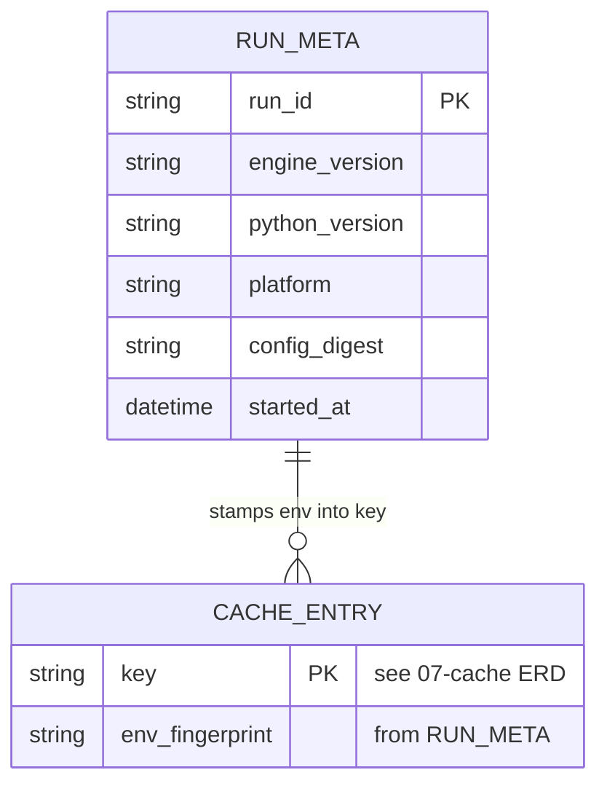

# 13 — Cross-Cutting Concerns (Config, Reporting, Error Model, Hermeticity/Security)

> **Status:** ✅ draft for discussion
> Prereqs: [00-vision](00-vision.md), [01-architecture](01-architecture.md), [02-domain-model](02-domain-model.md).
> Gated by: [ADR-E002](adr/ADR-E002-execution-substrate.md) (substrate/shim — where sandbox hooks
> observe), [ADR-E004](adr/ADR-E004-content-addressed-cache.md) (cache soundness depends on
> hermeticity), [ADR-E005](adr/ADR-E005-workspace-trait-seams.md) (trait seams),
> [ADR-E009](adr/ADR-E009-lazy-assertion-introspection.md) (purity guard shares the sandbox hooks).
> Consumes: [02-domain-model](02-domain-model.md) (`RunReport`, `TestResult`, `RichDiff`, `Outcome`),
> the [07-cache](07-cache.md) ERD (referenced, **not** duplicated here).

The four concerns in this doc cut across every subsystem: **config** drives all of them,
**reporting** is the run's only user-facing output, the **error model** is how every subsystem
fails safely, and **hermeticity/security** is the shared machinery (`SandboxHooks`) that makes the
cache sound ([ADR-E004](adr/ADR-E004-content-addressed-cache.md)) *and* the assertion re-eval safe
([ADR-E009](adr/ADR-E009-lazy-assertion-introspection.md)). All four live in `engine-core`:
`config/`, `report/`, `error.rs`, and the sandbox hook host (shared between `cache/` and the
shim boundary), one type per file per [ADR-E005](adr/ADR-E005-workspace-trait-seams.md).

---

## 1. Config

### 1.1 Source & precedence

Config is loaded from `pyproject.toml` `[tool.riptide]`, **evolving** the existing
[`tiderace/config.rs`](#) loader (`TideraceConfig::load`, `#[serde(deny_unknown_fields)]` so typos
are hard errors). The precedence chain is strict and is resolved once by the `ConfigResolver`
into an effective, immutable `Config` the orchestrator threads everywhere:

**CLI > env > file > defaults.** Each layer is a sparse overlay (all fields `Option`, as in
`TideraceConfig` today); `ConfigResolver::resolve` folds them right-to-left so a present value at a
higher layer always wins. The result is validated once (e.g. `workers >= 1`, `pattern` compiles as a
regex, `timeout > 0`) and any violation is a `ConfigError` ([§3](#3-error-model)) surfaced *before*
collection starts — never a panic, never a silent default.

### 1.2 Config classifier

`TideraceConfig` is carried forward and renamed `RawConfig` (the sparse, file/env/CLI-shaped
overlay); `Config` is the resolved, total, validated form. New fields cover the subsystems the old
binary lacked (cache, sandbox, reporting), but the loader's shape is unchanged.

`engine_version`, `python_version`, and `platform` from the resolved `Config` feed straight into the
cache key ([ADR-E004](adr/ADR-E004-content-addressed-cache.md), [07-cache](07-cache.md)) — config is
where the "avoid cross-environment poisoning" inputs originate.

---

## 2. Reporting

### 2.1 The `Reporter` trait

`Reporter` is the seam from [01-architecture §7](01-architecture.md): the orchestrator depends on the
trait, never a concrete formatter. Two methods, both from the master diagram
([01 §5](01-architecture.md)): `on_result` is called **streaming** as each `TestResult` lands (so an
IDE/terminal shows progress live, not at the end), and `finish` is called once with the aggregate
`RunReport`. A run may fan out to **several reporters at once** (terminal + JUnit + SARIF in CI) via
a `MultiReporter` composite that forwards to each — the composite is itself a `Reporter` (LSP), so
the orchestrator holds exactly one.

`TerminalReporter` carries forward the existing [`tiderace/reporter.rs`](#) look (the boxed header,
colored pass/fail/skip tallies, the `skipped (unchanged)` impact line, coverage bars) but consumes
the richer [`TestResult`](02-domain-model.md)/[`RichDiff`](02-domain-model.md) so failures render
structured diffs ([09-assertions](09-assertions.md)) instead of a 20-line stdout slice.

### 2.2 Reporter outputs

| Reporter | Format | Primary consumer | When used | Stream / finish |
|---|---|---|---|---|
| `TerminalReporter` | ANSI text (boxed, colored) | a human at a TTY | default interactive runs | both (live progress + summary) |
| `JsonReporter` | newline-delimited JSON events + final report object | IDEs / Test Explorer over JSON-RPC ([08-daemon](08-daemon.md)); scripts | `--json`, daemon mode | both (one event per `on_result`) |
| `JUnitReporter` | JUnit XML (`<testsuite>`/`<testcase>`) | generic CI (Jenkins, GitLab, Azure) | `--junit out.xml` in CI | finish only |
| `GitHubReporter` | GitHub Actions workflow commands (`::error file=…,line=…::`) + job-summary markdown | GitHub Actions annotations | detected `GITHUB_ACTIONS=true` | both (annotate failures live) |
| `SarifReporter` | SARIF 2.1.0 JSON | GitHub code-scanning / security dashboards | `--sarif out.sarif` | finish only |

**IDE-friendly machine output.** `JsonReporter`'s streaming `on_result` events are the contract the
[daemon](08-daemon.md) exposes over JSON-RPC: each carries the `NodeId`, `Outcome`, `duration`, and
(on failure) the structured `RichDiff` with `source_span`s, so an editor can render inline failures
and "run this test" affordances without parsing human text. Every reporter keys on the stable
`NodeId` ([02 §4](02-domain-model.md)) so IDE selections round-trip verbatim.

---

## 3. Error model

### 3.1 Typed errors, no panics

Per [rust.md](../../.claude/conventions/languages/rust.md) and core conventions: **no panics in
library code** — every fallible operation returns `Result<T, EngineError>`, errors propagate with
`?`, and `thiserror` derives `Display`/`Error` with `#[from]` for sub-error conversion. The old
binary used `anyhow` at the top level; `engine-core` upgrades to a **typed** `EngineError` so the
CLI, daemon, and reporters can branch on *kind* (and `anyhow` is allowed only at the thin
`engine-cli` boundary for context-wrapping the final `Result`).

### 3.2 The critical distinction: error-as-`Outcome::Error` vs error-as-engine-failure

The same Rust `Result` machinery serves two *semantically different* failure classes, and the
boundary between them is load-bearing for the [cache](07-cache.md) and exit codes:

| Failure | Class | Becomes | Aborts the run? |
|---|---|---|---|
| A test's `setUp`/fixture raised; import error in the test's module; worker crash/timeout running *one* test | **per-test** | `TestResult { Outcome::Error }` ([02 §8](02-domain-model.md)) | **No** — recorded, run continues, re-run next time ([02 §8](02-domain-model.md) impact rule) |
| Bare `assert` / `self.assert*` did not hold | **per-test** | `TestResult { Outcome::Failed, RichDiff }` | No |
| `FixtureError::Cycle`/`ScopeWiden` (graph invalid for a whole scope path) | **engine** (scoped) | `EngineError::Fixture` → those items error; collection aborts for that scope | Partial (that scope path) |
| `ConfigError`, `ExecError::WellspringBoot`, `CacheError::IndexCorrupt`, fatal `Io` | **engine** (global) | `EngineError` bubbles to the front-end | **Yes** — non-zero process exit, no `RunReport` results |

The rule: **anything that prevents a specific test from yielding a meaningful pass/fail becomes
`Outcome::Error` on that test's `TestResult`** (so the report stays complete and the test re-runs
next time); **anything that prevents the *engine* from running at all becomes a bubbled
`EngineError`**. The shim never panics the worker for a per-test problem — it captures the exception
and reports `error` exactly as [`tiderace/worker.py`](#)'s loop does today (belt-and-suspenders
`try/except` around each request, EOF-clean exit). `RunReport::exit_code()` ([02 §3](02-domain-model.md))
counts `Outcome::Error`/`Failed` toward a non-zero code; a bubbled `EngineError` short-circuits to a
distinct fatal exit code so CI can tell "tests failed" from "the engine could not run."

---

## 4. Hermeticity & security

### 4.1 `SandboxHooks` — the shared observation/enforcement mechanism

`SandboxHooks` is the **single** machinery that intercepts impure operations, and it is shared by
three callers so there is exactly one definition of "impure" ([09 §4](09-assertions.md),
[04 F2](04-fixture-graph.md)):

1. **Cache soundness** ([ADR-E004](adr/ADR-E004-content-addressed-cache.md)) — discover a test's
   *true* input set (which env vars / files it read) and *detect impurity* (clock/network/RNG) so an
   impure test is marked uncacheable rather than silently cached stale.
2. **Assertion purity guard** ([ADR-E009](adr/ADR-E009-lazy-assertion-introspection.md),
   [09 §4](09-assertions.md)) — during the single traced assertion re-eval, any tripped hook ⇒ fall
   back to the plain message.
3. **`reinit_after_fork` discovery** ([04 §4.3, F2](04-fixture-graph.md)) — observing a socket/thread
   spawn in a fixture body can auto-flag it fork-fragile.

The hooks live at the substrate boundary: the **shim observes** (it sits in the Python process where
`open`/`socket`/`time`/`random` are called, via `sys.audit` hooks + targeted wrappers); **Rust owns
the policy** (thresholds, allow-lists, the cacheable/uncacheable verdict) — the same observe-in-shim,
decide-in-Rust split as the assertion introspector ([09 §2](09-assertions.md)).

### 4.2 Observe vs enforce — staged, conservative-by-default

Per [ADR-E004](adr/ADR-E004-content-addressed-cache.md)'s "staged, conservative-by-default":

| Stage | What it does | Default for |
|---|---|---|
| `Observe` | Record every fs/env/net/clock/RNG access; never block. Feeds the cache the true input closure + impurity verdict. | initial rollout |
| `WarnOnViolation` | Observe + warn when a test reads outside its declared `allow_env`/`allow_paths` (heads-up that a cache entry may be unsound). | opt-in |
| `Enforce` | Deny disallowed access (raise in the body → `Outcome::Error`); pin nondeterminism (`freeze_clock`, `seed_rng`) to make otherwise-impure tests cacheable. | opt-in / future |

We **observe by default and enforce only on opt-in** — matching the ADR's revisit posture (narrow to
explicit opt-in if observation proves too leaky). What we *observe* feeds the cache key's
`declared_env`/`executed_sources` terms; what we *enforce* is how a user converts an impure test into
a cacheable one (frozen clock, seeded RNG, recorded network).

### 4.3 Daemon socket scoping & cache-poisoning prevention

- **Daemon socket scoping** ([08-daemon](08-daemon.md)): the warm daemon's JSON-RPC endpoint is a
  **per-user, per-project** Unix domain socket (mode `0600`, under a per-user runtime dir keyed by
  project root) — never a TCP port — so one user's warm interpreter + fixture snapshots can't be
  driven by another local user. Requests are validated against the typed protocol; a `NodeId` is
  only ever passed as data, never `eval`/`exec`'d (the invariant `tiderace/worker.py` already holds).
- **Cache-poisoning prevention** ([ADR-E004](adr/ADR-E004-content-addressed-cache.md)): the cache key
  *includes* `engine_version + python_version + platform` (from §1 `Config`) so a result computed in
  one environment can never satisfy another. A `RemoteCache` ([01 §5](01-architecture.md)) entry is
  content-addressed and **verified on read** (`CacheError::KeyMismatch` if the stored digest ≠ the
  recomputed key); impure tests are never written ([§4.2](#42-observe-vs-enforce--staged-conservative-by-default)).
  The full key construction, store layout, and `SQLite` index **ERD live in [07-cache](07-cache.md)
  — not duplicated here**; §1 only contributes the environment-fingerprint inputs.

### 4.4 Output capping

Carrying forward the existing **256 KB** per-test output cap: `Captured` ([02 §3](02-domain-model.md))
stdout/stderr are bounded at `Config.output_cap_bytes` (default `256 * 1024`). A test that floods
output is truncated with a `… [output capped at 256KB] …` marker rather than ballooning the cache
entry or the report — bounding both RSS during a run and the size of a cached `TestResult`. The cap
is config-overridable but defaulted conservatively so a pathological test can't poison the store or
OOM the daemon.

---

## 5. Cross-cutting metadata (config + reconciliation with the cache ERD)

The only persistent cross-cutting state this doc *introduces* is config provenance; the result/cache
tables are owned by [07-cache](07-cache.md) and are **referenced, not redefined** (per
[02 §10 invariant 4](02-domain-model.md): cache keys/semantics live in `cache/`).

| Table / record | Owner doc | Cross-cutting role here |
|---|---|---|
| `cache_entry(key, outcome, captured, closure, env_fingerprint, created_at)` | **[07-cache](07-cache.md) ERD** | §4.3 reads `env_fingerprint` (from §1 `Config`) for poisoning prevention; not defined here |
| `source_hash(path, sha256)` | **[07-cache](07-cache.md) ERD** | feeds `InputClosure.executed_sources`; §4.1 hooks discover which sources/env were touched |
| `run_meta(run_id, engine_version, python_version, platform, config_digest)` | **this doc (config)** | the resolved `Config` digest + environment fingerprint that every cache key folds in (§4.3); the *only* new table |
| `RunReport` (in-memory) | **[02-domain-model](02-domain-model.md)** | aggregated by reporters (§2); never persisted by config |

> `CACHE_ENTRY` is shown only with the columns this doc *touches* (`key`, `env_fingerprint`); its full
> schema is owned by [07-cache](07-cache.md). `RUN_META` is the one cross-cutting table introduced
> here — it records the environment + config under which a run produced cache entries, which is the
> data §4.3's poisoning-prevention check compares against.

---

## 6. Contracts for downstream docs

- **Config** is resolved once into an immutable `Config` and threaded read-only everywhere; no
  subsystem re-reads `pyproject.toml`. Environment-fingerprint fields (`engine_version`,
  `python_version`, `platform`) are the inputs [07-cache](07-cache.md) folds into every key.
- **Reporters** are pure consumers of [`TestResult`](02-domain-model.md)/[`RunReport`](02-domain-model.md);
  they never mutate domain state and never branch on [`TestStyle`](02-domain-model.md)
  ([10-test-styles](10-test-styles.md)). New output formats are added behind the `Reporter` trait
  (OCP), not by editing existing reporters.
- **`EngineError`** is the single error type crossing the `engine-core` boundary; the per-test vs
  engine-failure split (§3.2) is the contract the [Orchestrator](01-architecture.md) and front-ends
  rely on to decide between recording an `Outcome::Error` and aborting the run.
- **`SandboxHooks`** is the *one* impurity definition shared by [07-cache](07-cache.md),
  [09-assertions](09-assertions.md), and [04-fixture-graph](04-fixture-graph.md); none of them define
  their own. The observe/enforce stage is config-driven (§4.2).

---

## 7. Open questions

- **CC1** — Config file location precedence when both `pyproject.toml` and a dedicated
  `riptide.toml` exist: merge or `pyproject` only? (lean: `pyproject` canonical, `riptide.toml` opt-in)
- **CC2** — `sys.audit`-hook coverage: do audit events capture *every* fs/net access on all supported
  CPython versions, or do we need targeted C-ext wrappers for the gaps? (→ de-risking spike)
- **CC3** — Remote-cache trust model: signed cache entries vs trusted-CI-only writes — how do we stop
  a poisoned shared cache from a compromised shard? (→ [07-cache](07-cache.md), [security review])
- **CC4** — SARIF/GitHub reporter mapping for `Outcome::Error` vs `Failed`: distinct severities, or
  both `error`-level annotations? (→ CI ergonomics review)
- **CC5** — Output-cap interaction with the assertion `RichDiff`: cap diff `repr`s independently of
  the 256KB stdout cap so a huge value doesn't crowd out captured logs. (→ [09 A1](09-assertions.md))
