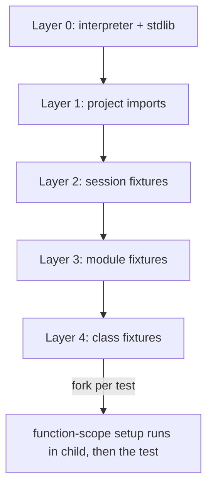

# ADR-E003 — Fork-from-snapshot isolation; fixture scopes as memory snapshots

**Status:** ✅ Accepted (design) · The load-bearing performance bet.

## Context

Two costs dominate Python test runs: (a) **importing the world** (project + heavy deps), paid
once per process — so xdist pays it *N* times; and (b) **isolation** — a truly fresh interpreter
per test is the only way to kill order-dependent/state-leak flakiness, but process-per-test is
far too slow in pytest.

These are normally treated as a trade-off (fast *or* isolated). `fork()` with copy-on-write
collapses the trade-off.

## Decision

Adopt a **Wellspring/fork** model (import the project once into a warm parent, then fork a pristine child per test):

1. A **wellspring** Python process imports the project **once**.
2. For each test, `fork()` a child. COW makes the child a fully-warm interpreter in ~ms.
3. The child runs **exactly one test** in total isolation, reports, and exits.

**Fixture scopes become layered memory snapshots.** We fork from the *deepest applicable*
snapshot and run only narrower-scope setup post-fork:

A 10s `setUpClass`/session fixture is paid **once**, becomes a snapshot, and every test forks
from it with its own pristine copy.

## Consequences

- ➕ Import paid once total; per-test cost ≈ fork cost.
- ➕ **Order-dependent flakiness structurally eliminated** — every test gets a pristine world.
- ➕ Expensive fixtures amortized perfectly across all dependent tests.
- ➖ **fork + threads is hazardous** (locks/threads held across fork): the wellspring must snapshot
  *before* spawning threads/thread-spawning C-exts; provide post-fork re-init hooks.
- ➖ **Non-fork-safe resources** (open sockets, file handles, CUDA/GPU contexts, some DB
  connections) don't survive fork: such fixtures declare `reinit_after_fork` and run/rebuild in
  the child (effectively function-scoped for the resource).
- ➖ **COW write amplification:** tests touching many pages increase RSS; bound concurrency by
  memory, not just CPU.
- ➖ **Platform:** Linux/macOS only → Windows fallback via the `Worker` trait (see E008).

## Alternatives considered

- **Process-per-test (spawn fresh):** correct + isolated but pays import every time — rejected
  as default (kept as `SubprocessWorker` fallback for non-fork platforms).
- **Shared interpreter across tests (pytest's model):** fast but leaks state → flakiness —
  rejected.
- **Subinterpreters:** rejected (E002 / old ADR-010).
- **CRIU checkpoint/restore:** powerful cross-process snapshotting; heavy + Linux-specific —
  parked as a future enhancement for the snapshot store.

## Revisit trigger

If the de-risking spike shows fork-from-warm fails on common C-extension stacks (crashes,
deadlocks) that re-init hooks can't tame, fall back to a warm `SubprocessWorker` pool as the
default and treat fork as an opt-in fast path.
