# Phase 1 — Fork/Wellspring Spike (de-risk) — Implementation Plan

> 📋 **PLAN — awaiting human approval. No agent begins work until approved.**
>
> **Shared scaffold (read first):** [PIPELINE.md](../PIPELINE.md) · **Roadmap:** [ROADMAP.md](../ROADMAP.md)
> **Phase design:** [05-execution-wellspring](../design/05-execution-wellspring.md) ·
> [ADR-E002 — execution substrate](../design/adr/ADR-E002-execution-substrate.md) ·
> [ADR-E003 — fork-from-snapshot isolation](../design/adr/ADR-E003-fork-snapshot-isolation.md)

This plan specifies **only** what is unique to Phase 1. Everything shared across phases — the loaded
conventions, the agent roster→role mapping, the Lane 0 env-gate doctrine, the implementation
standards, the enforcement checkpoints, the test-strategy doctrine, and the debug/retry/escalation
logic — lives in [PIPELINE.md](../PIPELINE.md) and is **referenced**, not repeated.

**This is a spike.** Its single job is the **cheapest possible REAL, end-to-end proof of the thesis
*before* a workspace is built around it**, and then a **go/no-go** decision on `ForkWorker` as the
default execution path. See [§0.6 — Spike ≠ stub](#06-spike--stub-the-no-stubs-rule-applied-here)
for exactly how the no-stubs rule ([PIPELINE §4.3](../PIPELINE.md#4-implementation-standards-enforced-as-passfail-at-gates))
applies to spike code.

---

## 0. Phase scope

### 0.1 In scope (deliverable → design ref)

| Deliverable | What it is | Design ref |
|---|---|---|
| **Minimal Wellspring** | A Rust harness that spawns one `python` running a minimal-but-real shim, imports a sample project **once** (Layer 0→1), then stays a pristine fork source. | [05 §1, §3](../design/05-execution-wellspring.md), [ADR-E003](../design/adr/ADR-E003-fork-snapshot-isolation.md) |
| **`fork()`-per-test loop** | After warm import, `fork()` a COW child per test; child runs exactly one body and exits; parent never runs a body. | [05 §3.1, §9](../design/05-execution-wellspring.md), [ADR-E003 decision](../design/adr/ADR-E003-fork-snapshot-isolation.md) |
| **Minimal binary IPC channel** | `u32` length-prefixed framing carrying a request (which test, which style) and a streamed/terminal result event over the child pipe. Spike-minimal `ExecRequest`/`ExecEvent`. | [05 §5](../design/05-execution-wellspring.md), [ADR-E002 decision](../design/adr/ADR-E002-execution-substrate.md) |
| **pytest-style fn driver** | Run ONE real `def test_*` function: import module, call the callable, capture real pass/fail/exception. **NO pytest involved.** | [05 §5.2 (`style`)](../design/05-execution-wellspring.md), [10 (styles)](../design/README.md) |
| **`unittest.TestCase` driver** | Run ONE real `unittest.TestCase` method at **method granularity** via stdlib `TestCase("name").run(result)` and read `TestResult`. **NO pytest.** | [05 §5.2 (`style`)](../design/05-execution-wellspring.md), [ADR-E002](../design/adr/ADR-E002-execution-substrate.md) |
| **Isolation proof** | A test that mutates a module global must NOT affect the next test (fork gives each a pristine copy). Asserted as an acceptance scenario, not just observed. | [ADR-E003 — "order-dependent flakiness structurally eliminated"](../design/adr/ADR-E003-fork-snapshot-isolation.md), [05 §3](../design/05-execution-wellspring.md) |
| **Crash/timeout → `Outcome::Error`, Wellspring survives** | A deliberately-crashing/hanging child is `kill_tree`'d; recorded as `Error`; the Wellspring and sibling children are unaffected. | [05 §8, §10](../design/05-execution-wellspring.md), ports [`procutil.rs`](../../../../tiderace/procutil.rs) verbatim |
| **Fork-from-warm with a live C-extension** | The make-or-break: `import numpy` (a real native dep with its own allocator/threads) into the Wellspring **before** forking, then prove a child runs correctly post-fork. | [05 §6.1, §6.4](../design/05-execution-wellspring.md), [ADR-E003 ➖ fork+threads / non-fork-safe](../design/adr/ADR-E003-fork-snapshot-isolation.md) |
| **Differential benchmark** | `hyperfine` comparison: **fork-from-warm-Wellspring** vs **fresh-process-per-test** vs **stock pytest** on a small suite. | [05 §11 (perf budget)](../design/05-execution-wellspring.md), [00-vision §6 targets](../design/00-vision.md) |
| **Go/no-go report + learnings-contract** | A written verdict against [§0.5 criteria](#05-gono-go-criteria-decided-now) plus the [§7.4 learnings-contract](#74-learnings-contract-handed-to-phase-2) Phase 2 consumes. | [ROADMAP Phase-1 gate](../ROADMAP.md), [ADR-E003 revisit trigger](../design/adr/ADR-E003-fork-snapshot-isolation.md) |

### 0.2 Out of scope (later-phase boundaries — these are NOT stubs)

These are **owned by named later phases** ([ROADMAP](../ROADMAP.md)); their absence here is a phase
boundary, not a placeholder ([PIPELINE §4.3](../PIPELINE.md#4-implementation-standards-enforced-as-passfail-at-gates)):

| Deferred | Owning phase |
|---|---|
| Cargo **workspace**, domain model, `RegexCollector`, CLI `run`, productionized `Wellspring`/`ForkWorker`/`ShimProtocol` | [Phase 2](../phase-2-workspace-domain-collection/PLAN.md) |
| Native fixture graph, **Watermark** snapshot *layers* (S/M/C) + fork-from-deepest, `reinit_after_fork`, `MemoryGovernor`, `SubprocessWorker` fallback impl | [Phase 3](../phase-3-fixtures-watermarks/PLAN.md) |
| Full pytest/unittest protocols (parametrize, marks, subTest, async), lazy assertion introspection / `RichDiff` | [Phase 4](../phase-4-styles-assertions/PLAN.md) |
| `sys.monitoring` coverage, `DepGraph`/impact, content-addressed cache | [Phase 5](../phase-5-coverage-cache/PLAN.md) |
| `LocalityScheduler`, warm daemon, JSON-RPC, watch mode | [Phase 6](../phase-6-scheduler-daemon/PLAN.md) |
| pytest-compat layer, reporters, conformance suite, Windows `SubprocessWorker` validation | [Phase 7](../phase-7-compat-reporting-hardening/PLAN.md) |

**Explicitly NOT in the spike:** snapshot *layers* (we prove Layer 0→1 + a single fork point only —
**one** fork-from-warm boundary, not the S/M/C stack); the `Worker` trait family; the `MemoryGovernor`
RSS-budget admission (we fork sequentially / low fan-out and *measure* RSS to inform Phase 3, but do
not build the governor); bincode field-completeness for the full `ExecRequest`/`ExecEvent`. The spike
uses a minimal subset and says so.

### 0.3 Depends on / unblocks

- **Depends on:** nothing prior in this engine effort (Phase 1 is the root of the
  [dependency graph](../ROADMAP.md#phase-dependency-graph)). Reuses grounding from the existing
  `tiderace/` engine — see [§0.4](#04-grounding-what-the-spike-borrows).
- **Unblocks:** [Phase 2](../phase-2-workspace-domain-collection/PLAN.md) **only on a GO**. A NO-GO
  reshapes Phases 2–3 (swap `ForkWorker` default for warm `SubprocessWorker`) per the
  [ADR-E003 revisit trigger](../design/adr/ADR-E003-fork-snapshot-isolation.md). Either way the
  [§7.4 learnings-contract](#74-learnings-contract-handed-to-phase-2) is the hand-off artifact.

### 0.4 Grounding — what the spike borrows

The spike is not greenfield; it borrows proven mechanics from the current engine (referenced, not
copied blindly — [PIPELINE §4.4 understand-before-applying](../PIPELINE.md#4-implementation-standards-enforced-as-passfail-at-gates)):

- [`tiderace/procutil.rs`](../../../../tiderace/procutil.rs) — `set_process_group` + `kill_tree`
  **port forward verbatim** ([05 §8](../design/05-execution-wellspring.md)); the spike's timeout/crash
  handling is exactly this.
- [`tiderace/pool.rs`](../../../../tiderace/pool.rs) — the warm-worker lifecycle, readiness handshake,
  background stdout-drain thread, `recv_timeout`-bounded reads, and worker-respawn-on-hang pattern are
  the template for the Wellspring loop. **What changes:** newline-JSON → **length-prefixed binary
  framing** ([ADR-E002](../design/adr/ADR-E002-execution-substrate.md)), and pytest-`pytest.main()`
  driving → **fork-per-test + shim drives the body directly, no pytest**.
- [`tiderace/worker.py`](../../../../tiderace/worker.py) — the shim's structure (capture the *real*
  stdout for the protocol channel, redirect test output away from it, robust per-request error
  handling) is the template for `shim.py`. **What changes:** no `import pytest`; the shim imports the
  project, `fork()`s, and in the child drives a plain callable **or** `unittest.TestCase.run()`.

### 0.5 Go/no-go criteria (decided now)

A criterion is **measured live** (never against a mock) and recorded in the go/no-go report. **GO**
requires all of C1–C5; **C6 is the headline performance gate**.

| # | Criterion | Threshold (GO) | Evidence source |
|---|---|---|---|
| **C1** | Real outcome capture | A passing pytest-style fn → pass; a failing one → fail; a passing/failing `unittest` method → matching outcome; **differential agreement with stock pytest** on the same corpus. | [§7.3 oracle](#73-acceptance-oracle), [§8](#8-integration-verification) |
| **C2** | Fork isolation | The state-mutation pair proves a global mutated by test A is **not** seen by test B (pristine COW child each time). | [§7.1 AT-ISO](#71-atdd-acceptance-scenarios-authored-first) |
| **C3** | Crash/timeout containment | Crashing + hanging tests → `Outcome::Error` with the timeout note; the **Wellspring and sibling children survive** and keep producing results. | [§7.1 AT-CRASH/AT-TIMEOUT](#71-atdd-acceptance-scenarios-authored-first), [05 §8](../design/05-execution-wellspring.md) |
| **C4** | **Fork-from-warm with a C-extension** | With **numpy imported into the Wellspring before fork**, a child runs a numpy-touching test correctly, **no deadlock / no segfault**, across **≥200 sequential forks** (stability, not one lucky fork). | [§7.1 AT-CEXT](#71-atdd-acceptance-scenarios-authored-first), [ADR-E003 ➖](../design/adr/ADR-E003-fork-snapshot-isolation.md) |
| **C5** | Spike is real & tested | All scenarios run live; coverage ≥ [80/70](../PIPELINE.md#1-conventions-loaded-apply-to-every-phase); enforcement clean (no `pass`/`TODO`/`unimplemented!`/`todo!`/`NotImplementedError`). | [§6](#6-convention-enforcement), [PIPELINE §5](../PIPELINE.md#5-convention-enforcement-checkpoints) |
| **C6** | **Performance thesis** | Fork-from-warm is **faster than fresh-process-per-test** on the small suite **and at least competitive with stock pytest's single-process run** on a deliberately import-heavy corpus (the import is paid 1× vs N×). Directional target: per-test marginal cost ≈ `fork + body` (≈ [0.5–3 ms fork](../design/05-execution-wellspring.md) + body), import amortized once. | [§7.2 benchmark](#72-tdd-pairing--benchmark-harness), [05 §11](../design/05-execution-wellspring.md) |

**NO-GO (any of):** C4 fails and re-init hooks cannot tame it (fork+C-ext crashes/deadlocks); **or**
C6 shows fork-from-warm is not meaningfully faster than fresh-process even with a heavy import (thesis
not supported). NO-GO → **ESCALATE** ([PIPELINE §8](../PIPELINE.md#8-debug--retry--escalation-every-phase)),
trigger the [ADR-E003 revisit](../design/adr/ADR-E003-fork-snapshot-isolation.md), and reshape Phases
2–3 to default to a warm `SubprocessWorker` ([05 §7](../design/05-execution-wellspring.md)).

### 0.6 Spike ≠ stub (the no-stubs rule applied here)

[PIPELINE §4.3](../PIPELINE.md#4-implementation-standards-enforced-as-passfail-at-gates) forbids
`pass`/`TODO`/`unimplemented!`/`todo!`/`NotImplementedError`/placeholder returns. **The spike honors
this fully:** every line is **real and tested** — it actually spawns `python`, imports a real project,
really `fork()`s, really drives a real test body / `unittest.TestCase.run()`, and reports a **real**
outcome verified against pytest. There are **no placeholders anywhere**.

What makes it a *spike* and not production code is a **scope** decision, not a quality one: it
deliberately implements the **minimal subset** of `Wellspring`/IPC/styles needed to answer go/no-go,
and it is **explicitly licensed to be rewritten/productionized in [Phase 2](../phase-2-workspace-domain-collection/PLAN.md)**
under the real workspace + trait seams. Minimal-but-complete ≠ stubbed. The enforcement gate
([§6](#6-convention-enforcement)) runs the same no-stub greps as every other phase — a hit fails it.

### 0.7 ADRs validated by this phase

- [**ADR-E002**](../design/adr/ADR-E002-execution-substrate.md) — subprocess + shim + **binary
  length-prefixed IPC** (not newline-JSON): validated by the live handshake + framed request/result.
- [**ADR-E003**](../design/adr/ADR-E003-fork-snapshot-isolation.md) — **the load-bearing bet**:
  import-once + fork-per-test gives free isolation, *including under a C-extension*. This phase is the
  named [de-risking spike](../design/adr/ADR-E003-fork-snapshot-isolation.md) its **revisit trigger**
  refers to.

---

## 1. Conventions

All shared conventions per [PIPELINE §1](../PIPELINE.md#1-conventions-loaded-apply-to-every-phase)
(core/general, [rust.md](../../../../.claude/conventions/languages/rust.md), workflows, test skills,
ADRs). **Phase-1 emphasis:**

- **Rust:** `Result`/`?`, `thiserror`, **no panics in library code**, `unsafe` (the `libc::kill` in
  `kill_tree`, and `fork()`) is **isolated, commented, and justified** — the only sanctioned `unsafe`,
  ported from [`procutil.rs`](../../../../tiderace/procutil.rs).
- **Python shim:** [PIPELINE G-C3](../PIPELINE.md#1-conventions-loaded-apply-to-every-phase) — PEP 8,
  fully type-annotated, minimal, no third-party imports except the corpus's own (`numpy` is imported
  by the *corpus/Wellspring warm-up*, not as a shim dependency). This phase **proposes** the new
  `.claude/conventions/languages/python.md` (G-C3 resolution) so Phase 2 inherits it.
- **Standing gaps** [G-C1/G-C2/G-C4](../PIPELINE.md#1-conventions-loaded-apply-to-every-phase) apply
  as written (use ADRs + rust.md; target 80/70; ticket-less `feat/` branch).

---

## 2. Agent roster

Full mapping in [PIPELINE §2](../PIPELINE.md#2-agent-roster--pipeline-roles-24-agents--70-subagents--5-skills).
**Roles carrying the weight this phase:**

| Role | Agent | Why central here |
|---|---|---|
| Environment (Lane 0) | `devops-agent` | The C-extension venv + isolated pytest baseline are the load-bearing env; un-startable = hard blocker. |
| Code | `code-agent` | The Rust harness (Wellspring + IPC + fork loop) **and** `shim.py`. |
| ATDD + TDD + Integration verification | `test-agent` | Authors the acceptance scenarios (incl. the differential oracle) **and** runs the live differential — there is no separate integration agent ([PIPELINE §2 note](../PIPELINE.md#2-agent-roster--pipeline-roles-24-agents--70-subagents--5-skills)). |
| **Performance** | `performance-agent` | **Owns C6** — the `hyperfine` 3-way benchmark is the headline deliverable, not an afterthought. |
| Security | `security-agent` | Frame-injection resistance (the [`pool.rs`](../../../../tiderace/pool.rs) newline-forge defense, now enforced by the length header) + `unsafe`/`fork` review. |
| Debug / retry | `debug-agent` | The fork+C-ext failure mode (C4) is *the* anticipated escalation; `root-cause`/`triage` lead it. |
| Orchestration | `orchestrator-agent` | Aggregates lanes, runs the live oracle, sequences the gates, **authors the go/no-go report**. |

---

## 3. Environment manifest (Lane 0)

The `devops-agent` Lane 0 gate per [PIPELINE §3](../PIPELINE.md#3-environment-gate-doctrine-lane-0--every-phase)
**provisions and health-checks every row before any other lane unblocks**, then emits
`phase-1-fork-spike/env-manifest.md` in the
[prior-phase format](../../../completed/phase-1-hardening-benchmarks/env-manifest.md). **The pipeline
owns all setup — no human runs a command.** An un-startable row is a **hard blocker**.

| # | Service / process | Purpose this phase | Automated provisioning | Health check | Depends on |
|---|---|---|---|---|---|
| **L0-1** | Rust toolchain (rustc/cargo/clippy/rustfmt) | Build + lint the harness | pre-installed (verify only) | `cargo --version && cargo clippy --version && rustfmt --version` | — |
| **L0-2** | `cargo-llvm-cov` | Coverage gate (C5, ≥80/70) | pre-installed / `cargo install` | `cargo llvm-cov --version` | L0-1 |
| **L0-3** | Isolated CPython venv (3.12+) | The interpreter the Wellspring spawns; **isolated** so the engine never touches system Python | `uv venv .riptide-spike-venv` (`uv` already present; mirrors [prior phase E2](../../../completed/phase-1-hardening-benchmarks/env-manifest.md)) | `./.riptide-spike-venv/bin/python -V` → 3.12+ | — |
| **L0-4** | **C-extension stack (numpy)** | **The core risk (C4):** prove fork-from-warm with a real native dep loaded (own allocator + possible threads) | `uv pip install numpy` into L0-3 | `python -c "import numpy; print(numpy.__version__)"` | L0-3 |
| **L0-5** | pytest (**differential baseline ONLY**) | The oracle for C1 + the 3rd benchmark contestant. **Never runs under the engine** — it is the thing we differ *against*. | `uv pip install pytest` into L0-3 | `python -c "import pytest"` | L0-3 |
| **L0-6** | `hyperfine` | The C6 3-way benchmark driver | `cargo install hyperfine` (mirrors [prior phase E5](../../../completed/phase-1-hardening-benchmarks/env-manifest.md)) | `hyperfine --version` | — |
| **L0-7** | **Spike corpus** | The real tests the spike runs (see breakdown below) | committed fixture files under the phase folder; generated/verified by the gate | `pytest -q <corpus>` collects & runs the pytest-visible subset green | L0-3, L0-5 |
| **L0-8** | Branch + session | `feat/`-style branch + mandatory session file ([PIPELINE §1 core](../PIPELINE.md#1-conventions-loaded-apply-to-every-phase)) | `git checkout -b` + session file | `git branch --show-current` | — |

**Spike corpus (L0-7) — every artifact a criterion needs, nothing more:**

| Corpus item | Style | Drives criterion |
|---|---|---|
| 1 × passing + 1 × failing `def test_*` function | pytest-style fn (no pytest) | C1 (outcome capture + differential) |
| 1 × `unittest.TestCase` with a passing + a failing method | `unittest` method via `TestCase.run()` | C1 (unittest at method granularity, no pytest) |
| 1 × **state-mutation isolation pair** (test A sets a module global; test B asserts it is unset) | pytest-style fn | C2 (isolation) |
| 1 × **deliberately crashing** test (e.g. `os.abort()`/segfault) + 1 × **hanging** test (`while True`) | pytest-style fn | C3 (crash/timeout → Error, Wellspring survives) |
| 1 × **numpy-touching** test (allocate an ndarray, do real math, assert) | pytest-style fn | C4 (fork-from-warm with C-ext); reused ×200 for stability |

> The corpus is **dual-readable**: the pytest-visible subset (everything except the crashing/hanging
> tests, which are run only under the spike) runs green under stock pytest so it can serve as the
> [§7.3 differential oracle](#73-acceptance-oracle). The `unittest.TestCase` is also pytest-collectable
> for the oracle, but the **spike drives it via stdlib `TestCase.run()`, never via pytest**.

---

## 4. Execution map (phase-specific)

Specializes the [PIPELINE §7 generic shape](../PIPELINE.md#7-generic-execution-map-shape-each-phase-specializes-it).

```mermaid
flowchart TB
    subgraph L0["🔒 Lane 0 — Env gate (devops-agent)"]
        E1["Rust + llvm-cov (L0-1/2)"]
        E2["isolated venv 3.12+ (L0-3)"]
        E3["numpy C-ext (L0-4)"]
        E4["pytest baseline ONLY (L0-5)"]
        E5["hyperfine (L0-6)"]
        E6["spike corpus (L0-7)"]
        E7["branch + session (L0-8)"]
    end
    L0 -->|all health checks GREEN<br/>emit env-manifest.md| C["Freeze spike contracts (architect-agent):<br/>minimal frame format + ExecRequest/ExecEvent subset +<br/>TestStyle{PytestFn, UnittestMethod} + Outcome{Pass,Fail,Error}"]

    C --> LANES

    subgraph LANES["⏩ Concurrent lanes (agents spawn subagents per independent subtask)"]
        direction LR
        subgraph LR_["Lane R — Rust harness (code-agent)"]
            R1["▸ scaffold: bin + framing module"]
            R2["▸ code: Wellspring spawn + handshake + fork loop"]
            R3["▸ code: kill_tree/process-group (port procutil)"]
        end
        subgraph LP_["Lane P — Python shim (code-agent)"]
            P1["▸ code: shim import-once + read frame"]
            P2["▸ code: pytest-fn driver"]
            P3["▸ code: unittest TestCase.run() driver"]
        end
        subgraph LA_["Lane A — ATDD (test-agent)"]
            A1["▸ testing: AT-PASS/FAIL/UNIT/ISO/CRASH/TIMEOUT/CEXT (authored FIRST, failing)"]
        end
        subgraph LT_["Lane T — TDD (test-agent)"]
            T1["▸ testing: framing roundtrip, fork-child outcome, kill_tree, handshake"]
        end
        subgraph LB_["Lane B — Perf harness (performance-agent)"]
            B1["▸ benchmarking: 3-way hyperfine scaffold (warm-fork / fresh-proc / pytest)"]
        end
        subgraph LS_["Lane S — Security review prep (security-agent)"]
            S1["▸ threat-model: frame-injection + unsafe/fork surface"]
        end
    end

    LANES --> AGG["🧩 Aggregation (orchestrator-agent):<br/>wire Rust↔shim live · run ATDD + TDD on real python · capture RSS"]

    AGG --> GINT["🚧 Integration gate (test-agent): live boundary checks §8 — NEVER mocked"]
    GINT --> GENF["🚧 Enforcement gate (enforcement-agent): clippy -Dwarnings, rustfmt, NO-STUB grep, 80/70"]
    GENF --> GSEC["🚧 Security gate (security-agent): frame-injection resistance + unsafe/fork audit"]
    GSEC --> GPERF["🚧 Performance gate (performance-agent): run C6 3-way benchmark, record numbers"]
    GPERF --> GREV["🚧 Final review (review-agent): understand-before-applying + spike quality"]
    GREV --> GNG{"GO / NO-GO<br/>(orchestrator-agent vs §0.5 C1–C6)"}

    GNG -->|GO| NEXT["✅ Phase 2 unblocked + §7.4 learnings-contract published"]
    GNG -->|NO-GO| REV["⚠️ ADR-E003 revisit → warm SubprocessWorker default → reshape Phases 2–3"]

    AGG -. fail .-> DBG["🔁 Debug/retry (debug-agent): root-cause/triage/rubber-duck"]
    GINT -. fail .-> DBG
    GENF -. fail .-> DBG
    GSEC -. fail .-> DBG
    GPERF -. fail .-> DBG
    GREV -. fail .-> DBG
    DBG -. re-run .-> AGG
    DBG -. "fork+C-ext crash (C4) OR thesis unsupported (C6) OR gate fails 2× OR hard blocker" .-> HUMAN["🧑 Human — ESCALATE (all lanes pause)"]
    HUMAN -. may resolve to .-> REV
```

---

## 5. Subagent specification

Spawned by the parent agents in [§2](#2-agent-roster) / [PIPELINE §2](../PIPELINE.md#2-agent-roster--pipeline-roles-24-agents--70-subagents--5-skills).
Each operates within [PIPELINE §1 conventions](../PIPELINE.md#1-conventions-loaded-apply-to-every-phase)
and the [§4.4 understand-before-applying](../PIPELINE.md#4-implementation-standards-enforced-as-passfail-at-gates) rule.

| Subagent | Parent | Task scope | Inputs | Outputs | Convention constraints |
|---|---|---|---|---|---|
| `devops` | `devops-agent` | Provision + health-check L0-1…L0-8; emit `env-manifest.md` | This plan §3; [prior manifest format](../../../completed/phase-1-hardening-benchmarks/env-manifest.md) | Green manifest; isolated venv w/ numpy+pytest; corpus | No system-Python mutation; isolated venv only; all-green before lanes unblock |
| `scaffold` | `code-agent` | Spike crate/bin layout + framing module skeleton (real, compiling) | Frozen contracts (§4 `C` node) | Rust module tree, one type per file | snake_case files; SOLID; no stubs |
| `code` (Rust) | `code-agent` | Wellspring spawn, **binary frame** read/write, fork-per-test loop, port `procutil` kill_tree | [`pool.rs`](../../../../tiderace/pool.rs), [`procutil.rs`](../../../../tiderace/procutil.rs), [05 §5/§8/§9](../design/05-execution-wellspring.md) | Working Rust harness | `Result`/`?`, `thiserror`, **`unsafe` isolated+justified**, no panics in lib |
| `code` (shim) | `code-agent` | `shim.py`: import-once, read frame, **fork**, drive pytest-fn / `unittest.TestCase.run()`, stream result frame | [`worker.py`](../../../../tiderace/worker.py), [05 §5.2](../design/05-execution-wellspring.md), [ADR-E002](../design/adr/ADR-E002-execution-substrate.md) | Minimal real `shim.py` | PEP 8, fully typed, **no pytest import**, no `pass`/`TODO`/`NotImplementedError` |
| `testing` (ATDD) | `test-agent` | Author **failing-first** acceptance scenarios §7.1 incl. differential oracle | §0.5 criteria; corpus | Acceptance suite (red → green) | ATDD-first; **Python boundary never mocked** ([PIPELINE §6](../PIPELINE.md#6-test-strategy-doctrine)) |
| `testing`/`quality` (TDD) | `test-agent` | Concurrent unit/integration tests: framing roundtrip, fork-child outcome, kill_tree, handshake timeout | Harness + shim sources | Unit/integration suite; ≥80/70 | Coverage taxonomy; mock only true externals (none at the py boundary) |
| `benchmarking` | `performance-agent` | Build + run the **3-way `hyperfine`** comparison; record results | §0.5 C6; corpus; [05 §11](../design/05-execution-wellspring.md) | Benchmark numbers + interpretation | Every perf claim backed by a benchmark; reproducible command |
| `threat-model` / `vulnerability-assessment-specialist` | `security-agent` | Frame-injection resistance (length-header forge defense) + `unsafe`/`fork` audit | Framing impl; [`pool.rs` security note](../../../../tiderace/pool.rs) | Security findings | Boundary handling policy; document residual risk |
| `root-cause` / `triage` / `rubber-duck` | `debug-agent` | Diagnose gate failures; **lead the C4 fork+C-ext investigation** | Structured gate failures | Repro + root cause + retry/escalate recommendation | [PIPELINE §8](../PIPELINE.md#8-debug--retry--escalation-every-phase) escalation thresholds |

---

## 6. Convention enforcement

All checkpoints per [PIPELINE §5](../PIPELINE.md#5-convention-enforcement-checkpoints). **Phase-1
specifics layered on top:**

- **NO-STUB grep is non-negotiable here despite "spike."** The enforcement gate greps both Rust
  (`unwrap`/`panic!`/`unimplemented!`/`todo!`/`TODO`) and Python (`pass` as a body,
  `NotImplementedError`, `TODO`). A hit **fails the gate** — see [§0.6](#06-spike--stub-the-no-stubs-rule-applied-here)
  for why a spike still must pass this.
- **`unsafe` audit:** every `unsafe` block (`fork`, `libc::kill`) must be isolated to the smallest
  scope, commented with its invariant, and justified — checked at enforcement **and** the security gate.
- **Understand-before-applying artifact:** the harness/shim must carry a short justification for the
  load-bearing choices (why fork-from-warm over re-import; why length-prefixed framing over
  newline-JSON given [`pool.rs`](../../../../tiderace/pool.rs)'s newline defense; why `TestCase.run()`
  at method granularity vs a runner) — verified at enforcement + final review
  ([PIPELINE §4.4](../PIPELINE.md#4-implementation-standards-enforced-as-passfail-at-gates)).
- **Coverage:** ≥80% line / ≥70% branch ([G-C2](../PIPELINE.md#1-conventions-loaded-apply-to-every-phase))
  via `cargo-llvm-cov` (Rust) + the live acceptance run exercising the shim paths.

---

## 7. Test strategy

Per the [PIPELINE §6 doctrine](../PIPELINE.md#6-test-strategy-doctrine): **ATDD authored first**
(the spec), **TDD concurrent** with implementation, **the Python boundary is never mocked** — every
acceptance scenario forks a real `python` running the real shim.

### 7.1 ATDD acceptance scenarios (authored first)

Authored **red** by `test-agent`/`testing` before any harness code; turn **green** only when the
spike genuinely works.

| ID | Scenario | Asserts criterion |
|---|---|---|
| **AT-PASS** | Spike runs a passing `def test_*` → `Outcome::Pass`; matches pytest. | C1 |
| **AT-FAIL** | Spike runs a failing `def test_*` → `Outcome::Fail` with the real assertion info; matches pytest. | C1 |
| **AT-UNIT** | Spike runs a `unittest.TestCase` passing **and** failing method via `TestCase.run()` → matching outcomes; **no pytest in the path**; matches pytest's verdict. | C1 |
| **AT-ISO** | Run the mutation pair: test A mutates a module global, test B asserts it is pristine → B passes, proving each fork is a fresh world. | C2 |
| **AT-CRASH** | Run the `os.abort()` test → `Outcome::Error`; the **next** test in the same run still executes (Wellspring survived). | C3 |
| **AT-TIMEOUT** | Run the hanging test with a short deadline → `kill_tree`, `Outcome::Error` with the timeout note; sibling tests unaffected. | C3 |
| **AT-CEXT** | With numpy imported into the Wellspring pre-fork, run the numpy test → `Pass`, no deadlock/segfault, **repeated ≥200 forks** all clean. | C4 |
| **AT-DIFF** | The differential oracle (§7.3) reports **0 disagreements** between spike and pytest on the pytest-visible corpus. | C1 |

### 7.2 TDD pairing + benchmark harness

Concurrent unit/integration tests (`test-agent`), each paired to a code unit:

- **Framing roundtrip** — `write_frame(read_frame(x)) == x` for payloads containing `\n`, `\r`, `\0`,
  and a multi-frame stream cannot be forged by embedded bytes (the structured upgrade of the
  [`pool.rs` newline-injection test](../../../../tiderace/pool.rs)).
- **Fork-child outcome** — a forked child reports the correct terminal event for pass/fail/raise.
- **kill_tree / process-group** — a child that spawns a grandchild is fully reaped on timeout
  (ported [`procutil`](../../../../tiderace/procutil.rs) behavior).
- **Handshake** — Wellspring readiness within a bounded `recv_timeout`; missing handshake → clean error.

**Benchmark harness (C6, `performance-agent`):** a `hyperfine` 3-way on the small suite —
(1) **fork-from-warm Wellspring** (import once, fork per test), (2) **fresh-process-per-test** (spawn
`python` + import per test — the honest cost the fork model replaces), (3) **stock pytest** single
process. The corpus includes a deliberately **import-heavy** variant so the import-amortization effect
(the [xdist-killer](../design/05-execution-wellspring.md#11-performance-budget--where-the-milliseconds-go),
pay 1× not N×) is measurable, not just asserted.

### 7.3 Acceptance oracle

The **oracle is stock pytest** ([L0-5](#3-environment-manifest-lane-0)) run on the pytest-visible
corpus subset. For each test, the spike's `Outcome` must **agree** with pytest's verdict
(pass/fail/error). Disagreement on any test fails **AT-DIFF / C1**. pytest is used **only** as this
external truth source and as benchmark contestant #3 — it is **never** invoked under the engine
([PIPELINE §6 mocking discipline](../PIPELINE.md#6-test-strategy-doctrine)). The crashing/hanging tests
have no pytest oracle (they are about *containment*); their oracle is "Wellspring still alive + result
== `Error`."

### 7.4 Learnings-contract handed to Phase 2

The spike's durable output — what [Phase 2](../phase-2-workspace-domain-collection/PLAN.md) consumes
regardless of GO/NO-GO:

1. **Verdict** — GO or NO-GO against [§0.5 C1–C6](#05-gono-go-criteria-decided-now), with the live
   evidence for each.
2. **Frame format & message subset that actually worked** — the validated minimal
   `ExecRequest`/`ExecEvent`/`TestStyle`/`Outcome` shapes, and the bincode-vs-msgpack lean for
   [open question E-4](../design/05-execution-wellspring.md#12-open-questions).
3. **C-extension fork behavior** — does numpy survive fork-from-warm as-is, or are `reinit_after_fork`
   hooks required, and for which resource classes ([ADR-E003 ➖](../design/adr/ADR-E003-fork-snapshot-isolation.md),
   [05 §6.1/6.2](../design/05-execution-wellspring.md)) → directly informs the Phase 3 `reinit` design.
4. **Measured per-fork cost + child RSS** — real `fork` latency and observed child RSS, the seed inputs
   for the Phase 3 `MemoryGovernor` `per_fork_estimate`
   ([05 §6.3, open question E-3](../design/05-execution-wellspring.md)).
5. **Benchmark numbers** — the 3-way table, so Phase 2's targets are grounded in measurement, not the
   directional [05 §11](../design/05-execution-wellspring.md) budget.
6. **If NO-GO:** the concrete failure mode + the reshape directive (warm `SubprocessWorker` default)
   for Phases 2–3 and the [ADR-E003 revisit](../design/adr/ADR-E003-fork-snapshot-isolation.md).

---

## 8. Integration verification

**This phase IS an integration test of one boundary** — there is nothing to verify *but* the boundary,
and it is **never mocked** ([PIPELINE §4.1](../PIPELINE.md#4-implementation-standards-enforced-as-passfail-at-gates),
[§6](../PIPELINE.md#6-test-strategy-doctrine)). Owned by `test-agent`, gated by `orchestrator-agent`.

| Boundary | How confirmed end-to-end LIVE |
|---|---|
| **Rust → spawn `python` + load shim → handshake** | Real spawn against [L0-3 venv](#3-environment-manifest-lane-0); Wellspring blocks on a real readiness frame within a bounded timeout (the [`pool.rs`](../../../../tiderace/pool.rs) handshake, framed). |
| **Rust ↔ shim binary IPC** | A real length-prefixed `ExecRequest` is written; real streamed/terminal `ExecEvent` frames are read back and decoded. Verified with payloads carrying `\n`/`\r`/`\0`. |
| **Real outcome capture** | Pass/fail/error of real pytest-fn **and** real `unittest.TestCase.run()` bodies captured from a real interpreter — **AT-PASS/FAIL/UNIT**. |
| **Differential vs pytest** | Spike outcomes diffed against the [§7.3 stock-pytest oracle](#73-acceptance-oracle); 0 disagreements — **AT-DIFF**. |
| **Fork isolation** | The live mutation pair proves COW children are pristine — **AT-ISO**. |
| **Crash/timeout → `Error`, Wellspring survives** | Real `os.abort()`/hang `kill_tree`'d via ported [`procutil`](../../../../tiderace/procutil.rs); Wellspring keeps serving — **AT-CRASH/AT-TIMEOUT**. |
| **Fork-from-warm with C-ext loaded** | numpy imported pre-fork; ≥200 real forks each run a numpy test cleanly — **AT-CEXT** (the make-or-break). |

Any boundary that cannot be verified live is a **hard blocker** → escalate
([PIPELINE §8](../PIPELINE.md#8-debug--retry--escalation-every-phase)).

---

## 9. Gap report (phase-specific + honest fallbacks)

| # | Gap / risk | Likelihood | Impact | Fallback / handling |
|---|---|---|---|---|
| **G1** | **fork + C-extension threads/allocator** (numpy may spawn threads or hold non-fork-safe state) → child deadlock/segfault. **The single make-or-break risk.** | Medium | **Critical (C4 / NO-GO)** | First try post-fork re-init in the child ([reinit pattern](../design/05-execution-wellspring.md#62-non-fork-safe-resources-reinit_after_fork)). If untameable → **ESCALATE** → [ADR-E003 revisit](../design/adr/ADR-E003-fork-snapshot-isolation.md) → warm `SubprocessWorker` default. Captured in the [§7.4 contract](#74-learnings-contract-handed-to-phase-2). |
| **G2** | **Thesis under-performs** — fork-from-warm not meaningfully faster than fresh-process even with heavy import. | Low | **Critical (C6 / NO-GO)** | Honest NO-GO; the benchmark numbers themselves are the deliverable. Reshape per [ROADMAP gate](../ROADMAP.md). |
| **G3** | numpy in the venv pulls platform wheels / BLAS variance affecting fork behavior. | Low–Med | Medium | Pin numpy in [L0-4](#3-environment-manifest-lane-0); record exact version in the manifest; if a wheel is unavailable, the gate flags it as a blocker (no silent substitution). |
| **G4** | `unittest.TestCase.run()` at **method granularity** has edge cases (e.g. `setUp`/`tearDown` per method) the minimal driver mishandles. | Med | Medium (C1) | Spike scope = ONE method each (pass + fail) with trivial `setUp`; full unittest protocol is explicitly [Phase 4](../phase-4-styles-assertions/PLAN.md). Differential oracle catches any mismatch. |
| **G5** | bincode vs msgpack undecided ([E-4](../design/05-execution-wellspring.md#12-open-questions)). | Low | Low | Spike picks one (lean bincode for Rust-native simplicity), records the choice + any friction in the [§7.4 contract](#74-learnings-contract-handed-to-phase-2) for Phase 2 to ratify. |
| **G6** | Benchmark "small suite" too small to show amortization, making C6 inconclusive. | Med | Medium | Include the deliberately **import-heavy** corpus variant (§7.2) so the pay-1×-not-N× effect is visible; if still inconclusive → debug-agent retunes, escalate if a 2nd run is also inconclusive. |
| **G7** | Linux-only `fork`/`libc::kill` — spike does not exercise Windows. | n/a | Low (by design) | Windows `SubprocessWorker` (ADR-E008 cross-platform) is [Phase 7](../phase-7-compat-reporting-hardening/PLAN.md); explicitly out of scope, not a stub. |
| **G8** | [Standing convention gaps G-C1–G-C4](../PIPELINE.md#1-conventions-loaded-apply-to-every-phase). | — | Low | Resolved as in [§1](#1-conventions); this phase also **proposes** `python.md` (G-C3). |

---

## 10. Debug & retry

Full logic in [PIPELINE §8](../PIPELINE.md#8-debug--retry--escalation-every-phase) (owner
`debug-agent`; structured failures; escalating retry: subagent → full-lane → contract-change-pauses-
all-lanes; escalate when a gate fails twice / any hard blocker / material plan change).

**Phase-1-specific escalation triggers (any → ESCALATE, all lanes pause):**

- **C4 fork+C-ext crash/deadlock** that post-fork re-init cannot tame (**G1**) — the headline
  escalation; `root-cause`/`triage` own the investigation before escalating.
- **C6 thesis unsupported** (**G2**) — fork-from-warm not meaningfully faster than fresh-process.
- **Un-startable env row** ([§3](#3-environment-manifest-lane-0), e.g. numpy wheel unavailable, no
  isolated Python) — hard blocker.
- **Boundary unverifiable live** ([§8](#8-integration-verification)) — by definition fails the phase's
  whole purpose.
- Either of the above resolves, via human decision, to the **NO-GO path**: trigger the
  [ADR-E003 revisit](../design/adr/ADR-E003-fork-snapshot-isolation.md) and reshape Phases 2–3 to a
  warm `SubprocessWorker` default — recorded in the [§7.4 learnings-contract](#74-learnings-contract-handed-to-phase-2).
