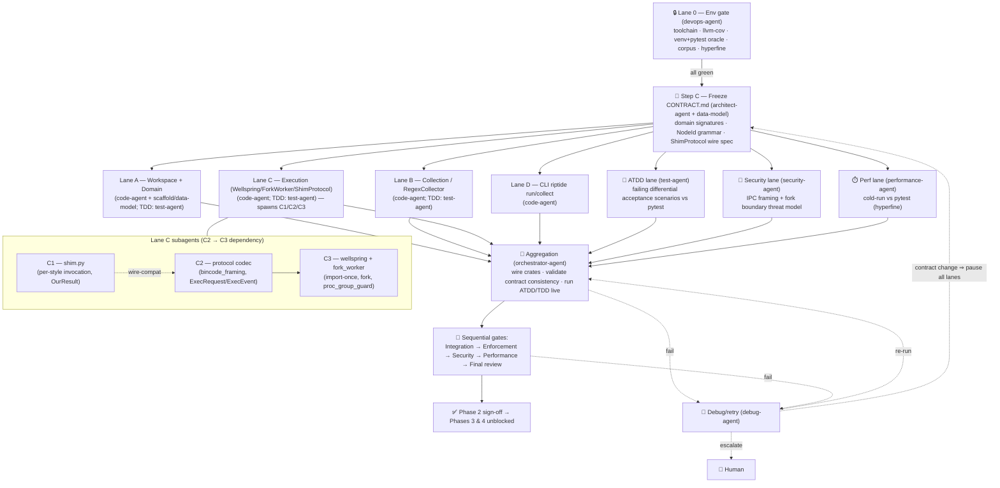

# Phase 2 — Workspace + Domain + Collection (Multiagent Implementation Plan)

> **Status:** 📋 PLAN — awaiting human approval. **No agent begins work, no code is written, and no
> subagent is spawned until this phase is approved.** This document is for human review only.
>
> **Shared scaffold (read first, not repeated here):** [PIPELINE.md](../PIPELINE.md) —
> conventions (§1), roster→roles (§2), env-gate doctrine (§3), implementation standards (§4),
> enforcement checkpoints (§5), test-strategy doctrine (§6), generic execution-map shape (§7),
> debug/retry/escalation (§8), cross-phase constraints (§9).
>
> **Roadmap context:** [ROADMAP.md](../ROADMAP.md) (Phase 2 row) · **Design:** [DESIGN.md](../DESIGN.md)
> · **Design docs consumed:** [01-architecture](../design/01-architecture.md),
> [02-domain-model](../design/02-domain-model.md), [03-collection](../design/03-collection.md),
> [05-execution-wellspring](../design/05-execution-wellspring.md),
> [10-test-styles](../design/10-test-styles.md) ·
> **ADRs validated here:** [ADR-E001](../design/adr/ADR-E001-pure-rust-engine-no-pytest.md),
> [ADR-E005](../design/adr/ADR-E005-workspace-trait-seams.md) · also exercised:
> [ADR-E002](../design/adr/ADR-E002-execution-substrate.md) (binary IPC),
> [ADR-E003](../design/adr/ADR-E003-fork-snapshot-isolation.md) (productionizing the Phase-1 fork bet).
>
> **Naming:** **Wellspring** (the warm CPython parent — never "zygote"); **Watermark(s)** for the
> layered snapshot points the Wellspring mints.

---

## 0. Scope

**Goal.** Productionize the Phase-1 fork/Wellspring spike into a real, structured foundation: a
Cargo **workspace**, the full I/O-free **domain model**, a source-scanning **`RegexCollector`**, a
**productionized** Wellspring + `ForkWorker` + `ShimProtocol` behind the `Worker` trait seam, and a
thin CLI (`riptide run`, `riptide collect`). The phase ends with a real end-to-end run of a
**fixture-free** corpus (pytest functions + `Test*` classes + `unittest.TestCase`) whose outcomes
match pytest **differentially**.

### 0.1 In scope (deliverable → design reference)

| # | Deliverable | Design reference |
|---|-------------|------------------|
| S1 | Cargo **workspace** with crates `engine-core` (lib), `engine-cli` (thin front-end), `py-shim` (Rust-shipped `shim.py`); workspace `Cargo.toml`, shared lints/profiles, `error.rs` (thiserror) | [01 §4](../design/01-architecture.md), [ADR-E005](../design/adr/ADR-E005-workspace-trait-seams.md) |
| S2 | **Domain model** in `engine-core/src/domain/`, **one type per file, snake_case filenames**: `NodeId`, `ScopePath` (+ `*Id` leaf newtypes), `Scope`, `TestItem`, `TestStyle`, `Fixture`, `FixtureRequest`, `Mark`, `Parametrization`, `ParamSet`, `Outcome`, `TestResult`, `Captured`, `RichDiff`, `RunReport`, `InputClosure`, `CacheKey` (shape only), plus leaf value types (`OutcomeTally`, `ParamValue`, `Duration` newtype, `SubExpr`, `LogRecord`, hash newtypes) | [02](../design/02-domain-model.md) (full catalogue §3; invariants §10) |
| S3 | **`Collector` trait + `RegexCollector`** (default, `Precision::Regex`) in `engine-core/src/collection/`: `collector.rs`, `regex_collector.rs`, `walk.rs` (tree-walk + ignore rules), `node_id_builder.rs`, `static_mark.rs`. Ports `tiderace/collector.rs`: indentation class/func regexes, `is_test_class` (pytest `Test*` **or** `*TestCase` base), `async def`, path normalization. Emits pytest-compatible `NodeId`s for: pytest functions, `Test*` class methods, `unittest.TestCase` methods (with class prefix — the Phase-1 W4 fix), async tests | [03](../design/03-collection.md) (§2, §4, §5), [10 §1](../design/10-test-styles.md) |
| S4 | **Productionized Wellspring + ForkWorker + ShimProtocol** in `engine-core/src/exec/` behind the **`Worker` trait** seam: `worker.rs` (trait + `WorkerCaps`), `wellspring.rs`, `fork_worker.rs`, `shim_connection.rs`, `bincode_framing.rs`, `exec_request.rs`, `exec_event.rs`, `proc_group_guard.rs` (ports `tiderace/procutil.rs` `set_process_group`/`kill_tree` verbatim). Carries forward Phase-1 spike learnings (import-once → fork-per-test → length-prefixed binary IPC → result) | [05](../design/05-execution-wellspring.md) (§2, §4.1, §5, §8), [ADR-E002](../design/adr/ADR-E002-execution-substrate.md), [ADR-E003](../design/adr/ADR-E003-fork-snapshot-isolation.md) |
| S5 | **`shim.py`** in `py-shim/`: receives framed `ExecRequest`, invokes the body per `TestStyle` (pytest fn `func(**args)`; `Test*` method `Cls().method()`; `unittest` `Cls(method).run(OurResult())` with the `OurResult` `unittest.TestResult` subclass), streams framed `ExecEvent`s, reports **raw** pass/fail (Rust applies disposition policy) | [10 §3–§6](../design/10-test-styles.md), [05 §5](../design/05-execution-wellspring.md), [ADR-E001](../design/adr/ADR-E001-pure-rust-engine-no-pytest.md) |
| S6 | **CLI** `engine-cli`: `riptide run` (collect → fork-run → tally `RunReport` → process exit code) and `riptide collect` (list `NodeId`s, no execution). Thin front-end over `engine-core` (DIP) | [01 §2](../design/01-architecture.md), `tiderace/main.rs` (CLI shape port-forward) |
| S7 | **`CONTRACT.md`** phase artifact (see §0.5): frozen domain type signatures + `NodeId` format + the `ShimProtocol` wire spec (`ExecRequest`/`ExecEvent` framing) that Phases 3–7 consume | [02](../design/02-domain-model.md), [05 §5](../design/05-execution-wellspring.md) |
| S8 | **Conformance corpus** (Lane 0 deliverable): fixture-free pytest fns + `Test*` classes + `unittest.TestCase`, incl. a state-mutation isolation pair + a crash test + a timeout test, generated deterministically by extending `benchmarks/fixtures/generate.py` | [03 §4](../design/03-collection.md), env §3 |
| S9 | **Differential acceptance**: every corpus test's `Outcome` (and `NodeId`) matches pytest's disposition on the same corpus; fork isolation proven by the state-mutation pair; crash/timeout → `Outcome::Error` | [02 §8](../design/02-domain-model.md), [10 §6](../design/10-test-styles.md) |

### 0.2 Out of scope (later-phase **boundaries**, not stubs)

Per [PIPELINE §4.3](../PIPELINE.md), a later-phase feature is a **boundary**, not a stub — it is
simply not in scope and must not be faked with `pass`/`todo!`/placeholder returns. The domain types
that later phases fill (`Fixture`, `FixtureRequest`, `Parametrization`, `RichDiff`, `InputClosure`,
`CacheKey`) are **defined as data with their pure methods** this phase; the *machinery that
populates/consumes them* is the boundary.

| Deferred capability | Owning phase | Boundary statement |
|---------------------|--------------|--------------------|
| Native fixture graph, scopes, yield/finalizers, autouse, **Watermark snapshot layers**, fork-from-deepest, `reinit_after_fork`, `SubprocessWorker`, `MemoryGovernor` | Phase 3 | `ForkWorker` this phase forks from the **single** Layer-0/1 Wellspring (interpreter + project import only). No `WatermarkStack`, no wider-scope layers. `Fixture`/`FixtureRequest` types exist; the **graph/resolver does not**. |
| `@parametrize` expansion, full mark semantics, assertion introspection (`RichDiff` build + purity guard), `subTest`, `expectedFailure` mapping | Phase 4 | `Mark`/`Parametrization`/`ParamSet`/`RichDiff` types exist; `RegexCollector` records statically-recognized marks **verbatim** (`Skip`, `Custom`) but does **not** expand params or build diffs. `AssertionFailure` events are captured but not introspected. |
| Cache (content store, key builder, tiered), coverage (`sys.monitoring`), impact analysis | Phase 5 | `InputClosure`/`CacheKey` types exist (shape only, per [02 §10.4](../design/02-domain-model.md)); **no key is computed and no result is cached** this phase. `served_from_cache` is always `false`. |
| `LocalityScheduler`, warm daemon, JSON-RPC, FS watch, watch mode | Phase 6 | Execution this phase runs tests in collected order with a simple fixed worker fan-out (CPU count). No scheduler trait impl beyond trivial batching. |
| `AstCollector`, pytest-compat layer, reporters (JUnit/JSON/GitHub/SARIF), plugin host | Phases 3/4/7 | `Collector` trait admits `AstCollector` later; only `RegexCollector` ships now. CLI prints a terminal tally only. |
| **Fixtured tests** in the acceptance corpus | Phase 3 | Phase-2 acceptance uses a **fixture-free** corpus; any test requiring fixture injection is **excluded** from the corpus and **tracked as a known gap** (§9 G-2). |

### 0.3 Depends on (Phase 1 spike learnings — carried forward)

This phase **consumes the validated outputs of the Phase-1 fork/Wellspring spike** ([ROADMAP](../ROADMAP.md)
row 1; [05](../design/05-execution-wellspring.md), [ADR-E003](../design/adr/ADR-E003-fork-snapshot-isolation.md)):

- **D1 — go/no-go result.** Phase 1's go decision (import-once + `fork()`-per-test runs a real
  pytest fn **and** a `unittest.TestCase`, isolated, faster than fresh-process) is the precondition
  for `ForkWorker` being the default `Worker`. **If Phase 1 returned no-go**, this plan is
  materially invalidated and must be re-presented with `SubprocessWorker` as the default per the
  [ADR-E003 revisit trigger](../design/adr/ADR-E003-fork-snapshot-isolation.md) (escalation, [PIPELINE §8](../PIPELINE.md)).
- **D2 — IPC framing decision.** The spike's measured choice (bincode vs msgpack, open question
  [05 E-4](../design/05-execution-wellspring.md)) is inherited as the frozen payload codec for
  `BincodeFraming`; the `u32-LE length ++ payload` frame header is fixed regardless.
- **D3 — shim shape + fork-safety findings.** The spike's minimal `shim.py` invocation pattern and
  any observed fork hazards (thread-spawning imports, fd inheritance) carry forward as constraints
  on the productionized shim and on the single-layer fork point.
- **D4 — timeout/process-group machinery** validated in the spike ports forward verbatim from
  `tiderace/procutil.rs`.

### 0.4 Unblocks

- **Phase 3 (Fixtures + watermarks):** consumes the frozen `Worker`/`Wellspring` seam, the
  `ExecRequest.post_fork`/`reinit` fields (present in the wire spec, unused this phase), and the
  domain `Fixture`/`Scope`/`ScopePath` types to build the graph and Watermark layers.
- **Phase 4 (Styles + assertions):** consumes `TestStyle`, the per-style shim invocation seam, and
  the `ExecEvent::AssertionFailure` event already streamed but not yet introspected.
- Both phases depend on **`CONTRACT.md`** being frozen at the architect-contract step (§0.5).

### 0.5 ADRs validated + CONTRACT.md artifact

- **ADR-E001** is validated by S5/S9: a real `unittest.TestCase` runs via stdlib `case.run()` at
  method granularity with **no pytest and no unittest runner** underneath, and a pytest function
  runs natively — differentially matching pytest outcomes.
- **ADR-E005** is validated by S1–S4: the workspace exists, `engine-core` is a pure library with
  the `Worker` and `Collector` traits as DIP seams, front-end is thin, one-type-per-file holds.
- **`CONTRACT.md` (phase artifact).** Produced at the **architect-contract step** (Step C in §4),
  frozen **before** the parallel lanes unblock, and published in this phase folder. It is the frozen
  interface Phases 3–7 build against; any change to it mid-execution forces a contract-change pause
  ([PIPELINE §8](../PIPELINE.md), retry tier 3). Its exact published interface list is in §0.6 and
  echoed in the final summary.

### 0.6 CONTRACT.md — published interface list (frozen at Step C)

1. **Domain type signatures (frozen):** `NodeId`, `ScopePath`, `Scope`, `TestItem`, `TestStyle`,
   `Fixture`, `FixtureRequest`, `Mark`, `Parametrization`, `ParamSet`, `Outcome`, `TestResult`,
   `Captured`, `RichDiff`, `RunReport`, `InputClosure`, `CacheKey` — public field/method signatures
   exactly per [02 §3 catalogue](../design/02-domain-model.md), with the [02 §10 invariants](../design/02-domain-model.md)
   restated as the contract guarantees downstream phases may rely on.
2. **`NodeId` format (frozen):** the pytest-byte-compatible string grammar
   `file.py[::Class]::func[\[param-id\]]`, with the `file()/class()/func()/param_id()` accessors and
   path-normalization rule (strip leading `./`).
3. **`ShimProtocol` wire spec (frozen):** frame header `u32 length (LE) ++ payload`; the
   `ExecRequest` field set (`node_id`, `style`, `post_fork`, `reinit`, `fixture_args`,
   `capture_caps`, `deadline`) and the `ExecEvent` variant set (`Started`, `Stdout`, `Stderr`,
   `Log`, `AssertionFailure`, `CoverageDelta`, `FixtureError`, `Finished`) per [05 §5.2](../design/05-execution-wellspring.md),
   with the payload codec fixed by Phase-1 D2. Forward-compatible fields (`post_fork`, `reinit`,
   `CoverageDelta`) are **present in the spec but carry empty/no values** this phase — they are the
   frozen seam Phases 3 and 5 fill without a wire-format change.

---

## 1. Conventions

See [PIPELINE §1](../PIPELINE.md) (loaded conventions table + standing gaps G-C1..G-C4). **Phase-2
emphasis:**

- **One type per file, snake_case filenames** is load-bearing this phase — the domain layer is ~20
  files and the enforcement gate greps for multi-type files ([PIPELINE §5](../PIPELINE.md)).
- **`Result`/`?`, `thiserror`, no panics in `engine-core`** — the `error.rs` typed-error model
  ([01 §4](../design/01-architecture.md), [13](../design/13-cross-cutting.md)) is established here as
  the workspace's error spine.
- **G-C3 (no Python convention)** bites this phase because `shim.py` is first written here. The
  plan **proposes adding `.claude/conventions/languages/python.md`** (PEP 8, fully type-annotated,
  minimal) and the security/enforcement lanes hold `shim.py` to it.
- **Understand-before-applying** ([PIPELINE §4.4](../PIPELINE.md)): each subagent touching the fork
  boundary or IPC framing must state *why* (why fork-from-single-Wellspring now, why length-prefixed
  framing, why the `Worker` trait seam) in its output.

---

## 2. Roster

See [PIPELINE §2](../PIPELINE.md) (24 agents → pipeline roles, subagent map). **Phase-2 emphasis:**
the execution lane (Lane C) is the deepest and **spawns its own subagents** (C1/C2/C3, §5); the
integration-verification role has no dedicated agent and is assigned to `test-agent` (live
differential run vs pytest), gated by `orchestrator-agent`, exactly as [PIPELINE §2](../PIPELINE.md)
specifies. No fabricated agents.

---

## 3. Environment manifest (Lane 0)

`devops-agent` runs the [PIPELINE §3](../PIPELINE.md) env gate and emits
`phase-2-workspace-domain-collection/env-manifest.md` at execution time (same format as the
[Phase-1 manifest](../../../completed/phase-1-hardening-benchmarks/env-manifest.md)). The phase
needs:

| # | Item | Provisioned by | Health check |
|---|------|----------------|--------------|
| E1 | Rust toolchain + `clippy` + `rustfmt` | pre-installed / verify | `cargo --version && cargo clippy --version && rustfmt --version` |
| E2 | `cargo-llvm-cov` | pre-installed / `cargo install` | `cargo llvm-cov --version` |
| E3 | Isolated **venv (3.12+)** via **uv** with **pytest baseline** (the differential oracle) | `uv venv` + `uv pip install pytest` (stdlib `venv` may be unavailable — Phase-1 deviation) | `./.venv/bin/python -V` (≥3.12) and `python -c "import pytest"` |
| E4 | **Fixture-free conformance corpus** — extend `benchmarks/fixtures/generate.py` deterministically to emit: pytest functions, `Test*` classes, `unittest.TestCase` subclasses, a **state-mutation isolation pair** (test A mutates module/global state, test B asserts it is pristine — proves fork isolation), a **crash test** (e.g. `os.abort()`/segfault), and a **timeout test** (infinite loop). Fixtured tests **excluded** (§0.2, §9 G-2). | `python benchmarks/fixtures/generate.py --no-fixtures …` (new flag) | `pytest -q <corpus>` produces a stable baseline disposition map (the oracle) |
| E5 | `hyperfine` | `cargo install hyperfine` | `hyperfine --version` |
| E6 | Branch + mandatory session | `git checkout -b feat/...` + session file | `git branch --show-current` |

**Gate rule:** all-green before any other lane unblocks; an un-startable item (e.g. no `fork`
support on the host, no Python ≥3.12) is a **hard blocker** surfaced immediately
([PIPELINE §3](../PIPELINE.md)).

---

## 4. Execution map (this phase)

Specializes the [PIPELINE §7](../PIPELINE.md) shape. **Step C freezes `CONTRACT.md` before lanes
unblock** — this is the critical synchronization point because every parallel lane builds against the
frozen domain signatures + wire spec.

**Lane parallelism:** Lanes A/B/C/D + ATDD + security + perf run **concurrently after Step C**.
Lane C internally sequences **C2 (codec) → C3 (wellspring+fork-worker)** because the worker depends
on the frame codec; **C1 (shim) develops in parallel with C2** but must converge on the C2 wire
format (the dotted wire-compat edge). TDD subagents are paired to A/B/C and run alongside (not
after) implementation ([PIPELINE §6](../PIPELINE.md)).

---

## 5. Subagent spec table

| Lane / role | Agent | Subagent(s) | Deliverable | Inputs (frozen) | Done = |
|-------------|-------|-------------|-------------|-----------------|--------|
| Step C | `architect-agent` (+`plan-agent`) | `data-model`, `task-breakdown` | **`CONTRACT.md`** frozen (§0.6) | 02, 05 §5, Phase-1 D2 | All §0.6 items signed off; lanes may unblock |
| **A** Workspace+domain | `code-agent` | `scaffold`, `data-model`, `boilerplate` | Workspace (S1) + all domain types (S2) | `CONTRACT.md` | `cargo build` green; types compile; invariant methods (`Scope::outlives`, `Outcome::is_failure/counts_against_run`, `RunReport::exit_code`, `NodeId` accessors) implemented + unit-tested |
| A-TDD | `test-agent` | `testing`, `quality` | Domain unit tests (happy/boundary/null/error) | A types | ≥80/70 coverage on `domain/`; ordering/equality/serde round-trip proven |
| **B** Collection | `code-agent` | `code` | `Collector` trait + `RegexCollector` (S3) | `CONTRACT.md`, `tiderace/collector.rs` | Collects corpus into correct `NodeId`s incl. unittest class-prefix (W4) + async + `Test*` methods |
| B-TDD | `test-agent` | `testing`, `quality` | Collection unit tests | B impl | Ports + extends `tiderace/collector.rs` test module; new `TestStyle`/`is_async`/`marks` assertions; ≥80/70 |
| **C** Execution | `code-agent` | **C1, C2, C3** (below) | Wellspring + ForkWorker + ShimProtocol behind `Worker` (S4, S5) | `CONTRACT.md` wire spec, Phase-1 D1–D4 | Real fork-per-test run streams `ExecEvent`s; `proc_group_guard` ports `procutil` |
| C1 shim | `code-agent` (Lane C) | — | `py-shim/shim.py`: framed I/O, per-`TestStyle` invocation, `OurResult` `unittest.TestResult` subclass, raw pass/fail | wire spec (C2), 10 §3–§6 | Runs all three styles; PEP 8 + typed (proposed `python.md`) |
| C2 codec | `code-agent` (Lane C) | — | `bincode_framing.rs`, `exec_request.rs`, `exec_event.rs`, `shim_connection.rs` | wire spec | Frame round-trips arbitrary bytes (incl. `\n\0`) in node ids/tracebacks; **C3 blocks on this** |
| C3 wellspring+worker | `code-agent` (Lane C) | — | `wellspring.rs` (import-once), `fork_worker.rs`, `worker.rs` trait + `WorkerCaps`, `proc_group_guard.rs` | C2 codec, Phase-1 D1/D3/D4 | Import once → fork per test → run body → stream → exit; timeout/crash → `kill_tree` |
| C-TDD | `test-agent` | `testing` | Exec unit + integration tests (Python boundary **not mocked**) | C impl | Real `python`+real shim fork/exec tests; framing round-trip; crash/timeout→`Error` |
| **D** CLI | `code-agent` | `code` | `engine-cli`: `riptide run`, `riptide collect` (S6) | `engine-core` API | `run` returns correct exit code from `RunReport::exit_code()`; `collect` lists ids |
| **ATDD** | `test-agent` | `testing` | Failing differential acceptance scenarios (the spec) **before** code | corpus + pytest oracle | Scenarios assert per-test `Outcome` == pytest disposition; isolation pair; crash/timeout→`Error` |
| **Security** | `security-agent` | `threat-model`, `vulnerability-assessment-specialist`, `security-architecture-reviewer` | Threat model of IPC framing + fork boundary | wire spec, exec design | No frame-injection via node id/traceback; fd/env inheritance reviewed; child cannot corrupt Wellspring |
| **Perf** | `performance-agent` | `benchmarking`, `bottleneck-analysis` | Cold-run `riptide run` vs `pytest` on corpus (hyperfine) | corpus, built CLI | Measured + recorded; backs the [05 §11](../design/05-execution-wellspring.md) budget claims (honest floor noted) |

---

## 6. Enforcement

See [PIPELINE §5](../PIPELINE.md) (checkpoint matrix). **Phase-2 specifics** the
`enforcement-agent` (+`house-style`) verifies at the gate:

- **One-type-per-file / snake_case** across `domain/` (~20 files), `collection/`, `exec/` — a
  multi-type file fails the gate.
- **No-stubs grep** (`pass`, `TODO`, `unimplemented!`, `todo!`, `NotImplementedError`, placeholder
  returns, commented-out logic) across `engine-core` **and** `shim.py`. The out-of-scope domain
  fields (`Fixture`, `Parametrization`, etc.) must be **real data definitions with their pure
  methods**, not stubs — a `todo!()` body fails; an honest "graph resolver is Phase 3" boundary in
  `CONTRACT.md` does not ([PIPELINE §4.3](../PIPELINE.md)).
- **`clippy -Dwarnings` + `rustfmt`**, no `unwrap`/`panic!` in `engine-core` lib paths.
- **`shim.py`** held to PEP 8 + full type annotations (proposed `python.md`, G-C3).
- **Coverage ≥80% line / ≥70% branch** on `domain/`, `collection/`, `exec/` (G-C2).
- **Understand-before-applying** justification present for the fork-point, framing, and trait-seam
  choices.

---

## 7. Test strategy

Per [PIPELINE §6](../PIPELINE.md): **ATDD first, TDD in parallel; the Python boundary is never
mocked.**

- **Oracle.** The differential oracle is **pytest** run in the Lane-0 venv against the **same
  fixture-free corpus**. The ATDD lane captures pytest's per-`NodeId` disposition map first, then
  asserts `riptide run` produces the identical `Outcome` per `NodeId` (and identical collected
  `NodeId` set). This is the [PIPELINE §6](../PIPELINE.md) "differential vs pytest where an oracle
  exists" rule made concrete for this phase.
- **ATDD scenarios (authored before code):** (a) collected `NodeId` set == pytest's (incl. unittest
  class-prefixed ids); (b) every passing/failing/skipped test's `Outcome` matches pytest; (c) the
  **state-mutation isolation pair** both pass under `riptide` (proving fork isolation) where they
  would interfere under shared state; (d) the **crash** test → `Outcome::Error` (not `Failed`); (e)
  the **timeout** test → `Outcome::Error` with the carried-forward timeout note.
- **TDD (parallel, per lane):** domain pure-logic tested directly (ordering, equality, serde
  round-trip, `exit_code`); collection tested by porting + extending the existing
  `tiderace/collector.rs` test module; **execution tested against real `python` + the real shim**
  (fork/exec, framing round-trip incl. embedded `\n`/`\0`, crash/timeout edges) — **no mock of the
  Python boundary** ([PIPELINE §6](../PIPELINE.md)).
- **Coverage gate** at enforcement: ≥80/70.

---

## 8. Integration verification

The phase's one **real, verified integration** ([PIPELINE §4.1](../PIPELINE.md)) is the
**Rust ↔ CPython boundary**: subprocess + shim + `fork()` + length-prefixed binary IPC. Assigned to
`test-agent` (live run), gated by `orchestrator-agent`. **Not** "passes against a mock." Verified
items:

| # | Boundary assertion | How verified |
|---|--------------------|--------------|
| I1 | **Handshake** — Wellspring boots, loads shim, imports the corpus once; Rust reads readiness over the framed pipe | live; assert ready event before any `ExecRequest` |
| I2 | **Real outcomes** — a real pytest fn, a real `Test*` method, and a real `unittest.TestCase` method each run and report a correct raw pass/fail mapped to `Outcome` | live, all three styles |
| I3 | **Differential vs pytest** — per-`NodeId` `Outcome` map equals pytest's on the full corpus | ATDD diff against oracle |
| I4 | **Fork isolation** — the state-mutation pair both pass; mutation in child A is invisible to child B | live; failure here = isolation regression (blocker) |
| I5 | **Crash → `Outcome::Error`** — a child that segfaults/`os.abort()`s is reaped via `kill_tree`, recorded `Error`, siblings unaffected | live crash test |
| I6 | **Timeout → `Outcome::Error`** — a hung child is killed by process-group `kill_tree` on deadline, recorded `Error` with the timeout note; Wellspring survives | live timeout test |
| I7 | **Frame integrity** — node ids/tracebacks containing `\n`/`\r`/`\0` round-trip verbatim (no second-frame forgery) | unit + live |

An unverifiable integration is a **hard blocker** ([PIPELINE §3/§8](../PIPELINE.md)).

---

## 9. Gap report

| ID | Gap | Disposition |
|----|-----|-------------|
| G-1 | **Phase-1 dependency.** A Phase-1 **no-go** invalidates the `ForkWorker`-as-default premise and forces a `SubprocessWorker`-default re-plan ([ADR-E003 revisit](../design/adr/ADR-E003-fork-snapshot-isolation.md)). | **Blocking precondition** — confirm Phase-1 go before approval. |
| G-2 | **Fixtured tests excluded from acceptance.** The Phase-2 corpus is fixture-free; any fixture-requiring test is excluded and deferred to Phase 3. | **Known, accepted boundary** ([0.2](#02-out-of-scope-later-phase-boundaries-not-stubs)); tracked for Phase-3 corpus extension. |
| G-3 | **Single fork layer only.** No `WatermarkStack`/wider-scope snapshots this phase — `ForkWorker` forks from the Layer-0/1 Wellspring. Performance win is bounded by import-once amortization, **not** the full fixture-layer win. | **Accepted** — perf lane reports against this honest floor ([05 §11](../design/05-execution-wellspring.md)); full win lands Phase 3. |
| G-4 | **G-C3 — no Python convention** for `shim.py`. | **Resolve before Lane C unblocks:** propose + add `.claude/conventions/languages/python.md`. |
| G-5 | **G-C1/G-C2 — placeholder core/testing conventions.** | Use engine ADRs + `rust.md` + coverage skill, ≥80/70 ([PIPELINE §1](../PIPELINE.md)). |
| G-6 | **IPC codec (E-4).** bincode vs msgpack inherited from Phase-1 D2; frame header fixed regardless. | **Resolved by D2;** revisit only on the [05 E-4](../design/05-execution-wellspring.md) trigger. |
| G-7 | **`needs_import_finalize` residue.** `RegexCollector` conservatively flags ambiguous marks/params it cannot fold; lazy finalize is **not** built this phase. | **Boundary** — flagged items are excluded from the fixture-free corpus; finalize lands with fixtures/params (Phase 3/4). |

---

## 10. Debug & retry

See [PIPELINE §8](../PIPELINE.md) for the full escalation logic. **Phase-2 specifics:**

- **Owner:** `debug-agent` (+`root-cause`, `triage`, `rubber-duck`).
- **Most likely failure surfaces** (each emits expected-vs-actual + owning lane/subagent + repro
  command): differential mismatch vs pytest (I3, owner ATDD/Lane B or C); fork-isolation leak (I4,
  Lane C); crash/timeout misclassified as `Failed` not `Error` (I5/I6, Lane C result builder);
  frame desync / partial read (I7, C2); fork-unsafe import in the corpus deadlocking the child
  (Lane C / corpus).
- **Retry tiers:** (1) subagent retry (e.g. C2 codec only) → (2) full-lane retry (Lane C) → (3)
  **a change to `CONTRACT.md` (domain signature or wire spec) ⇒ pause ALL lanes and re-present the
  plan**, because every parallel lane built against the frozen contract.
- **Escalate to human** when a gate fails **twice**, on any **hard blocker** (no `fork`, no Python
  ≥3.12, unverifiable Rust↔CPython integration, fork+C-ext crash that survives `kill_tree`), or any
  Phase-1-go reversal. On escalation, **all lanes pause** ([PIPELINE §9](../PIPELINE.md)).
</content>
</invoke>
