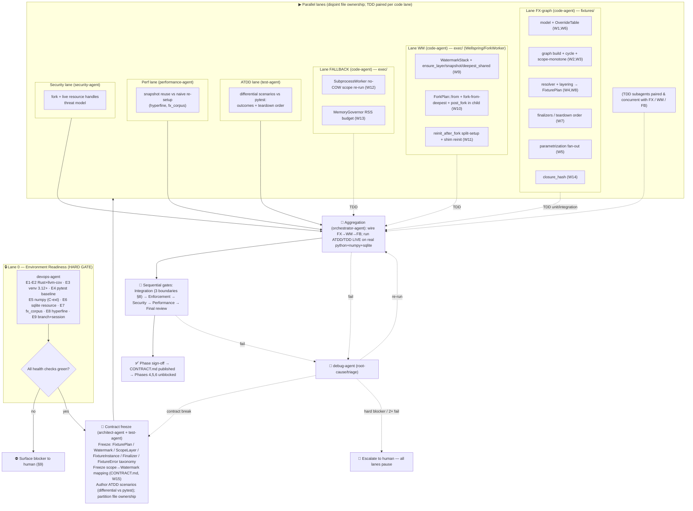

# Phase 3 — Fixtures + Watermarks

> **Status:** ✅ **DELIVERED & merged to `main_v2`.** Live status: [ROADMAP-v2](../ROADMAP-v2.md). Original plan preserved below for history.
> **Owner:** orchestrator-agent · **Persona:** Software Engineer · **Date:** 2026-06-15
> **Shared scaffold (do not repeat — referenced):** [PIPELINE.md](../PIPELINE.md) ·
> **Roadmap:** [ROADMAP.md](../ROADMAP.md) · **Design:** [DESIGN.md](../DESIGN.md)
> **Primary design docs:** [04-fixture-graph](../design/04-fixture-graph.md) ·
> [05-execution-wellspring](../design/05-execution-wellspring.md) ·
> [ADR-E003](../design/adr/ADR-E003-fork-snapshot-isolation.md) (this phase **validates the layers**)

This plan specializes the shared multiagent scaffold for Phase 3. The conventions loaded
([PIPELINE §1](../PIPELINE.md#1-conventions-loaded)), the agent roster→role mapping
([§2](../PIPELINE.md#2-agent-roster--pipeline-roles-24-agents--70-subagents--5-skills)), the Lane 0
environment doctrine ([§3](../PIPELINE.md#3-environment-gate-doctrine-lane-0--every-phase)), the
implementation standards ([§4](../PIPELINE.md#4-implementation-standards-enforced-as-passfail-at-gates)),
the enforcement checkpoints ([§5](../PIPELINE.md#5-convention-enforcement-checkpoints)), the
test-strategy doctrine ([§6](../PIPELINE.md#6-test-strategy-doctrine)), the generic execution-map
shape ([§7](../PIPELINE.md#7-generic-execution-map-shape-each-phase-specializes-it)), and the
debug/retry/escalation logic ([§8](../PIPELINE.md#8-debug--retry--escalation-every-phase)) all apply
verbatim and are **not** restated here — only what is specific to this phase is below.

---

## 0. Phase scope

**Goal:** native fixture dependency injection with **no pytest underneath**
([ADR-E001](../design/adr/ADR-E001-pure-rust-engine-no-pytest.md)), and the mapping of fixture
scopes onto **Wellspring** memory snapshot layers (**Watermarks**) — the load-bearing performance
mechanism that turns an *N×* fixture cost into a *1×* cost
([04 §4](../design/04-fixture-graph.md#4-scopes-as-snapshot-layers--the-load-bearing-performance-link),
[05 §3](../design/05-execution-wellspring.md#3-the-layered-snapshot-stack), [ADR-E003](../design/adr/ADR-E003-fork-snapshot-isolation.md)).

Each work item (W#) is traceable to a lane (§4) and a verification (§7–§8).

| ID | Work item | Why it matters | Design ref |
|----|-----------|----------------|------------|
| W1 | `Fixture` model + `OverrideTable` (name, scope, deps, autouse, params, is_yield, reinit_after_fork, scope_path) | The user-facing DI contract; the spine of the phase | [04 §1](../design/04-fixture-graph.md#1-the-fixture-model), [04 §3](../design/04-fixture-graph.md#3-classifier-diagram--fixture-subsystem) |
| W2 | `FixtureGraph` build: resolve dep names via nearest-override, insert nodes/edges | Single source of truth for ordering + closure | [04 §2](../design/04-fixture-graph.md#2-the-fixturegraph) |
| W3 | **Cycle detection** (3-color DFS → `FixtureError::Cycle{path}`) + **scope-monotonicity** check (`FixtureError::ScopeWiden`) | Guarantees layers in §4 are well-formed; no deadlock at setup | [04 §2.2](../design/04-fixture-graph.md#22-cycle-detection--scope-ordering-invariant) |
| W4 | Topological **setup order** + **reverse teardown order** per scope + **transitive closure** per `TestItem` (requested + autouse) | Correct setup/teardown sequencing; what makes finalizers ordered | [04 §2.1](../design/04-fixture-graph.md#21-responsibilities), [04 §6](../design/04-fixture-graph.md#6-activity--build-graph-topo-order-snapshot-layer-assignment) |
| W5 | **Parametrized fixtures** → cartesian fan-out into `FixtureInstance`s, each with its own `closure_hash` | Parameter variants cache independently; multiplies dependent tests | [04 §1.3](../design/04-fixture-graph.md#13-parametrized-fixtures), [04 §8](../design/04-fixture-graph.md#8-feeding-the-cache-key-link-to-adr-e004--07-cache) |
| W6 | **Override-by-location / conftest-like layering** (`(name, ScopePath)` longest-prefix match) | pytest fidelity: nearer module/conftest shadows farther | [04 §1.4](../design/04-fixture-graph.md#14-override-by-location-conftest-like-layering) |
| W7 | **Yield-style teardown / finalizers** — captured per active instance, run in strict reverse order at owning scope exit | Correct teardown; snapshotted-scope finalizers run **once**, function finalizers per child | [04 §1.1](../design/04-fixture-graph.md#11-yield-style-teardown--finalizers) |
| W8 | `LayeredResolver` → `FixturePlan` (layers, `fork_from`, `post_fork`, `closure_hash`) + bin instances into `ScopeLayer`s | The deliverable the executor + scheduler consume | [04 §4.1–4.2](../design/04-fixture-graph.md#41-the-fork-from-the-deepest-applicable-snapshot-plan) |
| W9 | **Watermark snapshot layers** in `Wellspring`/`WatermarkStack`: `ensure_layer`, `snapshot(scope)`, `WatermarkStack::deepest_shared`, `invalidate_from`, `retire_layer` | The session→module→class layer stack the whole thesis rides on | [05 §3](../design/05-execution-wellspring.md#3-the-layered-snapshot-stack), [05 §2](../design/05-execution-wellspring.md#2-classifier-class-diagram--the-execution-subsystem) |
| W10 | **Fork-from-deepest-applicable-Watermark** (`ForkPlan::from(FixturePlan, WatermarkStack)`) + **function-scope setup post-fork** in the child | The per-test isolation cost ≈ `fork + post_fork + body` | [05 §3.1](../design/05-execution-wellspring.md#31-fork-from-the-deepest-applicable-snapshot), [04 §5](../design/04-fixture-graph.md#5-sequence--resolving--setting-up-fixtures-across-layers-and-post-fork) |
| W11 | **`reinit_after_fork`** split-setup: pure part snapshotted at declared scope; fork-fragile handle in `ScopeLayer.reinit_in_child`, rebuilt in child (via `ExecRequest.reinit`) | Non-fork-safe resources (DB conns, sockets, file handles) get a **fresh** handle per child, never a corrupted inherited one | [04 §4.3](../design/04-fixture-graph.md#43-non-fork-safe-resources-reinit_after_fork), [05 §6.1–6.2](../design/05-execution-wellspring.md#61-fork--threads) |
| W12 | **`SubprocessWorker` no-COW fallback path** — re-run wider-scope setup **once per worker**, function setup/teardown per test, wider-scope finalizers once at batch end | Correct degraded path on Windows / `--no-fork` / fork-unsafe; produces identical results | [05 §7](../design/05-execution-wellspring.md#7-the-no-cow-fallback-path-subprocessworker), [ADR-E008](../design/adr/ADR-E008-cross-platform.md) |
| W13 | **`MemoryGovernor`** — bound concurrent forks by RSS budget (`min(cpu, rss_budget / per_fork_estimate)`), seeded from `Watermark.rss_bytes`, refined by observed child RSS | Prevents COW write-amplification OOM under fixture-heavy suites | [05 §6.3](../design/05-execution-wellspring.md#63-cow-write-amplification--bound-concurrency-by-memory) |
| W14 | `closure_hash` over the post-override, post-parametrization transitive fixture closure | The `fixture_closure` term of the [ADR-E004](../design/adr/ADR-E004-content-addressed-cache.md) cache key; consumed by Phase 5 | [04 §8](../design/04-fixture-graph.md#8-feeding-the-cache-key-link-to-adr-e004--07-cache) |
| W15 | **CONTRACT.md** — publish the fixture-scope→Watermark-layer mapping + `FixturePlan`/`Watermark`/`ScopeLayer` interfaces for Phases 4–6 | Phases 4, 5, 6 consume these; freezing them is a phase deliverable | this phase |

### In scope (boundaries, explicit)
- The `FixtureGraph` from [04](../design/04-fixture-graph.md): DI, the **5 scopes**
  (`Function`/`Class`/`Module`/`Package`/`Session`), yield-style teardown/finalizers, autouse,
  fixture-overrides-by-location/conftest-like layering, parametrized fixtures.
- Cycle detection + topo setup order + reverse teardown order + transitive closure.
- **Watermark snapshot layers** (session→module→class) with fork-from-deepest-applicable-Watermark
  and function-scope setup post-fork.
- `reinit_after_fork` for non-fork-safe resources (DB connections, file handles).
- `SubprocessWorker` no-COW fallback path (re-run scope setup).
- `MemoryGovernor` to bound fork concurrency by RSS budget.

### Out of scope (owned by later phases — **not stubs**, simply not this phase, per [PIPELINE §4.3](../PIPELINE.md#4-implementation-standards-enforced-as-passfail-at-gates))
- Test-level `@parametrize` / marks + assertion introspection / `RichDiff` / purity guard →
  **Phase 4** ([09](../design/09-assertions.md), [10](../design/10-test-styles.md)). (Fixture-level
  parametrization **is** in scope; test-level is not.)
- `sys.monitoring` coverage, `DepGraph`, `ImpactAnalyzer`, content-addressed cache store/index →
  **Phase 5** ([07](../design/07-cache.md), [11](../design/11-coverage-impact.md)). We **emit** the
  `closure_hash` term (W14) but do **not** build the cache that consumes it.
- `LocalityScheduler` (duration-aware LPT + scope locality), warm daemon, snapshot retirement/RSS
  reclaim policy across runs → **Phase 6** ([06](../design/06-scheduler.md),
  [08](../design/08-daemon.md)). Phase 3 produces Watermarks and the `MemoryGovernor` *input* the
  scheduler will later size fan-out from; it does not schedule.

### Depends on (Phase 2 deliverables — consumed, not rebuilt)
Cargo **workspace** + domain model (`NodeId`, `Scope`, `TestItem`, `TestStyle`, `TestResult`,
`Outcome`, `ScopePath`, `Captured`), the productionized `Wellspring`/`ForkWorker`/`ShimProtocol`
(`BincodeFraming`, `ShimConnection`, `ExecRequest`/`ExecEvent`), and Phase 2's **`CONTRACT.md`**.
Phase 3 **extends** `ExecRequest` with `post_fork`/`reinit` consumption and adds the snapshot-layer
methods to `Wellspring`; it does not re-implement the fork/IPC primitives.

### Unblocks
Phases **4, 5, 6** (ROADMAP dependency graph). **Validates ADR-E003 (the layers)** end-to-end on a
real C-extension + non-fork-safe resource stack.

---

## 1. Conventions loaded (delta only)

All of [PIPELINE §1](../PIPELINE.md#1-conventions-loaded) applies. Phase-specific notes:

- **G-C1 / G-C2 / G-C3 / G-C4** standing gaps are inherited from PIPELINE; no new convention gaps
  are introduced by this phase.
- **C-FX (new, this phase):** the fixture **error taxonomy** is a public contract surface.
  `FixtureError::{Cycle{path}, ScopeWiden{narrow, wide}, Unresolved{name, scope_path},
  DuplicateAutouse, ParamShapeMismatch}` are `thiserror` types per
  [rust.md](../../../.claude/conventions/languages/rust.md); they are frozen at the contract step
  (§4) because Phase 4/5/7 report on them. **Needs ratification at the contract step**, not invented
  mid-lane.
- The Python **shim** changes (run `post_fork` fixtures + `reinit` in the child; register
  `Finalizer` continuations) follow **G-C3**'s proposed `python.md` (PEP 8, fully type-annotated,
  minimal). The shim stays *dumb* — ordering/policy lives in Rust
  ([05 §5.2](../design/05-execution-wellspring.md#52-messages)).

---

## 2. Discovered agent roster → pipeline role (delta only)

Roster + role mapping is [PIPELINE §2](../PIPELINE.md#2-agent-roster--pipeline-roles-24-agents--70-subagents--5-skills).
Phase-3 lane→agent assignment (TDD subagents **paired** with each code lane per
[§6](../PIPELINE.md#6-test-strategy-doctrine)):

| Phase-3 lane | Agent | Spawns (per concern) |
|---|---|---|
| Lane 0 — Env gate | `devops-agent` | `devops` (toolchain, venv, C-ext + sqlite resource stack, conformance corpus, hyperfine) |
| Contract freeze | `architect-agent` (+ `plan-agent`) | `data-model`, `scaffold`, `task-breakdown` |
| **Lane FX-graph** (W1–W8, W14) | `code-agent` | `scaffold`, `code` — **spawns one subagent per concern**: model+override, graph-build+cycle, resolver+layering, finalizers, parametrization, closure-hash |
| **Lane WM** (W9–W11) | `code-agent` | `code` — watermark layering inside `Wellspring`/`ForkWorker`; fork-from-deepest; `reinit_after_fork` |
| **Lane FALLBACK** (W12–W13) | `code-agent` | `code` — `SubprocessWorker` no-COW scope re-run + `MemoryGovernor` |
| **ATDD lane** | `test-agent` | `testing` — differential acceptance scenarios vs pytest (authored before code) |
| **TDD subagents** (paired, concurrent) | `test-agent` | `testing`, `quality` — one per code lane |
| **Perf lane** | `performance-agent` | `benchmarking`, `profiling`, `bottleneck-analysis` — snapshot reuse vs naive re-setup |
| **Security lane** | `security-agent` | `threat-model`, `vulnerability-assessment-specialist`, `security-architecture-reviewer` — fork + live resource handles |
| Aggregation / gates | `orchestrator-agent` | — |
| Enforcement | `enforcement-agent` | `house-style` |
| Verify | `review-agent` | `review`, `quality` |
| Debug / retry | `debug-agent` | `root-cause`, `triage`, `rubber-duck` |

**No role lacks an agent.** Integration verification (the three boundaries in §8) has no dedicated
agent → assigned to `test-agent` (live differential run on the real Python/resource boundary), gated
by `orchestrator-agent`, exactly per [PIPELINE §2](../PIPELINE.md#2-agent-roster--pipeline-roles-24-agents--70-subagents--5-skills).

---

## 3. Environment manifest (Lane 0 — hard prerequisite gate)

Per [PIPELINE §3](../PIPELINE.md#3-environment-gate-doctrine-lane-0--every-phase): the `devops-agent`
**starts/verifies everything itself** — the human is never asked to run a command. Nothing else
unblocks until every health check passes. Output is `phase-3-fixtures-watermarks/env-manifest.md` in
the format of the [Phase 1 manifest](../../completed/phase-1-hardening-benchmarks/env-manifest.md)
(produced **at execution time**, not now).

| # | Service / process | Purpose | Start / provision | Health check |
|---|---|---|---|---|
| E1 | Rust toolchain (cargo, rustc, clippy, rustfmt) | Build, lint, format, test the workspace | verify present | `cargo --version && cargo clippy --version && rustfmt --version` |
| E2 | `cargo-llvm-cov` | Coverage vs ≥80 line / ≥70 branch (G-C2) | verify / `cargo install` | `cargo llvm-cov --version` |
| E3 | Isolated venv, CPython **3.12+** | Reproducible Python substrate, no system pollution | `uv venv` (per Phase 1 deviation — `ensurepip` may be absent) | `./.tiderace-fx-venv/bin/python -V` → 3.12+ |
| E4 | **pytest baseline** (in venv) | Differential oracle for outcomes + teardown order | `uv pip install pytest` | `python -c "import pytest"` |
| E5 | **Real C-extension (numpy)** — fork-from-warm native stack | Exercise fork-from-warm against a real native extension (E-2 hazard) | `uv pip install numpy` | `python -c "import numpy; print(numpy.__version__)"` |
| E6 | **In-memory sqlite connection fixture** (non-fork-safe resource) | The `reinit_after_fork` integration boundary (boundary 2, §8) — verify child gets a **fresh** connection | stdlib `sqlite3` (no install) + corpus fixture acquires `sqlite3.connect(":memory:")` | `python -c "import sqlite3; sqlite3.connect(':memory:')"` |
| E7 | **Fixture-heavy conformance corpus** (deterministic generator) | Shared target for ATDD + TDD + perf: session/module/class/function fixtures, autouse, overrides, yield teardown, parametrized fixtures | generate into `benchmarks/fixtures/fx_corpus/` (deterministic, like Phase 1's `generate.py`) | `pytest -q benchmarks/fixtures/fx_corpus` runs green; collects expected N |
| E8 | `hyperfine` | Statistically-sound wall-time benchmarking (perf lane) | verify / `cargo install` | `hyperfine --version` |
| E9 | Feature branch + session file | Governance (general.md) | pipeline creates `feat/...` (no ticket — G-C4) + session | `git branch --show-current`; session file valid |

**Why this stack (understand-before-applying, [PIPELINE §4.4](../PIPELINE.md#4-implementation-standards-enforced-as-passfail-at-gates)):**
numpy is a *real* native, fork-from-warm extension (not a toy) and an in-memory sqlite connection is
a genuinely non-fork-safe resource — together they exercise the two riskiest ADR-E003 hazards
(C-ext during fixture setup; a resource that silently survives fork and corrupts) on a real boundary.
**The Python/resource boundary is never mocked** ([PIPELINE §6](../PIPELINE.md#6-test-strategy-doctrine)).

**Stop/cleanup:** `rm -rf ./.tiderace-fx-venv .tiderace.db .tiderace-coverage` (all gitignored);
regenerate corpus deterministically anytime. Documented fully in the generated `env-manifest.md`.

**Network dependency risk:** E4–E5, E8 require downloads. Network-restricted sandbox ⇒ **hard
blocker** surfaced immediately (§9), not worked around.

---

## 4. Execution map

Specializes [PIPELINE §7](../PIPELINE.md#7-generic-execution-map-shape-each-phase-specializes-it).

**Concurrency honesty note.** Lanes are parallel **only where they touch disjoint paths**. Lane
FX-graph owns `crates/engine-core/src/fixtures/**` (one concern per subagent, one type per file).
Lanes WM and FALLBACK both edit `crates/engine-core/src/exec/**` — to avoid two-writer conflicts,
**WM owns `wellspring.rs` / `watermark_stack.rs` / `fork_plan.rs` / `fork_worker.rs`** while
**FALLBACK owns `subprocess_worker.rs` / `memory_governor.rs`**; the shared `ExecRequest`/`ExecEvent`
shapes are **frozen at the contract step** so neither lane changes them mid-run. The shim
(`crates/py-shim/shim.py`) is edited only by WM (post_fork + reinit + finalizer registration) to keep
a single writer. The only true serialization points are the **contract freeze** (before lanes) and
the **aggregation gate** (after all). A `FixturePlan` shape change mid-run invalidates WM/FB/ATDD in
flight ⇒ contract-change retry (§10), all lanes pause and re-present.

---

## 5. Subagent specification

| Subagent | Parent | Task scope | Inputs | Outputs | Convention constraints |
|---|---|---|---|---|---|
| env | devops-agent | Provision + health-check §3; branch + session | repo, Phase 2 workspace | `env-manifest.md`, green signal | gitignore artifacts; pin versions; `uv` per Phase 1 deviation |
| contract | architect-agent | Freeze `FixturePlan`/`Watermark`/`ScopeLayer`/`FixtureInstance`/`Finalizer` + `FixtureError` taxonomy + scope→Watermark mapping; write **CONTRACT.md** (W15); file-ownership map | [04], [05], Phase 2 CONTRACT.md | `CONTRACT.md`, frozen interfaces | typed `thiserror`; no signature churn mid-lane; trait DI seams |
| atdd-author | test-agent | Differential acceptance scenarios **before code** (outcomes + teardown order vs pytest on fx_corpus) | scope, fx_corpus | acceptance scenarios | test-coverage-categories; **no mocks at the python boundary** |
| fx-model | code-agent | W1 `Fixture` + W6 `OverrideTable` (nearest, longest-prefix) | CONTRACT.md | `fixtures/fixture.rs`, `override_table.rs` + `#[cfg(test)]` | `Result`/`?`; no stubs; one type/file |
| fx-graph | code-agent | W2 build + W3 cycle (3-color DFS) + scope-monotonicity | CONTRACT.md, fx-model | `fixture_graph.rs` + tests | typed `FixtureError`; no `unwrap`/`panic!` in lib |
| fx-resolver | code-agent | W4 topo/teardown/closure + W8 `LayeredResolver`→`FixturePlan` (bin into ScopeLayers, choose fork_from) | fx-graph | `layered_resolver.rs`, `fixture_plan.rs`, `scope_layer.rs` + tests | as above; justify layering algorithm vs [04 §4.2] |
| fx-finalizer | code-agent | W7 `Finalizer` capture + strict reverse-order teardown per scope | fx-graph | `finalizer.rs` + tests | snapshotted-scope finalizers run **once**; function per child |
| fx-param | code-agent | W5 parametrized fan-out → `FixtureInstance`s (cartesian) | fx-graph | `fixture_instance.rs` + tests | each instance distinct `closure_hash` |
| fx-hash | code-agent | W14 `closure_hash` over post-override/post-param transitive closure | fx-resolver, fx-param | `closure_hash.rs` + tests | matches `fixture_closure` term of ADR-E004 key |
| wm-stack | code-agent | W9 `WatermarkStack` + `Wellspring::ensure_layer/snapshot/retire_layer/invalidate_from`, `deepest_shared` | CONTRACT.md, Phase 2 Wellspring | `watermark_stack.rs`, edits to `wellspring.rs` + tests | append-only, scope-monotone layers; no Function state in a snapshot |
| wm-fork | code-agent | W10 `ForkPlan::from` + fork-from-deepest + child runs `post_fork` then body | wm-stack, fx-resolver | `fork_plan.rs`, edits to `fork_worker.rs` + shim | parent never runs a body (pristine source) |
| wm-reinit | code-agent | W11 split-setup; pure part snapshotted, fragile handle in `reinit_in_child`, shim rebuilds in child | wm-fork | `reinit_in_child` wiring, shim `reinit` path + tests | child gets **fresh** resource, never inherited |
| fb-subproc | code-agent | W12 `SubprocessWorker` no-COW: wider setup once/worker, function per test, finalizers once/batch | CONTRACT.md, Phase 2 pool | `subprocess_worker.rs` + tests | `WorkerCaps.supports_cow=false`; identical results to fork path |
| fb-governor | code-agent | W13 `MemoryGovernor` RSS budget + `admit()` permit | wm-stack (`Watermark.rss_bytes`) | `memory_governor.rs` + tests | `min(cpu, rss_budget/per_fork_est)`; refined by observed RSS |
| tdd-fx / tdd-wm / tdd-fb | test-agent | Unit + integration tests **concurrent** with each code lane (red→green) | lane code | `#[cfg(test)]` + `tests/` | 7 coverage categories; ≥80/70 |
| integ | test-agent | The 3 §8 boundaries, live, **no mocks** | built workspace, venv, fx_corpus | integration suite | real python + numpy + sqlite; differential vs pytest |
| perf | performance-agent | snapshot reuse vs naive re-setup; fork cost; governor under pressure | binary, fx_corpus, hyperfine | `RESULTS.md` + JSON | every claim backed by a benchmark; document baselines |
| sec-review | security-agent | fork + live resource handles threat model (handle leakage across fork, fd reuse, kill_tree) | diff, design | findings (severity) | STRIDE; flag, don't silently patch |
| enforce | enforcement-agent | convention + no-stub audit over the diff | full diff | pass/fail + change requests | all of [PIPELINE §5](../PIPELINE.md#5-convention-enforcement-checkpoints) |
| review | review-agent | final code/perf/correctness review | full diff | review report | understand-before-applying justifications present |

---

## 6. Convention enforcement (per checkpoint)

Inherits [PIPELINE §5](../PIPELINE.md#5-convention-enforcement-checkpoints) verbatim. Phase-specific
checks added at the gates:

| Check (phase-specific) | Applied by | Verified at | How |
|---|---|---|---|
| `FixtureError` taxonomy frozen, all variants `thiserror`, no swallowed errors | code subagents | enforce | grep typed errors; clippy |
| **No stubs** in fixture/exec/shim (`pass`/`TODO`/`unimplemented!`/`todo!`/`NotImplementedError`) | all | enforce — **a hit fails the gate** | grep over diff incl. `shim.py` |
| Scope-monotonicity invariant enforced (no `Function` state in a snapshotted layer) | fx-resolver, wm-stack | review + integration | property test + boundary 1 (§8) |
| Watermark layers append-only & scope-ordered (S→M→C) | wm-stack | review | code + state-machine [05 §10] |
| `FixturePlan`/`Watermark` interface unchanged after contract freeze | architect | aggregation | diff vs frozen CONTRACT.md |
| Coverage ≥80 line / ≥70 branch (G-C2) | test-agent | aggregation | `cargo llvm-cov --fail-under-lines 80` |
| Understand-before-applying justification present (why fork-from-deepest, why split-setup, why RSS budget) | code subagents | enforce + review | rationale in subagent output |

---

## 7. Test strategy

Inherits [PIPELINE §6](../PIPELINE.md#6-test-strategy-doctrine) (ATDD-first, TDD-paired, **the
python/resource boundary is never mocked**).

**ATDD (authored before any code, by test-agent) — differential vs pytest on `fx_corpus`:**
- *Setup order:* Given fixtures `db(session) → seeded(module) → order(function)`
  ([04 §7](../design/04-fixture-graph.md#7-worked-example--session-db--module--function-fixture)),
  Then setup runs in topo order and **teardown in strict reverse**, matching pytest.
- *Scope counts:* Given a module of 500 tests sharing a module fixture, Then the module fixture body
  runs **once**, function fixtures **per test** (the 1× not 500× claim).
- *Autouse:* Given an autouse fixture in a conftest, Then it enters every in-scope test's closure
  without being requested.
- *Override:* Given a module-level fixture shadowing a session `conftest` fixture of the same name,
  Then tests in that module resolve to the module definition (nearest wins).
- *Parametrized fixture:* Given `params=[a,b,c]`, Then 3 instances run, 3 distinct `closure_hash`es.
- *Cycle:* Given `a→b→a`, Then collection aborts with `FixtureError::Cycle{path}` (not a deadlock).
- *Scope widen:* Given a `session` fixture depending on a `function` fixture, Then
  `FixtureError::ScopeWiden`.
- *reinit_after_fork:* Given the sqlite-connection fixture, Then each forked child opens a **fresh**
  connection (asserted distinct from the parent's; parent's never used in-child).
- *Fallback parity:* Given `--no-fork` (`SubprocessWorker`), Then outcomes + teardown order are
  **identical** to the fork path on the same corpus.

**TDD (unit, concurrent with code, 7 coverage categories — happy/boundary/empty-null/error/ordering/authz-n-a/adversarial):**
- graph: cycle (self, long, none), scope-monotone violations, empty graph, single node, diamond
  closure, autouse injection.
- resolver: topo stability, teardown = reverse(setup), closure = requested+autouse+transitive,
  fork_from = deepest live shared layer, parametrized cartesian product.
- finalizer: reverse order within scope, function vs snapshotted-scope run-count, error-during-teardown.
- watermark_stack: append-only ordering, `deepest_shared`, `invalidate_from`, retire.
- fork/reinit: child runs post_fork only, reinit rebuilds fragile handle, parent stays pristine.
- memory_governor: `max_concurrent_forks` math, admit blocks under pressure, refinement from observed
  RSS, boundary (rss_budget < per_fork_estimate → ≥1).

**Validation at aggregation:** `cargo test` (unit+integration) green in the **live venv** against
**real** python + numpy + sqlite; `cargo llvm-cov` ≥ thresholds; ATDD differential green vs pytest;
fallback-parity green.

---

## 8. Integration verification plan (every boundary, end-to-end, **no mocks**)

Per [PIPELINE §4.1](../PIPELINE.md#4-implementation-standards-enforced-as-passfail-at-gates):
**never mock the Python/resource boundary.** The three named integration boundaries for this phase:

| # | Boundary | How verified working (live) |
|---|---|---|
| **1** | **Fork-from-Watermark with REAL fixtures across all scopes** | Run `fx_corpus` (session/module/class/function + autouse + overrides + yield + parametrized) under `ForkWorker`. Assert **outcomes and teardown order match pytest differentially**; assert wider-scope fixture bodies ran **once** and function fixtures per test (scope-count probe baked into corpus). |
| **2** | **Non-fork-safe resource re-initialized post-fork** | The sqlite in-memory connection fixture is `reinit_after_fork`. Assert each child gets a **fresh** connection (distinct object identity / connection cookie), the parent's connection is **never used in the child**, and no child observes a corrupted/inherited handle. This is the load-bearing safety claim of ADR-E003 (E5+E6 stack; numpy present to exercise C-ext during setup). |
| **3** | **No-COW `SubprocessWorker` path produces identical results** | Run the **same** `fx_corpus` with `--no-fork`. Assert the result set (pass/fail/skip/error per node) and teardown ordering are **identical** to boundary 1's fork-path run. |

Any boundary that cannot be verified in-environment (e.g. fork+numpy crash that reinit can't tame) is
a **hard blocker** (§9) — surfaced immediately, never stubbed around. A fork+C-ext crash is an
explicit ADR-E003 **revisit trigger** (escalate, do not paper over).

---

## 9. Gap report & fallbacks

| Gap / blocker | Severity | Proposed fallback |
|---|---|---|
| **Phase 2 `CONTRACT.md` not yet produced** (Phase 3 depends on it) | 🔴 Blocker | Phase 3 Lane 0 cannot freeze interfaces until Phase 2 publishes its domain + wire-protocol contract. **Sequential dependency — Phase 2 must sign off first.** |
| **Network-restricted sandbox** (E4–E5, E8 downloads) | 🔴 Blocker | Halt and report; no workaround (matches Phase 1 doctrine). |
| **fork + numpy crash / deadlock during fixture setup** that `reinit_after_fork` can't tame | 🔴 Blocker | This is the [ADR-E003 revisit trigger](../design/adr/ADR-E003-fork-snapshot-isolation.md#revisit-trigger): escalate; candidate response is to make `SubprocessWorker` the default and fork an opt-in fast path. **Human decision — reshapes the phase.** |
| **Resource silently survives fork and corrupts** (the E-2 hazard, [05 §6.2]) | 🟠 | Boundary 2 (§8) is designed to *catch* this; if auto-detection (open question F2/E-2) is needed it is **deferred to Phase 5 sandbox machinery** — Phase 3 requires the explicit `reinit_after_fork` declaration. |
| **COW write amplification under fixture-heavy corpus** (governor tuning) | 🟠 | `per_fork_estimate` calibration (open question E-3) is **directional this phase**; perf lane measures convergence, scheduler-side sizing is Phase 6. Conservative default budget; refine from observed RSS. |
| **`Package` scope override tie-breaking** across sibling packages (open question F3) | 🟠 Decision | Implement the 5 scopes; if two sibling packages define the same name, **document the prefix-match tie-break rule in CONTRACT.md** and flag for ratification. |
| **Snapshot retirement / RSS reclaim policy** (open questions F1/E-1) | 🟢 | Cross-run warm retention is **Phase 6 (daemon)**. Phase 3 retires layers within a single run only. |
| **`bincode` vs `msgpack` frame payload** (open question E-4) | 🟢 | Inherited from Phase 2's `ShimProtocol` choice; not re-litigated here. |

---

## 10. Debug & retry logic

Inherits [PIPELINE §8](../PIPELINE.md#8-debug--retry--escalation-every-phase). Phase-specific notes:

- **Owner:** debug-agent (+ root-cause, triage, rubber-duck).
- **Surfacing:** failures appear at aggregation or a sequential gate (integration boundary, coverage,
  enforce no-stub, security, perf regression), as a structured failure (expected vs actual, owning
  lane/subagent, repro command).
- **Retry scope (escalating):** (1) subagent-only retry (≤2) → (2) full-lane retry → (3)
  **`FixturePlan`/`Watermark`/`ScopeLayer` contract change ⇒ pause all lanes and re-present the
  plan** (WM/FB/ATDD work in flight is invalidated by a fixture-plan shape change).
- **Escalate to human (all lanes pause):** any 🔴 in §9, a **fork + numpy crash/deadlock** (ADR-E003
  revisit trigger), any §8 boundary that won't verify, or a gate failing **twice**.

---

## Approval checklist (for the human)

- [ ] Confirm **Phase 2 has signed off and published `CONTRACT.md`** (hard prerequisite).
- [ ] Approve the **C-ext + resource stack** (numpy + in-memory sqlite) and the deterministic
      **fixture-heavy conformance corpus** as the integration target.
- [ ] **Ratify the `FixtureError` taxonomy** (C-FX) at the contract step.
- [ ] Confirm the **5 scopes** in scope and the **`Package`-scope tie-break** documented in
      CONTRACT.md (open question F3).
- [ ] Approve isolated venv + cargo installs (E3–E5, E8); confirm network availability.
- [ ] Acknowledge the **ADR-E003 revisit trigger** path (fork+C-ext crash ⇒ escalate, may reshape).
- [ ] **Approve this plan** to unblock Lane 0.

---

## Deliverable for Phases 4–6 — the fixture-scope → Watermark-layer mapping contract

Published as `phase-3-fixtures-watermarks/CONTRACT.md` at sign-off (W15). The mapping this phase
**finalizes** (the stable interface Phases 4, 5, 6 consume):

| Fixture `Scope` | Watermark layer | Set up | Snapshotted? | Finalizer runs | Goes in `FixturePlan` as |
|---|---|---|---|---|---|
| — (interpreter+stdlib) | Layer 0 (wellspring boot) | once per wellspring | implicit base | on wellspring death | — |
| — (project imports) | Layer 1 | once per wellspring | implicit base | on wellspring death | — |
| `Session` | Layer 2 — `Watermark S` | once in wellspring lineage | **yes** | once, when layer retires | `ScopeLayer{scope:Session, snapshot:Some(S)}` |
| `Package` | Layer 2.5 (between S and M) | once per package path | **yes** (if shared) | once, when layer retires | `ScopeLayer{scope:Package, snapshot:Some(..)}` |
| `Module` | Layer 3 — `Watermark M` | once per module | **yes** | once, when layer retires | `ScopeLayer{scope:Module, snapshot:Some(M)}` |
| `Class` | Layer 4 — `Watermark C` (deepest) | once per class | **yes** | once, when layer retires | `ScopeLayer{scope:Class, snapshot:Some(C)}` |
| **`Function`** | **post-fork (no layer)** | **in the forked child** | **no** | **per test, in-child, reverse order** | `FixturePlan.post_fork[]` |
| any scope + `reinit_after_fork` | declared layer (pure part) **+ post-fork (fragile handle)** | pure part once; handle **per child** | pure part yes; handle no | pure part once at layer retire; handle per child | `ScopeLayer.reinit_in_child[]` + `ExecRequest.reinit[]` |

**Invariants this contract guarantees** (relied on by Phases 4–6): layers are **append-only and
scope-monotonic** (no `Function` state in any snapshot, enforced by scope-monotonicity, §6);
`fork_from = WatermarkStack::deepest_shared(plan)`; the parent wellspring **never** runs a body;
each `FixtureInstance` (incl. each parametrization) carries a distinct `closure_hash` feeding the
[ADR-E004](../design/adr/ADR-E004-content-addressed-cache.md) cache key; and the `SubprocessWorker`
no-COW path is **result-identical** to the fork path (it re-runs wider-scope setup once per worker
instead of snapshotting). Phase 4 consumes `FixturePlan.post_fork` + `fixture_args`; Phase 5 consumes
`closure_hash`; Phase 6 consumes `Watermark.rss_bytes` (via `MemoryGovernor`) and the
`deepest_shared` scope for locality scheduling.
