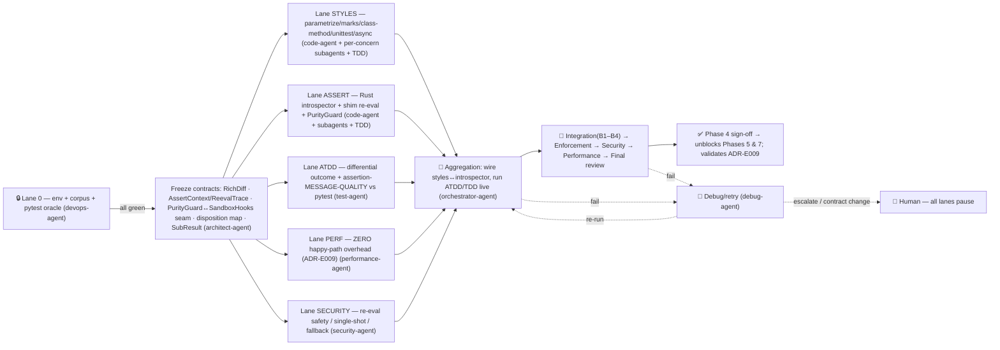

# Phase 4 — Full Test Styles + Assertion Introspection — Implementation PLAN

> **Status:** ✅ **core DELIVERED** on `feat/n5-conformance` — RichDiff (ADR-E009) + async tests + unittest fidelity; purity guard deferred to the sandbox. Live status: [ROADMAP-v2](../ROADMAP-v2.md). Original plan preserved below.
>
> **Shared scaffold (read first, not repeated here):** [PIPELINE.md](../PIPELINE.md) — conventions,
> agent roster→role map, Lane 0 doctrine, implementation standards, enforcement checkpoints,
> test-strategy doctrine, generic execution-map shape, debug/retry/escalation, cross-phase
> constraints. **Roadmap:** [ROADMAP.md](../ROADMAP.md). **Design:** [DESIGN.md](../DESIGN.md).
>
> **Phase-specific design (this phase implements):**
> [09-assertions](../design/09-assertions.md) · [10-test-styles](../design/10-test-styles.md) ·
> [02-domain-model](../design/02-domain-model.md) (RichDiff / Outcome / TestResult).
> **ADRs validated:** [ADR-E009](../design/adr/ADR-E009-lazy-assertion-introspection.md) (lazy
> introspection — *the perf claim this phase proves*) · grounded in
> [ADR-E001](../design/adr/ADR-E001-pure-rust-engine-no-pytest.md) (own the framework; drive stdlib
> `TestCase.run()`, no pytest underneath).
>
> **Names:** the warm imported interpreter is the **Wellspring**; the per-scope COW snapshot layers
> are **Watermarks**.

---

## 0. Status banner & phase identity

| Field | Value |
|---|---|
| **Phase** | 4 of 7 — *Full styles + assertion introspection* |
| **Goal** | Complete fidelity for **all three `TestStyle`s** (pytest fn, pytest class-method, `unittest.TestCase`) **and** pytest-grade failure messages — **without pytest underneath**. |
| **Proves** | [ADR-E009](../design/adr/ADR-E009-lazy-assertion-introspection.md): rich diffs cost **zero** on the happy path (introspect only on failure), uniform across bare `assert` and `self.assert*`; and [ADR-E001](../design/adr/ADR-E001-pure-rust-engine-no-pytest.md)'s claim that we run pytest *and* unittest suites without pytest and without the unittest *runner*. |
| **Depends on** | **Phase 3** (fixture graph, scopes, **Watermark** snapshot layers, `fork_at`, `reinit_after_fork`, `SubprocessWorker` fallback) · **Phase 2** ([`CONTRACT.md`](../phase-2-workspace-domain-collection/) — domain model, wire protocol, `Wellspring`/`ForkWorker`/`ShimProtocol`, CLI `run`). |
| **Unblocks** | **Phase 5** (coverage+cache — shares the **same** `SandboxHooks` impurity machinery the purity guard reuses) · **Phase 7** (compat/reporting/hardening — reporters format `RichDiff`; conformance suite exercises all styles). |
| **Out of scope** | coverage/cache (Phase 5) · scheduler/daemon (Phase 6) · pytest-plugin compat & `@pytest.mark.usefixtures`-on-`TestCase` cross-pollination, custom `load_tests` ordering/filtering (Phase 7). These are **phase boundaries, not stubs** (PIPELINE §4.3). |
| **Approval gate** | Roadmap approved + Phase 3 signed off + **this** plan approved before Lane 0 starts. |

This plan specializes the shared scaffold; it restates none of PIPELINE §§1–9. Read both together.

---

## 1. Scope — precisely what Phase 4 delivers

### 1.1 In scope (per-style protocols from [10](../design/10-test-styles.md))

1. **`PytestFunction`** — full protocol ([10 §3](../design/10-test-styles.md)): `func(**fixtures)`
   invocation post-fork; module/session fixtures already baked into Watermark layers by Phase 3;
   function fixtures + autouse + `reinit_after_fork` post-fork; bare-`assert` failures route the
   failing frame to the `AssertionIntrospector`.
2. **`PytestClassMethod`** ([10 §4](../design/10-test-styles.md)) — `Test*` class **without** a
   `TestCase` base. `setup_module`/`teardown_module` → Watermark `M`; `setup_class`/`teardown_class`
   → Watermark `C` (deepest, frozen once); **fresh `inst = Cls()` per method post-fork**;
   `setup_method`/`teardown_method` post-fork around each instance; finalizers reverse order.
3. **`UnittestMethod`** ([10 §5](../design/10-test-styles.md)) — drive **stdlib `TestCase.run()` at
   method granularity** via the `OurResult` (`unittest.TestResult` subclass) — *the single piece of
   compat Python this phase adds*. stdlib owns `setUp`/`tearDown`/`addCleanup`/`doCleanups`/the body;
   **the engine** drives `setUpClass`/`setUpModule` → Watermark `C`/`M` and `tearDownClass`/
   `tearDownModule` on layer retirement (the [ADR-E001](../design/adr/ADR-E001-pure-rust-engine-no-pytest.md)
   replacement of `TestSuite`/`TestLoader`/`TextTestRunner`).
4. **`@parametrize`** ([02 §6](../design/02-domain-model.md), [10 §7](../design/10-test-styles.md)) —
   **test-level expansion into distinct `TestItem`s**, one per `ParamSet`, each a first-class node
   with its own `NodeId` (`[param-id]` suffix) and its own `CacheKey`. Expansion happens *after*
   collection, *before* scheduling, via `Parametrization::expand`. Literal arg lists fold statically;
   computed / `pytest_generate_tests` lists need a Wellspring finalize (`needs_import_finalize`).
5. **Marks** ([02 §6/§8](../design/02-domain-model.md)) — `Skip`/`SkipIf` (no fork on a true skip),
   `XFail` → `XFail` (expected fail) / `XPass` (unexpected pass), `strict` xfail turns `XPass` into
   `Error`. Inversion applied at **result-assembly** time; the Worker reports raw pass/fail.
6. **`subTest`** (unittest, [10 §7](../design/10-test-styles.md)) — one `TestCase.run()` may emit
   many `addSubTest` outcomes; collected into the **single owning `TestItem`'s `TestResult`** as
   `SubResult` sub-records (one `NodeId`, one cache entry — preserves the one-id-one-result
   invariant [02 §10](../design/02-domain-model.md)). Parent `Passed` iff all subs passed, else
   `Failed` carrying per-sub `RichDiff`s. **Explicitly *not* expanded into N items.**
7. **`expectedFailure` / `unexpectedSuccess`** (unittest) — `@expectedFailure`+fail → `XFail`;
   `@expectedFailure`+pass → `XPass`; config `unittest_unexpected_success_is_error` decides whether
   `XPass` fails the run (matches pytest `xfail(strict=True)` ergonomics without changing stdlib).
8. **`IsolatedAsyncioTestCase` + async tests** ([10 §5.2](../design/10-test-styles.md)) — for
   `UnittestMethod`, the **stdlib case owns its event loop** inside `run()`; works for free under
   fork. For `PytestFunction`/`PytestClassMethod` async, the **shim owns the loop** (asyncio stdlib;
   trio optional). The `is_async` flag is recorded by collection and read by the Worker.
9. **Lazy assertion introspection** ([09](../design/09-assertions.md),
   [ADR-E009](../design/adr/ADR-E009-lazy-assertion-introspection.md)) — run asserts at native speed;
   **only on `AssertionError`** re-evaluate that assert's AST in the shim with a **single traced
   re-eval** to build a `RichDiff`; the **`PurityGuard`** (reusing the cache layer's `SandboxHooks`
   definition of "impure") with **graceful fallback** to the plain message + note on impure /
   non-reproducing expressions. Uniform across bare `assert` and unittest `self.assert*` (method →
   comparison-shape mapping: `assertEqual`→`==`, `assertIn`→`in`, `assertTrue`→truthiness, …).

### 1.2 Out of scope (deferred — phase boundaries, not stubs)

| Deferred item | Owning phase | Why not here |
|---|---|---|
| `sys.monitoring` coverage, `DepGraph`, `ImpactAnalyzer`, content-addressed cache | 5 | This phase *consumes* the `SandboxHooks` "impure" definition for the guard but does **not** build the cache. |
| Scheduler locality / warm daemon / watch | 6 | This phase runs through the Phase-2/3 execution path as-is. |
| pytest-plugin host, `PyPluginAdapter`, `@pytest.mark.usefixtures` on a `TestCase`, custom `load_tests` ordering/filtering | 7 | Compat-shim items ([10 §7](../design/10-test-styles.md)); native path is style-faithful without them. |
| Reporter *formatting* of `RichDiff` for terminal/JUnit/SARIF | 7 (reporters) | This phase produces the `RichDiff` value and a minimal CLI rendering for the differential message-quality oracle; full reporters are Phase 7. |

### 1.3 Explicit non-goals carried from design open questions (documented, not faked)

- **A1 / A3 / TS3** — re-eval recursion **depth** (`max_depth`) and **custom `self.assertX`** handling.
  Decision for this phase: ship a configurable `max_depth` default and map only the *known* stdlib
  `assert*` methods to comparison shapes; unknown/custom `assertX` → **plain message fallback** (not
  a guessed shape). Flagged in §10 for human ratification.
- **A2** — auto-promoting the cached per-file rewrite when the guard trips N times: **not built**
  here (stays the ADR-E009 revisit trigger); we only *measure* fallback frequency (§7 perf lane).
- **TS1** — `subTest` cache granularity: method-atomic (whole method re-runs); sub-test memoization
  is a Phase-5 question.
- **TS2** — `setUpClass` opening a non-fork-safe resource: handled via Phase 3's
  `reinit_after_fork` analogue if present; otherwise surfaced by the security lane's AST/side-effect
  watch and **flagged**, not silently worked around.

---

## 2. Lane 0 — Environment gate (`devops-agent`)

Per PIPELINE §3, Lane 0 must be **all-green before any other lane unblocks**; the pipeline owns all
setup (no human runs a command); a service that cannot start is a **hard blocker**. Emits
`phase-4-styles-assertions/env-manifest.md` in the
[Phase-1 manifest format](../../completed/phase-1-hardening-benchmarks/env-manifest.md).

| # | Item | Provisioned by | Health check |
|---|---|---|---|
| E1 | Rust toolchain (cargo/rustc/clippy/rustfmt) | pre-installed (verify) | `cargo --version && cargo clippy --version && rustfmt --version` |
| E2 | `cargo-llvm-cov` | pre-installed (verify) | `cargo llvm-cov --version` — happy-path-overhead coverage of the assert path |
| E3 | Isolated venv, CPython **3.12+** (for `sys.monitoring`-era + `IsolatedAsyncioTestCase`) | `uv venv` (Phase-1 pattern; `ensurepip` may be absent → use `uv`) | `./.venv/bin/python -V` (≥3.12) |
| E4 | **pytest baseline** (the differential oracle) | `uv pip install pytest` into venv | `python -c "import pytest"` + `pytest --version` |
| E5 | async libs — **asyncio (stdlib)**, **trio (optional)** | stdlib present; `uv pip install trio` if the trio corpus is enabled | `python -c "import asyncio; import trio"` (trio optional → don't block) |
| E6 | `hyperfine` | `cargo install hyperfine` | `hyperfine --version` |
| E7 | **Phase-4 corpus** (see §2.1) | generator script under `benchmarks/fixtures/` (Phase-1 `generate.py` pattern) | `pytest -q <corpus>` runs under the **pytest oracle** and produces the expected disposition set |
| E8 | Branch + mandatory session | `git checkout -b feat/tiderace-styles-assertions` + session file | `git branch --show-current` |

**Hard-blocker triggers for Lane 0:** venv < 3.12; pytest baseline uninstallable (no oracle ⇒ no
differential); fork+async-loop crash in a smoke run (ties to the Phase-1 go/no-go fork result —
escalate per PIPELINE §8, **all lanes pause**).

### 2.1 The Phase-4 corpus (the heart of the differential gate)

A deterministically-generated suite that **every Phase-4 feature must be exercised by**, each item
having a known pytest-oracle disposition and (for failures) a known pytest message to diff against:

- **Styles:** pytest functions; pytest `Test*` classes with `setup_module`/`setup_class`/
  `setup_method` (+ teardown); `unittest.TestCase` with `setUp`/`tearDown`/`addCleanup`/
  `setUpClass`/`setUpModule`/`tearDownClass`/`tearDownModule`.
- **Parametrize:** literal lists, multi-arg cartesian, explicit `ids=`, and one computed list.
- **Every mark:** `skip`, `skipif` (true & false condition), `xfail` (lenient & `strict`) that
  fails *and* that unexpectedly passes.
- **unittest dispositions:** `@skip`/`@skipIf`/`@skipUnless`/`self.skipTest`, `@expectedFailure`
  (failing → XFail) and `@expectedFailure` (passing → unexpectedSuccess/XPass), `subTest` (all-pass,
  some-fail), class-level `@skip` (must short-circuit before the Watermark layer — no `setUpClass`).
- **Async:** `IsolatedAsyncioTestCase` (asyncSetUp/asyncTearDown), pytest `async def` (asyncio;
  optional trio), and an async test that *fails an assert* (rich diff under a loop).
- **Rich failing asserts** (for message-quality diff vs pytest): equality (`==` on ints / strings /
  lists / dicts / nested), membership (`in`/`not in`), identity (`is`/`is not`), exception shape
  (`assertRaises` / `pytest.raises`), truthiness, and a **deliberately side-effecting / nondeterministic**
  assert per category (`queue.pop()`, `time.time()`, an RNG read) to exercise **PurityGuard
  fallback** — these are the documented gaps (§10), present so the gate can prove the fallback path,
  not hide it.

---

## 3. Interface contracts frozen before parallel lanes (`architect-agent`)

Per the generic execution map (PIPELINE §7), contracts are frozen *after* Lane 0 green and *before*
parallel lanes, so a mid-lane contract change forces a re-plan (PIPELINE §8 escalation tier 3). The
contracts this phase publishes/consumes:

1. **`RichDiff` field contract** (§9.1) — the domain type ([02](../design/02-domain-model.md)) that
   the shim *assembles* and Rust *owns/finalizes*; reporters (Phase 7) and the cache (Phase 5)
   consume it without branching on style.
2. **`AssertContext` / `ReevalTrace`** wire shape ([09 §5](../design/09-assertions.md)) — what the
   shim ships back over the binary pipe ([ADR-E002](../design/adr/ADR-E002-execution-substrate.md))
   so Rust can finalize the `RichDiff` and apply guard *policy*.
3. **`PurityGuard` ↔ `SandboxHooks` seam** — this phase consumes the *same* "impure" definition
   Phase 5 will own; the trait seam (`SandboxGuard` impl of `PurityGuard`) is frozen here so Phase 5
   plugs its detector in without re-opening this contract ([09 A4](../design/09-assertions.md)).
4. **Disposition mapping** (§9.2) — the finalized stdlib `TestResult` → `Outcome` table; **no new
   `Outcome` variants** (the enum stays closed, [02 §8/§10](../design/02-domain-model.md)).
5. **`SubResult` sub-record on `TestResult`** — one `NodeId`, many sub-rows; the contract Phase 5's
   cache keys the parent id against ([10 §8](../design/10-test-styles.md)).

---

## 4. Parallel lanes & subagent specs

Agents map per PIPELINE §2; each code lane has a **concurrent TDD subagent** (PIPELINE §6). Lanes
run in parallel after §3; subagents within a lane fan out on independent concerns.

### Lane STYLES — per-style protocol fidelity (`code-agent`; spawns per-concern subagents)

Implements §1.1 items 1–8. The single switch is at the Worker's body-invocation step
([10 §8](../design/10-test-styles.md), [02 §7](../design/02-domain-model.md)); everything up/down
stream stays style-agnostic.

| Subagent | Concern | Key outputs | Paired TDD |
|---|---|---|---|
| `styles/parametrize` | `Parametrization::expand` test-level fan-out into distinct `NodeId`/`CacheKey` items; static fold vs Wellspring finalize | expanded `TestItem`s, pytest-byte-compatible `[param-id]` suffixes | `testing` subagent: id-parity unit tests + finalize integration |
| `styles/marks` | `Skip`/`SkipIf` (no-fork on true skip), `XFail`→`XFail`/`XPass`, `strict`→`Error` at result-assembly | mark→outcome inversion (Rust, pure) | unit tests on inversion truth table |
| `styles/class-method` | `setup_class`/`setup_method` split (Watermark `C`/`M` vs post-fork), fresh-instance-per-method | the `PytestClassMethod` invocation path in shim | integration on real fork: instances don't share child memory |
| `styles/unittest` | drive stdlib `TestCase.run(OurResult())`; engine-driven `setUpClass`/`setUpModule`→Watermark, `tearDown*` on retirement; `subTest` aggregation; `expectedFailure`/`unexpectedSuccess` | `OurResult` (the **only** style-specific Python), disposition read-off | integration: real `TestCase.run`, never mocked |
| `styles/async` | shim-owned loop for pytest async (asyncio; trio opt); `IsolatedAsyncioTestCase` runs unchanged under fork | event-loop-under-fork execution | integration: async assert failure → rich diff under loop |

### Lane ASSERT — lazy introspection (`code-agent`; spawns subagents)

Implements §1.1 item 9. Rust owns orchestration + policy + the `RichDiff` type; the shim owns
AST capture + single traced re-eval ([09 §2](../design/09-assertions.md)).

| Subagent | Concern | Key outputs | Paired TDD |
|---|---|---|---|
| `assert/orchestrator` | Rust `AssertionIntrospector` / `LazyIntrospector`: `explain(AssertFailure)`, `max_depth`, guard policy, `RichDiff` finalize (op, lhs/rhs repr, unified diff) | the Rust side of [09 §5](../design/09-assertions.md) | unit tests on `RichDiff` assembly from a captured `AssertContext` |
| `assert/shim-reeval` | shim: capture frame/source/locals/globals; parse line→AST; locate failing node; classify `AssertKind`; single traced re-eval recording `SubexprValue`s | `AssertContext` + proposed `RichDiff` over the pipe | integration: re-eval on **real** `AssertionError`, never mocked |
| `assert/unittest-shapes` | map `self.assert*`→comparison shape; unknown/custom `assertX`→plain fallback (A3 decision) | the `AssertKind`→op mapping | unit tests per known method; fallback test for custom method |
| `assert/purity-guard` | `SandboxGuard` impl of `PurityGuard`: reproduction check (re-eval still falsy) + I/O watch via Phase-5-shared `SandboxHooks`; `GuardVerdict`; graceful fallback note | the guard + fallback message | unit + integration: pure→RichDiff, impure/nondeterministic→fallback note |

### Lane ATDD — acceptance / differential (`test-agent`; spawns `testing`)

Authors **failing acceptance scenarios first** (PIPELINE §6) from §1.1, **differential vs the pytest
oracle**. Two oracle dimensions:

1. **Outcome + disposition parity** — for every corpus item, tiderace's `Outcome` (incl. `NodeId`
   for parametrize ids, XFail/XPass, subTest aggregation) **matches pytest's** disposition.
2. **Assertion message-QUALITY comparison** — for every failing-assert corpus item, tiderace's
   `RichDiff` is **as informative as pytest's** failure message (same operands surfaced, same
   diff shape) — the G5 adoption gate. Edge-case parity gaps are *recorded* (§10), not papered over.

### Lane PERF — happy-path zero-overhead (`performance-agent`; spawns `benchmarking`, `profiling`)

Proves the **central ADR-E009 claim**: a passing assert costs **nothing extra**. Method:

- `hyperfine` + `cargo llvm-cov` on an **all-green, assert-heavy** corpus: assert-path instructions
  on the pass branch must be **zero introspection** (the failure machinery is never entered).
- Differential: tiderace all-green run vs pytest all-green run (pytest pays its import-time rewrite
  tax; tiderace must not) — the "faster *and* richer" claim ([09 §7](../design/09-assertions.md)).
- Measure **PurityGuard fallback frequency** on the corpus (the ADR-E009 revisit-trigger metric).

### Lane SECURITY — re-eval safety (`security-agent`; spawns `threat-model`,
`vulnerability-assessment-specialist`)

The introspector **re-evaluates user expressions**; security owns the boundary:

- Re-eval must be **single** (no compounding side effects); the guard must fall back — never
  silently produce a diff — on any tripped `SandboxHooks` (fs/network/clock/RNG).
- AST fragment handling in the shim must not enable arbitrary side-effect amplification beyond the
  single traced eval; no eval of attacker-influenced strings outside the captured node.
- Threat model the shim↔Rust pipe payload (`AssertContext`/`ReevalTrace`) for injection.

---

## 5. Integration boundaries (verified live — never mocked; PIPELINE §4.1)

Integration verification is owned by `test-agent` (live differential), gated by `orchestrator-agent`.
The Python boundary is **never** mocked (PIPELINE §6).

| # | Boundary | What "verified" means |
|---|---|---|
| **B1** | **Shim-side AST re-evaluation of a failing assert → `RichDiff`** | Run against **real** `AssertionError`s from the corpus (equality/contains/identity/exception). The captured frame, AST node, traced subexpr values, and finalized `RichDiff` are checked against the actual failure — **never a mocked frame**. |
| **B2** | **Differential outcome + disposition vs pytest** for marks / xfail / xpass / **parametrize ids** / subTest | Live run of tiderace and the pytest oracle on the same corpus; per-item `Outcome` and `NodeId` (incl. `[param-id]`) compared. Disagreement = blocker. |
| **B3** | **Async event-loop execution under `fork()`** | `IsolatedAsyncioTestCase` (stdlib-owned loop) and pytest `async def` (shim-owned loop) both run in a forked child without loop-state corruption; an async assert failure still produces a rich diff. |
| **B4** | **`PurityGuard` ↔ `SandboxHooks`** on a real impure assert | A side-effecting/nondeterministic corpus assert trips the guard live and yields the fallback note — proving the documented gap is handled, not faked. |

---

## 6. Aggregation → sequential gates → sign-off (`orchestrator-agent`)

Per PIPELINE §7. Aggregation wires the lanes, validates cross-lane consistency (one `TestResult`,
one `AssertionIntrospector`, closed `Outcome`), and runs ATDD/TDD **live**. Then sequential gates:

1. **Integration gate** — B1–B4 all green on the live environment (`test-agent`).
2. **Enforcement gate** (`enforcement-agent`) — one-type-per-file, `Result`/`?`+`thiserror`+no
   panics, `rustfmt` + `clippy -Dwarnings`, **no-stubs grep** (`pass`/`TODO`/`unimplemented!`/
   `todo!`/`NotImplementedError`) — a hit **fails the gate**; coverage **≥80% line / ≥70% branch**
   (PIPELINE G-C2); Python shim PEP8 + fully typed (G-C3); understand-before-applying justification
   present (e.g. *why* lazy-on-failure over import-time rewrite; *why* `setUpClass`→Watermark).
3. **Security gate** — Lane SECURITY findings resolved; re-eval single-shot + fallback proven.
4. **Performance gate** — zero happy-path assertion overhead demonstrated; differential vs pytest
   all-green; fallback-frequency metric recorded.
5. **Final review** (`review-agent`) — design fidelity to 09/10/02; ADR-E009 claim substantiated.

**Debug/retry** (`debug-agent`, PIPELINE §8): subagent retry → full-lane retry → **contract change ⇒
pause all lanes & re-present**. Escalate to human on a twice-failing gate, any hard blocker (fork+
async crash, unverifiable integration), or a material plan/roster/env change.

---

## 7. Execution map (specialized from PIPELINE §7)

---

## 8. Test strategy (specialized from PIPELINE §6)

- **ATDD first:** differential scenarios (B2/B1) authored as failing specs before code, from §1.1.
- **TDD in parallel:** every STYLES/ASSERT subagent has a concurrent `testing` subagent (table §4).
- **Mocking discipline:** pure Rust logic (mark inversion, `RichDiff` finalize, param expansion)
  tested directly; **the Python boundary is never mocked** — re-eval and `TestCase.run` tests use
  real `python` + the real shim on real exceptions (PIPELINE §6).
- **Coverage taxonomy** (happy/boundary/null/error/isolation): includes the failure paths (the whole
  point of the introspector) and the **fallback** paths (impure/nondeterministic asserts).

---

## 9. Contracts this phase finalizes (the deliverable artifacts)

### 9.1 `RichDiff` field contract

The domain type lives at `crates/engine-core/src/domain/rich_diff.rs`
([02 §3](../design/02-domain-model.md)); the shim *assembles* a proposal, **Rust owns and finalizes**
it ([09 §5](../design/09-assertions.md)). Reconciling 02's `RichDiff` with 09's classifier:

| Field | Type | Owner | Meaning |
|---|---|---|---|
| `op` | `String` | Rust (from `AssertKind`) | the comparison operator surfaced (`==`, `in`, `is`, `raises`, `truthy`, …) |
| `lhs_repr` | `ValueRepr` | shim→Rust | repr of the left operand (string repr + optional type tag) |
| `rhs_repr` | `ValueRepr` | shim→Rust | repr of the right operand (absent for unary truthiness) |
| `subexprs` | `Vec<SubexprValue>` | shim→Rust | each traced subexpression: `{ source_span: Span, repr: ValueRepr }`, truncated at `max_depth` |
| `unified_diff` | `Option<String>` | Rust | computed line/seq diff for large equal-shaped operands (lists/dicts/multiline strings) |
| `fallback_note` | `Option<String>` | Rust (from `GuardVerdict`) | set **iff** the guard tripped: *"rich diff suppressed — expression appears impure/nondeterministic."* When set, `subexprs` is empty and the original `AssertionError`/unittest `msg` is carried in `lhs_repr` |

> **Reconciliation note for review:** [02](../design/02-domain-model.md)'s `RichDiff` lists
> `lhs_repr: String`, `rhs_repr: String`, `note: Option<String>`, `subexprs: Vec<SubExpr>`;
> [09](../design/09-assertions.md)'s classifier uses `ValueRepr`, `SubexprValue`, `unified_diff`,
> `fallback_note`. **RESOLVED (2026-06-15):** [02-domain-model](../design/02-domain-model.md) has
> been updated to the canonical merged shape (`op`, `lhs_repr`/`rhs_repr`: `ValueRepr`,
> `subexprs`: `Vec<SubexprValue>`, `unified_diff`, `fallback_note`), with `SubexprValue`/`ValueRepr`
> added to 02's vocabulary and 09 marked as referencing 02 as owner. `domain/rich_diff.rs` follows
> this shape when implemented in this phase.

Invariants: produced **only** on `Failed`/sub-failure; **one `RichDiff` per failing assertion**
(sub-failures carry one each under the parent `SubResult`); identical shape for bare `assert` and
`self.assert*` so reporters/cache never branch on style.

### 9.2 Disposition mapping finalized — stdlib `TestResult` → engine `Outcome`

From [10 §6](../design/10-test-styles.md), finalized here. **No new `Outcome` variants** — the enum
stays closed ([02 §8](../design/02-domain-model.md)). The shim reads dispositions off `OurResult`;
Rust maps:

| stdlib `OurResult` callback | Trigger | Engine `Outcome` |
|---|---|---|
| `addSuccess` | method returned, no failure | `Passed` |
| `addFailure` | `self.failureException` (`AssertionError` subclass) raised | `Failed` + `RichDiff` (via [09](../design/09-assertions.md)) |
| `addError` | any non-`AssertionError` exception (incl. in `setUp`/`tearDown`/cleanup/`setUpClass`) | `Error` |
| `addSkip` | `SkipTest` / `@skip*` / `self.skipTest()` | `Skipped` (with reason) |
| `addExpectedFailure` | `@expectedFailure` **and** the test failed | `XFail` |
| `addUnexpectedSuccess` | `@expectedFailure` **but** the test passed | `XPass` (→ `Error` iff `unittest_unexpected_success_is_error`) |
| `addSubTest` (failed) | a `subTest` block failed | sub-failure record; parent `Failed` if any sub failed |
| `addSubTest` (passed) | a `subTest` block passed | sub-pass record; no standalone result |

Engine-driven (stdlib's runner would, `TestCase.run` does not): `setUpClass`/`setUpModule` at
Watermark `C`/`M`; `tearDownClass`/`tearDownModule` once on layer retirement. Class-level `@skip`
short-circuits **before** the Watermark layer (no `setUpClass`). This mirrors and generalizes the
pytest-report→status mapping in the legacy `tiderace/worker.py` `ResultCollector`, now reading
stdlib `TestResult` ([10 §6](../design/10-test-styles.md)).

`SubResult` sub-record (finalized): one `NodeId`, many sub-rows on `TestResult`; the cache
([07](../design/07-cache.md), Phase 5) keys the **parent** id and stores sub-rows as part of the
cached outcome — no extra cache keys (one-id-one-result, [02 §10](../design/02-domain-model.md)).

---

## 10. Gap report (flag, don't fake — PIPELINE §4.3)

| ID | Gap | Disposition |
|---|---|---|
| **G-RD** | ~~`RichDiff` field-shape divergence between [02](../design/02-domain-model.md) and [09](../design/09-assertions.md).~~ | ✅ **RESOLVED (2026-06-15):** 02 aligned to 09's canonical shape; `SubexprValue`/`ValueRepr` added to 02's vocabulary; 09 references 02 as owner. No longer blocks Lane ASSERT. |
| **G-1** | **Rich-diff parity edge cases vs pytest** — deeply nested operands, custom `__repr__`, very large dict/list diffs, recursion truncation at `max_depth` (A1). | Differential lane *records* per-edge-case parity; gaps documented in the phase report, not hidden. Truncation depth is a ratifiable default. |
| **G-2** | **Side-effecting / nondeterministic asserts** where `PurityGuard` must fall back (`queue.pop()`, `time.time()`, RNG). | Corpus includes these on purpose; the gate **proves** fallback fires with the labeled note. Fallback frequency is the ADR-E009 revisit metric (perf lane). **Documented limitation, not a wrong answer.** |
| **G-3** | **Custom `self.assertX`** on user `TestCase` subclasses (A3/TS3). | Decision: **plain-message fallback** for unknown methods (no guessed comparison shape). Ratify. |
| **G-4** | **`TestStyle` switch is the single style-aware point** — relies on Phase-3 Watermark `fork_at`/retirement + `reinit_after_fork`. If Phase 3's layer retirement or fork-safety contract shifts, this phase's `setUpClass`/`tearDownClass`-on-retirement path breaks. | Cross-phase dependency surfaced; a Phase-3 contract change → re-present (PIPELINE §8). |
| **G-5** | **trio** is optional (E5). If trio isn't installed, async coverage is asyncio-only. | Non-blocking; manifest records whether trio was provisioned. |
| **G-6** | **`SandboxHooks` are co-owned with Phase 5.** This phase consumes the "impure" definition via the `PurityGuard` seam (§3.3); the detector itself is Phase 5 (A4 — sharing one hook instance per child without double-counting). | Seam frozen here; detector arrives in Phase 5. Phase boundary, not a stub. |
| **G-7** | `pytest_generate_tests` / computed parametrize lists need a **Wellspring finalize** (`needs_import_finalize`), which depends on the Phase-2/3 finalize path. | In scope for the static+finalize split; dynamic `load_tests` *ordering/filtering* remains a Phase-7 compat item. |

---

### Summary (for the reviewer)

**Phase 4 closes the framework's fidelity gap: it makes tiderace run all three `TestStyle`s — pytest
functions, pytest class-methods, and stdlib `unittest.TestCase` (driven via `TestCase.run()` at
method granularity, no pytest and no unittest *runner* underneath) — with full `@parametrize`
test-level expansion, every mark (`skip`/`skipif`/`xfail`→`XFail`/`xpass`→`XPass`), `subTest`,
`expectedFailure`/`unexpectedSuccess`, and async (`IsolatedAsyncioTestCase` + `async def`), while
delivering pytest-grade failure messages through lazy assertion introspection that costs zero on the
happy path and re-evaluates a failing assert's AST in the shim under a `PurityGuard` that falls back
gracefully (never wrongly) on impure/nondeterministic expressions — proving ADR-E009 and ADR-E001
against a live pytest oracle, and unblocking Phases 5 and 7.** The two artifacts this phase
finalizes are below.

**RichDiff field contract** (§9.1): `op: String` (Rust) · `lhs_repr: ValueRepr` · `rhs_repr:
ValueRepr` · `subexprs: Vec<SubexprValue { source_span: Span, repr: ValueRepr }>` (shim→Rust,
truncated at `max_depth`) · `unified_diff: Option<String>` (Rust) · `fallback_note: Option<String>`
(Rust, set iff the `PurityGuard` trips; then `subexprs` empty and the original message rides in
`lhs_repr`). Produced only on failure, identical shape for `assert` and `self.assert*`, one per
failing assertion. **G-RD resolved (2026-06-15):** this shape is now the canonical one in both
[02-domain-model](../design/02-domain-model.md) and [09-assertions](../design/09-assertions.md).

**New disposition mapping finalized** (§9.2, stdlib `TestResult`→`Outcome`, enum stays closed):
`addSuccess`→`Passed` · `addFailure`→`Failed`+`RichDiff` · `addError`→`Error` · `addSkip`→`Skipped` ·
`addExpectedFailure`→`XFail` · `addUnexpectedSuccess`→`XPass` (→`Error` iff
`unittest_unexpected_success_is_error`) · `addSubTest`(fail/pass)→`SubResult` sub-records under one
`NodeId` (parent `Failed` iff any sub failed). Engine-driven `setUpClass`/`setUpModule`→Watermark
`C`/`M` and `tearDownClass`/`tearDownModule` on layer retirement; class-level `@skip` short-circuits
before the Watermark layer.
