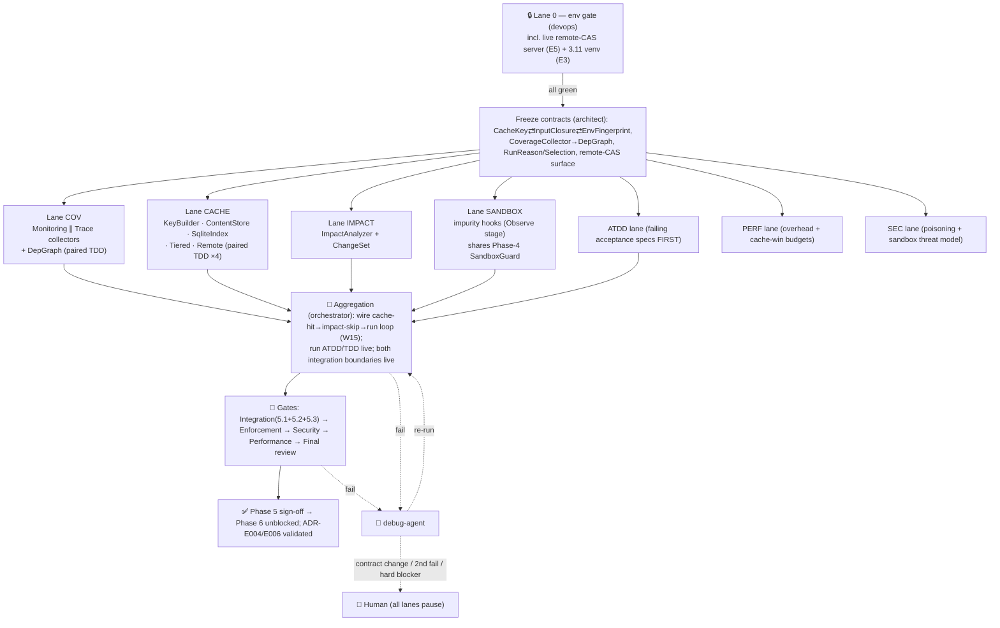

# Phase 5 — Coverage + Content-Addressed Cache (the build-system-for-tests core)

> **Status:** 📋 PLAN — awaiting human approval. **No agent begins work, no Lane 0 starts, no code is
> written until this phase is explicitly approved.** This document is for human review only.
> **Owner:** orchestrator-agent · **PM/architect:** architect-agent (+ plan-agent) · **Persona:** Software Engineer · **Date:** 2026-06-15
> **Shared scaffold:** [PIPELINE.md](../PIPELINE.md) (conventions, agent roster, env-gate doctrine,
> implementation standards, enforcement checkpoints, test doctrine, debug/retry — **not repeated here**).
> **Roadmap row:** [ROADMAP.md](../ROADMAP.md) Phase 5 · **Design:** [07-cache](../design/07-cache.md),
> [11-coverage-impact](../design/11-coverage-impact.md), [13-cross-cutting §4](../design/13-cross-cutting.md) ·
> **ADRs validated:** [ADR-E004](../design/adr/ADR-E004-content-addressed-cache.md),
> [ADR-E006](../design/adr/ADR-E006-coverage-sys-monitoring.md).

This plan specializes the [PIPELINE.md](../PIPELINE.md) multiagent model for Phase 5 only. Where a
part is identical across phases (loaded conventions, the 24-agent roster → role mapping, the Lane 0
env-gate doctrine, the four implementation standards, the enforcement checkpoints, the ATDD/TDD
doctrine, and the debug/retry/escalation ladder) it is **referenced, not restated**.

---

## 0. Phase scope — the marquee thesis: *never run a test you can skip*

Phase 5 turns a test outcome into a **build artifact**: content-addressed by its transitive input
closure, memoized locally + remotely, and skippable when its inputs are unchanged. Per-test coverage
is the dependency tracker that makes both the cache key sound and impact selection precise. The
orchestrator's resolution order is locked at **cache-hit → impact-skip → run** ([07 §7.2](../design/07-cache.md),
[ADR-E004](../design/adr/ADR-E004-content-addressed-cache.md)).

### 0.1 In scope (work items, each traceable to a lane + a live verification)

| ID | Work item | Design home | Lane |
|----|-----------|-------------|------|
| W1 | `CoverageCollector` trait + `MonitoringCollector` (PEP 669 `sys.monitoring`, 3.12+, **in-fork**, line+branch, disable-per-location) | [11 §1](../design/11-coverage-impact.md), [ADR-E006](../design/adr/ADR-E006-coverage-sys-monitoring.md) | COV |
| W2 | `TraceCollector` (`sys.settrace` fallback, ≤3.11) producing the **same** `CoverageReport` | [11 §1](../design/11-coverage-impact.md) | COV |
| W3 | `CoverageReport` / `FileLines` / `LineSet` types + `into_sources()` bridge to `InputClosure.executed_sources` | [11 §1.1](../design/11-coverage-impact.md) | COV |
| W4 | `DepGraph` (per-test touched-source, forward `deps_of` + reverse `tests_touching`) — feeds **both** key and impact | [11 §2](../design/11-coverage-impact.md) | COV/IMPACT |
| W5 | `ImpactAnalyzer` evolving [`impact.rs`](../../../../tiderace/impact.rs) — `RunReason` enum, line-precise rule 3, conservative always-rerun floor | [11 §3](../design/11-coverage-impact.md) | IMPACT |
| W6 | `ChangeSet::from_tree` evolving [`hasher.rs`](../../../../tiderace/hasher.rs) (`hash_all_python_files`/`find_changed_files`) to line-deltas | [11 §3](../design/11-coverage-impact.md) | IMPACT |
| W7 | `InputClosure` + `EnvFingerprint` + `CacheKeyBuilder` (provisional + final key; **only** place keys are computed — domain invariant #4) | [07 §1](../design/07-cache.md) | CACHE |
| W8 | `ContentStore` trait + CAS blob store (content-addressed, refcounted, `zstd+postcard` codec) | [07 §2](../design/07-cache.md) | CACHE |
| W9 | `SqliteIndex` — evolve [`db.rs`](../../../../tiderace/db.rs) 4 tables → cache index (`CONTENT_STORE`, `CACHE_ENTRY`, `TEST_DEP`, `TEST_TIMING`, `FILE_HASH`) | [07 §2.1 ERD](../design/07-cache.md) | CACHE |
| W10 | `LocalCache` (store+index, `gc(EvictionPolicy)`), `NullCache` (`--no-cache` seam), `Cache` trait | [07 §3](../design/07-cache.md) | CACHE |
| W11 | `TieredCache` (Local + optional Remote; write-through-on-read promote; async best-effort remote put) | [07 §7](../design/07-cache.md) | CACHE |
| W12 | `RemoteCache` client + **remote-CAS protocol** (`has`/`get`/`get_blob`/`put`/`put_blob`); **verify-on-read** (`CacheError::KeyMismatch`) | [07 §7.1](../design/07-cache.md), [13 §4.3](../design/13-cross-cutting.md) | CACHE |
| W13 | `SandboxHooks` impurity detection (`Observe` stage): clock/RNG/network/fs/env via shim `sys.audit` hooks; `ImpurityVerdict`/`ImpurityReport`; impure → uncacheable-or-pinned | [07 §4](../design/07-cache.md), [13 §4](../design/13-cross-cutting.md) | SANDBOX |
| W14 | Cache-entry state machine (`Unknown→Computing→Fresh/Uncacheable→Stale→Evicted`) + invalidation rules incl. always-rerun Failed/Error | [07 §5–6](../design/07-cache.md) | CACHE |
| W15 | Orchestrator wiring of the **cache-hit → impact-skip → run** resolution loop closing back to `put(final_key)` | [07 §7.2](../design/07-cache.md) | AGG |

### 0.2 Out of scope (owned by later phases — these are *boundaries*, not stubs per [PIPELINE §4.3](../PIPELINE.md))

- **Scheduler + warm daemon + FS-watch invalidation + IDE JSON-RPC** → Phase 6 ([06](../design/06-scheduler.md), [08](../design/08-daemon.md)). `TEST_TIMING` rows are *written* this phase but the bin-packing consumer is Phase 6.
- **Full hermetic ENFORCEMENT** (`WarnOnViolation`/`Enforce` stages, deny-on-violation, auto-pin clock/RNG). This phase ships **`Observe` only** ([13 §4.2](../design/13-cross-cutting.md)); impurity is *detected and marked uncacheable*, not *prevented*.
- **GC scheduling/triggering policy in the daemon** ([07 C3](../design/07-cache.md)) — `gc()` exists and is unit-tested; *who* calls it on snapshot retirement is Phase 6.
- **Remote-cache auth/transport hardening** (signing, mTLS, multi-tenant). This phase ships a *minimal* token + content-verify-on-read; the trust model ([07 C2](../design/07-cache.md), [13 CC3](../design/13-cross-cutting.md)) is flagged (G5) for a later security pass.
- **Reporters** beyond what the orchestrator already emits — Phase 7.

### 0.3 Dependencies & what this unblocks

- **Depends on Phase 4** — real `Outcome`s + observed input closures (`test_bytecode_hash` from the shim's compiled code object; the `SandboxGuard` instance shared with the assertion `PurityGuard`, [09 §4](../design/09-assertions.md)).
- **Depends on Phase 3** — `FixturePlan.closure_hash` (the `fixture_closure` key term, [04 §8](../design/04-fixture-graph.md)) and fork-from-warm execution that coverage runs *inside*.
- **Unblocks Phase 6** (scheduler reads `TEST_TIMING`; daemon reuses warm cache) and contributes to **Phase 7** (cache stats in reporters).
- **Validates ADR-E004** (content-addressed cache, soundness strategy) and **ADR-E006** (`sys.monitoring` coverage, settrace fallback).

---

## 1. Conventions loaded

Per [PIPELINE §1](../PIPELINE.md) (core/general.md, rust.md, feature/code/testing workflows, test
skills, ADRs E001–E010, planning structure). Standing gaps **G-C1…G-C4** apply unchanged. Phase-5
specifics layered on top:

- **One-type-per-file** ([ADR-E005](../design/adr/ADR-E005-workspace-trait-seams.md)) across `crates/engine-core/src/{coverage,impact,cache}/`; `error.rs` adds `CacheError` ([13 §3](../design/13-cross-cutting.md)).
- **No keys outside `cache/`** — domain invariant #4 ([02 §10](../design/02-domain-model.md), [07 §8](../design/07-cache.md)): only `cache/cache_key_builder.rs` computes a `CacheKey`. Enforced at the enforcement gate (grep for `Sha256`/`CacheKey` construction outside `cache/`).
- **No second impurity definition** — `SandboxHooks`/`ImpurityVerdict` are shared with the assertion purity guard ([09 §4](../design/09-assertions.md), [13 §4.1](../design/13-cross-cutting.md)); Lane SANDBOX consumes the Phase 4 `SandboxGuard`, it does not fork a parallel one.
- **One dependency table** — `TEST_DEP` is the single physical home of the `DepGraph`; cache reads it forward, impact reads it reverse ([11 §5](../design/11-coverage-impact.md)). No duplicate state.

---

## 2. Agent roster → Phase-5 lanes

Roster + role mapping are fixed in [PIPELINE §2](../PIPELINE.md). Phase 5 instantiates **six work
lanes + Lane 0**, each owned by an agent that spawns **paired TDD subagents** (impl ∥ test) per
[PIPELINE §6](../PIPELINE.md). No fabricated agents; integration-verification → `test-agent` gated by
`orchestrator-agent`.

| Lane | Agent | Subagents spawned | Owns (W#) |
|------|-------|-------------------|-----------|
| **0 — Env gate** | `devops-agent` | `devops`, `docker` (only if remote-CAS server needs containerizing) | E1–E9 below |
| **COV — coverage collectors** | `code-agent` | `scaffold`, `code` ×2 (`MonitoringCollector` ∥ `TraceCollector`), `testing` (TDD) ×2 | W1–W4 |
| **CACHE — key + store + index + tiered + remote** | `code-agent` | `code` ×4 (KeyBuilder · ContentStore · SqliteIndex · Tiered/Remote), `testing` (TDD) ×4 | W7–W12, W14 |
| **IMPACT — analyzer + change detection** | `code-agent` | `code`, `testing` (TDD) | W5–W6 |
| **SANDBOX — impurity hooks** | `code-agent` (+ `security-agent` consult) | `code`, `testing` (TDD) | W13 |
| **ATDD — acceptance** | `test-agent` | `testing` | acceptance scenarios (§7) — authored **first** |
| **PERF — overhead + cache-win bench** | `performance-agent` | `benchmarking`, `profiling`, `bottleneck-analysis` | §8 budgets |
| **SEC — cache poisoning + sandbox** | `security-agent` | `threat-model`, `vulnerability-assessment-specialist`, `security-architecture-reviewer` | §9 |
| **AGG / gates** | `orchestrator-agent` (+ `review-agent`, `enforcement-agent`, `debug-agent`) | per [PIPELINE §2](../PIPELINE.md) | W15 + gates |

**Why paired TDD subagents (understand-before-applying, [PIPELINE §4.4](../PIPELINE.md)):** every code
lane has a concurrent `testing` subagent writing unit+integration tests *alongside* (not after) impl;
the Python boundary (`sys.monitoring`/`settrace`/`sys.audit`) is **never mocked** — collector and
sandbox tests fork a real `python` + the real shim ([PIPELINE §6](../PIPELINE.md)).

---

## 3. Lane 0 — environment gate (devops-agent)

Per [PIPELINE §3](../PIPELINE.md): the pipeline owns **all** setup; no human is asked to run a command.
Lane 0 must be **all-green before any other lane unblocks**, and emits
`phase-5-coverage-cache/env-manifest.md` in the [Phase 1 manifest format](../../completed/phase-1-hardening-benchmarks/env-manifest.md).
A service that cannot start is a **hard blocker**, surfaced immediately ([PIPELINE §8](../PIPELINE.md)).

| # | Item | Provisioned by | Health check (verify) |
|---|------|----------------|------------------------|
| E1 | Rust toolchain + `cargo-llvm-cov` (≥80/70 gate) | pre-installed (carry-forward) | `cargo --version && cargo llvm-cov --version` |
| E2 | venv on **CPython ≥3.12** (required for `sys.monitoring`) | `uv venv` (carry-forward; no sudo) | `python -c "import sys; assert sys.version_info>=(3,12)"` |
| E3 | venv on **CPython 3.11** (to exercise the `TraceCollector` fallback path live) | `uv venv .riptide-py311` | `python3.11 -c "import sys; print(sys.version_info)"` |
| E4 | pytest + coverage.py **baseline oracle** (differential coverage comparison) | `uv pip install` | `python -c "import coverage, pytest"` |
| E5 | **Local remote-CAS server** — a real minimal HTTP content-addressed store implementing `has/get/get_blob/put/put_blob` (§5.2) | **started by Lane 0** (small `engine-cli serve-cache` or a vendored test server bin), bound to `127.0.0.1:<port>`, `0600` token file | `curl -s 127.0.0.1:$PORT/healthz` + a `put_blob`→`get_blob` round-trip script |
| E6 | **Coverage-overhead corpus** — a suite sized to measure per-test `sys.monitoring`/settrace tax vs no-coverage | `benchmarks/fixtures/` generator (extend) | run count + per-test timing emitted |
| E7 | **Edit-to-invalidate corpus** — module touched by many tests, with a known 3-line helper edit that should invalidate exactly the intersecting tests | generator | baseline `tests_touching` set recorded |
| E8 | **Impure-test corpus** — tests reading `time.time()`, `random`, and a socket, to verify uncacheable detection | generator | each classified non-`Pure` |
| E9 | `hyperfine` + branch + session file | `cargo install` + `git checkout -b feat/...` + session | `hyperfine --version && git branch --show-current` |

> **The remote-CAS server (E5) is a real integration boundary, not a mock** ([PIPELINE §4.1](../PIPELINE.md)).
> Lane 0 starts it; the §6-(2) integration test puts on it from a "machine A" working dir and gets on
> a **simulated fresh machine B** (a second clean local cache dir, distinct `local_dir`) to prove the
> remote tier end-to-end. If the server cannot be started, Phase 5 is **hard-blocked**.

---

## 4. Frozen interface contracts (architect-agent, before any parallel lane)

Contracts are frozen *once* after Lane 0 is green, so the lanes parallelize without churn. A change to
any of these mid-run is a **contract change ⇒ pause all lanes + re-present** ([PIPELINE §8](../PIPELINE.md)).
Types live in `crates/engine-core/src/{coverage,impact,cache}/`, one per file.

### 4.1 `CacheKey ⇄ InputClosure ⇄ EnvFingerprint` contract (the soundness anchor)

```rust
// domain/input_closure.rs — SHAPE owned by 02; a pure description of THE TEST's inputs.
struct InputClosure {
    test_bytecode_hash: Hash,          // shim hashes the compiled code object (not text)
    executed_sources:   Vec<SourceHash>, // from CoverageCollector (11/E006); SORTED at hash time
    fixture_closure:    Vec<FixtureId>,  // -> FixturePlan.closure_hash (04 §8), supplied verbatim
    env_fingerprint:    EnvHash,         // SandboxHooks-observed env/file reads (declared_env)
}

// cache/env_fingerprint.rs — a property of the RUNTIME, captured ONCE per process (NOT on the test).
struct EnvFingerprint {
    engine_version: Hash,   // compile-time const; bump = wholesale cache invalidation
    python_version: Hash,   // sys.implementation + sys.version_info, reported by wellspring
    platform:       Hash,   // target_triple + libc, e.g. linux-x86_64-glibc2.39
    declared_env:   EnvHash // env/files the test is permitted to read
}

// cache/cache_key_builder.rs — THE ONLY place keys are computed (domain invariant #4).
//   provisional_key(item, plan): pre-run, over statically-known terms (no executed_sources yet)
//   final_key(closure):          post-run, full key incl. observed executed_sources
fn key_for(closure: &InputClosure, env: &EnvFingerprint) -> CacheKey { /* SHA256, executed_sources SORTED */ }
```

**Invariants other lanes must honor (frozen):**
1. `executed_sources` are **sorted** and `fixture_closure` is folded to its deterministic `ClosureHash`, so ordering non-determinism never changes the key ([07 §1.2 canonicalization](../design/07-cache.md)).
2. The **env triple** (`engine_version`/`python_version`/`platform`) is **mandatory** and lives on `EnvFingerprint`, not `InputClosure` — this is the structural cross-environment-poisoning defense ([07 §6.2](../design/07-cache.md), [ADR-E004](../design/adr/ADR-E004-content-addressed-cache.md)).
3. **Bootstrap (first sight):** no `executed_sources` yet ⇒ `provisional_key` looks up a candidate, re-validates every recorded `TEST_DEP.source_hash` against current `FILE_HASH`; a miss ⇒ run, and the run writes the `final_key` entry ([07 §1.3](../design/07-cache.md)).
4. **Never cacheable:** `Outcome::Failed`/`Error` (always re-run, [11 rule 5](../design/11-coverage-impact.md)/[07 §6.1](../design/07-cache.md)); any `ImpurityVerdict != Pure` that is **unpinned** ([07 §4](../design/07-cache.md)).

### 4.2 `CoverageCollector` → `DepGraph` contract

`CoverageCollector::{start(tool_id), stop()->CoverageReport, touched()}` — two impls
(`MonitoringCollector` 3.12+, `TraceCollector` ≤3.11) produce the **same** `CoverageReport{node_id,
touched: Vec<FileLines>}`. `CoverageReport::into_sources() -> Vec<SourceHash>` is the bridge to
`InputClosure.executed_sources`; the line-level `LineSet` is what `DepGraph` persists for impact
precision ([11 §1.1](../design/11-coverage-impact.md)). `DepGraph` is a **view over** `TEST_DEP` —
`persist(index)`/`load(index)`, never its own storage.

### 4.3 `RunReason` / `Selection` contract (impact)

`ImpactAnalyzer::select(tests) -> Selection{to_run, skipped, reasons: HashMap<NodeId,RunReason>}` with
`RunReason ∈ {NeverRun, OwnFileChanged, DependencyChanged, PreviouslyFailed, NoDepGraph_SourceChanged}`,
preserving every safety semantic already test-covered in [`impact.rs`](../../../../tiderace/impact.rs)
and adding the line-precise `DependencyChanged` plus the conservative file-level degrade ([11 §4 note](../design/11-coverage-impact.md)).

---

## 5. The two live integration boundaries (both verified end-to-end, not mocked)

### 5.1 Boundary (1) — CPython coverage via `sys.monitoring` in-fork

The `MonitoringCollector` runs **inside the fork worker** under our tool id, scoped to the test body,
disabling events per-location once seen ([ADR-E006](../design/adr/ADR-E006-coverage-sys-monitoring.md)).
**Verification (test-agent, live):** for a set of fixture tests, the touched-file set produced by
`MonitoringCollector` is compared **differentially against `coverage.py`** (E4) over the same bodies —
they must agree on the file set (line set within a documented tolerance for branch/line semantics).
The `TraceCollector` path is exercised on the 3.11 venv (E3) and asserted to yield the **same**
`CoverageReport` shape. This is the proof that the cache's `executed_sources` term is sound.

### 5.2 Boundary (2) — remote cache CAS over the network

A thin content-addressable protocol; the action cache (`CACHE_ENTRY`) + CAS (`CONTENT_STORE`) map
directly onto it ([07 §7.1](../design/07-cache.md)). **Protocol surface this phase establishes:**

| RPC | Semantics | Idempotent |
|-----|-----------|-----------|
| `has(keys: [CacheKey]) -> [bool]` | batched existence probe before a run (skip download if absent) | yes |
| `get(key: CacheKey) -> Option<EntryMeta>` | entry metadata incl. `blob_hash` + recorded `InputClosure` | yes |
| `get_blob(blob_hash: Hash) -> Option<Bytes>` | fetch the content blob (serialized `TestResult`); content-addressed ⇒ CDN/layer-cacheable | yes |
| `put(key: CacheKey, meta: EntryMeta)` | upload entry metadata (small) | yes — last-writer-wins (same key ⇒ same inputs ⇒ same result) |
| `put_blob(blob_hash: Hash, bytes: Bytes)` | upload a blob; server may dedupe by `blob_hash` | yes |

**Transport (minimal, this phase):** HTTP/1.1 over `127.0.0.1` to the Lane-0 server (E5); a `0600`
bearer token; **content-verify-on-read** — `get_blob` recomputes the digest and raises
`CacheError::KeyMismatch` if it differs from the requested `blob_hash` ([13 §4.3](../design/13-cross-cutting.md)).
**Verification (test-agent, live):** `put` on machine-A dir → `get` on a **fresh machine-B** dir (clean
`local_dir`, same remote) yields an **instant cached `TestResult`** with no fork; and a deliberately
tampered blob trips `KeyMismatch` (cache-poisoning defense). The env triple in the key proves a
B-on-different-platform run **misses cleanly** rather than serving a poisoned hit.

### 5.3 The closed-loop acceptance (both boundaries + impact + sandbox together)

1. **Warm cache-hit** serves the *exact* prior `TestResult` (`served_from_cache=true`, no fork).
2. An **edit invalidates exactly the impacted tests** — the E7 3-line helper edit re-runs only the tests whose `touched_lines` intersect, the rest serve from cache.
3. An **impure test is NOT cached** — each E8 test classifies non-`Pure` ⇒ `CACHE_ENTRY.state=Uncacheable` ⇒ always falls through to run.

---

## 6. Execution map (specializes [PIPELINE §7](../PIPELINE.md))



**Parallelism rationale:** COV, CACHE, IMPACT, SANDBOX touch disjoint modules and depend only on the
frozen §4 contracts, so they run concurrently; CACHE further fans out to four independent concerns
(key/store/index/tiered-remote). The only cross-lane handshake is `DepGraph` (COV produces, IMPACT +
CACHE consume) and `InputClosure` (CACHE assembles from COV+SANDBOX+Phase-3 fixture closure) — both
fixed in §4, so aggregation is integration, not redesign.

---

## 7. Test strategy (ATDD-first, per [PIPELINE §6](../PIPELINE.md))

**ATDD scenarios authored as failing specs before code** (the spec), differential vs the oracle where
one exists:

| # | Acceptance scenario | Oracle / assertion |
|---|---------------------|--------------------|
| A1 | `MonitoringCollector` touched-file set matches `coverage.py` on the same bodies (3.12+) | differential vs coverage.py (E4) |
| A2 | `TraceCollector` (3.11, E3) yields the same `CoverageReport` shape on the same suite | self-consistency vs A1 file sets |
| A3 | Warm re-run with no edits: **100% cache hits, 0 forks**, exact prior `TestResult` served | `served_from_cache=true` for all |
| A4 | E7 3-line helper edit: only intersecting tests re-run; reasons = `DependencyChanged`; rest cache-served | exact `tests_touching` set vs E7 baseline |
| A5 | E8 impure tests (clock/RNG/socket): classified non-`Pure`, `state=Uncacheable`, never served | per-test `ImpurityVerdict` |
| A6 | `put` on machine-A → `get` on fresh machine-B (E5): instant cached result, no fork | live remote round-trip |
| A7 | Tampered remote blob ⇒ `CacheError::KeyMismatch`; cross-platform key ⇒ clean miss (no poison) | poisoning defense |
| A8 | Previously-`Failed`/`Error` test always re-runs, never cache-served (carry-forward [impact.rs](../../../../tiderace/impact.rs) rule 4) | `RunReason::PreviouslyFailed` |

**TDD in parallel:** each lane's `testing` subagent covers the 7 coverage categories (happy/boundary/
null/error/coverage/isolation/regression) against the [skill](../../../.claude/skills/test-coverage-categories);
the Python boundary is never mocked (real fork + real shim). Coverage gate **≥80 line / ≥70 branch**.
Carry-forward regression tests from `impact.rs`/`db.rs`/`hasher.rs` are preserved and extended to
line-level.

---

## 8. Performance lane (performance-agent — every claim benchmarked)

| Budget | Target | Method |
|--------|--------|--------|
| P1 | `sys.monitoring` per-test overhead **low enough to leave always-on** (the ADR-E006 viability claim) | E6 corpus, coverage-on vs coverage-off per-test timing |
| P2 | `settrace` fallback documented 2–5× (accepted for ≤3.11) | E3 venv, same corpus |
| P3 | Per-fork `sys.monitoring` **registration cost** (the [11 I1](../design/11-coverage-impact.md)/[ADR-E006 revisit](../design/adr/ADR-E006-coverage-sys-monitoring.md) risk) — register-once-in-wellspring-and-inherit vs per-child | profile both; flag G1 if per-fork tax erodes the win |
| P4 | **Cache-win**: warm all-hit run vs cold run; edit-one-helper run vs full run | hyperfine, E7 corpus — demonstrates the inner-loop skip |
| P5 | `ObservationLog` sandbox tax under fork (the [07 C1](../design/07-cache.md) risk) | observe-on vs observe-off per-test |

---

## 9. Security lane (security-agent — cache poisoning + sandbox)

| # | Concern | Mitigation this phase | Deferred |
|---|---------|------------------------|----------|
| S1 | **Cross-environment poisoning** | env triple mandatory in key (structural, §4.1 inv. 2); verified by A7 | — |
| S2 | **Remote blob tampering** | content-verify-on-read ⇒ `KeyMismatch` (§5.2); A7 | signed entries / trust model → G5 ([07 C2](../design/07-cache.md), [13 CC3](../design/13-cross-cutting.md)) |
| S3 | **Impurity leakage** (a clock/RNG/net read coverage can't see ⇒ unsound cache) | `SandboxHooks` `Observe` via `sys.audit` + targeted wrappers; **conservative default = uncacheable** ([13 §4.2](../design/13-cross-cutting.md)) | `sys.audit` coverage gaps → G2 ([13 CC2](../design/13-cross-cutting.md)) |
| S4 | **Untrusted NodeId/path → `Command`/store path** | carry-forward [`worker.py`](#) invariant (NodeId as data, never `eval`/`exec`); store paths are content-hashes, not user strings | — |
| S5 | **Remote endpoint auth** | minimal `0600` bearer token, localhost-bound | full auth/transport → G5 |
| S6 | **Output-cap poisoning** | 256 KB per-test cap bounds cached `TestResult` size ([13 §4.4](../design/13-cross-cutting.md)) | — |

---

## 10. Gaps & open questions (flagged for human review — do not silently resolve)

| ID | Gap | Source | Proposed handling (for review) |
|----|-----|--------|-------------------------------|
| **G1** | **Per-fork `sys.monitoring` registration cost** may erode the cache win on already-fast suites | [11 I1](../design/11-coverage-impact.md), [ADR-E006 revisit](../design/adr/ADR-E006-coverage-sys-monitoring.md) | PERF P3 measures both strategies; if per-fork tax is material, register once in wellspring + inherit across `fork()` (needs Phase-3 wellspring touch — flag as cross-phase) |
| **G2** | **`sys.audit`-hook coverage** may miss some fs/net accesses on some CPython minors ⇒ impurity-detection leakage | [07 C1](../design/07-cache.md), [13 CC2](../design/13-cross-cutting.md) | Conservative default: anything ambiguous ⇒ uncacheable; document the gap; consider targeted C-ext wrappers later. **Soundness floor: never cache when unsure.** |
| **G3** | **Diff→changed-line mapping** across edits that shift lines (insertions above a touched line) | [11 I2](../design/11-coverage-impact.md) | This phase degrades to **file-level** rule when line mapping is ambiguous (never under-selects); AST re-anchoring deferred |
| **G4** | **`LineSet` encoding** — run-length vs roaring bitmap for 10k-line files × 50k tests | [11 I4](../design/11-coverage-impact.md) | Start run-length (matches `TEST_DEP.touched_lines` ERD); benchmark; revisit if index query is hot |
| **G5** | **Remote-CAS trust model** — minimal token only this phase | [07 C2](../design/07-cache.md), [13 CC3](../design/13-cross-cutting.md) | Signed entries / trusted-CI-write model deferred to a later security pass; **flagged, not stubbed** |
| **G6** | **Auto-pinning impure tests** (frozen clock/seeded RNG) transparently vs explicit marker | [07 C4](../design/07-cache.md), [ADR-E004 aggressiveness opt-in](../design/adr/ADR-E004-content-addressed-cache.md) | This phase only *marks* impure tests uncacheable (`Observe`); pinning is `Enforce`-stage = Phase 7+ |
| **G-C1…G-C4** | Standing convention gaps | [PIPELINE §1](../PIPELINE.md) | Unchanged; ratify before unblock |

**Escalation:** any gate failing twice, any hard blocker (un-startable remote-CAS server,
`sys.monitoring` unavailable, fork+collector crash), or any contract change ⇒ **all lanes pause and
this plan is re-presented** ([PIPELINE §8](../PIPELINE.md)).

---

## Summary (for the approver)

Phase 5 is the build-system-for-tests core: it makes a test outcome a **content-addressed build
artifact** so the engine *never runs a test it can skip*. Per-test coverage captured **in-fork** via
PEP 669 `sys.monitoring` (3.12+, `MonitoringCollector`) — with a `settrace` `TraceCollector` fallback
for ≤3.11 — produces a precise, line-level `DepGraph` that simultaneously (a) forms the
`executed_sources` term of a content-addressed `CacheKey` and (b) drives a line-precise
`ImpactAnalyzer` (evolved from [`impact.rs`](../../../../tiderace/impact.rs), preserving its
conservative always-rerun floor for never-run / own-file-changed / previously-failed tests). Results
memoize through a `TieredCache` (`LocalCache` = CAS `ContentStore` + evolved-`db.rs` `SqliteIndex`, plus
an optional `RemoteCache`), and `SandboxHooks` (`Observe` stage, shared with the Phase-4 assertion
purity guard) detects impurity so impure tests are marked **uncacheable**, never silently cached. Two
boundaries are verified **live** by Lane 0 + test-agent — `sys.monitoring` coverage differentially
against `coverage.py`, and a **real local remote-CAS server** proving put-on-A → get-on-fresh-B with
content-verify-on-read — closing the orchestrator loop **cache-hit → impact-skip → run** and validating
**ADR-E004** and **ADR-E006**. Out of scope (later phases): scheduler/daemon, hermetic *enforcement*,
remote-cache signing.

### Contract this phase establishes — `CacheKey ⇄ InputClosure ⇄ EnvFingerprint`

```
CacheKey = SHA256(
    InputClosure.test_bytecode_hash          // compiled code object (shim), survives whitespace edits
  + sorted(InputClosure.executed_sources)    // coverage-derived touched source (E006/11) — SORTED
  + InputClosure.fixture_closure_digest()    // = FixturePlan.closure_hash (04 §8), supplied verbatim
  + InputClosure.env_fingerprint             // SandboxHooks-observed env/file reads
  + EnvFingerprint.engine_version            // ┐
  + EnvFingerprint.python_version            // ├ the env triple — mandatory, runtime-scoped, the
  + EnvFingerprint.platform                  // ┘ structural cross-environment-poisoning defense
)
```
- `InputClosure` = pure description of **the test's** inputs (round-trips on `TestResult.executed_closure`).
- `EnvFingerprint` = property of **the runtime**, captured once/process, folded in only at hash time.
- Computed **only** in `cache/cache_key_builder.rs` (domain invariant #4): `provisional_key` (pre-run, no `executed_sources`) for lookup → `final_key` (post-run, full) for storage.
- **Never cacheable:** `Outcome::Failed`/`Error`; any non-`Pure` + unpinned `ImpurityVerdict`.

### Remote-CAS protocol surface this phase establishes

`has([CacheKey])->[bool]` · `get(CacheKey)->Option<EntryMeta>` · `get_blob(Hash)->Option<Bytes>` ·
`put(CacheKey, EntryMeta)` · `put_blob(Hash, Bytes)` — all idempotent (content-addressed ⇒ same key
⇒ same inputs ⇒ same result ⇒ racing writers converge). Minimal transport: HTTP over localhost to the
Lane-0 server, `0600` bearer token, **content-verify-on-read** (`CacheError::KeyMismatch` on digest
mismatch). `TieredCache` reads local→remote with **write-through-on-read promotion** and best-effort
async remote `put` (a failed remote write never fails the run; local correctness is independent).
