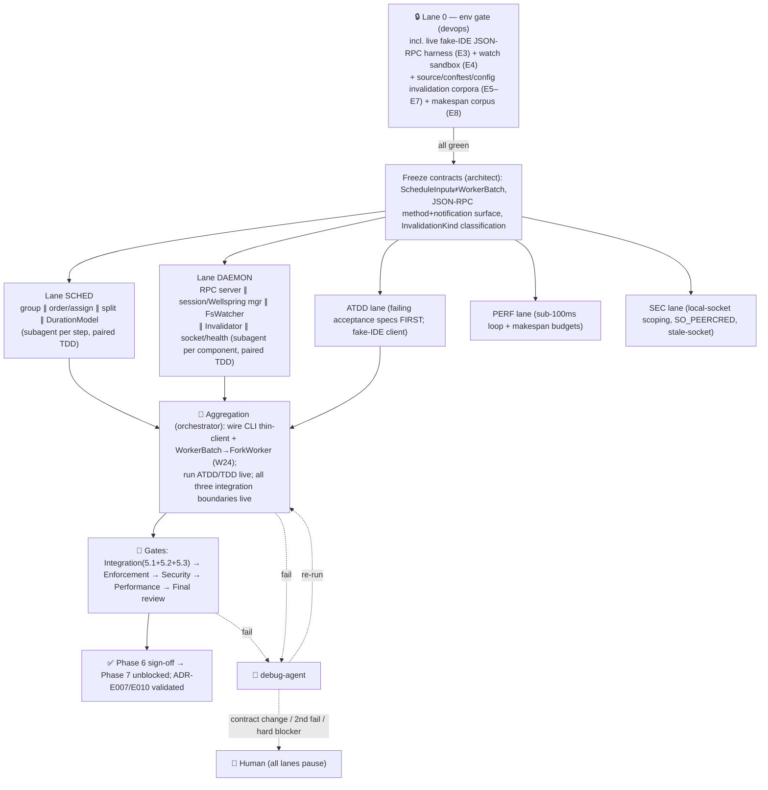

# Phase 6 — Scheduler + Warm Daemon (the sub-100ms inner loop)

> **Status:** ✅ **DELIVERED** on `feat/n5-conformance` — LocalityScheduler + runnable warm daemon (`EngineHandler` e2e, `react_to_change`/`watch_loop`, `tiderace-daemon` bin); measured inner loop ≈ 7 ms. Live status: [ROADMAP-v2](../ROADMAP-v2.md). Original plan preserved below.
> **Owner:** orchestrator-agent · **PM/architect:** architect-agent (+ plan-agent) · **Persona:** Software Engineer · **Date:** 2026-06-15
> **Shared scaffold:** [PIPELINE.md](../PIPELINE.md) (conventions, agent roster, env-gate doctrine,
> implementation standards, enforcement checkpoints, test doctrine, debug/retry — **not repeated here**).
> **Roadmap row:** [ROADMAP.md](../ROADMAP.md) Phase 6 · **Design:** [06-scheduler](../design/06-scheduler.md),
> [08-daemon](../design/08-daemon.md) ·
> **ADRs validated:** [ADR-E007](../design/adr/ADR-E007-warm-daemon.md) (warm daemon),
> [ADR-E010](../design/adr/ADR-E010-locality-scheduler.md) (locality scheduler).

This plan specializes the [PIPELINE.md](../PIPELINE.md) multiagent model for Phase 6 only. Where a
part is identical across phases (loaded conventions, the 24-agent roster → role mapping, the Lane 0
env-gate doctrine, the four implementation standards, the enforcement checkpoints, the ATDD/TDD
doctrine, and the debug/retry/escalation ladder) it is **referenced, not restated**.

---

## 0. Phase scope — the marquee thesis: *schedule for makespan + snapshot reuse, then keep it warm*

Phase 6 builds the two halves of the fast inner loop. The **`LocalityScheduler`** ([06](../design/06-scheduler.md),
[ADR-E010](../design/adr/ADR-E010-locality-scheduler.md)) decides *which worker runs which test, in what
order*, reconciling the two objectives that pull opposite ways — **makespan** (balance load) vs
**snapshot reuse** (co-locate a scope so its expensive **Watermark** is built once). The **warm
daemon** ([08](../design/08-daemon.md), [ADR-E007](../design/adr/ADR-E007-warm-daemon.md)) keeps the three
expensive things hot between invocations — imported Python (the **Wellspring(s)**), the caches, and
collection state — and serves CLI + IDE over a per-user/per-project **local socket** so a one-file
edit becomes streamed results **well under 100ms**. The single most dangerous part — **stale-module
invalidation** — is addressed head-on: surgical hash-invalidate when sound, **recycle** when not.

### 0.1 In scope (work items, each traceable to a lane + a live verification)

| ID | Work item | Design home | Lane |
|----|-----------|-------------|------|
| W1 | `Scheduler` trait (DIP seam) + `RoundRobinScheduler` (baseline / debug knob, evolves [`runner.rs`](../../../../tiderace/runner.rs) chunking) | [06 §2](../design/06-scheduler.md), [ADR-E005](../design/adr/ADR-E005-workspace-trait-seams.md) | SCHED |
| W2 | `ScheduleInput` / `ScopeGroup` / `WorkerBatch` / `SplitChoice` types (one per file) | [06 §2](../design/06-scheduler.md) | SCHED |
| W3 | `DurationModel` backed by SQLite `TEST_TIMING` (Phase 5) + cache records; `est`/`est_group`/`has_history`/`record` + EWMA `history_decay` | [06 §4](../design/06-scheduler.md), [11](../design/11-coverage-impact.md) | SCHED |
| W4 | **Group** — `group_by_scope`: sort by `ScopePath`, segment into `ScopeGroup`s at snapshot boundaries (cheap sort-then-segment via the `ScopePath` total order) | [06 §3.1](../design/06-scheduler.md) | SCHED |
| W5 | **Order** — `order_lpt`: groups by `est_group` descending (longest-processing-time-first) | [06 §3.2](../design/06-scheduler.md) | SCHED |
| W6 | **Assign** — `assign_greedy`: min-heap of workers by `est_load`, group → least-loaded worker | [06 §3.3](../design/06-scheduler.md) | SCHED |
| W7 | **Split** — `split_decision`: keep vs split along `next_boundary()` when `est_total > split_threshold × avg_bin`; flat-module count-shard fallback; `min_group_split` floor; re-insert shards | [06 §3.4](../design/06-scheduler.md) | SCHED |
| W8 | **Cold-run heuristic** — `cold_estimate` (static AST/line size · per-test floor · test count); `cold_proxy` knob; no-COW path raises effective `split_threshold` | [06 §4, §7](../design/06-scheduler.md) | SCHED |
| W9 | `[tool.tiderace.scheduler]` config (`scheduler`/`split_threshold`/`min_group_split`/`worker_count`/`history_decay`/`cold_proxy`), `WorkerCaps`-aware tuning | [06 §7](../design/06-scheduler.md), [13](../design/13-cross-cutting.md) | SCHED |
| W10 | `Daemon` lifecycle state machine (`Starting→Warming→Ready→Running/Invalidating/Recycling→Stopping`) in `daemon.rs` | [08 §4](../design/08-daemon.md) | DAEMON |
| W11 | `RpcServer` trait + `JsonRpcServer` (JSON-RPC 2.0, LSP-style `Content-Length` framing) + `RpcMethod` decode | [08 §9](../design/08-daemon.md) | DAEMON |
| W12 | Request/response methods: `discover` · `run` · `runImpacted` · `subscribeResults`/`unsubscribe` · `health` · `shutdown` | [08 §9.1](../design/08-daemon.md) | DAEMON |
| W13 | `EventStream` + server-pushed notifications: `tiderace/runStarted` · `tiderace/result` · `tiderace/runFinished` · `tiderace/invalidated` · `tiderace/collectionChanged` (adapts the engine `HookHost` stream, not a parallel one) | [08 §9.2–9.3](../design/08-daemon.md), [12](../design/12-plugin-host.md) | DAEMON |
| W14 | `Session` + `SessionManager` (per-`ProjectKey` warm `engine-core`: `WellspringManager`, `Cache`, `CollectionState`, `RunOrchestrator`); one-run-at-a-time admit + queue; idle-TTL eviction | [08 §2, §4](../design/08-daemon.md) | DAEMON |
| W15 | `FsWatcher` porting [`watcher.rs`](../../../../tiderace/watcher.rs) (debounce/quiet-window, ignore rules, `.py`-only, dedup batch) → `EventStream<ChangeBatch>` | [08 §2, §10](../design/08-daemon.md) | DAEMON |
| W16 | `Invalidator` — `diff` (content-hash via ported [`hasher.rs`](../../../../tiderace/hasher.rs)) → `classify` → `apply`; **in-place vs recycle** regimes; `InvalidationKind ∈ {Module, Conftest, Config, CLevel, ImportGraph}` | [08 §5](../design/08-daemon.md) | DAEMON |
| W17 | `RunOrchestrator::run_impacted(ChangeSet)` — the edit→result fast path: rescan → impact → cache → fork only impacted non-cached → stream | [08 §3](../design/08-daemon.md) | DAEMON |
| W18 | `LocalSocket` (`socket.rs`) — per-user/per-project, `$XDG_RUNTIME_DIR/tiderace/`, `0700`/`0600`, `SO_PEERCRED` uid check, `ProjectKey`-derived path | [08 §6](../design/08-daemon.md) | DAEMON/SEC |
| W19 | Lifecycle ops: **start** (detached spawn + readiness handshake, generalizes [`pool.rs`](../../../../tiderace/pool.rs) `ready`) · **reuse** (health-ping, not socket existence) · **stop** (drain + `kill_tree` fork groups via ported `procutil`, flush cache, unlink socket); stale-socket guard + PID/start-time lock file | [08 §4, §6, §10](../design/08-daemon.md) | DAEMON |
| W20 | Wellspring **recycle** (age/request-count, generalizes `pool.rs` `MAX_WORKER_REQUESTS=500`) + memory-bounded fork concurrency (`MemoryGovernor` from Phase 3) | [08 §4](../design/08-daemon.md) | DAEMON |
| W21 | `health` payload `HealthStatus{ state, sessions, rss_bytes, wellspring_age, cache_hit_rate }` | [08 §4 health](../design/08-daemon.md) | DAEMON |
| W22 | **Ephemeral in-process fallback** — `--no-daemon`/CI builds `engine-core` in-process; identical `RunReport` (one-core-two-front-ends) | [08 §7](../design/08-daemon.md), [ADR-E005](../design/adr/ADR-E005-workspace-trait-seams.md) | DAEMON |
| W23 | **Watch mode** — `tiderace watch` over the daemon: FS change → `runImpacted` → streamed results (generalizes today's [`main.rs`](../../../../tiderace/main.rs) `cmd_watch`) | [08 §3](../design/08-daemon.md) | DAEMON |
| W24 | CLI thin-client wiring — `tiderace run`/`watch` start-or-reuse daemon transparently; `WorkerBatch` → `ForkWorker` hand-off carries `snapshot_scope`/`scope_path`/`fixture_plan` | [08 §7](../design/08-daemon.md), [06 §8](../design/06-scheduler.md) | AGG |

### 0.2 Out of scope (owned by later phases — these are *boundaries*, not stubs per [PIPELINE §4.3](../PIPELINE.md))

- **Distributed `RemoteWorker`** (scheduling across machines) — explicitly future, not Phase 6. The
  `Scheduler` seam admits it later; this phase schedules only local fork workers.
- **pytest-compat layer, plugin host, reporters** (JUnit/JSON/GitHub/SARIF), conformance suite,
  Windows `SubprocessWorker` validation → **Phase 7** ([12](../design/12-plugin-host.md), [13](../design/13-cross-cutting.md), [ROADMAP](../ROADMAP.md)). Phase 6 emits results over the wire as `TestResult`/`RunReport`; the IDE-facing notification *shapes* are fixed here, the reporter *formats* are Phase 7.
- **Windows named-pipe socket** — the cross-platform fallback is Phase 7's hardening item ([ADR-E008](../design/adr/ADR-E008-cross-platform.md)); Phase 6 ships and verifies the **Unix domain socket** path (Linux), with the `socket.rs` seam shaped so the named-pipe impl drops in later (flagged G6).
- **Cross-run worker affinity** (pin a module's group to the worker holding its warm snapshot across
  inner-loop runs) — design open question [06 S-2](../design/06-scheduler.md); **flagged G3**, not built.
- **GC scheduling/triggering on snapshot retirement** — Phase 5 shipped `gc()`; *who* calls it on
  recycle is wired here only as far as flushing on `stop`; full retirement policy → flagged G4.

### 0.3 Dependencies & what this unblocks

- **Depends on Phase 5** — the **content-addressed cache** (`TieredCache`/`LocalCache`) the daemon holds
  warm; the **`ImpactAnalyzer`** + `ChangeSet` the watcher feeds; and the **`TEST_TIMING`** history rows
  the `DurationModel` consumes (written by Phase 5, *first consumed here* — [ROADMAP](../ROADMAP.md), [05 §0.2](../phase-5-coverage-cache/PLAN.md)).
- **Depends on Phase 3** — **Watermarks** / snapshot layers + `Wellspring`/`ForkWorker`/`fork_at` (the
  scheduler's `snapshot_scope` targets a `Watermark`; the daemon holds Wellsprings warm), `FixturePlan`
  (`closure_hash`, carried on every `WorkerBatch`), and the `MemoryGovernor` (fork concurrency bound).
- **Unblocks Phase 7** (compat/reporters/hardening attach to the daemon's RPC + the stable
  `WorkerBatch`/`RunReport` contracts).
- **Validates ADR-E007** (warm daemon as primary host, robust invalidation, local-socket scoping) and
  **ADR-E010** (duration-aware scope-locality scheduling beats round-robin on makespan **and** reuse).

---

## 1. Conventions loaded

Per [PIPELINE §1](../PIPELINE.md) (core/general.md, rust.md, feature/code/testing workflows, test
skills, ADRs E001–E010, planning structure). Standing gaps **G-C1…G-C4** apply unchanged. Phase-6
specifics layered on top:

- **One-type-per-file** ([ADR-E005](../design/adr/ADR-E005-workspace-trait-seams.md)) across
  `crates/engine-core/src/scheduler/` (`scheduler.rs` trait, `locality_scheduler.rs`,
  `round_robin_scheduler.rs`, `schedule_input.rs`, `duration_model.rs`, `scope_group.rs`,
  `worker_batch.rs`, `split_choice.rs`) and `crates/engine-daemon/src/` (`daemon.rs`, `rpc_server.rs`,
  `rpc_method.rs`, `session.rs`, `session_manager.rs`, `fs_watcher.rs`, `invalidator.rs`,
  `event_stream.rs`, `socket.rs`, `health.rs`).
- **Shell-over-core discipline** (daemon invariant #5, [08 §11](../design/08-daemon.md),
  [ADR-E005](../design/adr/ADR-E005-workspace-trait-seams.md)): **all run logic lives in `engine-core`**;
  `engine-daemon` adds only socket/RPC/watch/invalidate/stream. Enforced at the enforcement gate (grep:
  no `Wellspring`/`fork`/`Cache::put`/orchestration logic authored *inside* `engine-daemon`).
- **Behavioral parity invariant** (daemon invariant #2): a daemon run and the ephemeral fallback must
  produce **identical `RunReport`s** for the same inputs (W22) — warmth is an optimization, never a
  semantic. Verified by a differential test, not asserted by inspection.
- **No second event system** ([08 §9.3](../design/08-daemon.md)): RPC notifications are produced by a
  daemon-side `Reporter` subscribed to the engine `HookHost` ([12](../design/12-plugin-host.md)); the daemon
  does not invent a parallel event bus. CLI output, IDE streaming, and plugins observe the *same* events.
- **No network listener, ever** (daemon invariant #3): local socket only; the only outbound network I/O
  is Phase 5's `RemoteCache`. Enforced at security gate (grep: no `TcpListener`/`bind(0.0.0.0|127.0.0.1:port)` in `engine-daemon`).

---

## 2. Agent roster → Phase-6 lanes

Roster + role mapping are fixed in [PIPELINE §2](../PIPELINE.md). Phase 6 instantiates **two big work
lanes (SCHED, DAEMON) + ATDD + PERF + SEC + Lane 0**, each owned by an agent that spawns **paired TDD
subagents** (impl ∥ test) per [PIPELINE §6](../PIPELINE.md). No fabricated agents;
integration-verification → `test-agent` (the fake-IDE differential harness) gated by `orchestrator-agent`.

| Lane | Agent | Subagents spawned | Owns (W#) |
|------|-------|-------------------|-----------|
| **0 — Env gate** | `devops-agent` | `devops`, `docker` (only if the fake-IDE harness needs containerizing) | E1–E9 below |
| **SCHED — locality bin-pack** | `code-agent` | `scaffold`, `code` ×4 (group · order/assign · split · DurationModel), `testing` (TDD) ×4 — *subagent per algorithm step* | W1–W9 |
| **DAEMON — RPC + session/Wellspring mgr + FS watch + invalidator** | `code-agent` | `code` ×5 (RPC server · session/Wellspring manager · FsWatcher · Invalidator · socket/health), `testing` (TDD) ×5 — *subagent per component* | W10–W23 |
| **ATDD — acceptance** | `test-agent` | `testing` (drives the **fake-IDE JSON-RPC client**) | acceptance scenarios (§7) — authored **first** |
| **PERF — sub-100ms loop + makespan** | `performance-agent` | `benchmarking`, `profiling`, `bottleneck-analysis` | §8 budgets |
| **SEC — local-socket scoping** | `security-agent` | `threat-model`, `vulnerability-assessment-specialist`, `security-architecture-reviewer` | §9 |
| **AGG / gates** | `orchestrator-agent` (+ `review-agent`, `enforcement-agent`, `debug-agent`) | per [PIPELINE §2](../PIPELINE.md) | W24 + gates |

**Why a subagent per scheduler step / per daemon component (understand-before-applying,
[PIPELINE §4.4](../PIPELINE.md)):** the SCHED algorithm is four near-independent transforms over the same
worklist (group→order→assign→split) plus the `DurationModel` data source — each gets an impl subagent
paired with a `testing` subagent writing unit tests *alongside* (LPT-orders, split-threshold boundaries,
cold-estimate fallbacks). The DAEMON shell decomposes into five components with clean seams (RPC server,
session/Wellspring manager, watcher, invalidator, socket/health). **The Python boundary and the socket
are never mocked** — DAEMON tests fork a real `python` + real shim and speak real JSON-RPC over a real
Unix socket ([PIPELINE §6](../PIPELINE.md), §5 below).

---

## 3. Lane 0 — environment gate (devops-agent)

Per [PIPELINE §3](../PIPELINE.md): the pipeline owns **all** setup; no human is asked to run a command.
Lane 0 must be **all-green before any other lane unblocks**, and emits
`phase-6-scheduler-daemon/env-manifest.md` in the [Phase 1 manifest format](../../completed/phase-1-hardening-benchmarks/env-manifest.md).
A service that cannot start is a **hard blocker**, surfaced immediately ([PIPELINE §8](../PIPELINE.md)).

| # | Item | Provisioned by | Health check (verify) |
|---|------|----------------|------------------------|
| E1 | Rust toolchain + `cargo-llvm-cov` (≥80/70 gate) | pre-installed (carry-forward) | `cargo --version && cargo llvm-cov --version` |
| E2 | venv on **CPython ≥3.12** (warm Wellspring substrate) | `uv venv` (carry-forward; no sudo) | `python -c "import sys; assert sys.version_info>=(3,12)"` |
| E3 | **Fake-IDE JSON-RPC client harness** — a *real* client that frames `Content-Length` requests, calls `discover`/`run`/`runImpacted`/`subscribeResults`, and consumes streamed `tiderace/*` notifications over the live Unix socket (a small Rust integration bin or a typed Python client; **not a mock**) | **built + started by Lane 0** | harness connects to a throwaway daemon, calls `health`, gets `Ready`; records a streamed-result round-trip |
| E4 | **FS-watch sandbox project dir** — a writable scratch tree the watcher watches and the harness edits, isolated from the repo (so a test run cannot retrigger itself; ignore-rule fidelity) | generator (clean temp project per run) | watcher reports a debounced batch for a single `.py` save; ignores `__pycache__`/`.git`/`.venv`/state |
| E5 | **Invalidation corpus — edit *source*** — a module touched by many tests with a known body edit | generator | baseline impacted set recorded; edit re-runs only the intersecting tests |
| E6 | **Invalidation corpus — edit *conftest*** — a `conftest.py` whose fixtures span modules | generator | a conftest edit must trigger a **recycle** (stale-import correctness) |
| E7 | **Invalidation corpus — edit *config*** — `pyproject.toml` `[tool.tiderace]` change | generator | a config edit must trigger a **recycle** |
| E8 | **Fixture-heavy makespan corpus** — modules with expensive (Watermark-snapshotted) session/module fixtures + skewed per-test durations, with a primed `TEST_TIMING` history | generator + one warm priming run | hist rows present; `RoundRobinScheduler` vs `LocalityScheduler` measurable |
| E9 | `hyperfine` + branch + session file | `cargo install` + `git checkout -b feat/...` + session | `hyperfine --version && git branch --show-current` |

> **The fake-IDE harness (E3) and the socket are real integration boundaries, not mocks**
> ([PIPELINE §4.1](../PIPELINE.md)). Lane 0 builds and exercises the harness against a throwaway daemon
> before any DAEMON lane work unblocks; the §5 integration tests drive it end-to-end. If the harness
> cannot complete a streamed-result round-trip over the live socket, Phase 6 is **hard-blocked**.

---

## 4. Frozen interface contracts (architect-agent, before any parallel lane)

Contracts are frozen *once* after Lane 0 is green, so SCHED and DAEMON parallelize without churn. A
change to any of these mid-run is a **contract change ⇒ pause all lanes + re-present**
([PIPELINE §8](../PIPELINE.md)). Types live in `crates/engine-core/src/scheduler/` and
`crates/engine-daemon/src/`, one per file.

### 4.1 `ScheduleInput → Vec<WorkerBatch>` contract (the scheduler I/O the executor consumes)

```rust
// scheduler/scheduler.rs — the DIP seam (ADR-E005); two impls share it.
trait Scheduler { fn plan(&self, input: ScheduleInput) -> Vec<WorkerBatch>; }

// scheduler/schedule_input.rs — surviving TestItems post cache+impact filtering (Phase 5).
struct ScheduleInput {
    tests:        Vec<TestItem>,    // already cache-hit/impact-skip filtered upstream
    history:      DurationModel,    // SQLite TEST_TIMING + cache records (Phase 5)
    worker_count: usize,            // resolved 'auto' = min(cpu, rss_budget / per_fork_estimate)
    worker_caps:  WorkerCaps,       // supports_cow gate (Phase 3); false ⇒ raise split_threshold
    rss_budget:   u64,              // MemoryGovernor bound (Phase 3)
}

// scheduler/worker_batch.rs — the executor's input; carries EXACTLY what a ForkWorker needs.
struct WorkerBatch {
    worker_index:   usize,
    snapshot_scope: Scope,          // which Watermark to build/reuse and fork_at (Phase 3)
    scope_path:     ScopePath,      // shared by construction across every test in the batch
    tests:          Vec<NodeId>,    // ordered; fed one ExecRequest at a time over the shim protocol
    fixture_plan:   FixturePlan,    // layers / fork_from / post_fork / closure_hash (Phase 3 / 04 §8)
    est_load:       Duration,
}
```

**Invariants other lanes must honor (frozen):**
1. **Snapshot-build-once guarantee:** every `NodeId` in a `WorkerBatch` shares `snapshot_scope` **by
   construction** (§3.1 grouping), so the `ForkWorker` builds that `Watermark` **once** and forks every
   test from it — the locality payoff ([06 §8](../design/06-scheduler.md)). A scheduler that emits a batch
   whose tests do not share `snapshot_scope` is a **correctness bug**, not a perf miss.
2. **Determinism:** `plan` is a pure function of `ScheduleInput`; grouping is the cheap
   sort-then-segment over the `ScopePath` total order ([02 §5](../design/02-domain-model.md)), so the same
   input yields the same batches (testable without a fork).
3. **Split soundness:** a shard produced by `split_decision` carries the **deepest snapshot scope it
   still can** (`next_boundary()`); the flat-module count-shard fallback accepts module-snapshot rebuild
   per shard — never silently drops a test, never splits below `min_group_split` ([06 §3.4](../design/06-scheduler.md)).
4. **Cold-run never pathological:** with no `TEST_TIMING` history, `cold_estimate` must avoid
   pathological imbalance, not be exact; `DurationModel::record` folds every `TestResult.duration` back
   so the *next* run is duration-optimal ([06 §4](../design/06-scheduler.md), [ADR-E010](../design/adr/ADR-E010-locality-scheduler.md)).

### 4.2 JSON-RPC method + notification surface (the daemon wire contract IDEs bind to)

JSON-RPC 2.0, LSP-style `Content-Length` framing ([08 §9](../design/08-daemon.md)). **Request/response:**

| Method | Params | Result | Notes |
|--------|--------|--------|-------|
| `discover` | `{ roots?, force_rescan? }` | `{ items: TestItem[], collection_revision }` | warm `CollectionState`; rescan only if stale/forced — the IDE test tree |
| `run` | `{ selection: NodeId[] \| Query, options }` | `RunReport` (also streamed) | honors **cache → impact-skip → run** |
| `runImpacted` | `{ since?: ChangeSet, options }` | `RunReport` (also streamed) | the edit→result fast path; defaults to "since last run" via the warm impact graph |
| `subscribeResults` | `{ filter?: NodeId[] }` | `{ subscription: SubId }` | opens the streaming subscription; unsubscribe via `unsubscribe` or socket close |
| `unsubscribe` | `{ subscription: SubId }` | `{ ok }` | — |
| `health` | `{}` | `HealthStatus{ state, sessions, rss_bytes, wellspring_age, cache_hit_rate }` | liveness + warmth; drives reuse/recycle + stale-daemon detection |
| `shutdown` | `{ mode: "graceful" \| "now" }` | `{ ok }` | graceful drains in-flight; `now` kills fork groups immediately |

**Server-pushed notifications (completion-order, `run_id`-correlated):**

| Notification | Payload | Fires when |
|--------------|---------|-----------|
| `tiderace/runStarted` | `{ run_id, total_selected, impacted, cache_candidates }` | a run is admitted (progress denominator) |
| `tiderace/result` | `{ run_id, TestResult }` (`served_from_cache`, `Outcome`, `Duration`, `RichDiff` on fail) | each test resolves — cache-served or freshly forked |
| `tiderace/runFinished` | `{ run_id, RunReport }` | the run completes |
| `tiderace/invalidated` | `{ files, kind, recycled: bool }` | the watcher invalidated state (and whether a recycle happened) |
| `tiderace/collectionChanged` | `{ added, removed, collection_revision }` | a rescan changed the test set |

**Wire invariants (frozen):** all `NodeId`s/payloads travel **inside** JSON (serde-escaped) so a
crafted filename can never forge a second frame (carries forward the `pool.rs` newline-injection guard);
notifications are the engine `HookHost` stream adapted onto the wire, not a second event system
([08 §9.3](../design/08-daemon.md)).

### 4.3 `InvalidationKind` classification contract (the stale-import safety anchor)

`Invalidator::diff(ChangeBatch) -> Vec<ModuleDelta>` (content-hash, **not mtime** —
[ADR-E004](../design/adr/ADR-E004-content-addressed-cache.md)) → `classify(ModuleDelta) -> InvalidationKind`
→ `apply(session, deltas) -> InvalidationPlan`, with the two-regime guarantee:

| `InvalidationKind` | Regime | Wellspring |
|--------------------|--------|-----------|
| `Module` (test/impl body) | invalidate-in-place: drop module from import cache, rescan file, let cache key change naturally | **KEEP** |
| `ImportGraph` (new/deleted file, changed import edge) | rescan + patch impact graph; recycle **only if** the edge feeds the already-imported set | KEEP unless feeds wellspring |
| `Conftest` (`conftest.py`) | **RECYCLE** — fixtures/hooks span modules, stale closures unsafe | **RECYCLE** |
| `Config` (`pyproject.toml` / plugin enable / env settings) | **RECYCLE** — reinterprets the whole tree | **RECYCLE** |
| `CLevel` (C-ext / native / `sys.modules` surgery) | **RECYCLE** — interpreter no longer a faithful clean import | **RECYCLE** |

**Frozen safety invariant (daemon invariant #1):** *never serve a result from a stale interpreter.* Any
change the `Invalidator` cannot prove is a clean in-place module swap **forces a recycle** — correctness
outranks the re-warm cost ([08 §5](../design/08-daemon.md)). This is the explicit ADR-E007 ➖ addressed
head-on.

---

## 5. The live integration boundaries (all verified end-to-end, never mocked)

### 5.1 Boundary (1) — daemon JSON-RPC over the local socket

The fake-IDE client (E3) connects to the **live** Unix domain socket, frames real `Content-Length`
requests, and calls `discover` → `run` → `runImpacted` → `subscribeResults`, receiving **streamed real
results** (`tiderace/runStarted` → `tiderace/result` ×N in completion order → `tiderace/runFinished`).
**Verification (test-agent, live):** the harness asserts the streamed `TestResult`s match a direct
`engine-core` run of the same selection (parity), and that `health` reports `Ready` with non-zero
`wellspring_age` after warm-up. **The socket is never mocked.**

### 5.2 Boundary (2) — FS watch → invalidation → impacted fork-run → streamed results within budget

The harness edits a source file in the sandbox tree (E5). `FsWatcher` debounces → `Invalidator`
classifies `Module` (in-place) → `RunOrchestrator::run_impacted` rescans, queries impact, checks cache,
forks only the impacted non-cached tests, and the daemon streams `tiderace/invalidated{recycled:false}`
then `tiderace/result` ×N. **Verification (test-agent + performance-agent, live):** the impacted set
equals the E5 baseline (no over/under-selection), the rest serve from cache, and the **edit→first-result
wall-clock is measured against the sub-100ms budget** on a small blast radius (§8 P1).

### 5.3 Boundary (3) — conftest/config change triggers a real Wellspring recycle (stale-import correctness)

The harness edits `conftest.py` (E6) — and separately `pyproject.toml` (E7). The `Invalidator` must
classify `Conftest`/`Config`, drive `Invalidating → Recycling → Warming`, tear down the stale
Wellspring (process-group `kill_tree`), re-import the clean tree, and stream
`tiderace/invalidated{recycled:true}`. **Verification (test-agent, live, the classic-failure-mode test):**
a fixture value mutated in `conftest.py` is reflected in the *next* run's results — proving **no result
is served from a partially-mutated interpreter**. A negative control (plain module edit) must **not**
recycle (`recycled:false`), proving recycle is not over-eager. **The Python boundary is never mocked.**

### 5.4 The closed-loop acceptance (scheduler + daemon + invalidation together)

1. **Warm sub-100ms edit→result:** a one-line source edit on a warm daemon streams the impacted
   results well under 100ms (small blast radius).
2. **Scheduler beats round-robin:** on the E8 fixture-heavy corpus, `LocalityScheduler` makespan and
   wasted-snapshot-setup are both materially better than `RoundRobinScheduler` (the ADR-E010 §6 worked
   example reproduced on real timings).
3. **Recycle correctness:** conftest/config edits recycle; module edits do not — and no run ever
   reflects a stale fixture.
4. **Behavioral parity:** the same selection via daemon and via `--no-daemon` ephemeral fallback yields
   identical `RunReport`s (daemon invariant #2).

---

## 6. Execution map (specializes [PIPELINE §7](../PIPELINE.md))



**Parallelism rationale:** SCHED lives entirely in `engine-core/src/scheduler/` and depends only on the
frozen §4.1 contract + Phase-5 `DurationModel` data; DAEMON lives in `engine-daemon/` and depends on the
frozen §4.2/§4.3 contracts + the same `engine-core` the CLI already drives. They touch **disjoint
crates**, so they run concurrently. The only cross-lane handshake is the `WorkerBatch` the daemon's
`RunOrchestrator` feeds to `ForkWorker` (SCHED produces, DAEMON consumes) — fixed in §4.1, so
aggregation (W24, the CLI thin-client wiring) is integration, not redesign.

---

## 7. Test strategy (ATDD-first, per [PIPELINE §6](../PIPELINE.md))

**ATDD scenarios authored as failing specs before code** (the spec), differential vs an oracle where one
exists (round-robin for makespan; the ephemeral in-process path for parity):

| # | Acceptance scenario | Oracle / assertion |
|---|---------------------|--------------------|
| A1 | Warm daemon: one-line source edit → streamed impacted results **< 100ms** (small blast radius, E5) | hyperfine edit→first-result wall-clock (P1) |
| A2 | `LocalityScheduler` makespan **and** snapshot-setup beat `RoundRobinScheduler` on E8 | differential vs round-robin (the ADR-E010 §6 example on real timings) |
| A3 | `runImpacted` after a source edit re-runs exactly the impacted set; rest cache-served; `tiderace/invalidated{recycled:false}` | impacted set vs E5 baseline |
| A4 | **conftest** edit (E6) ⇒ **recycle**; the next run reflects the changed fixture (no stale interpreter) | `tiderace/invalidated{recycled:true}` + value reflected |
| A5 | **config** edit (E7) ⇒ **recycle** | `recycled:true` |
| A6 | Plain module edit does **not** recycle (negative control — recycle not over-eager) | `recycled:false` |
| A7 | Daemon `RunReport` ≡ `--no-daemon` ephemeral `RunReport` for the same selection (behavioral parity) | byte-equal report diff |
| A8 | Lifecycle: start (detached + readiness) → reuse (health-ping) → stale-socket replaced → graceful `shutdown` drains in-flight then `kill_tree`s fork groups | live RPC + process-tree assertions |
| A9 | Cold-run scheduler (no `TEST_TIMING`) avoids pathological imbalance; second run is duration-optimal (history folded) | imbalance bound; run-2 makespan < run-1 |
| A10 | `discover`/`subscribeResults` stream `tiderace/result` in completion order, `run_id`-correlated, over the live socket | fake-IDE harness (E3) |

**TDD in parallel:** each lane's `testing` subagent covers the 7 coverage categories
(happy/boundary/null/error/coverage/isolation/regression) against the
[skill](../../../.claude/skills/test-coverage-categories). SCHED tests are **pure** (no fork) — LPT
ordering, split-threshold boundaries (`= 1.5×`, just over, far over), `min_group_split` floor, flat-module
fallback, cold-estimate proxies, no-COW threshold raise. DAEMON tests **never mock** the socket or the
Python boundary — real Unix socket, real `python` + real shim, real recycle. Carry-forward regression
tests from [`pool.rs`](../../../../tiderace/pool.rs) (newline-injection framing, kill+respawn on
hang/crash, `MAX_WORKER_REQUESTS` recycle) and [`watcher.rs`](../../../../tiderace/watcher.rs) (ignore
rules, `.py`-only, debounce) are preserved and extended. Coverage gate **≥80 line / ≥70 branch**.

---

## 8. Performance lane (performance-agent — every claim benchmarked)

| Budget | Target | Method |
|--------|--------|--------|
| P1 | **Edit→result well under 100ms** on a warm daemon, small blast radius (the G4 thesis, [08 §1](../design/08-daemon.md)) | hyperfine; FS-save → first `tiderace/result`; budget-decomposed (debounce + diff/invalidate + impact + cache-check + fork+body) |
| P2 | **Scheduler makespan + reuse vs round-robin** on E8 fixture-heavy corpus (ADR-E010 §6 numbers, reproduced) | hyperfine both schedulers; report makespan + total fixture-setup seconds |
| P3 | **Scheduler cost itself** — `plan()` must stay cheap Rust (runs every cold run + every warm loop, [06 §1](../design/06-scheduler.md)) | micro-bench `plan()` at 1k/10k/50k tests; assert sub-ms-to-low-ms |
| P4 | **Warm-reuse win** — second daemon invocation vs first (warm-up amortized) and vs `--no-daemon` cold | hyperfine; quantifies the ADR-E007 warmth payoff |
| P5 | **Daemon memory growth** under sustained forking — RSS over N inner-loop cycles; recycle threshold validated (the [08 §4](../design/08-daemon.md) memory-bound risk) | RSS sampling across a long watch session; assert recycle bounds it (flag G2 if not) |
| P6 | **Split-threshold sweep** — validate the `1.5` default + no-COW raise across corpora (ADR-E010 "needs tuning, config knob") | parametric sweep on E8; recommend default |

---

## 9. Security lane (security-agent — local-socket scoping + stale-socket)

| # | Concern | Mitigation this phase | Deferred |
|---|---------|------------------------|----------|
| S1 | **Cross-user access** to the warm interpreter / cache | `SO_PEERCRED` uid check; socket under `$XDG_RUNTIME_DIR/tiderace/` `0700`/`0600`, owned by invoking uid; refuse any uid ≠ owner ([08 §6](../design/08-daemon.md)) | — |
| S2 | **Cross-project session addressing** | one `Session` per canonicalized `ProjectKey` (real path + interpreter fingerprint); socket path derived from a hash of the key — two projects/venvs never share warm state | — |
| S3 | **Stale-socket trust** (leftover from a crashed daemon) | liveness proven by `health` ping, not socket existence; PID + start-time lock file distinguishes alive/crashed/different; stale socket **replaced**, never trusted ([08 §6](../design/08-daemon.md)) | — |
| S4 | **Network exposure** | **no TCP listener, ever** — local socket only; grep-enforced (§1); only outbound I/O is Phase-5 `RemoteCache` | — |
| S5 | **Frame forgery** via crafted NodeId/path | payloads inside serde-escaped JSON (carry-forward `pool.rs` newline-injection guard, unit-tested) | — |
| S6 | **Privilege escalation** | daemon runs as invoking user, no setuid/setgid, no global listener, inherits user env/venv | — |
| S7 | **Windows named-pipe** peer-cred + ACL specifics | shaped seam only this phase | named-pipe impl + cross-platform socket hardening → Phase 7 ([ADR-E008](../design/adr/ADR-E008-cross-platform.md)), flagged G6 |

---

## 10. Gaps & open questions (flagged for human review — do not silently resolve)

| ID | Gap | Source | Proposed handling (for review) |
|----|-----|--------|-------------------------------|
| **G1** | **Stale-module invalidation correctness** — the classic warm-host failure mode (serve a result from a partially-mutated interpreter) | [08 §5](../design/08-daemon.md), [ADR-E007 ➖](../design/adr/ADR-E007-warm-daemon.md) | Addressed head-on: hash-classify (§4.3) with **recycle-when-unsure**; A4/A5/A6 + boundary 5.3 prove conftest/config recycle and the module-edit negative control live. **Soundness floor: when in doubt, recycle.** Residual risk = a `CLevel` mutation we fail to *classify*; conservative default treats unknown import-time native state as `CLevel` → recycle. |
| **G2** | **Daemon memory growth** under long sessions (COW write amplification, [ADR-E003](../design/adr/ADR-E003-fork-snapshot-isolation.md)) | [08 §4](../design/08-daemon.md) | PERF P5 samples RSS over N cycles; recycle by age/request-count (generalizes `pool.rs` `MAX_WORKER_REQUESTS`) + memory-bounded fork concurrency (`MemoryGovernor`). If recycle does not bound it, escalate. |
| **G3** | **Cross-run worker affinity** (pin a module's group to the worker already holding its warm snapshot) | [06 S-2](../design/06-scheduler.md), [08 F1/E-1](../design/08-daemon.md) | **Flagged, not built** this phase; the `Scheduler`/`Session` seams admit it later. Phase 6 rebuilds the snapshot per warm run; affinity is a follow-on optimization. |
| **G4** | **GC-on-recycle / snapshot-retirement policy** | [07 C3](../design/07-cache.md), [06 S-2](../design/06-scheduler.md) | This phase flushes the cache index on `stop`; the full retirement trigger (who calls `gc()` on recycle) is flagged for a follow-on — not stubbed. |
| **G5** | **Multi-client concurrency** — multiple IDEs/CLIs subscribing to one `Session` mid-run | [08 §9.3](../design/08-daemon.md) | This phase: one logical **run at a time** per `Session` (queued); multiple `subscribeResults` to the same run is supported. Concurrent *runs* per project deferred; document the queueing semantics. |
| **G6** | **Cross-platform socket specifics** — Windows named pipe peer-cred/ACL; macOS `LOCAL_PEERCRED` | [08 §6](../design/08-daemon.md), [ADR-E008](../design/adr/ADR-E008-cross-platform.md) | Phase 6 ships + verifies the **Linux Unix-socket** path with a clean `socket.rs` seam; the named-pipe impl and macOS peer-cred validation are **Phase 7 hardening** — flagged, not stubbed. |
| **G7** | **Split-threshold default** (`1.5`) may not generalize across suites | [06 §9 S-1](../design/06-scheduler.md), [ADR-E010 revisit](../design/adr/ADR-E010-locality-scheduler.md) | PERF P6 sweeps it; ship `1.5` as the benchmarked default + the config knob; if locality penalty is negligible for cheap-fixture suites, recommend leaning toward pure LPT (the ADR-E010 revisit trigger). |
| **G-C1…G-C4** | Standing convention gaps | [PIPELINE §1](../PIPELINE.md) | Unchanged; ratify before unblock |

**Escalation:** any gate failing twice, any hard blocker (fake-IDE harness can't complete a streamed
round-trip, socket un-bindable, fork+recycle crash, daemon RSS unbounded by recycle), or any contract
change ⇒ **all lanes pause and this plan is re-presented** ([PIPELINE §8](../PIPELINE.md)).

---

## Summary (for the approver)

Phase 6 builds the sub-100ms inner loop in two halves over disjoint crates. The **`LocalityScheduler`**
(`engine-core/src/scheduler/`, [06](../design/06-scheduler.md)/[ADR-E010](../design/adr/ADR-E010-locality-scheduler.md))
turns surviving post-cache/impact `TestItem`s into `WorkerBatch`es via **group → order → assign → split**:
group tests by deepest shared **Watermark** scope so a snapshot is built once, order groups
longest-processing-time-first from SQLite `TEST_TIMING` history (cold-run static-size heuristic that
converges after one run), greedily assign to the least-loaded worker, and split a too-big group along the
*next* scope boundary — beating round-robin on **both** makespan and wasted fixture setup. The **warm
daemon** (`engine-daemon/`, [08](../design/08-daemon.md)/[ADR-E007](../design/adr/ADR-E007-warm-daemon.md))
is a thin shell over the *same* `engine-core` the CLI drives: it holds Wellspring(s), caches, and
collection state warm; speaks **JSON-RPC over a per-user/per-project Unix socket** to CLI + IDE; watches
the FS, diffs by **content hash**, runs impact, and fork-runs only the impacted non-cached tests,
streaming results — and **recycles the Wellspring** on any `conftest`/config/C-level change so it
**never serves a stale-interpreter result** (the classic failure mode, addressed head-on). All three
boundaries are verified **live** by Lane 0 + test-agent — a real **fake-IDE JSON-RPC client** over the
socket, FS-watch → invalidate → impacted fork-run within the latency budget, and a real conftest/config
**recycle** — with an ephemeral in-process fallback proving daemon/CLI behavioral parity, validating
**ADR-E007** and **ADR-E010**. Out of scope (later phases): distributed `RemoteWorker`, reporters/compat,
Windows named-pipe socket, cross-run worker affinity.

### JSON-RPC method / notification surface this phase finalizes

```
request/response:
  discover(roots?, force_rescan?)        -> { items: TestItem[], collection_revision }
  run(selection: NodeId[]|Query, options)-> RunReport            (also streamed)
  runImpacted(since?: ChangeSet, options)-> RunReport            (also streamed)  [edit→result fast path]
  subscribeResults(filter?: NodeId[])    -> { subscription: SubId }
  unsubscribe(subscription: SubId)       -> { ok }
  health()                               -> HealthStatus{ state, sessions, rss_bytes,
                                                          wellspring_age, cache_hit_rate }
  shutdown(mode: "graceful"|"now")       -> { ok }

server-pushed notifications (completion-order, run_id-correlated):
  tiderace/runStarted     { run_id, total_selected, impacted, cache_candidates }
  tiderace/result         { run_id, TestResult }   (served_from_cache, Outcome, Duration, RichDiff on fail)
  tiderace/runFinished    { run_id, RunReport }
  tiderace/invalidated    { files, kind, recycled: bool }
  tiderace/collectionChanged { added, removed, collection_revision }
```
- JSON-RPC 2.0, LSP-style `Content-Length` framing; **local socket only**, never TCP.
- Notifications are the engine `HookHost` stream adapted onto the wire (no parallel event system).
- All `NodeId`s/payloads inside serde-escaped JSON (carry-forward `pool.rs` newline-injection guard).

### Scheduler input/output contract this phase finalizes

```
Scheduler::plan(ScheduleInput) -> Vec<WorkerBatch>          // DIP seam: LocalityScheduler | RoundRobinScheduler

ScheduleInput { tests: Vec<TestItem>,         // surviving, post cache-hit + impact-skip filtering
                history: DurationModel,        // SQLite TEST_TIMING + cache records (Phase 5); EWMA history_decay
                worker_count: usize,           // 'auto' = min(cpu, rss_budget / per_fork_estimate)
                worker_caps: WorkerCaps,       // supports_cow=false ⇒ raise effective split_threshold
                rss_budget: u64 }              // MemoryGovernor bound (Phase 3)

WorkerBatch  { worker_index, snapshot_scope: Scope,  // the Watermark to build once + fork_at
               scope_path: ScopePath,                // shared by EVERY test in the batch, by construction
               tests: Vec<NodeId>,                   // ordered; one ExecRequest at a time over the shim
               fixture_plan: FixturePlan,            // layers/fork_from/post_fork/closure_hash (Phase 3)
               est_load: Duration }
```
- **plan() is a pure, deterministic function** of `ScheduleInput` (testable without a fork).
- **Snapshot-build-once guarantee:** every test in a batch shares `snapshot_scope` by construction, so
  the `ForkWorker` builds that Watermark once and forks every test from it — the locality payoff.
- **Split soundness:** shards carry the deepest snapshot scope they still can (`next_boundary()`); never
  drop a test, never split below `min_group_split`.
- **Cold→warm:** no-history runs use `cold_estimate` (avoid pathological imbalance, not exact);
  `DurationModel::record` folds each `TestResult.duration` back so the next run is duration-optimal.
- Config: `[tool.tiderace.scheduler]` — `scheduler` · `split_threshold`(1.5) · `min_group_split`(2) ·
  `worker_count`(auto) · `history_decay`(0.5) · `cold_proxy`(static_size).
