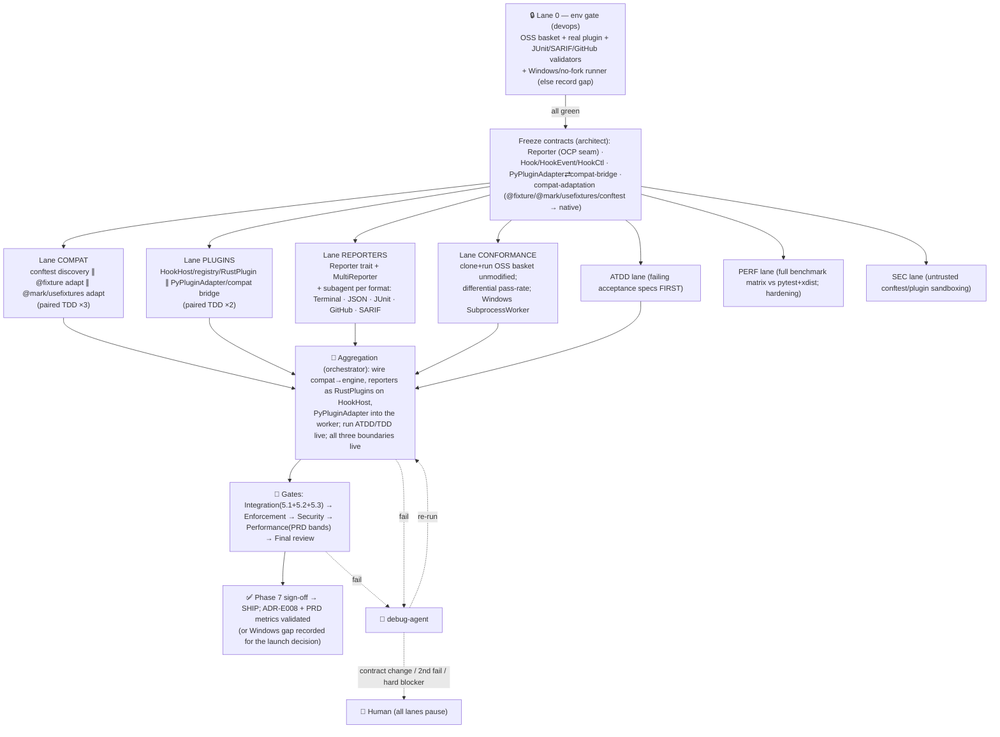

# Phase 7 — Compat + Reporting + Plugin Host + Hardening (adoption + ship-readiness)

> **Status:** 🟢 **core DELIVERED** on `feat/n5-conformance` — 5 reporters + plugin host (`HookHost`) + Windows CI job + measured perf; further governor tuning is iterative. Live status: [ROADMAP-v2](../ROADMAP-v2.md). Original plan preserved below.
> **Owner:** orchestrator-agent · **PM/architect:** architect-agent (+ plan-agent) · **Persona:** Software Engineer · **Date:** 2026-06-15
> **Shared scaffold:** [PIPELINE.md](../PIPELINE.md) (conventions, agent roster, env-gate doctrine,
> implementation standards, enforcement checkpoints, test doctrine, debug/retry — **not repeated here**).
> **Roadmap row:** [ROADMAP.md](../ROADMAP.md) Phase 7 (the final phase → ship) · **Design:**
> [12-plugin-host](../design/12-plugin-host.md), [13-cross-cutting §2 (reporting)](../design/13-cross-cutting.md),
> [PRD success metrics](../PRD.md#success-metrics) · **ADRs validated:**
> [ADR-E008](../design/adr/ADR-E008-cross-platform.md) (cross-platform `Worker`),
> [ADR-E001](../design/adr/ADR-E001-pure-rust-engine-no-pytest.md) (own the framework; staged compat).

This plan specializes the [PIPELINE.md](../PIPELINE.md) multiagent model for Phase 7 only. Where a
part is identical across phases (loaded conventions, the 24-agent roster → role mapping, the Lane 0
env-gate doctrine, the four implementation standards, the enforcement checkpoints, the ATDD/TDD
doctrine, and the debug/retry/escalation ladder) it is **referenced, not restated**.

---

## 0. Phase scope — the adoption + ship-readiness phase: *run real suites unmodified, emit standard reports, prove the claims*

Phases 1–6 built the engine: the **Wellspring** fork-from-warm substrate, **Watermark** fixture
snapshot layers, full pytest/unittest styles + assertions, the content-addressed cache, and the warm
daemon + scheduler. Phase 7 is what makes it **shippable and adoptable**: a real-world pytest/unittest
suite must run *unmodified* (the pytest-compat layer), the run must emit the **standard report formats**
real CI/IDE/security tools consume (the reporters), real Python plugins must keep working (the plugin
host + `PyPluginAdapter`), and the **PRD performance + adoption metrics must be measured, not asserted**
(the conformance suite + full benchmark matrix). It validates **ADR-E008** (the Windows
`SubprocessWorker` fallback) and the **PRD success metrics** — and is honest where it cannot
(Windows runner availability, long-tail plugin compat) rather than faking a pass.

### 0.1 In scope (work items, each traceable to a lane + a live verification)

| ID | Work item | Design home | Lane |
|----|-----------|-------------|------|
| W1 | **`conftest.py` discovery + load** — directory-walked, nearest-first scope chain (root→leaf), evaluated in the fork worker; fixtures/marks it defines visible to tests below it | [ADR-E001](../design/adr/ADR-E001-pure-rust-engine-no-pytest.md), [12 §7](../design/12-plugin-host.md) | COMPAT |
| W2 | **`@pytest.fixture` adaptation** — map decorator (scope, params, autouse, `yield`-finalizer, `name=`) onto the native Watermark fixture graph (Phase 3) — *adapt*, do **not** re-import pytest's fixture machinery | [ADR-E001](../design/adr/ADR-E001-pure-rust-engine-no-pytest.md), [04 fixture graph](../design/04-fixture-graph.md) | COMPAT |
| W3 | **`@pytest.mark.*` + `usefixtures` adaptation** — `skip`/`skipif`/`xfail`/`parametrize`/custom marks + `@pytest.mark.usefixtures(...)` mapped onto the native mark/parametrize model (Phase 4); custom marks registered (no `PytestUnknownMarkWarning` noise) | [ADR-E001](../design/adr/ADR-E001-pure-rust-engine-no-pytest.md), [10 test-styles](../design/10-test-styles.md) | COMPAT |
| W4 | **`HookHost` + `Hook` trait + `HookEvent` (closed enum) + `HookRegistry` + `Priority` + `HookCtl`** — Rust-native dispatcher; engine-level hooks fire **once per event in the orchestrator**, not per fork | [12 §2,§4,§5](../design/12-plugin-host.md) | PLUGINS |
| W5 | **`RustPlugin` trait** — the in-process fast path; the reporters (W9–W13) and flaky-detect register as `RustPlugin`s observing engine events | [12 §3](../design/12-plugin-host.md) | PLUGINS |
| W6 | **`PyPluginAdapter`** (`Hook` impl) + worker-side **compat bridge** — loads a curated set of REAL Python plugins **inside the fork worker** against a minimal, curated pytest-hook surface (`pytest_runtest_setup`/`call`/`teardown` subset); explicit opt-in via config | [12 §3,§7](../design/12-plugin-host.md) | PLUGINS |
| W7 | **Hook error isolation** — observer-hook error logged + isolated (run continues); mutating-hook (`emit_mut`) error drops the mutation + surfaces in `RunReport` diagnostics; worker-plugin crash contained by fork boundary as `Outcome::Error` | [12 §6, invariant 4](../design/12-plugin-host.md), [13 §3.2](../design/13-cross-cutting.md) | PLUGINS |
| W8 | **`Reporter` trait + `MultiReporter` composite + `OutputSink`** — the OCP seam; `on_collection`/`on_result` (streaming) + `finish`; fans out to several reporters at once | [13 §2.1](../design/13-cross-cutting.md), [01 §7](../design/01-architecture.md) | REPORTERS |
| W9 | **`TerminalReporter`** — ANSI boxed/colored, live progress + summary; carries the `tiderace/reporter.rs` look forward but renders structured `RichDiff` (Phase 4) on failure | [13 §2.2](../design/13-cross-cutting.md) | REPORTERS (subagent) |
| W10 | **`JsonReporter`** — newline-delimited JSON events (one per `on_result`) + final report object; the JSON-RPC contract the daemon (Phase 6) exposes; keys on stable `NodeId` | [13 §2.2](../design/13-cross-cutting.md) | REPORTERS (subagent) |
| W11 | **`JUnitReporter`** — JUnit XML `<testsuite>`/`<testcase>`; `finish` only | [13 §2.2](../design/13-cross-cutting.md) | REPORTERS (subagent) |
| W12 | **`GitHubReporter`** — GitHub Actions workflow commands (`::error file=…,line=…::`) + job-summary markdown; live annotation; gated on `GITHUB_ACTIONS=true` | [13 §2.2](../design/13-cross-cutting.md) | REPORTERS (subagent) |
| W13 | **`SarifReporter`** — SARIF 2.1.0 JSON for GitHub code-scanning/security dashboards; `finish` only | [13 §2.2](../design/13-cross-cutting.md) | REPORTERS (subagent) |
| W14 | **Conformance suite** — extend [`benchmarks/real_world.sh`](../../../../benchmarks/real_world.sh) into a differential **pass-rate harness** over a basket of real OSS pytest+unittest projects run *unmodified*; emit a per-suite + per-feature pass-rate breakdown | [PRD adoption metric](../PRD.md#success-metrics), [ADR-E001](../design/adr/ADR-E001-pure-rust-engine-no-pytest.md) | CONFORMANCE |
| W15 | **Full benchmark matrix** — extend [`benchmarks/run_benchmarks.py`](../../../../benchmarks/run_benchmarks.py) to validate the **PRD perf targets** (inner-loop/CI/cold/fixture-heavy) vs pytest **and** pytest-xdist on identical suites/hardware via hyperfine | [PRD success metrics](../PRD.md#success-metrics) | PERF |
| W16 | **Windows `SubprocessWorker` validation** — run the compat + reporter + conformance acceptance set on the no-fork `SubprocessWorker` path (ADR-E008), proving correctness (degraded perf accepted). **If no Windows runner is available in the env, Lane 0 records it as an explicit gap/blocker — never faked** | [ADR-E008](../design/adr/ADR-E008-cross-platform.md) | CONFORMANCE / Lane 0 |
| W17 | **Performance hardening** — close gaps surfaced by W15 (allocation/IPC/dispatch hot paths) so the measured numbers land in the PRD bands; no behavior change | [PRD success metrics](../PRD.md#success-metrics) | PERF |
| W18 | **Untrusted conftest/plugin sandboxing** — `conftest.py` and worker-side compat plugins are untrusted code; they run under the existing `SandboxHooks` (Phase 5) and the fork-boundary isolation; document the trust posture | [13 §4](../design/13-cross-cutting.md), [12 §6](../design/12-plugin-host.md) | SEC |

### 0.2 Out of scope (owned by later/never — these are *boundaries* or explicit non-goals per [PIPELINE §4.3](../PIPELINE.md), not stubs)

- **100% pytest-plugin-ecosystem compatibility.** Explicit PRD non-goal + [12 §7.3](../design/12-plugin-host.md)/invariant 5: this phase ships the `PyPluginAdapter` **boundary** + a *curated* set of high-value plugins proven by the conformance suite. Every unsupported plugin is **reported as unsupported** (never silently misbehaving) and listed as a **roadmap item** (G2) — not stubbed.
- **New `HookEvent`s beyond the closed catalogue** ([12 §4](../design/12-plugin-host.md)). The enum is closed; adding events is a design-doc + `hook_event.rs` edit, out of phase scope.
- **A native plugin SDK / public `RustPlugin` API surface for third parties.** This phase uses `RustPlugin` internally (reporters/flaky-detect); publishing it as a stable extension point is a post-ship roadmap item (G4).
- **Hermetic `Enforce`-stage sandboxing of conftest/plugins** (deny-on-violation, auto-pin). Phase 5 shipped `Observe`; this phase consumes it for untrusted-code observation but does not add enforcement ([13 §4.2](../design/13-cross-cutting.md)).
- **CRIU/WSL COW-amortization for the Windows path** — explicit ADR-E008 "parked" alternative; the Windows fallback is `SubprocessWorker` (correct, degraded), not a snapshot scheme.

### 0.3 Dependencies & what this unblocks

- **Depends on ALL prior phases.** Phase 2 (domain `TestResult`/`RunReport`/`NodeId`, collection, `Worker` trait + `SubprocessWorker` seam), Phase 3 (native Watermark fixture graph that `@pytest.fixture` adapts onto; `SubprocessWorker` first introduced), Phase 4 (marks/parametrize/`RichDiff` that reporters render + `@pytest.mark` adapts onto), Phase 5 (`SandboxHooks` for untrusted-code observation; cache stats reporters surface), Phase 6 (`JsonReporter`'s streaming events are the daemon's JSON-RPC contract).
- **Unblocks ship.** This is the **terminal phase** of the roadmap; its sign-off authorizes release.
- **Validates ADR-E008** (the cross-platform `Worker` fallback works on a no-fork path) and the **PRD success metrics** (perf bands + the adoption pass-rate metric) — the two things a launch decision rests on.

---

## 1. Conventions loaded

Per [PIPELINE §1](../PIPELINE.md) (core/general.md, rust.md, feature/code/testing workflows, test
skills, ADRs E001–E010, planning structure). Standing gaps **G-C1…G-C4** apply unchanged. Phase-7
specifics layered on top:

- **One-type-per-file** ([ADR-E005](../design/adr/ADR-E005-workspace-trait-seams.md)) across
  `crates/engine-core/src/{hooks,report,compat}/`: `hooks/{hook_host,hook,hook_event,hook_registry,priority,rust_plugin,py_plugin_adapter}.rs` ([12 intro](../design/12-plugin-host.md)) and `report/{reporter,multi_reporter,terminal_reporter,json_reporter,junit_reporter,github_reporter,sarif_reporter,output_sink}.rs` ([13 §2](../design/13-cross-cutting.md)).
- **`HookEvent` is closed** ([12 invariant 1](../design/12-plugin-host.md)): no lane adds a lifecycle event without editing `hook_event.rs` *and* [12 §4](../design/12-plugin-host.md). Enforced at the enforcement gate.
- **New report formats are added behind the `Reporter` trait (OCP), never by editing existing reporters** ([13 §6](../design/13-cross-cutting.md)). The five formats are five files implementing one trait; the orchestrator holds exactly one `Reporter` (the `MultiReporter` composite).
- **Reporters are pure consumers** of `TestResult`/`RunReport`; they never mutate domain state and **never branch on `TestStyle`** ([13 §6](../design/13-cross-cutting.md)).
- **Engine-level hooks fire in Rust, once per event** — never once per fork worker, never through Python ([12 invariant 2](../design/12-plugin-host.md)). Anything per-test-in-Python goes through the worker-side compat bridge only.
- **The compat surface is curated and staged, not the full pluggy/`_pytest` surface** ([12 invariant 5](../design/12-plugin-host.md)); unsupported plugins are *reported*, never silently degraded.
- **No re-importing pytest's runner/session/collection** ([ADR-E001](../design/adr/ADR-E001-pure-rust-engine-no-pytest.md), [12 §7.3](../design/12-plugin-host.md)) — the compat layer *adapts* decorators/marks onto the native engine; it does not run pytest underneath. Enforced at the enforcement gate (grep: no `import pytest` driving the run, no `_pytest.main`/`pluggy` in the hot path).

---

## 2. Agent roster → Phase-7 lanes

Roster + role mapping are fixed in [PIPELINE §2](../PIPELINE.md). Phase 7 instantiates **six work
lanes + Lane 0**, each owned by an agent that spawns **paired TDD subagents** (impl ∥ test) per
[PIPELINE §6](../PIPELINE.md). No fabricated agents; integration-verification → `test-agent` gated by
`orchestrator-agent`.

| Lane | Agent | Subagents spawned | Owns (W#) |
|------|-------|-------------------|-----------|
| **0 — Env gate** | `devops-agent` | `devops`, `docker` (only if a Windows/CI runner needs containerizing) | E1–E10 below |
| **COMPAT — conftest + fixture/mark adaptation** | `code-agent` | `scaffold`, `code` ×3 (conftest discovery · `@fixture` adapt · `@mark`/`usefixtures` adapt), `testing` (TDD) ×3 | W1–W3 |
| **PLUGINS — HookHost + PyPluginAdapter** | `code-agent` | `code` ×2 (`HookHost`/registry/`RustPlugin` ∥ `PyPluginAdapter`/compat bridge), `testing` (TDD) ×2 | W4–W7 |
| **REPORTERS — 5 formats behind one trait** | `code-agent` | `code` (trait + `MultiReporter`) + **one `code` subagent per format** (Terminal · JSON · JUnit · GitHub · SARIF), `testing` (TDD) paired per format | W8–W13 |
| **CONFORMANCE — OSS suites + pass-rate + Windows path** | `test-agent` (+ `devops-agent` for clone/provision) | `testing` | W14, W16 |
| **PERF — full benchmark matrix + hardening** | `performance-agent` | `benchmarking`, `profiling`, `bottleneck-analysis` | W15, W17 |
| **ATDD — acceptance** | `test-agent` | `testing` | acceptance scenarios (§7) — authored **first** |
| **SEC — untrusted conftest/plugin sandboxing** | `security-agent` | `threat-model`, `vulnerability-assessment-specialist`, `security-architecture-reviewer` | W18, §9 |
| **AGG / gates** | `orchestrator-agent` (+ `review-agent`, `enforcement-agent`, `debug-agent`) | per [PIPELINE §2](../PIPELINE.md) | wiring + gates |

**Why a subagent per reporter format ([PIPELINE §6](../PIPELINE.md)):** the five formats are
independent OCP-isolated files implementing one frozen `Reporter` trait, so they parallelize cleanly;
each is paired with a `testing` subagent that validates the output against a **real consumer/schema**
(JUnit XSD, SARIF 2.1.0 JSON schema, the GitHub Actions annotation grammar), never a self-written
mock. The Python boundary (conftest/compat-plugin load) is **never mocked** — COMPAT and PLUGINS
tests fork a real `python` + the real shim and load a **real** Python plugin ([PIPELINE §6](../PIPELINE.md)).

---

## 3. Lane 0 — environment gate (devops-agent)

Per [PIPELINE §3](../PIPELINE.md): the pipeline owns **all** setup; no human is asked to run a command.
Lane 0 must be **all-green before any other lane unblocks**, and emits
`phase-7-compat-reporting-hardening/env-manifest.md` in the
[Phase 1 manifest format](../../completed/phase-1-hardening-benchmarks/env-manifest.md).
A service that cannot start is a **hard blocker**, surfaced immediately ([PIPELINE §8](../PIPELINE.md)).

| # | Item | Provisioned by | Health check (verify) |
|---|------|----------------|------------------------|
| E1 | Rust toolchain + `cargo-llvm-cov` (≥80/70 gate) + `clippy`/`rustfmt` | pre-installed (carry-forward) | `cargo --version && cargo llvm-cov --version && cargo clippy --version` |
| E2 | venv on **CPython ≥3.12** with pytest + pytest-xdist **baselines** (the perf oracle) | `uv venv` + `uv pip install` (carry-forward; no sudo) | `python -c "import pytest, xdist"` and `pytest --version` |
| E3 | pytest baseline + coverage.py (differential conformance oracle: the pass/fail set pytest produces) | `uv pip install` | `pytest -q <one OSS suite>` produces a known pass/fail tally |
| E4 | **OSS conformance basket** — clone a basket of real pure-Python OSS libraries into **throwaway venvs** (carry-forward `real_world.sh` set: `cachetools`, `jmespath`, `toolz`, `inflection`; **plus** an explicit `unittest.TestCase`-style project to exercise both styles) | **started/provisioned by Lane 0** (shallow `git clone` + `uv pip install -e .` per [`real_world.sh`](../../../../benchmarks/real_world.sh)) | each suite runs green under pytest; per-suite baseline pass/fail tally recorded |
| E5 | **A real sample pytest plugin** installed in the venv (a small, well-scoped plugin from the curated set, e.g. `freezegun`/`pytest-mock`-class — chosen by Lane 0 to be loadable in-worker) | `uv pip install` | `python -c "import <plugin>"` + plugin entry point resolves |
| E6 | **JUnit XML schema validator** (a real JUnit/Jenkins XSD + an XML validator, e.g. `xmllint --schema`) | provisioned by Lane 0 (vendored XSD + `xmllint` or a Python `xmlschema`) | validates a known-good JUnit doc; rejects a malformed one |
| E7 | **SARIF 2.1.0 schema validator** (the official SARIF JSON schema + a JSON-schema validator) | provisioned by Lane 0 (vendored SARIF 2.1.0 schema + validator) | validates a known-good SARIF doc; rejects a malformed one |
| E8 | **GitHub Actions annotation harness** — a checker for the workflow-command grammar (`::error file=…,line=…,col=…::msg`) + job-summary markdown shape | provisioned by Lane 0 (grammar checker script) | parses a known-good annotation; rejects malformed |
| E9 | **Windows / no-fork runner** for the `SubprocessWorker` validation (ADR-E008) | **attempted by Lane 0**: a Windows CI runner if available, else a forced no-fork mode on Linux (`--worker=subprocess`) as a *partial* proxy | `--worker=subprocess` runs the acceptance set; **if a true Windows runner is unavailable, Lane 0 records G1 as an explicit gap/blocker — does NOT fake a Windows pass** |
| E10 | `hyperfine` + branch + session file | `cargo install` + `git checkout -b feat/...` + session | `hyperfine --version && git branch --show-current` |

> **Real consumers, not mocks** ([PIPELINE §4.1](../PIPELINE.md)): E4 (OSS suites under their own
> `tests/`), E5 (a real installed plugin), and E6–E8 (the actual JUnit XSD, SARIF 2.1.0 schema, and
> GitHub annotation grammar) are the live integration boundaries of §5. If the OSS basket cannot be
> cloned/installed, the plugin cannot be loaded in-worker, or a schema validator cannot be obtained,
> the affected sub-area is **hard-blocked**. The **Windows runner (E9) is the one expected gap**: its
> unavailability is recorded honestly per ADR-E008's revisit posture — it is a *documented blocker on
> the Windows claim*, not a reason to fake the result.

---

## 4. Frozen interface contracts (architect-agent, before any parallel lane)

Contracts are frozen *once* after Lane 0 is green, so the lanes parallelize without churn. A change to
any of these mid-run is a **contract change ⇒ pause all lanes + re-present** ([PIPELINE §8](../PIPELINE.md)).
Types live in `crates/engine-core/src/{hooks,report,compat}/`, one per file.

### 4.1 `Reporter` contract (the OCP seam every format implements)

```rust
// report/reporter.rs — the seam from 01 §7 / 13 §2.1. The orchestrator depends on this, never a concrete formatter.
trait Reporter {
    fn on_collection(&mut self, items: u32);          // collection finished, item count known
    fn on_result(&mut self, result: &TestResult);     // STREAMING — called as each result lands (live progress)
    fn finish(&mut self, report: &RunReport);          // ONCE — aggregate, finalize output, (caller computes exit code)
}
// report/multi_reporter.rs — itself a Reporter (LSP); the orchestrator holds exactly ONE.
struct MultiReporter { inner: Vec<Box<dyn Reporter>> }  // fans out to each in registration order
```

**Invariants other lanes must honor (frozen):**
1. **Streaming vs finish split is load-bearing** ([13 §2.2](../design/13-cross-cutting.md)): Terminal/JSON/GitHub emit on **both** `on_result` (live) and `finish`; JUnit/SARIF emit on **`finish` only** (they need the aggregate). A reporter that needs the whole run never emits partial files.
2. **Every reporter keys on the stable `NodeId`** ([02 §4](../design/02-domain-model.md)) so IDE/CI selections round-trip verbatim ([13 §2.2](../design/13-cross-cutting.md)).
3. **`Outcome::Error` vs `Outcome::Failed` must be distinguishable in every machine format** — the per-test-vs-engine-failure split ([13 §3.2](../design/13-cross-cutting.md)) surfaces as distinct test-case states in JUnit (`<error>` vs `<failure>`), distinct SARIF result kinds/levels, and distinct GitHub annotation severities (resolving open question **CC4** is a §10 decision item, G3).
4. **Reporters are observers** — they are `RustPlugin`s ([12 §3](../design/12-plugin-host.md)) registered on `OnResult`/`OnRunFinish`; a reporter error is isolated (W7), never aborts the run.

### 4.2 `Hook` / `HookEvent` / `HookCtl` contract (the plugin-host seam)

```rust
// hooks/hook.rs — the DIP seam every plugin (Rust-native AND PyPluginAdapter) implements.
trait Hook {
    fn name(&self) -> &str;
    fn interest(&self) -> EventMask;                   // host skips plugins that don't care — no wasted dispatch
    fn on_event(&mut self, ctx: &mut HookCtx, event: &HookEvent) -> Result<HookCtl, HookError>;
}
// hooks/hook_event.rs — the CLOSED set (12 §4). New events: edit this file AND 12 §4, never via a plugin.
enum HookEvent { OnConfigured, OnCollectStart, OnCollectFinish /*&mut Vec<TestItem>*/, OnSessionStart,
                 OnRunStart, OnTestStart, OnTestFinish, OnRunFinish, OnReport /*&mut ReportSink*/,
                 OnInvalidated, OnShutdown }
enum HookCtl { Continue, StopPropagation, Veto }       // Veto only meaningful on emit_mut events
```

**Invariants (frozen):**
1. **Engine-level hooks fire once per event in the orchestrator/daemon, not per fork** ([12 invariant 2](../design/12-plugin-host.md)). `OnTestStart`/`OnTestFinish` fire once per *test*, regardless of worker count.
2. **Ordering resolved at registration** (`Priority` rank + stable `seq`), not per call ([12 invariant 3](../design/12-plugin-host.md)).
3. **A misbehaving plugin cannot abort a run** ([12 invariant 4](../design/12-plugin-host.md), W7): observer error isolated; `emit_mut` error drops the mutation + records a diagnostic; worker-plugin crash = `Outcome::Error` on that test via the fork boundary.

### 4.3 `PyPluginAdapter` ⇄ compat-bridge contract (the only place engine events cross into Python-plugin land)

`PyPluginAdapter` is a `Hook` impl ([12 §3,§7.1](../design/12-plugin-host.md)) that crosses **at the
worker, per test, only for plugins the project explicitly enables** in config. The worker-side
**compat bridge** presents a *minimal, curated* slice of pytest hook names
(`pytest_runtest_setup`/`call`/`teardown` subset + the fixture/mark registration those plugins call) —
**not** the whole pluggy/`_pytest` surface. `adapt(event) -> PyHookCall` translates a worker-relevant
engine event into the corresponding bridge call; `collect_results(PyHookCall) -> HookCtl` folds the
plugin's effect (frozen clock, generated cases, mocked attrs) back into the worker's `TestResult`
before it returns ([12 §7.2](../design/12-plugin-host.md)). **Plugins assuming pytest's full
collection/session lifecycle are explicitly out of the initial surface and reported as unsupported**
([12 §7.2 step 5, §7.3](../design/12-plugin-host.md)) — never silently misbehaving.

### 4.4 Compat-adaptation contract (`@pytest.fixture`/`@pytest.mark.*`/`usefixtures`/conftest → native)

The compat layer **adapts onto the native engine, never re-imports pytest's runner**
([ADR-E001](../design/adr/ADR-E001-pure-rust-engine-no-pytest.md)): `@pytest.fixture(scope, params,
autouse, name)` maps to a native Watermark fixture-graph node (Phase 3 `FixturePlan`);
`@pytest.mark.{skip,skipif,xfail,parametrize}` + custom marks + `@pytest.mark.usefixtures(...)` map to
the native mark/parametrize model (Phase 4); `conftest.py` is discovered by directory walk and its
nearest-first scope chain supplies fixtures/marks to tests below it. **Frozen rule:** the adaptation is
a translation into existing domain types — it introduces **no new** fixture/mark execution path and
**no `import pytest`-driven run**. Differential equivalence to pytest is the acceptance oracle (§7).

---

## 5. The three live integration boundaries (all verified end-to-end, nothing mocked)

Per the phase brief, three boundaries are verified live ([PIPELINE §4.1](../PIPELINE.md)):

### 5.1 Boundary (1) — real OSS pytest/unittest suites execute under the engine; pass/fail set matches pytest

The E4 basket (`cachetools`, `jmespath`, `toolz`, `inflection`, + a unittest-style project) runs
**unmodified** under the engine. **Verification (test-agent, live):** for each suite, the engine's
per-test pass/fail/skip/xfail set is compared **differentially against pytest's** on the same suite
(E3 oracle). The metric is the **conformance pass-rate** (§7, §0); a divergence is recorded precisely
in the per-suite + per-feature breakdown — **never papered over**. This is the proof of the PRD
adoption metric and ADR-E001's "run real suites unmodified" thesis.

### 5.2 Boundary (2) — a real Python plugin loads via `PyPluginAdapter` inside the worker and its hooks fire

The E5 sample plugin is loaded **inside the fork worker** via the compat bridge (opt-in config).
**Verification (test-agent, live):** a test that depends on the plugin's behavior (e.g. a frozen clock
or a mocked attribute) runs under the engine and the plugin's effect is **observed in the test's
result** — the bridge hook demonstrably fired around the test body. A plugin that assumes the full
pytest session lifecycle is loaded and asserted to be **reported `unsupported`** (not silently broken).
Nothing about the plugin path is mocked — it is the real plugin against the real curated bridge.

### 5.3 Boundary (3) — reporter outputs validate against real schemas / consumers

Each machine reporter's output is validated against its **real consumer's schema/grammar**, not a
self-written check ([PIPELINE §4.1](../PIPELINE.md)):

| Reporter | Validated against (Lane-0 provisioned) | Pass condition |
|----------|----------------------------------------|----------------|
| `JUnitReporter` (W11) | JUnit/Jenkins **XSD** via `xmllint --schema` (E6) | a run's XML validates against the XSD; `<error>`≠`<failure>` distinction present (inv. 3) |
| `SarifReporter` (W13) | **SARIF 2.1.0** JSON schema validator (E7) | a run's SARIF validates against the 2.1.0 schema; `Error` vs `Failed` map to documented kinds/levels (inv. 3) |
| `GitHubReporter` (W12) | GitHub Actions **annotation grammar** checker (E8) | `::error file=…,line=…::` lines parse; job-summary markdown well-formed |
| `JsonReporter` (W10) | the **daemon's JSON-RPC contract** (Phase 6) — round-trip a streamed event + final report | events deserialize into the daemon's typed protocol; `NodeId` round-trips (inv. 2) |
| `TerminalReporter` (W9) | golden-snapshot of boxed/colored output + structured `RichDiff` render | matches the `tiderace/reporter.rs` look; failure shows the Phase-4 `RichDiff`, not a stdout slice |

### 5.4 The ship-readiness acceptance (all boundaries + perf + Windows together)

1. **Adoption:** the OSS basket runs unmodified and the **pass-rate breakdown** is produced (5.1).
2. **Plugins:** a real plugin loads in-worker and its hooks fire (5.2); unsupported plugins are reported.
3. **Reporting:** all five formats emit; the four machine formats validate against real schemas/consumers (5.3).
4. **Performance:** the §8 matrix lands the PRD bands vs pytest **and** pytest-xdist (W15/W17).
5. **Cross-platform:** the acceptance set passes on `SubprocessWorker` (ADR-E008) — **or** the Windows-runner gap is recorded honestly (W16/E9/G1).

---

## 6. Execution map (specializes [PIPELINE §7](../PIPELINE.md))



**Parallelism rationale:** COMPAT, PLUGINS, and REPORTERS touch disjoint modules
(`compat/`, `hooks/`, `report/`) and depend only on the frozen §4 contracts, so they run concurrently;
REPORTERS further fans out to five OCP-isolated format files (one subagent each). CONFORMANCE and PERF
**consume the assembled engine** so they ramp at aggregation (CONFORMANCE can author the differential
harness and provision the basket against the prior-phase binary early, then re-point at the new build).
The only cross-lane handshake is REPORTERS registering as `RustPlugin`s on the PLUGINS `HookHost`, and
PyPluginAdapter feeding through the worker — both fixed in §4, so aggregation is integration, not redesign.

---

## 7. Test strategy (ATDD-first, per [PIPELINE §6](../PIPELINE.md))

**ATDD scenarios authored as failing specs before code** (the spec), differential vs pytest wherever
an oracle exists:

| # | Acceptance scenario | Oracle / assertion |
|---|---------------------|--------------------|
| A1 | Each OSS basket suite runs **unmodified**; engine pass/fail/skip/xfail set **matches pytest** | differential vs pytest (E3); divergences itemized in the pass-rate breakdown |
| A2 | A suite with `conftest.py`-defined fixtures + custom marks runs; nearest-first conftest scope chain resolves correctly | differential vs pytest |
| A3 | `@pytest.fixture` (scope/params/autouse/`yield`/`name=`) + `@pytest.mark.{skip,skipif,xfail,parametrize}` + `@pytest.mark.usefixtures` behave **identically** to pytest | differential per-test outcome vs pytest |
| A4 | A **real Python plugin** (E5) loads via `PyPluginAdapter` in-worker; its effect is observed in the test result (hook fired) | live plugin effect asserted on `TestResult` |
| A5 | A plugin assuming the full pytest session lifecycle is **reported `unsupported`**, not silently broken | explicit `unsupported` diagnostic present |
| A6 | A failing/erroring observer hook (reporter) is **isolated** — the run completes; an `emit_mut` hook error **drops the mutation** + records a diagnostic | run continues; `RunReport` diagnostic present |
| A7 | `JUnitReporter` output **validates against the JUnit XSD** (E6); `<error>`≠`<failure>` for `Error` vs `Failed` | `xmllint --schema` passes |
| A8 | `SarifReporter` output **validates against SARIF 2.1.0** (E7); `Error`/`Failed` map to documented kinds/levels | SARIF schema validator passes |
| A9 | `GitHubReporter` emits valid annotation workflow-commands + job-summary markdown (E8) | annotation grammar checker passes |
| A10 | `JsonReporter` streaming events + final report **round-trip the daemon JSON-RPC contract** (Phase 6); `NodeId` stable | typed-protocol deserialize round-trip |
| A11 | `MultiReporter` fans out to terminal + JUnit + SARIF in one run; each consumer gets valid output simultaneously | all three validate from one run |
| A12 | The full **benchmark matrix** lands within the **PRD perf bands** vs pytest **and** pytest-xdist (§8) | hyperfine measured vs PRD targets |
| A13 | The acceptance set passes on the **`SubprocessWorker`** no-fork path (ADR-E008) | live `--worker=subprocess`; or G1 gap recorded if no Windows runner |

**TDD in parallel:** each lane's `testing` subagent covers the 7 coverage categories (happy/boundary/
null/error/coverage/isolation/regression) against the [skill](../../../.claude/skills/test-coverage-categories);
the Python boundary is **never mocked** (real fork + real shim; a **real** conftest + a **real**
installed plugin). Coverage gate **≥80 line / ≥70 branch**. Reporter outputs are validated against the
**real** XSD/SARIF schema/annotation grammar (E6–E8), not bespoke assertions.

### 7.1 Conformance pass-rate methodology (the PRD adoption metric)

The conformance harness **extends [`benchmarks/real_world.sh`](../../../../benchmarks/real_world.sh)**
(which already clones the OSS basket into throwaway venvs) into a **differential pass-rate** measurement:

1. **Baseline (oracle).** For each OSS suite, run **pytest** (E3) and record the authoritative per-test
   result set: `{NodeId → passed | failed | skipped | xfailed | xpassed | error}`.
2. **Engine run, unmodified.** Run the **engine** over the *same* suite with **no source edits** to the
   project, producing the same per-test result map keyed on `NodeId`.
3. **Differential classification.** Each test falls into exactly one bucket:
   `match` (engine outcome == pytest outcome) · `mismatch` (differs — engine bug or semantic gap) ·
   `unsupported` (engine declined to run it — a known-missing feature, **reported, not faked**) ·
   `collection-divergence` (the two collected different `NodeId` sets — e.g. the unittest `NodeId`
   shape issue noted in [W4 of the Phase-1 manifest](../../completed/phase-1-hardening-benchmarks/env-manifest.md)).
4. **Pass-rate.** `pass_rate = matched / pytest_total` per suite, **and** an aggregate across the
   basket. A second view, `runnable_rate = (matched + reported-unsupported) / pytest_total`, separates
   "we got it wrong" (the number that must trend to zero) from "we don't support it yet" (the roadmap
   queue).
5. **Per-feature breakdown.** Mismatches/unsupported are bucketed by feature (fixtures, parametrize,
   marks, conftest, plugin-dependent, async, collection shape) so the breakdown **says precisely what is
   not yet supported** — this is the G2 roadmap input, never a hidden failure.
6. **Honesty rule (binding, [PIPELINE §4.3](../PIPELINE.md)).** A test the engine cannot yet run is
   `unsupported` in the breakdown; it is **never** counted as a pass and **never** silently skipped.
   The same harness runs on the **`SubprocessWorker`** path (A13) so the Windows/no-fork pass-rate is a
   first-class column — or G1 records the absent Windows runner.

The harness emits the breakdown into `benchmarks/RESULTS.md` (pass-rate table) + `benchmarks/results.json`
(raw per-test buckets), the same artifacts the perf harness writes.

---

## 8. Performance lane (performance-agent — every PRD claim benchmarked, then hardened)

**W15 extends [`benchmarks/run_benchmarks.py`](../../../../benchmarks/run_benchmarks.py)** to the full
matrix and validates the **PRD success-metric bands** vs pytest **and** pytest-xdist on identical
suites/hardware via hyperfine; **W17** closes any gap that keeps a measured number out of band (hot-path
allocation, IPC framing, hook dispatch) with **no behavior change**.

| Budget | PRD target (vs pytest) | Method |
|--------|------------------------|--------|
| P1 | **Inner edit loop** (1 file changed, warm daemon) — **100–1000×** | hyperfine: edit-one-file warm-daemon loop vs pytest re-run (E2/E4 + Phase-6 daemon) |
| P2 | **CI, mostly-unchanged tree** (shared remote cache) — **≫10× (→∞ on full cache hit)** | warm all-hit run vs pytest full run (Phase-5 cache) |
| P3 | **Cold full run, large suite** — **5–50×** | hyperfine cold full run vs pytest **and** pytest-xdist (`-n`); honest framing per `real_world.sh` (cold is the engine's weakest regime) |
| P4 | **Fixture-heavy suite** — **10–100×** | the Watermark fixture-snapshot corpus vs pytest fixture setup/teardown cost |
| P5 | **State-leak / order-dependent flakiness — eliminated** | run an order-dependent corpus under fork isolation; assert deterministic vs pytest's order sensitivity |
| P6 | **`HookHost` dispatch overhead** (the [12 §1](../design/12-plugin-host.md) "we don't pay pluggy" claim) | per-event Rust dispatch cost vs a pluggy-style per-test Python chain on a 50k-test synthetic |
| P7 | **`SubprocessWorker` degradation** is *quantified*, not just asserted (ADR-E008) | fork vs subprocess path on the same suite; the degradation factor recorded for the launch decision |

A measured number outside its band is a **performance-gate failure** → W17 hardening → re-measure; a
persistent miss after hardening is escalated (§10), **never** reported as a pass.

---

## 9. Security lane (security-agent — untrusted conftest + untrusted plugins)

`conftest.py` and worker-side compat plugins are **untrusted code that executes**; the threat model
treats them accordingly ([13 §4](../design/13-cross-cutting.md), [12 §6](../design/12-plugin-host.md)).

| # | Concern | Mitigation this phase | Deferred |
|---|---------|------------------------|----------|
| S1 | **Malicious/buggy `conftest.py`** runs arbitrary code at collection/setup | runs inside the fork worker under Phase-5 `SandboxHooks` (`Observe`) + fork-boundary isolation; a crash = `Outcome::Error` on the affected tests, never an engine abort ([12 §6](../design/12-plugin-host.md)) | `Enforce`-stage deny-on-violation for conftest (G6 carry-forward from Phase 5) |
| S2 | **Worker-side compat plugin** crashes/hangs the interpreter | fork-boundary containment ([12 §6](../design/12-plugin-host.md)) — kills only that child, recorded as `Outcome::Error`; the curated surface limits what a plugin can reach | full untrusted-plugin sandbox → roadmap |
| S3 | **A bad plugin aborts the whole run** (the pytest failure mode this design rejects) | observer-hook error isolated; `emit_mut` error drops the mutation + diagnostic ([12 invariant 4](../design/12-plugin-host.md), W7); a `Veto` only rejects a mutation, never crashes the host | — |
| S4 | **Reporter output injection** — a test name/diff containing `::error`, XML-special, or SARIF-special chars escapes the format | each reporter **escapes for its format** (XML entity-encode for JUnit/SARIF strings, GitHub workflow-command escaping); validated by the §5.3 schema/grammar validators on adversarial inputs | — |
| S5 | **Untrusted `NodeId`/path → `Command`/path** | carry-forward `worker.py` invariant ([13 §4.3](../design/13-cross-cutting.md)): `NodeId` is data, never `eval`/`exec`'d; conftest/plugin **names** from config are validated, not shell-interpolated | — |
| S6 | **Output-cap poisoning** via a plugin/conftest flooding output | 256 KB per-test cap ([13 §4.4](../design/13-cross-cutting.md)) bounds report + cache size | — |

---

## 10. Gaps & open questions (flagged for human review — do not silently resolve)

| ID | Gap | Source | Proposed handling (for review) |
|----|-----|--------|-------------------------------|
| **G1** | **Windows runner availability.** A true Windows host may not exist in the env; the `SubprocessWorker` path can be exercised on Linux via `--worker=subprocess` as a *partial* proxy, but that does **not** prove Windows-native behavior | [ADR-E008](../design/adr/ADR-E008-cross-platform.md), brief, E9 | Lane 0 attempts a real Windows/CI runner; if unavailable, **record it as an explicit gap/blocker on the Windows claim** (the no-fork *logic* is validated; the Windows *platform* is not) — **never faked**. Launch decision is made with this gap visible |
| **G2** | **Long-tail pytest-plugin compat.** Only a curated set graduates this phase; many plugins remain unsupported | PRD non-goal, [12 §7.3 invariant 5](../design/12-plugin-host.md) | The curated set + the `PyPluginAdapter` boundary ship; **every unsupported plugin is reported as unsupported** (§5.2/A5) and enters the **roadmap** (the per-feature pass-rate breakdown is the queue). Not a launch blocker per the PRD |
| **G3** | **`Outcome::Error` vs `Failed` severity mapping** in SARIF/GitHub (distinct severities, or both `error`-level?) | [13 CC4](../design/13-cross-cutting.md), §4.1 inv. 3 | Decision item for the CI-ergonomics review: lean **distinct** (JUnit `<error>`≠`<failure>`; SARIF distinct kinds; GitHub `error` vs a `notice`/`warning` for `Error`); confirmed by the schema validators (A7/A8). Flag for sign-off |
| **G4** | **Public `RustPlugin` SDK** is not a stable third-party API this phase (used internally only) | [12 §3,§8](../design/12-plugin-host.md), §0.2 | Stabilize the extension point post-ship; this phase keeps `RustPlugin` internal (reporters/flaky-detect). Flagged, not stubbed |
| **G5** | **OSS suites using engine-unsupported features** (async edge cases, exotic parametrize/conftest patterns) lower the pass-rate | [ADR-E001 revisit](../design/adr/ADR-E001-pure-rust-engine-no-pytest.md), §7.1 | Recorded **precisely** in the per-feature pass-rate breakdown (§7.1 step 5); the `runnable_rate` view separates bugs (must → 0) from unsupported (roadmap). If the pass rate **stalls**, that is the ADR-E001 revisit trigger (consider a vendored-pytest-in-worker hybrid for compat-mode suites) — surfaced, not hidden |
| **G6** | **No `Enforce`-stage sandbox for untrusted conftest/plugins** — `Observe` only this phase | [13 §4.2](../design/13-cross-cutting.md), S1/S2 | Carry-forward Phase-5 posture (observe by default, enforce opt-in/future); document the trust boundary for the launch decision |
| **G-C1…G-C4** | Standing convention gaps | [PIPELINE §1](../PIPELINE.md) | Unchanged; ratify before unblock |

**Escalation:** any gate failing twice, any hard blocker (OSS basket un-clonable/un-installable, the
real plugin un-loadable in-worker, a schema validator unobtainable, a PRD perf band missed after
hardening), or any contract change ⇒ **all lanes pause and this plan is re-presented**
([PIPELINE §8](../PIPELINE.md)). The Windows-runner gap (G1) is **expected** and is recorded, not
escalated — it informs the launch decision rather than blocking the other lanes.

---

## Summary (for the approver)

Phase 7 is the **adoption + ship-readiness** phase and the roadmap's terminal step. It makes the engine
runnable on real-world suites *unmodified* via a **staged pytest-compat layer** (`conftest.py`
discovery + adaptation of `@pytest.fixture`, `@pytest.mark.*`, and `usefixtures` onto the native
**Watermark** fixture graph and Phase-4 mark/parametrize model — *adapting* onto the engine, never
re-importing pytest's runner per [ADR-E001](../design/adr/ADR-E001-pure-rust-engine-no-pytest.md)); it
ships the Rust-native **plugin host** (`HookHost` + `Hook` trait + closed `HookEvent` enum + `RustPlugin`)
plus a **`PyPluginAdapter`** that loads a *curated* set of **real** Python plugins **inside the
Wellspring fork worker** against a minimal pytest-hook surface; it ships **five reporters** behind one
OCP `Reporter` trait, fanned out via `MultiReporter`; it measures the **PRD adoption metric** with a
differential **conformance pass-rate** harness (extending `real_world.sh`) and the **PRD perf bands**
with the full benchmark matrix (extending `run_benchmarks.py`) vs pytest **and** pytest-xdist; and it
**hardens** performance to land those bands. Three boundaries are verified **live** by Lane 0 +
test-agent — real OSS suites differentially vs pytest, a real plugin loading in-worker with its hooks
firing, and reporter outputs validating against the **real** JUnit XSD / SARIF 2.1.0 schema / GitHub
annotation grammar — validating **ADR-E008** (the `SubprocessWorker` no-fork fallback) and the PRD
success metrics. Where the environment cannot prove a claim (a true **Windows runner**, G1) or a
feature is staged out (**long-tail plugin compat**, G2; engine-unsupported OSS features, G5), the plan
**records it precisely in the pass-rate breakdown and the gap table — it never fakes a pass.**
Sign-off authorizes **ship**.

### Conformance pass-rate methodology (the PRD adoption metric)

For each OSS suite in the basket (cachetools, jmespath, toolz, inflection + a unittest-style project),
run **pytest** as the oracle and the **engine** over the *same* suite **unmodified**, both keyed on the
stable `NodeId`, and classify every test into exactly one bucket — **`match`** (outcome agrees),
**`mismatch`** (an engine bug/semantic gap → must trend to zero), **`unsupported`** (a known-missing
feature the engine *declines and reports*, never fakes), or **`collection-divergence`** (the two
collected different `NodeId` sets). Then:

```
pass_rate     = matched / pytest_total                       # the headline adoption number
runnable_rate = (matched + reported-unsupported) / pytest_total   # separates "wrong" from "not yet"
```

Both are reported **per suite and aggregated**, plus a **per-feature breakdown** (fixtures · parametrize ·
marks · conftest · plugin-dependent · async · collection shape) that *names precisely what is not yet
supported* (the G2/G5 roadmap queue). The same harness runs on the **`SubprocessWorker`** path so the
no-fork pass-rate is a first-class column (or G1 records the absent Windows runner). Artifacts land in
`benchmarks/RESULTS.md` + `benchmarks/results.json`. **Binding honesty rule:** an unrunnable test is
`unsupported` in the breakdown — **never** counted as a pass, **never** silently skipped.

### Reporter output formats this phase ships (five, behind one OCP `Reporter` trait)

| Reporter | Format | Primary consumer | Stream / finish | Live validation |
|----------|--------|------------------|-----------------|-----------------|
| `TerminalReporter` | ANSI text (boxed, colored) + structured `RichDiff` | a human at a TTY | both | golden snapshot of look + `RichDiff` render |
| `JsonReporter` | newline-delimited JSON events + final report object | IDEs / Test Explorer over the daemon JSON-RPC; scripts | both | round-trips the Phase-6 daemon JSON-RPC contract |
| `JUnitReporter` | JUnit XML (`<testsuite>`/`<testcase>`, `<error>`≠`<failure>`) | generic CI (Jenkins/GitLab/Azure) | finish only | validates against the **JUnit XSD** (`xmllint --schema`) |
| `GitHubReporter` | GitHub Actions workflow commands + job-summary markdown | GitHub Actions annotations | both | parses against the **annotation grammar** checker |
| `SarifReporter` | SARIF 2.1.0 JSON | GitHub code-scanning / security dashboards | finish only | validates against the **SARIF 2.1.0** schema |

All five are `RustPlugin`s observing engine `HookEvent`s, composed by `MultiReporter` (the orchestrator
holds exactly one `Reporter`); new formats are added by adding a file behind the trait (OCP), never by
editing an existing reporter ([13 §6](../design/13-cross-cutting.md)).
